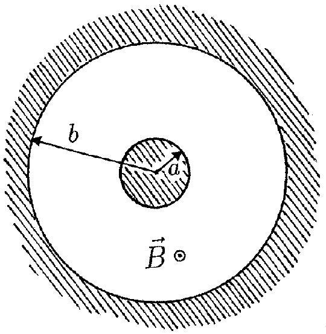

## PROBLEM 2

The space between a pair of coaxial cylindrical conductors is evacuated. The radius of the inner cylinder is $a$, and the inner radius of the outer cylinder is $b$, as shown in the figure below. The outer cylinder, called the anode, may be given a positive potential $V$ relative to the inner cylinder. A static homogeneous magnetic field $\vec{B}$ parallel to the cylinder axis, directed out of the plane of the figure, is also present. Induced charges in the conductors are neglected.

We study the dynamics of electrons with rest mass $m$ and charge $-e$. The electrons are released at the surface of the inner cylinder.

a) First the potential $V$ is turned on, but $\vec{B}=0$. An electron is set free with negligible velocity at the surface of the inner cylinder. Determine its speed $v$ when it hits the anode. Give the answer both when a non-relativistic treatment is sufficient, and when it is not. (1 point)

For the remaining parts of this problem a non-relativistic treatment suffices.
b) Now $V=0$, but the homogeneous magnetic field $\vec{B}$ is present. An electron starts out with an initial velocity $\vec{v}_{0}$ in the radial direction. For magnetic fields larger than a critical value $B_{c}$, the electron will not reach the anode. Make a sketch of the trajectory of the electron when $B$ is slightly more than $B_{c}$. Determine $B_{c}$. (2 points)

From now on both the potential $V$ and the homogeneous magnetic field $\vec{B}$ are present.
c) The magnetic field will give the electron a non-zero angular momentum $L$ with respect to the cylinder axis. Write down an equation for the rate of change $d L / d t$ of the angular momentum. Show that this equation implies that

$$
L-k e B r^{2}
$$

is constant during the motion, where $k$ is a definite pure number. Here $r$ is the distance from the cylinder axis. Determine the value of $k$. (3 points)
d) Consider an electron, released from the inner cylinder with negligible velocity, that does not reach the anode, but has a maximal distance from the cylinder axis equal to $r_{m}$. Determine the speed $v$ at the point where the radial distance is maximal, in terms of $r_{m}$. (1 point)
e) We are interested in using the magnetic field to regulate the electron current to the anode. For $B$ larger than a critical magnetic field $B_{c}$, an electron, released with negligible velocity, will not reach the anode. Determine $B_{c}$. (1 point)
f) If the electrons are set free by heating the inner cylinder an electron will in general have an initial nonzero velocity at the surface of the inner cylinder. The component of the initial velocity parallel to $\vec{B}$ is $V_{B}$, the components orthogonal to $\vec{B}$ are $v_{r}$ (in the radial direction) and $v_{\varphi}$ (in the azimuthal direction, i.e. orthogonal to the radial direction).

Determine for this situation the critical magnetic field $B_{c}$ for reaching the anode. (2 points)
