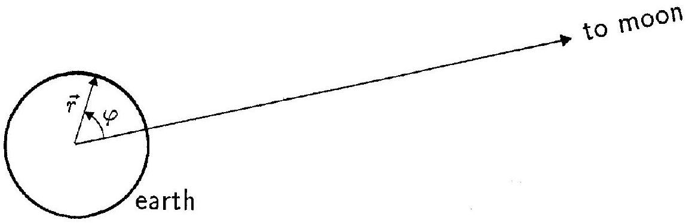

## PROBLEM 3

In this problem we consider some gross features of the magnitude of mid-ocean tides on earth. We simplify the problem by making the following assumptions:

(i) The earth and the moon are considered to be an isolated system,
(ii) the distance between the moon and the earth is assumed to be constant,
(iii) the earth is assumed to be completely covered by an ocean,
(iv) the dynamic effects of the rotation of the earth around its axis are neglected, and
(v) the gravitational attraction of the earth can be determined as if all mass were concentrated at the centre of the earth.

The following data are given:
Mass of the earth: $M=5.98 \cdot 10^{24} \mathrm{~kg}$
Mass of the moon: $M_{m}=7.3 \cdot 10^{22} \mathrm{~kg}$
Radius of the earth: $R=6.37 \cdot 10^{6} \mathrm{~m}$
Distance between centre of the earth and centre of the moon:
$L=3.84 \cdot 10^{8} \mathrm{~m}$
The gravitational constant: $G=6.67 \cdot 10^{-11} \mathrm{~m}^{3} \mathrm{~kg}^{-1} \mathrm{~s}^{-2}$.
a) The moon and the earth rotate with angular velocity $\omega$ about their common centre of mass, $C$. How far is $C$ from the centre of the earth? (Denote this distance by $l$.)

Determine the numerical value of $\omega$. (2 points)

We now use a frame of reference that is co-rotating with the moon and the center of the earth around $C$. In this frame of reference the shape of the liquid surface of the earth is static.

In the plane $P$ through $C$ and orthogonal to the axis of rotation the position of a point mass on the liquid surface of the earth can be described by polar coordinates $r, \varphi$ as shown in the figure. Here $r$ is the distance from the centre of the earth.

We will study the shape

$$
r(\varphi)=R+h(\varphi)
$$

of the liquid surface of the earth in the plane $P$.
b) Consider a mass point (mass $m$ ) on the liquid surface of the earth (in the plane $P$ ). In our frame of reference it is acted upon by a centrifugal force and by gravitational forces from the moon and the earth. Write down an expression for the potential energy corresponding to these three forces.

Note: Any force $F(r)$, radially directed with respect to some origin, is the negative derivative of a spherically symmetric potential energy $V(r)$ :

$$
F(r)=-V^{\prime}(r) .(3 \text { points })
$$

c) Find, in terms of the given quantities $M, M_{m}$, etc, the approximate form $h(\varphi)$ of the tidal bulge. What is the difference in meters between high tide and low tide in this model?

You may use the approximate expression

$$
\frac{1}{\sqrt{1+a^{2}-2 a \cos \theta}} \approx 1+a \cos \theta+\frac{1}{2} a^{2}\left(3 \cos ^{2} \theta-1\right),
$$

valid for $a$ much less than unity.
In this analysis make simplifying approximations whenever they are reasonable. (5 points)

# $27{ }^{\text {th }}$ INTERNATIONAL PHYSICS OLYMPIAD OSLO, NORWAY

THEORETICAL COMPETITION
JULY 21996
