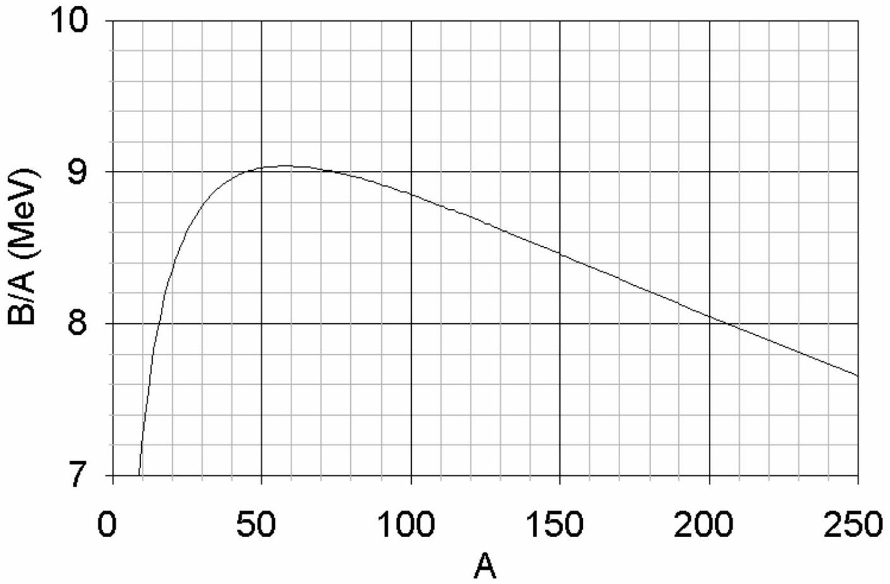
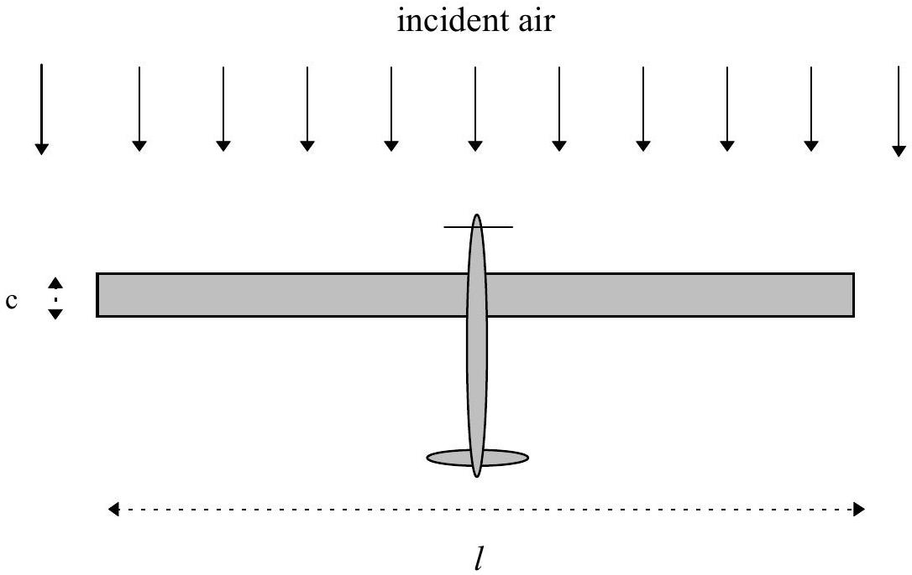
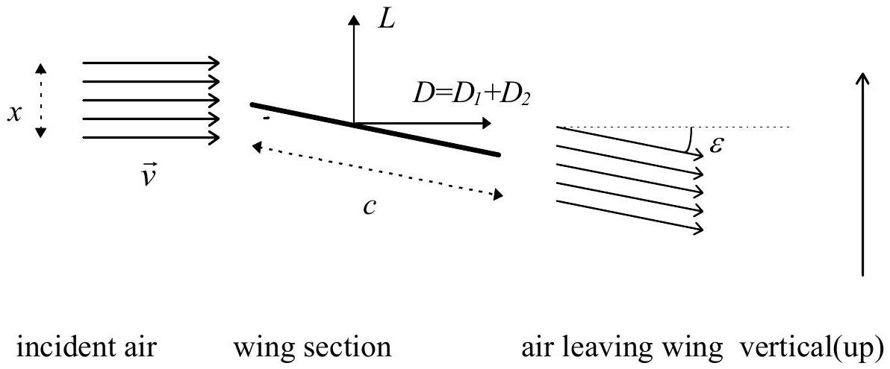
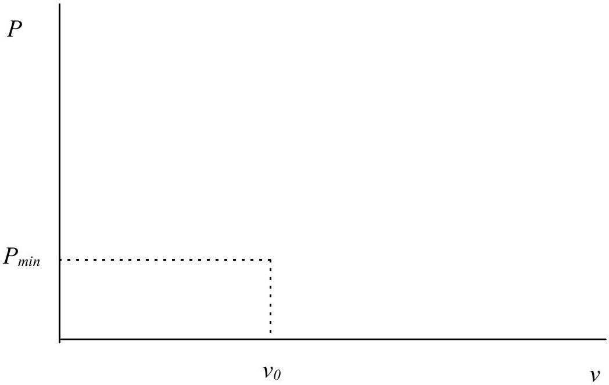

# $28^{\text {th }}$ International Physics Olympiad Sudbury, Canada

## THEORETICAL COMPETITION

Thursday, July $17{ }^{\text {th }}$, 1997

Time Available: 5 hours

Read This First:

1. Use only the pen provided.
2. Use only the front side of the answer sheets and paper.
3. In your answers please use as little text as possible; express yourself primarily in equations, numbers and figures. Summarize your results on the answer sheet.
4. Please indicate on the first page the total number of pages you used.
5. At the end of the exam please put your answer sheets, pages and graphs in order.

This set of problems consists of 11 pages.

Examination prepared at: University of British Columbia
Department of Physics and Astronomy
Committee Chair: Chris Waltham

Hosted by: Laurentian University

## Theory Question No. 1

Scaling
(a) A small mass hangs on the end of a massless ideal spring and oscillates up and down at its natural frequency $f$. If the spring is cut in half and the mass reattached at the end, what is the new frequency $f^{\prime}$ ? (1.5 marks)
(b) The radius of a hydrogen atom in its ground state is $a_{0}=0.0529 \mathrm{~nm}$ (the "Bohr radius"). What is the radius $a^{\prime}$ of a "muonic-hydrogen" atom in which the electron is replaced by an identically charged muon, with mass 207 times that of the electron? Assume the proton mass is much larger than that of the muon and electron. (2 marks)
(c) The mean temperature of the earth is $T=287 \mathrm{~K}$. What would the new mean temperature $T^{\prime}$ be if the mean distance between the earth and the sun was reduced by 1\%?
(2 marks)
(d) On a given day, the air is dry and has a density $\rho=1.2500 \mathrm{~kg} / \mathrm{m}^{3}$. The next day the humidity has increased and the air is 2\% by mass water vapour. The pressure and temperature are the same as the day before. What is the air density $\rho^{\prime}$ now? (2 marks)

Mean molecular weight of dry air: $28.8(\mathrm{~g} / \mathrm{mol})$
Molecular weight of water: 18 (g/mol)
Assume ideal-gas behaviour.
(e) A type of helicopter can hover if the mechanical power output of its engine is $P$. If another helicopter is made which is an exact $\frac{1}{2}$-scale replica (in all linear dimensions) of the first, what mechanical power $P^{\prime}$ is required for it to hover? (2.5 marks)
$\_\_\_\_$

(a) Frequency $f^{\prime}$ :
(b) Radius $a^{\prime}$ :
(c) Temperature $T^{\prime}$ :
(d) Density $\rho^{\prime}$ :
(e) Power $P^{\prime}$ :

## Theory Question No. 2

## Nuclear Masses and Stability

All energies in this question are expressed in MeV - millions of electron volts.
One $\mathrm{MeV}=1.6 \times 10^{-13} \mathrm{~J}$, but it is not necessary to know this to solve the problem.
The mass $M$ of an atomic nucleus with $Z$ protons and $N$ neutrons (i.e. the mass number $A=N+Z$ ) is the sum of masses of the free constituent nucleons (protons and neutrons) minus the binding energy $B / c^{2}$.

$$
M c^{2}=Z m_{p} c^{2}+N m_{n} c^{2}-B
$$

The graph shown below plots the maximum value of $B / A$ for a given value of $A$, vs. $A$. The greater the value of $B / A$, in general, the more stable is the nucleus.

Binding Energy per Nucleon

(a) Above a certain mass number $A_{\alpha}$, nuclei have binding energies which are always small enough to allow the emission of alpha-particles $(A=4)$. Use a linear approximation to this curve above $A=100$ to estimate $A_{\alpha}$. (3 marks)

For this model, assume the following:

- Both initial and final nuclei are represented on this curve.
- The total binding energy of the alpha-particle is given by $\mathrm{B}_{4}=25.0 \mathrm{MeV}$ (this cannot be read off the graph!).
(b) The binding energy of an atomic nucleus with $Z$ protons and $N$ neutrons $(A=N+Z)$ is given by a semi-empirical formula:
$$
B=a_{v} A-a_{s} A^{2 / 3}-a_{c} Z^{2} A^{-1 / 3}-a_{a} \frac{(N-Z)^{2}}{A}-\delta
$$
The value of $\delta$ is given by:
$$
\begin{aligned}
& +a_{p} A^{-3 / 4} \text { for odd-N/odd- } \mathrm{Z} \text { nuclei } \\
& 0 \text { for even-N/odd- } \mathrm{Z} \text { or odd-N/even- } \mathrm{Z} \text { nuclei } \\
& -a_{p} A^{-3 / 4} \text { for even-N/even- } \mathrm{Z} \text { nuclei }
\end{aligned}
$$
The values of the coefficients are:
$$
a_{v}=15.8 \mathrm{MeV} ; a_{s}=16.8 \mathrm{MeV} ; a_{c}=0.72 \mathrm{MeV} ; a_{a}=23.5 \mathrm{MeV} ; a_{p}=33.5 \mathrm{MeV} .
$$
(i) Derive an expression for the proton number $Z_{\text {max }}$ of the nucleus with the largest binding energy for a given mass number $A$. Ignore the $\delta$-term for this part only. marks)
(ii) What is the value of $Z$ for the $A=200$ nucleus with the largest $B / A$ ? Include the effect of the $\delta$-term. (2 marks)

(iii) Consider the three nuclei with $\mathrm{A}=128$ listed in the table on the answer sheet. Determine which ones are energetically stable and which ones have sufficient energy to decay by the processes listed below. Determine $Z_{\text {max }}$ as defined in part (i) and fill out the table on your answer sheet.

In filling out the table, please:

- Mark processes which are energetically allowed thus: $\sqrt{ }$
- Mark processes which are NOT energetically allowed thus: 0
- Consider only transitions between these three nuclei.

Decay processes:

(1) $\beta^{-}$- decay; emission from the nucleus of an electron
(2) $\beta^{+}$- decay; emission from the nucleus of a positron
(3) $\beta^{-} \beta^{-}$- decay; emission from the nucleus of two electrons simultaneously
(4) Electron capture; capture of an atomic electron by the nucleus.

The rest mass energy of an electron (and positron) is $m_{e} c^{2}=0.51 \mathrm{MeV}$; that of a proton is $m_{p} c^{2}=938.27 \mathrm{MeV}$; that of a neutron is $m_{n} c^{2}=939.57 \mathrm{MeV}$.
(3 marks)
$\_\_\_\_$

(a) Numerical value for $A_{\alpha}$ :
(b) (i) Expression for $Z_{\text {max }}$ :
(b)(ii) Numerical value of $Z$ :

**(b)(iii)**

| Nucleus/Process | $\beta^{-}$- decay | $\beta^{+}$- decay | Electron-capture | $\beta^{-} \beta^{-}$- decay |
| :--- | :--- | :--- | :--- | :--- |
| ${ }_{53}^{128} \mathrm{I}$ |  |  |  |  |
| ${ }_{54}^{128} \mathrm{Xe}$ |  |  |  |  |
| ${ }_{55}^{128} \mathrm{Cs}$ |  |  |  |  |

Notation : ${ }_{Z}^{A} X$
X = Chemical Symbol

## Theory Question No. 3

## Solar-Powered Aircraft

We wish to design an aircraft which will stay aloft using solar power alone. The most efficient type of layout is one with a wing whose top surface is completely covered in solar cells. The cells supply electrical power with which the motor drives the propeller.

Consider a wing of rectangular plan-form with span $l$, chord (width) $c$; the wing area is $S=c l$, and the wing aspect ratio $A=l / c$. We can get an approximate idea of the wing's performance by considering a slice of air of height $x$ and length $l$ being deflected downward at a small angle $\varepsilon$ with only a very small change in speed. Control surfaces can be used to select an optimal value of $\varepsilon$ for flight. This simple model corresponds closely to reality if $x=\pi l / 4$, and we can assume this to be the case. The total mass of the aircraft is $M$ and it flies horizontally with velocity $\vec{v}$ relative to the surrounding air. In the following calculations consider only the air flow around the wing.

Top view of aircraft (in its own frame of reference):

Side view of wing (in a frame of reference moving with the aircraft):

Ignore the modification of the airflow due to the propeller.

(a) Consider the change in momentum of the air moving past the wing, with no change in speed while it does so. Derive expressions for the vertical lift force $L$ and the horizontal drag force $D_{1}$ on the wing in terms of wing dimensions, $v, \varepsilon$, and the air density $\rho$. Assume the direction of air flow is always parallel to the plane of the side-view diagram. (3 marks)
(b) There is an additional horizontal drag force $D_{2}$ caused by the friction of air flowing over the surface of the wing. The air slows slightly, with a change of speed $\Delta v(\ll 1 \%$ of $v)$ given by:
$$
\frac{\Delta v}{v}=\frac{f}{A}
$$
The value of $f$ is independent of $\varepsilon$.
Find an expression (in terms of $M, f, A, S, \rho$ and $g$ - the acceleration due to gravity) for the flight speed $v_{0}$ corresponding to a minimum power being needed to maintain this aircraft in flight at constant altitude and velocity. Neglect terms of order ( $\varepsilon^{2} f$ ) or higher. (3 marks)
You may find the following small angle approximation useful:
$$
1-\cos \varepsilon \approx \frac{\sin ^{2} \varepsilon}{2}
$$
(c) On the answer sheet, sketch a graph of power $P$ versus flight speed $v$. Show the separate contributions to the power needed from the two sources of drag. Find an expression (in terms of $M, f, A, S, \rho$ and $g$ ) for the minimum power, $P_{m i n}$. (2 marks)

(d) If the solar cells can supply sufficient energy so that the electric motors and propellers generate mechanical power of $I=10$ watts per square metre of wing area, calculate the maximum wing loading $M g / S\left(\mathrm{~N} / \mathrm{m}^{2}\right)$ for this power and flight speed $v_{0}(\mathrm{~m} / \mathrm{s})$. Assume $\rho=1.25 \mathrm{~kg} / \mathrm{m}^{3}, f=0.004, A=10 . \quad$ (2 marks)
$\_\_\_\_$

(a) Expression for $L$ :
(a) Expression for $D_{1}$ :
(b) Expression for $D_{2}$ :
(b) Expression for $v_{0}$ :

(c) 
(c) Expression for $P_{\text {min }}$ :
(d) Maximum value of $M g / S$ :
(d) Numerical value of $v_{0}$ :
