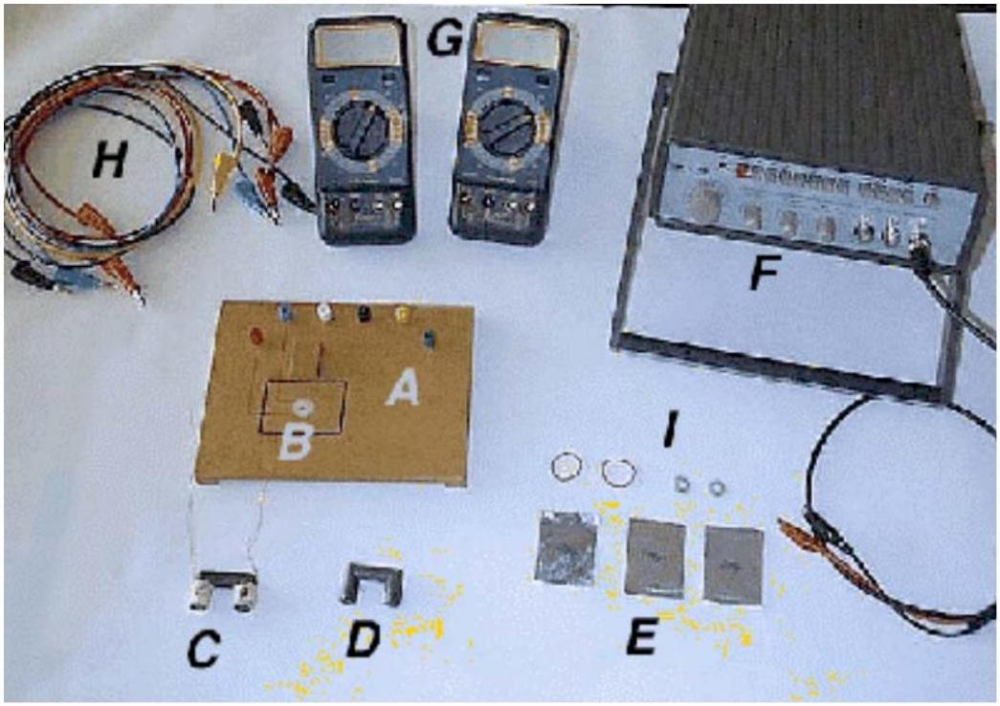
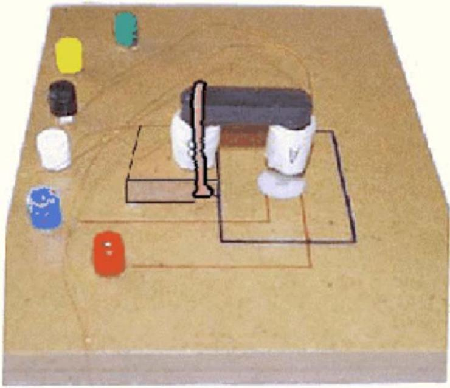
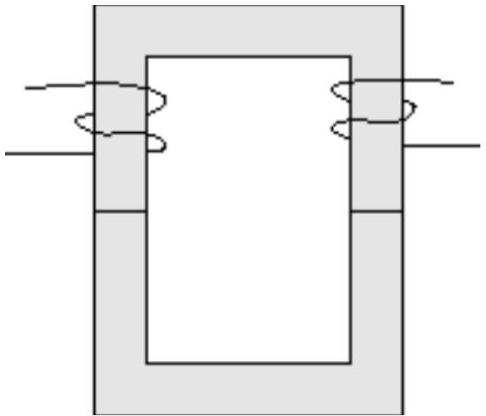
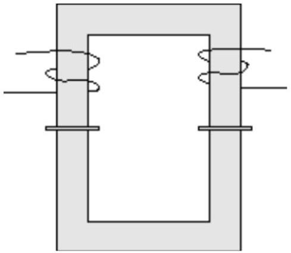

# $\mathbf{2 9}^{\text {th }}$ International Physics Olympiad

Reykjavik, Iceland

## Experimental competition

Monday, July 6th, 1998

## Time available: 5 hours

## Read this first:

Use only the pen provided.

1. Use only the front side of the answer sheets and paper.
2. Use as little text as possible in your answers; express yourself primarily with equations, numbers and figures. Summarize your results on the answer sheets.
3. Please indicate on all sheets the name of your team, your student number, the page number and the total number of pages.
4. At the end of the exam please put your answer sheets, pages and graphs in numerical order and leave them on your table.
5. Use of a calculator is allowed.

This set of problems consists of 6 pages.

Examination prepared at: University of Iceland, Department of Physics.

## Instrumentation provided:

A Platform with 6 banana jacks
B Pickup coil embedded into the platform
C Ferrite U-core with two coils marked ˋˋA" and ˋˋB"
D Ferrite U-core without coils
E Aluminium foils of thicknesses: $50 \mu \mathrm{~m}, 100 \mu \mathrm{~m}$ and $200 \mu \mathrm{~m}$
F Function generator with output leads
G Two multimeters
H Six leads with banana plugs

I Two rubber bands and two plastic spacers

## Multimeters

The multimeters are two-terminal devices that in this experiment are used for measuring AC voltages, AC currents, frequency and resistance. In all cases one of the terminals is the one marked COM. For the voltage, frequency and resistance measurements the other terminal is the red one marked $\mathbf{V}-\boldsymbol{\Omega}$. For current measurements the other terminal is the yellow one marked mA. With the central dial you select the meter function (V~ for AC voltage, A~ for AC current, Hz for frequency and $\Omega$ for resistance) and the measurement range. For the AC modes the measurement uncertainty is ± (4\% of reading + 10 units of the last digit). To get accurate current measurements a change of range is recommended if the reading is less than 10\% of full scale.

## Function generator

To turn on the generator you press in the red button marked PWR. Select the 10 kHz range by pressing the button marked 10k, and select the sine waveform by pressing the second button from the right marked with a wave symbol. No other buttons should be selected. You can safely turn the amplitude knob fully clockwise. The frequency is selected with the large dial on the left. The dial reading multiplied by the range selection gives the output frequency. The frequency can be verified at any time with one of the multimeters. Use the output marked MAIN, which has $50 \Omega$ internal resistance.

## Ferrite cores

Handle the ferrite cores gently, they are brittle!! Ferrite is a ceramic magnetic material, with low electrical conductivity. Eddy current losses in the cores are therefore low.

## Banana jacks

To connect a coil lead to a banana jack, you loosen the colored plastic nut, place the tinned end between the metal nut and plastic nut, and tighten it again.

Figure 1: Experimental arrangement for part I.

Part I. Magnetic shielding with eddy currents
Time-dependent magnetic fields induce eddy currents in conductors. The eddy currents in turn produce a counteracting magnetic field. In superconductors the induced eddy currents will expel the magnetic field completely from the interior of the conductor. Due to the finite conductivity of normal metals they are not as effective in shielding magnetic fields.
To describe the shielding effect of aluminium foils we will apply a phenomenological model

$$
B=B_{0} e^{-\alpha d}
$$

where $B_{0}$ is the magnetic field in the absence of foils. $B$ is the magnetic field beneath the foils, $\alpha$ an attenuation constant, and $d$ the foil thickness.

Experiment
Put the ferrite core with the coils, with legs down, on the raised block such that coil A is directly above the pickup coil embedded in the platform, as shown in Figure 1. Secure the core on the block by stretching the rubber bands over the core and under the block recess.

1. Connect the leads for coils A and B to the jacks. Measure the resistance of all coils to make sure you have good connections. You should expect values of less than $10 \Omega$. Write your values in field 1 on the answer sheet.
2. Collect data to validate the model above and evaluate the attenuation constant $\alpha$ for the aluminum foils $(50-300 \mu \mathrm{~m})$, for frequencies in the range of $5-20 \mathrm{kHz}$. Place the foils inside the square, above the pickup coil, and apply a sinusoidal voltage to coil A. Write your results in field 2 on the answer sheet.
3. Plot $\alpha$ versus frequency, and write in field 3 on the answer sheet, an expression describing the function $\alpha(f)$.

Part II. Magnetic flux linkage
The response of two coils on a closed ferrite core to an external alternating voltage ( $V_{g}$ ) from a sinusoidal signal generator is studied.

## Theory

In the following basic theoretical discussion, and in the treatment of the data, it is assumed that the ohmic resistance in the two coils and hysteresis losses in the core have insignificant influence on the measured currents and voltages. Because of these simplifications in the treatment below, some deviations will occur between measured and calculated values.

## Single coil

Let us first look at a core with a single coil, carrying a current $I$. The magnetic flux $\Phi$, that the current creates in the ferrite core inside the coil, is proportional to the current $I$ and to the number of windings $N$. The flux depends furthermore on a geometrical factor $g$, which is determined by the size and shape of the core, and the magnetic permeability $\mu=\mu_{r} \mu_{0}$, which describes the magnetic properties of the core material. The relative permeability is denoted $\mu_{r}$ and $\mu_{0}$ is the permeability of free space. The magnetic flux $\Phi$ is thus given by

$$
\Phi=\mu g N I=c N I
$$

where $c=\mu g$. The induced voltage is given by Faraday's law of induction,

$$
\varepsilon(t)=-N \frac{d \Phi(t)}{d t}=-c N^{2} \frac{d I(t)}{d t}
$$

The conventional way to describe the relationship between current and voltage for a coil is through the self inductance of the coil $L$, defined by,

$$
\varepsilon(t)=-L \frac{d I(t)}{d t}
$$

A sinusoidal signal generator connected to the coil will drive a current through it given by

$$
I(t)=I_{0} \sin \omega t
$$

where $\omega$ is the angular frequency and $I_{0}$ is the amplitude of the current. As follows from equation (3) this alternating current will induce a voltage across the coil given by

$$
\varepsilon(t)=-\omega c N^{2} I_{0} \cos \omega t
$$

The current will be such that the induced voltage is equal to the signal generator voltage $V_{g}$. There is a 90 degree phase difference between the current and the voltage. If we only look at the magnitudes of the alternating voltage and current, allowing for this phase difference, we have

$$
\varepsilon=\omega c N^{2} I
$$

## Two coils

Let us now assume that we have two coils on one core. Ferrite cores can be used to link magnetic flux between coils. In an ideal core the flux will be the same for all cross sections of the core. Due to flux leakage in real cores a second coil on the core will in general experience a reduced flux compared to the
flux-generating coil. The flux $\Phi_{B}$ in the secondary coil B is therefore related to the flux $\Phi_{A}$ in the primary coil A through

$$
\Phi_{B}=k \Phi_{A}
$$

Similarly a flux component $\Phi_{B} \quad$ created by a current in coil B will create a flux $\Phi_{A}=k \Phi_{B} \quad$ in coil A. The factor $k$, which is called the coupling factor, has a value less than one.
The ferrite core under study has two coils A and B in a transformer arrangement. Let us assume that coil A is the primary coil (connected to the signal generator). If no current flows in coil $\mathrm{B}\left(I_{B}=0\right)$, the induced voltage $\varepsilon_{A}$ due to $I_{A}$ is equal and opposite to $V_{g}$. The flux created by $I_{A}$ inside the secondary coil is determined by equation (8) and the induced voltage in coil B is

$$
\varepsilon_{B}=\omega k c N_{A} N_{B} I_{A}
$$

If a current $I_{B}$ flows in coil B, it will induce a voltage in coil A which is described by a similar expression. The total voltage across the coil A will then be given by

$$
V_{g}=\varepsilon_{A}=\omega c N_{A}^{2} I_{A}-\omega k c N_{A} N_{B} I_{B}
$$

The current in the secondary coil thus induces an opposing voltage in the primary coil, leading to an increase in $I_{A}$. A similar equation can be written for $\varepsilon_{B}$. As can be verified by measurements, $k$ is independent of which coil is taken as the primary coil.

## Experiment

Place the two U-cores together as shown in Figure 2, and fasten them with the rubber bands. Set the function generator to produce a 10 kHz , sine wave. Remember to set the multimeters to the most sensitive range suitable for each measurement. The numbers of the windings of the two coils, A and B, are: $N_{A}=$ 150 turns and $N_{B}=100$ turns ( ± 1 turn on each coil).

Figure 2: A transformer with a closed magnetic circuit.

1. Derive algebraic expressions for the self inductances $L_{A}$ and $L_{B}$, and the coupling factor $k$, in terms of measured and given quantities and write your results in field 1.a on the answer sheet. Draw circuit diagrams in field 1.b on the answer sheet, showing how these quantities are determined. Calculate the numerical values of $L_{A} \quad, L_{B} \quad$ and $k$ and write their values in field $1 . c$ on the answer sheet.
2. When the secondary coil is short-circuited, the current $I_{P}$ in the primary coil will increase. Use the equations above to derive an expression giving $I_{P}$ explicitly and write your result in field 2.a on the answer sheet. Measure $I_{P}$ and write your value in field 2.b on the answer sheet.
3. Coils A and B can be connected in series in two different ways such that the two flux contributions are either added to or subtracted from each other.
3.1. Find the self inductance of the serially connected coils, $L_{A+B}$, from measured quantities in the case where the flux contributions produced by the current $I$ in the two coils add to (strengthen) each other and write your answer in field 3.1 on the answer sheet.

3.2. Measure the voltages $V_{A}$ and $V_{B}$ when the flux contributions of the two coils oppose each other. Write your values in field 3.2.a on the answer sheet and the ratio of the voltages in field 3.2.b. Derive an expression for the ratio of the voltages across the two coils and write it in field 3.2.c on the answer sheet.
4. Use the results obtained to verify that the self inductance of a coil is proportional to the square of the number of its windings and write your result in field 4 on the answer sheet.
5. Verify that it was justified to neglect the resistances of the coils and write your arguments as mathematical expressions in field 5 on the answer sheet.
6. Thin plastic spacers inserted between the two half cores (as shown in Figure 3) reduce the coil inductances drastically. Use this reduction to determine the relative permeability $\mu_{r}$ of the ferrite material, given Ampere's law and continuity of the magnetic field B across the ferrite - plastic interface.

Assume $\mu=\mu_{0}=4 \pi \times 10^{-7} \mathrm{Ns}^{2} / \mathrm{C}^{2}$ for the plastic spacers and a spacer thickness of 1.6 mm . The geometrical factor can be determined from Ampere's law

$$
\oint \frac{1}{\mu} B d l=I_{\text {total }}
$$

where $I_{\text {total }}$ is the total current flowing through a surface bounded by the integration path. Write your algebraic expression for $\mu_{r}$ in field 6.a on the answer sheet and your numerical value in field 6.b.

Figure 3: The ferrite cores with the two spacers in place.
