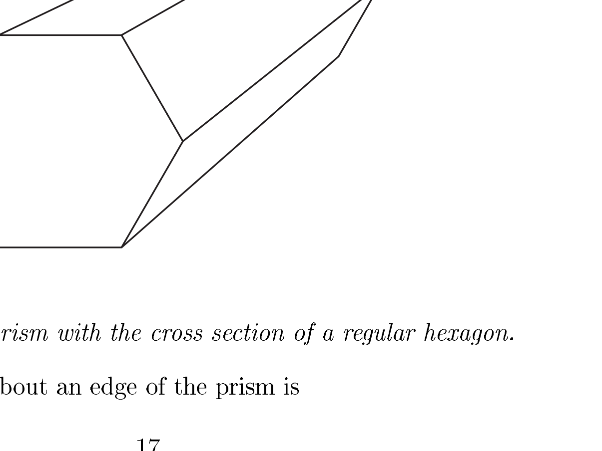
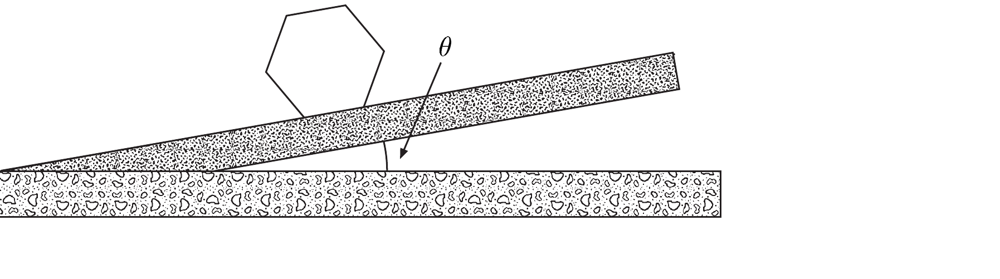

# $29^{\text {th }}$ International Physics Olympiad   Reykjavík, Iceland

## Theoretical competition

Saturday, July $4{ }^{\text {th }}$, 1998

9 a.m. - 2 p.m.

## Read this first:

1. Use only the pen provided.
2. Use only the front side of the answer sheets.
3. Use as little text as possible in your answers; express yourself primarily with equations, numbers and figures. Summarize your results on the answer sheets.
4. For anything but your answers and your graphs use the blank answer sheets. This applies e.g. when you are asked to show that... and also for all calculations you want to be considered for evaluation.
5. You may often be able to solve later parts of a problem without having solved the previous ones. In such cases you may take the result of a previous part as given, in the form stated in the problem text.
6. Please indicate on all sheets your team name, student number, number of page and total number of pages. On the blank answer sheets also indicate the problem number.
7. At the end of the exam please put your answer sheets in order. You may leave on your table material which you do not wish to be evaluated.

## This set of problems consists of 11 pages in total.

Examination prepared at:
University of Iceland, Department of Physics, in collaboration with physicists from the National Energy Authority.

## 1 Rolling of a hexagonal prism ${ }^{1}$

### 1.1 Problem text

Consider a long, solid, rigid, regular hexagonal prism like a common type of pencil (Figure 1.1). The mass of the prism is $M$ and it is uniformly distributed. The length of each side of the cross-sectional hexagon is $a$. The moment of inertia $I$ of the hexagonal prism about its central axis is

$$
I=\frac{5}{12} M a^{2}
$$

Figure 1.1: A solid prism with the cross section of a regular hexagon.

The moment of inertia $I^{\prime}$ about an edge of the prism is

$$
I^{\prime}=\frac{17}{12} M a^{2}
$$

a) ( 3.5 points) The prism is initially at rest with its axis horizontal on an inclined plane which makes a small angle $\theta$ with the horizontal (Figure 1.2). Assume that the surfaces of the prism are slightly concave so that the prism only touches the plane at its edges. The effect of this concavity on the moment of inertia can be ignored. The prism is now displaced from rest and starts an uneven rolling down the plane. Assume that friction prevents any sliding and that the prism does not lose contact with the plane. The angular velocity just before a given edge hits the plane is $\omega_{i}$ while $\omega_{f}$ is the angular velocity immediately after the impact.

Show that we may write

$$
\omega_{f}=s \omega_{i}
$$

and write the value of the coefficient $s$ on the answer sheet.

[^0]
Figure 1.2: A hexagonal prism lying on an inclined plane.

b) ( 1 point) The kinetic energy of the prism just before and after impact is similarly $K_{i}$ and $K_{f}$.

Show that we may write

$$
K_{f}=r K_{i}
$$

and write the value of the coefficient $r$ on the answer sheet.
c) ( 1.5 points) For the next impact to occur $K_{i}$ must exceed a minimum value $K_{i, \text { min }}$ which may be written in the form

$$
K_{i, \min }=\delta M g a
$$

where $g=9.81 \mathrm{~m} / \mathrm{s}^{2}$ is the acceleration of gravity.
Find the coefficient $\delta$ in terms of the slope angle $\theta$ and the coefficient $r$. Write your answer on the answer sheet. (Use the algebraic symbol $r$, not its value).
d) ( 2 points) If the condition of part (c) is satisfied, the kinetic energy $K_{i}$ will approach a fixed value $K_{i, 0}$ as the prism rolls down the incline.

Given that the limit exists, show that $K_{i, 0}$ may be written as:

$$
K_{i, 0}=\kappa M g a
$$

and write the coefficient $\kappa$ in terms of $\theta$ and $r$ on the answer sheet.
e) ( 2 points) Calculate, to within $0.1^{\circ}$, the minimum slope angle $\theta_{0}$, for which the uneven rolling, once started, will continue indefinitely. Write your numerical answer on the answer sheet.

### 1.2 Solution

a)
