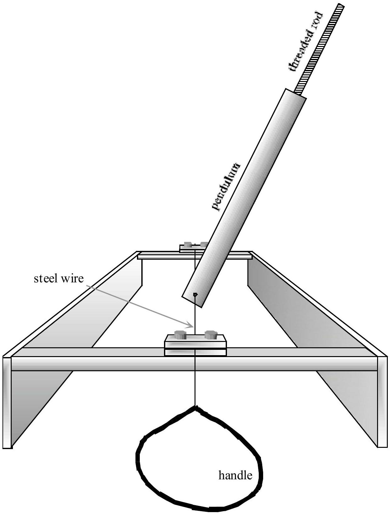
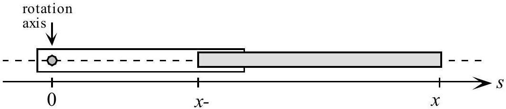
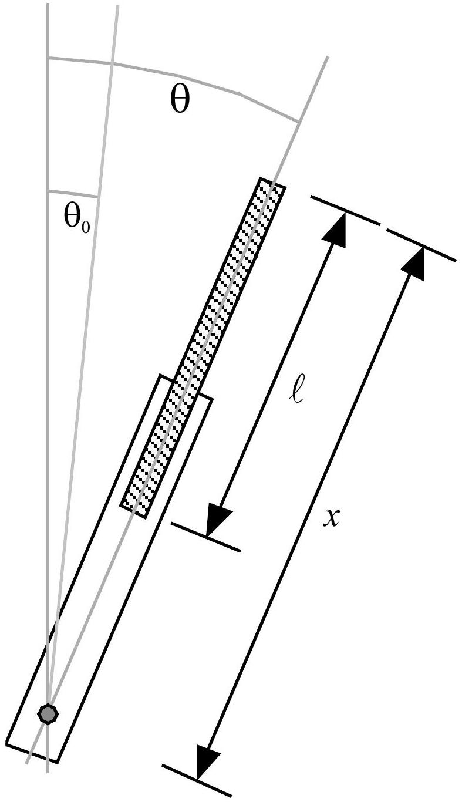
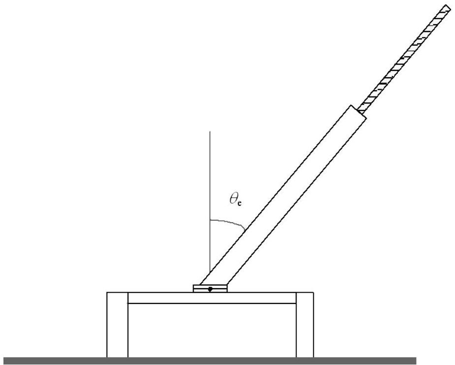
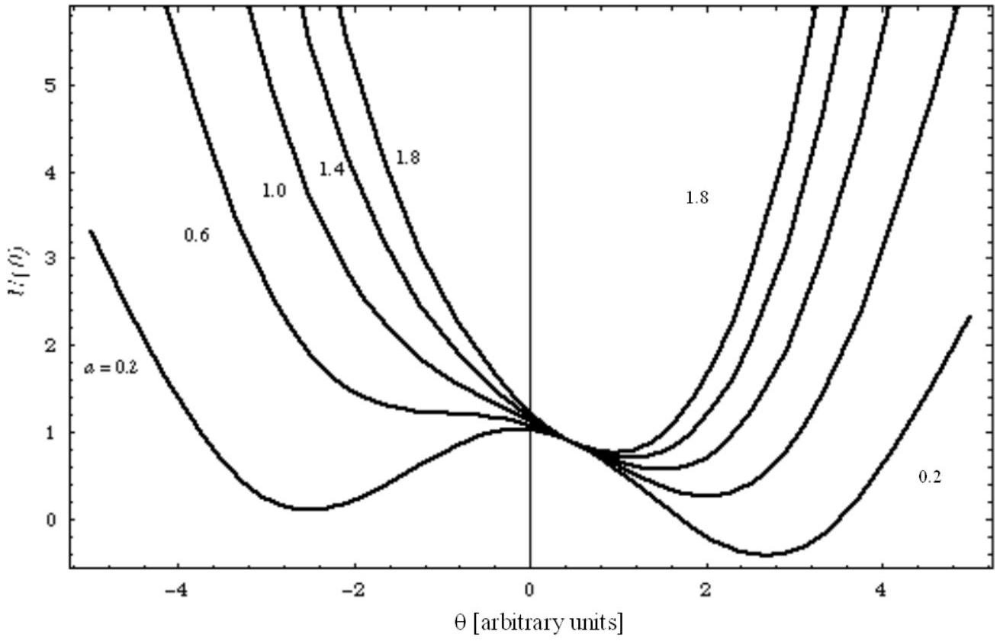

# 30th International Physics Olympiad

Padua, Italy

## Experimental competition

Tuesday, July 20th, 1999

Before attempting to assemble your equipment, read the problem text completely!

## Please read this first:

1. The time available is 5 hours for one experiment only.
2. Use only the pen provided.
3. Use only the front side of the provided sheets.
4. In addition to "blank" sheets where you may write freely, there is a set of Answer sheets where you must summarize the results you have obtained. Numerical results must be written with as many digits as appropriate; don't forget the units. Try - whenever possible - to estimate the experimental uncertainties.
5. Please write on the "blank" sheets the results of all your measurements and whatever else you deem important for the solution of the problem, that you wish to be evaluated during the marking process. However, you should use mainly equations, numbers, symbols, graphs, figures, and use as little text as possible.
6. It's absolutely imperative that you write on top of each sheet that you'll use: your name ("NAME"), your country ("TEAM"), your student code (as shown on your identification tag, "CODE"), and additionally on the "blank" sheets: the progressive number of each sheet (from 1 to $N$, "Page n.") and the total number $(N)$ of "blank" sheets that you use and wish to be evaluated ("Page total"); leave the "Problem" field blank. It is also useful to write the number of the section you are answering at the beginning of each such section. If you use some sheets for notes that you don't wish to be evaluated by the marking team, just put a large cross through the whole sheet, and don't number it.
7. When you've finished, turn in all sheets in proper order (answer sheets first, then used sheets in order, unused sheets and problem text at the bottom) and put them all inside the envelope where you found them; then leave everything on your desk. You are not allowed to take anything out of the room.

This problem consists of 11 pages (including this one and the answer sheets).

## Torsion pendulum

In this experiment we want to study a relatively complex mechanical system - a torsion pendulum - and investigate its main parameters. When its rotation axis is horizontal it displays a simple example of bifurcation.

## Available equipment

1. A torsion pendulum, consisting of an outer body (not longitudinally uniform) and an inner threaded rod, with a stand as shown in figure 1
2. A steel wire with handle
3. A long hexagonal nut that can be screwed onto the pendulum threaded rod (needed only for the last exercise)
4. A ruler and a right triangle template
5. A timer
6. Hexagonal wrenches
7. A3 Millimeter paper sheets.
8. An adjustable clamp
9. Adhesive tape
10. A piece of T-shaped rod

The experimental apparatus is shown in figure 1; it is a torsion pendulum that can oscillate either around a horizontal rotation axis or around a vertical rotation axis. The rotation axis is defined by a short steel wire kept in tension. The pendulum has an inner part that is a threaded rod that may be screwed in and out, and can be fixed in place by means of a small hexagonal lock nut. This threaded rod can not be extracted from the pendulum body.

When assembling the apparatus in step 5 the steel wire must pass through the brass blocks and through the hole in the pendulum, then must be locked in place by keeping it stretched: lock it first at one end, then use the handle to put it in tension and lock it at the other end.

Warning: The wire must be put in tension only to guarantee the pendulum stability. It's not necessary to strain it with a force larger than about 30 N. While straining it, don't bend the wire against the stand, because it might break.

Figure 1: Sketch of the experimental apparatus when its rotation axis is horizontal.

The variables characterizing the pendulum oscillations are:

- the pendulum position defined by the angle $\theta$ of deviation from the direction perpendicular to the plane of the stand frame, which is shown horizontal in figure 1.
- the distance $x$ between the free end of the inner threaded rod and the pendulum rotation axis
- the period $T$ of the pendulum oscillations.

The parameters characterizing the system are:

- the torsional elastic constant $\kappa$ (torque $=\kappa \cdot$ angle) of the steel wire;
- the masses $M_{1}$ and $M_{2}$ of the two parts of the pendulum (1: outer cylinder ${ }^{1}$ and 2: threaded rod);

[^0]

- the distances $R_{1}$ and $R_{2}$ of the center of mass of each pendulum part (1: outer cylinder and 2: threaded rod) from the rotation axis. In this case the inner mobile part (the threaded rod) is sufficiently uniform for computing $R_{2}$ on the basis of its mass, its length $\ell$ and the distance $x . R_{2}$ is therefore a simple function of the other parameters;
- the moments of inertia $I_{1}$ and $I_{2}$ of the two pendulum parts (1: outer cylinder and 2: threaded rod). In this case also we assume that the mobile part (the threaded rod) is sufficiently uniform for computing $I_{2}$ on the basis of its mass, its length $\ell$ and the distance $x . I_{2}$ is therefore also a simple function of the other parameters;
- the angular position $\theta_{0}$ (measured between the pendulum and the perpendicular to the plane of the stand frame) where the elastic recall torque is zero. The pendulum is locked to the rotation axis by means of a hex screw, opposite to the threaded rod; therefore $\theta_{0}$ varies with each installation of the apparatus.

Summing up, the system is described by 7 parameters: $\kappa, M_{1}, M_{2}, R_{1}, I_{1}, \ell, \theta_{0}$, but $\theta_{0}$ changes each time the apparatus is assembled, so that only 6 of them are really constants and the purpose of the experiment is that of determining them, namely $\kappa, M_{1}, M_{2}, R_{1}, I_{1}, \ell$, experimentally. Please note that the inner threaded rod can't be drawn out of the pendulum body, and initially only the total mass $M_{1}+M_{2}$ is given (it is printed on each pendulum).

In this experiment several quantities are linear functions of one variable, and you must estimate the parameters of these linear functions. You can use a linear fit, but alternative approaches are also acceptable. The experimental uncertainties of the parameters can be estimated from the procedure of the linear fit or from the spread of experimental data about the fit.

The analysis also requires a simple formula for the moment of inertia of the inner part (we assume that its transverse dimensions are negligible with respect to its length, see figure 2):

$$
I_{2}(x)=\int_{x-\ell}^{x} \lambda s^{2} d s=\frac{\lambda}{3}\left(x^{3}-(x-\ell)^{3}\right)=\frac{\lambda}{3}\left(3 \ell x^{2}-3 \ell^{2} x+\ell^{3}\right)
$$

where $\lambda=M_{2} / \ell$ is the linear mass density, and therefore

$$
I_{2}(x)=M_{2} x^{2}-M_{2} \ell x+\frac{M_{2}}{3} \ell^{2}
$$

Figure 2: In the analysis of the experiment we can use an equation (eq. 2) for the moment of inertia of a bar whose transverse dimensions are much less than its length. The moment of inertia must be computed about the rotation axis that in this figure crosses the $s$ axis at $s=0$.

Now follow these steps to find the 6 parameters $M_{1}, M_{2}, \kappa, R_{1}, \ell, I_{1}$ :

1. The value of the total mass $M_{1}+M_{2}$ is given (it is printed on the pendulum), and you can find $M_{1}$ and $M_{2}$ by measuring the distance $R(x)$ between the rotation axis and the center of mass of the pendulum. To accomplish this write first an equation for the position $R(x)$ of the center of mass as a function of $x$ and of the parameters $M_{1}, M_{2}, R_{1}, \ell$. [0.5 points]
2. Now measure $R(x)$ for several values of $x$ (at least 3) ${ }^{2}$. Clearly such measurement must be carried out when the pendulum is not attached to the steel wire. Use these measurements and the previous result to find $M_{1}$ and $M_{2}$. [3 points]

Figure 3: The variables $\theta$ and $x$ and the parameters $\theta_{0}$ and $\ell$ are shown here.
3. Find an equation for the pendulum total moment of inertia $I$ as a function of $x$ and of the parameters $M_{2}, I_{1}$ and $\ell$. [0.5 points]
4. Write the pendulum equation of motion in the case of a horizontal rotation axis, as a function of the angle $\theta$ (see figure 3) and of $x, \kappa, \theta_{0}, M_{1}, M_{2}$, the total moment of inertia $I$ and the position $R(x)$ of the center of mass. [1 point]

[^1] 5. In order to determine $\kappa$, assemble now the pendulum and set it with its rotation axis horizontal. The threaded rod must initially be as far as possible inside the pendulum. Lock the pendulum to the steel wire, with the hex screw, at about half way between the wire clamps and in such a way that its equilibrium angle (under the combined action of weight and elastic recall) deviates sizeably from the vertical (see figure 4). Measure the equilibrium angle $\theta_{e}$ for several values of $x$ (at least 5 ). [4 points]

Figure 4: In this measurement set the pendulum so that its equilibrium position deviates from the vertical.

6. Using the last measurements, find $\kappa$. [4.5 points]
7. Now place the pendulum with its rotation axis vertical ${ }^{3}$, and measure its oscillation period for several values of $x$ (at least 5). With these measurements, find $I_{1}$ and $\ell$. [4 points]

At this stage, after having found the system parameters, set the experimental apparatus as follows:

- pendulum rotation axis horizontal
- threaded rod as far as possible inside the pendulum
- pendulum as vertical as possible near equilibrium
- finally add the long hexagonal nut at the end of the threaded rod by screwing it a few turns (it can't go further than that)

In this way the pendulum may have two equilibrium positions, and the situation varies according to the position of the threaded rod, as you can also see from the generic graph shown in figure 5, of the potential energy as a function of the angle $\theta$.

The doubling of the potential energy minimum in figure 5 illustrates a phenomenon known in mathematics as bifurcation; it is also related to the various kinds of symmetry breaking that are studied in particle physics and statistical mechanics.

[^2]
Figure 5: Graph of the function $U(\theta)=\frac{a}{2}\left(\theta-\theta_{0}\right)^{2}+\cos \theta$ (which is proportional to the potential energy of this problem) as a function of $\theta$, with $\theta_{0} \neq 0$. The various curves correspond to different $a$ values as labeled in the figure; smaller values of $a(a<1)$ correspond to the appearence of the bifurcation. In our case the parameter $a$ is associated with the position $x$ of the threaded rod.

We can now study this bifurcation by measuring the period of the small oscillations about the equilibrium position:

8. Plot the period ${ }^{4} T$ as a function of $x$. What kind of function is it? Is it increasing, decreasing or is it a more complex function? [2.5 points]
[^3]
[^0]:    ${ }^{1}$ Including the small hex locking nut.

[^1]:    ${ }^{2}$ The small hex nut must be locked in place every time you move the threaded rod. Its mass is included in $M_{1}$. This locking must be repeated also in the following, each time you move the threaded rod.

[^2]:    ${ }^{3}$ In order to stabilize it in this position, you may reposition the stand brackets.

[^3]:    ${ }^{4}$ You may be able to observe two equilibrium positions, but one of them is more stable than the other (see figure 5). Report and plot the period for the more stable one.
