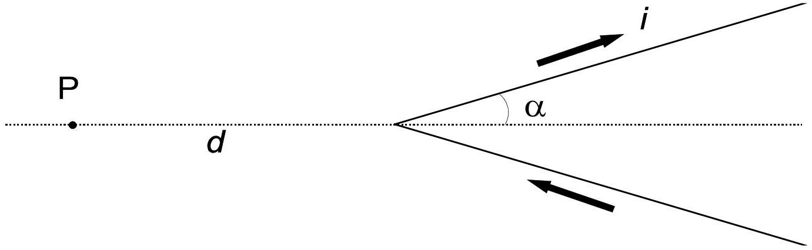
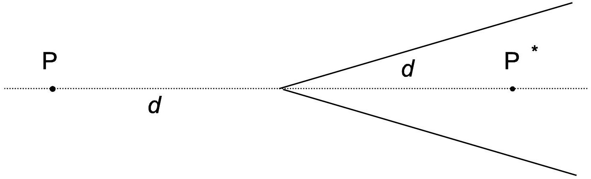

## Magnetic field with a V-shaped wire

Among the first successes of the interpretation by Ampère of magnetic phenomena, we have the computation of the magnetic field B generated by wires carrying an electric current, as compared to early assumptions originally made by Biot and Savart.

A particularly interesting case is that of a very long thin wire, carrying a constant current $i$, made out of two rectilinear sections and bent in the form of a "V", with angular half-span ${ }^{1} \alpha$ (see figure). According to Ampère's computations, the magnitude $B$ of the magnetic field in a given point P lying on the axis of the "V", outside of it and at a distance $d$ from its vertex, is proportional to $\tan \left(\frac{\alpha}{2}\right)$. Ampère's work was later embodied in Maxwell's electromagnetic theory, and is universally accepted.

Using our contemporary knowledge of electromagnetism,

1. Find the direction of the field B in P. [1 point]
2. Knowing that the field is proportional to $\tan \left(\frac{\alpha}{2}\right)$, find the proportionality factor $k$ in $|\mathbf{B}(\mathrm{P})|=k \tan \left(\frac{\alpha}{2}\right) . \quad[1.5$ points $]$
3. Compute the field B in a point $\mathrm{P}^{*}$ symmetric to P with respect to the vertex, i.e. along the axis and at the same distance $d$, but inside the "V" (see figure). [2 points]

[^0]

4. In order to measure the magnetic field, we place in P a small magnetic needle with moment of inertia $I$ and magnetic dipole moment $\boldsymbol{\mu}$; it oscillates around a fixed point in a plane containing the direction of B. Compute the period of small oscillations of this needle as a function of $B$. [2.5 points]
In the same conditions Biot and Savart had instead assumed that the magnetic field in P might have been (we use here the modern notation) $B(\mathrm{P})=\frac{i \mu_{0} \alpha}{\pi^{2} d}$, where $\mu_{0}$ is the magnetic permeability of vacuum. In fact they attempted to decide with an experiment between the two interpretations (Ampère's and Biot and Savart's) by measuring the oscillation period of the magnetic needle as a function of the "V" span. For some $\alpha$ values, however, the differences are too small to be easily measurable.
5. If, in order to distinguish experimentally between the two predictions for the magnetic needle oscillation period $T$ in P, we need a difference by at least 10\%, namely $T_{1}>1.10 T_{2}$ ( $T_{1}$ being the Ampere prediction and $T_{2}$ the Biot-Savart prediction) state in which range, approximately, we must choose the "V" half-span $\alpha$ for being able to decide between the two interpretations. [3 points]

## Hint

Depending on which path you follow in your solution, the following trigonometric equation might be useful: $\tan \left(\frac{\alpha}{2}\right)=\frac{\sin \alpha}{1+\cos \alpha}$

Final

NAME $\_\_\_\_$
TEAM $\_\_\_\_$
CODE $\_\_\_\_$

| Problem | 2 |
| :--- | :--- |
| Page n. | A |
| Page total |  |
