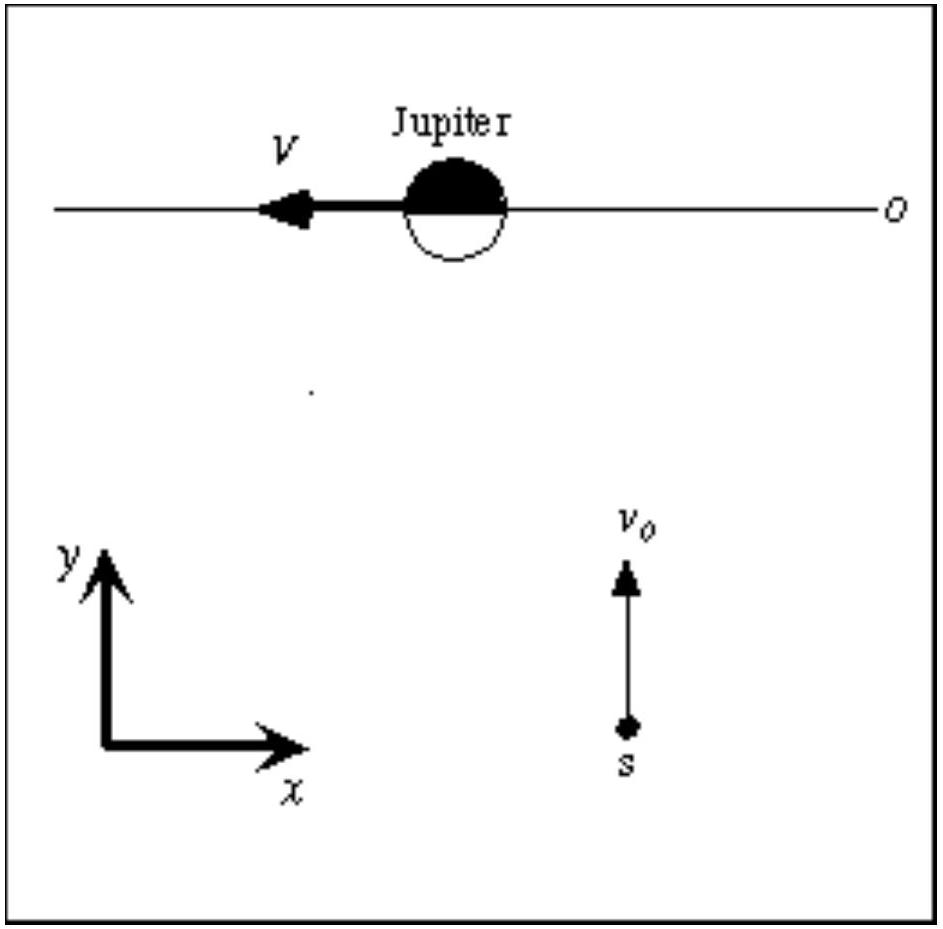
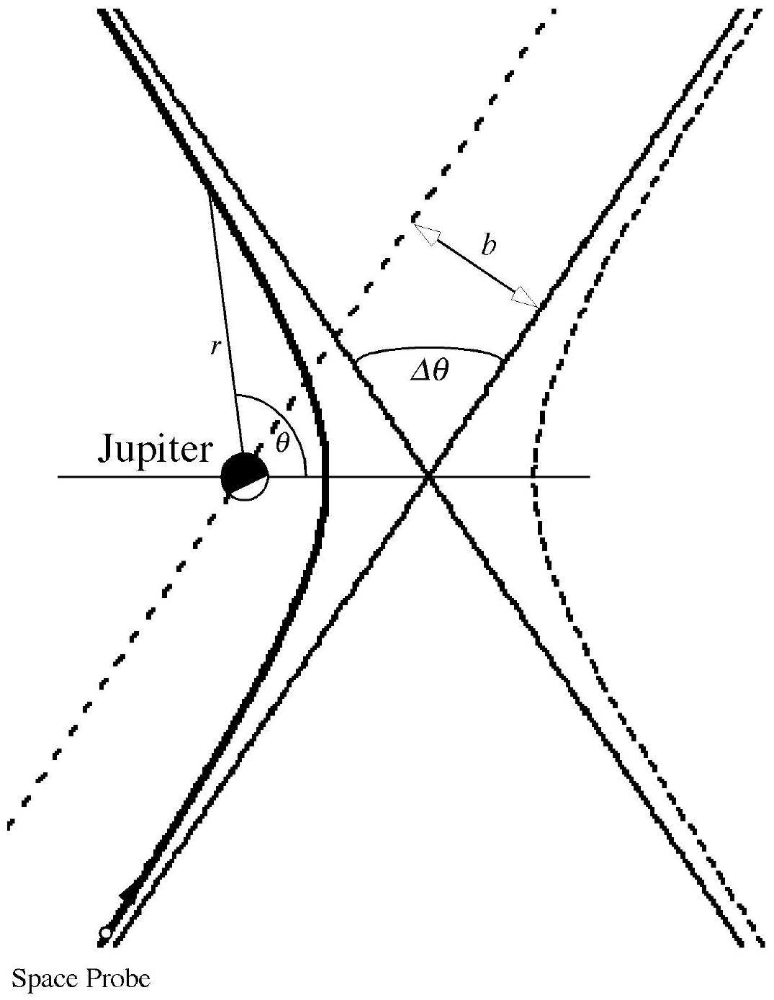

## Problem 3

## A space probe to Jupiter

We consider in this problem a method frequently used to accelerate space probes in the desired direction. The space probe flies by a planet, and can significantly increase its speed and modify considerably its flight direction, by taking away a very small amount of energy from the planet's orbital motion. We analyze here this effect for a space probe passing near Jupiter.

The planet Jupiter orbits around the Sun along an elliptical trajectory, that can be approximated by a circumference of average radius $R$; in order to proceed with the analysis of the physical situation we must first:

1. Find the speed $V$ of the planet along its orbit around the Sun. [ 1.5 points]
2. When the probe is between the Sun and Jupiter (on the segment Sun-Jupiter), find the distance from Jupiter where the Sun's gravitational attraction balances that by Jupiter. [1 point]

A space probe of mass $m=825 \mathrm{~kg}$ flies by Jupiter. For simplicity assume that the trajectory of the space probe is entirely in the plane of Jupiter's orbit; in this way we neglect the important case in which the space probe is expelled from Jupiter's orbital plane.

We only consider what happens in the region where Jupiter's attraction overwhelms all other gravitational forces.

In the reference frame of the Sun's center of mass the initial speed of the space probe is $v_{0}$ $=1.00 \cdot 10^{4} \mathrm{~m} / \mathrm{s}$ (along the positive $y$ direction) while Jupiter's speed is along the negative $x$ direction (see figure 1); by "initial speed" we mean the space probe speed when it's in the interplanetary space, still far from Jupiter but already in the region where the Sun's attraction is negligible with respect to Jupiter's. We assume that the encounter occurs in a sufficiently short time to allow neglecting the change of direction of Jupiter along its orbit around the Sun. We also assume that the probe passes behind Jupiter, i.e. the $x$ coordinate is greater for the probe than for Jupiter when the $y$ coordinate is the same.

Figure 1: View in the Sun center of mass system. O denotes Jupiter's orbit, s is the space probe.

3. Find the space probe's direction of motion (as the angle $\varphi$ between its direction and the $x$ axis) and its speed $v^{\prime}$ in Jupiter's reference frame, when it's still far away from Jupiter. [2 points]
4. Find the value of the space probe's total mechanical energy $E$ in Jupiter's reference frame, putting - as usual - equal to zero the value of its potential energy at a very large distance, in this case when it is far enough to move with almost constant velocity owing to the smallness of all gravitational interactions. [1 point]

The space probe's trajectory in the reference frame of Jupiter is a hyperbola and its equation in polar coordinates in this reference frame is

$$
\frac{1}{r}=\frac{G M}{v^{\prime 2} b^{2}}\left(1+\sqrt{1+\frac{2 E v^{\prime 2} b^{2}}{G^{2} M^{2} m}} \cos \theta\right)
$$

where $b$ is the distance between one of the asymptotes and Jupiter (the so called impact parameter), $E$ is the probe's total mechanical energy in Jupiter's reference frame, $G$ is the gravitational constant, $M$ is the mass of Jupiter, $r$ and $\theta$ are the polar coordinates (the radial distance and the polar angle).

Figure 2 shows the two branches of a hyperbola as described by equation (1); the asymptotes and the polar co-ordinates are also shown. Note that equation (1) has its origin in the "attractive focus" of the hyperbola. The space probe's trajectory is the attractive trajectory (the Final
emphasized branch).

Figure 2

5. Using equation (1) describing the space probe's trajectory, find the total angular deviation $\Delta \theta$ in Jupiter's reference frame (as shown in figure 2) and express it as a function of initial speed $v$ ' and impact parameter $b$. [2 points]
6. Assume that the probe cannot pass Jupiter at a distance less than three Jupiter radii from the center of the planet; find the minimum possible impact parameter and the maximum possible angular deviation. [1 point]
7. Find an equation for the final speed $v$ " of the probe in the Sun's reference frame as a function only of Jupiter's speed $V$, the probe's initial speed $v_{0}$ and the deviation angle $\Delta \theta$. [1 point]
8. Use the previous result to find the numerical value of the final speed $v$ " in the Sun's reference frame when the angular deviation has its maximum possible value. [0.5 points]

Final

## Hint

Depending on which path you follow in your solution, the following trigonometric formulas might be useful:

$$
\begin{aligned}
& \sin (\alpha+\beta)=\sin \alpha \cos \beta+\cos \alpha \sin \beta \\
& \cos (\alpha+\beta)=\cos \alpha \cos \beta-\sin \alpha \sin \beta
\end{aligned}
$$

Final

NAME $\_\_\_\_$
TEAM $\_\_\_\_$
CODE $\_\_\_\_$

| Problem | 3 |
| :--- | :--- |
| Page n. | A |
| Page total |  |
