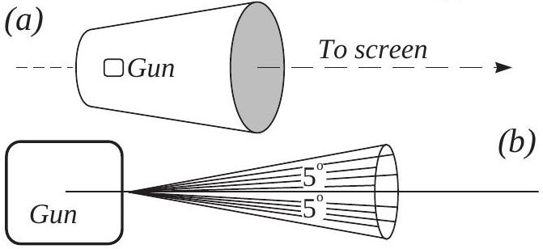
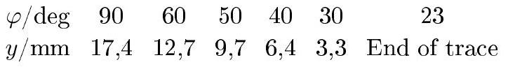
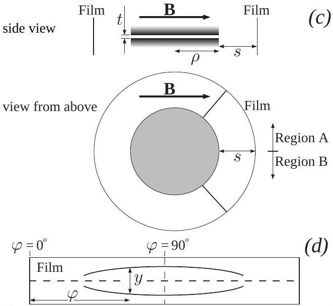

1) A cathode ray tube (CRT), consisting of an electron gun and a screen, is placed within a uniform constant magnetic field of magnitude $\vec{B}$ such that the magnetic field is parallel to the beam axis of the gun, as shown in figure (a).

The electron beam emerges from the anode of the electron gun on the axis, but with a divergence of up to 5° from the axis, as illustrated in figure (b). In general a diffuse spot is produced on the screen, but for certain values of the magnetic field a sharply focused spot is obtained.

By considering the motion of an electron initially moving at an angle $\beta$ (where $0 \leq \beta \leq 5^{\circ}$ ) to the axis as it leaves the electron gun, and considering the components of its motion parallel and perpendicular to the axis, derive an expression for the charge to mass ratio $e / m$ for the electron in terms of the following quantities: the smallest magnetic field for which a focused spot is obtained, the accelerating potential difference across the electron gun $V$ (note that $V<2 \mathrm{kV}$ ), $D$ - the distance between the anode and the screen.
2) Consider another method of evaluating the charge to mass ratio of the electron. The arrangement is shown from a side view and in plan view (from above) in figure (c), with the direction of the magnetic field marked $\vec{B}$. Within this uniform magnetic field $\vec{B}$ are placed two brass circular plates of radius $\rho$ which are separated by a very small distance $t$. A potential difference $V$ is maintained between them. The plates are mutually parallel and co-axial, however their axis is perpendicular to the magnetic field. A photographic film, covers the inside of the curved surface of a cylinder of radius $\rho+s$, which is held co-axial with the plates. In other words, the film is at a radial distance $s$ from the edges of the plates. The entire arrangement is placed in vacuo. Note that $t \ll s, \rho$.

A point source of $\beta$ particles, which emits the $\beta$ particles uniformly in all directions with a range of velocities, is placed between the centres of the plates, and the same piece of film is exposed under three different conditions: firstly with $B=0$ and $V=0$; secondly with $B=B_{0}$ and $V=V_{0}$, ning thirdly with $B=-B_{0}$, and $V=-V_{0}$, where $V_{0}$ and $B_{0}$ are positive constants. Please note that the upper plate is positively charged when $V>0$ (negative when $V<0$ ), and that the magnetic field is in the direction defined by figure (c) when $B>0$ (in the opposite direction when $B<0$ ). For this part you may assume the gap is negligibly small.

Two regions of the film are labelled $A$ and $B$ on figure (c). After exposure and development, a sketch of one of these regions is given in figure (d). From which region was this piece taken (on your answer sheet write $A$ or $B$ )? Justify your answer by showing the directions of the forces acting on the electron. 3) After exposure and development, a sketch of the film is given in figure (d). Measurements are made of the separation of the two outermost traces with a microscope, and this distance $(y)$ is also indicated for one particular angle on figure (d). The results are given in the table below, the angle $\varphi$ being defined in figure (c) as the angle between the magnetic field and a line joining the centre of the plates to the point on the film.

Numerical values of the system parameters are given below: $B_{0}=6.91 \mathrm{mT} ; V_{0}=580 \mathrm{~V} ; t=0.80 \mathrm{~mm} ; s=41.0 \mathrm{~mm}$.

In addition, you may take the speed of light in vacuum to be $3.00 \times 10^{8} \mathrm{~m} / \mathrm{s}$, and the rest mass of the electron to be $9.11 \times 10^{-31} \mathrm{~kg}$.

Determine the maximum $\beta$ particle kinetic energy observed. 4) Find the maximum kinetic energy as a numerical result in eV.

Using the information given in part (3), obtain a value for the charge to rest mass ratio of the electron. This should be done by plotting an appropriate graph which makes it possible to make a full use of the provided data.

Please note that the answer you obtain may not agree with the accepted value because of a systematic error in the observations.
