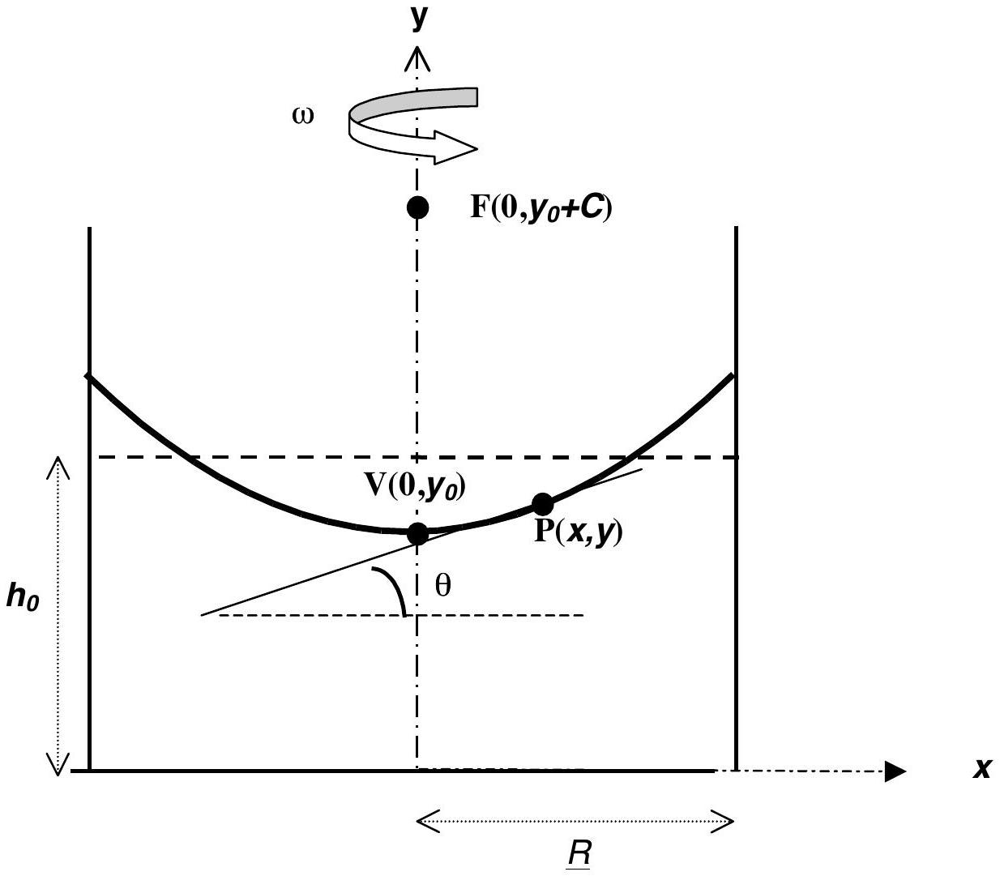
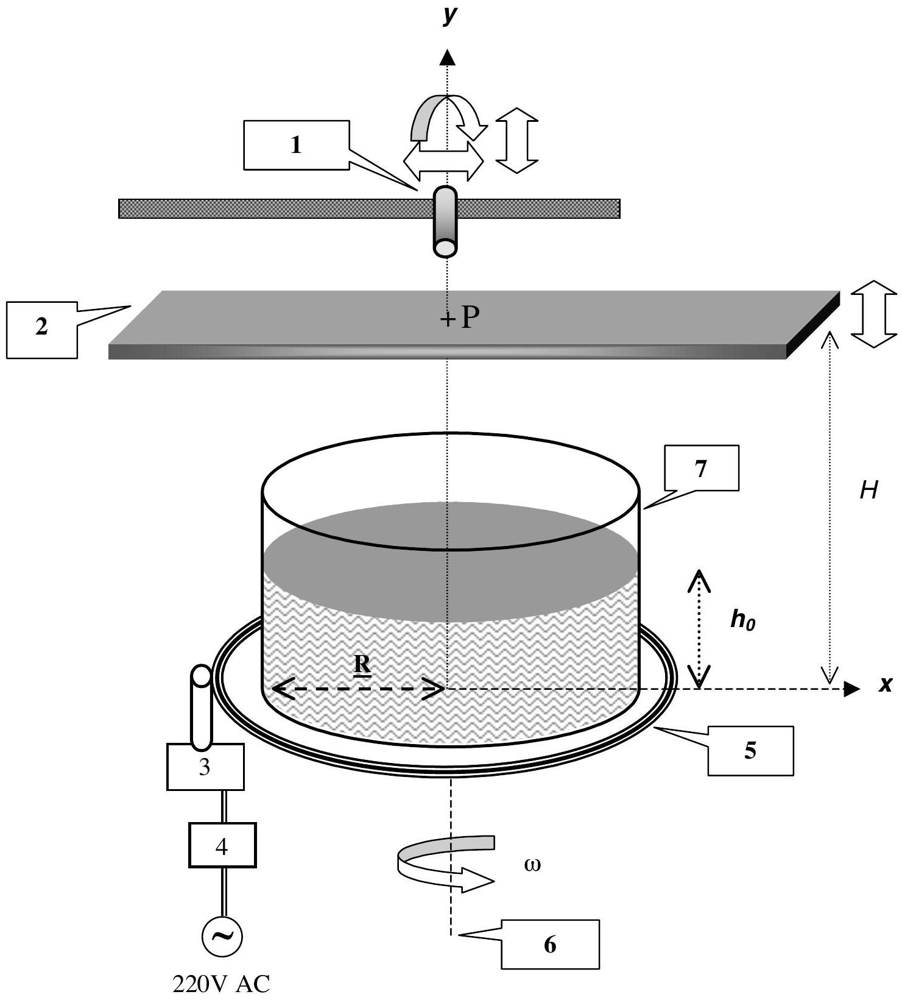
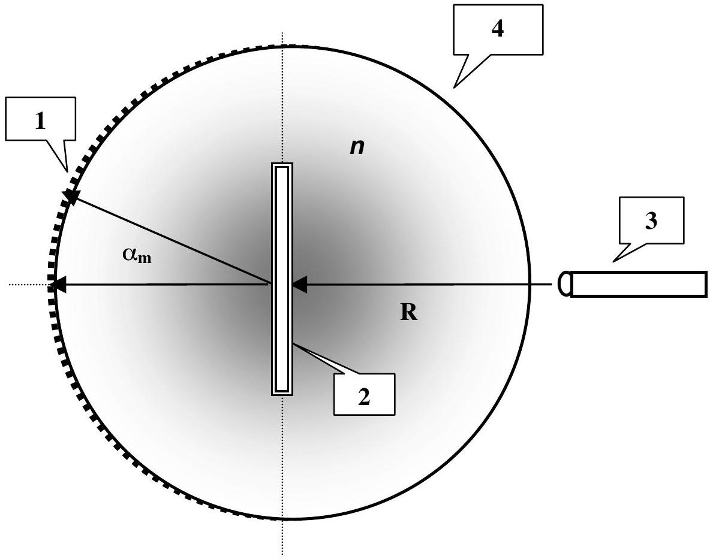

## Experimental Competition

Saturday, June $30{ }^{\text {th }}$, 2001

## Please read this first:

1. The time available is 5 hours for the experimental competition.
2. Use only the pen provided.
3. Use only the front side of the paper.
4. Begin each part of the problem on a separate sheet.
5. For each question, in addition to the blank sheets where you may write, there is an answer form where you must summarize the results you have obtained. Numerical results should be written with as many digits as are appropriate to the given data.
6. Write on the blank sheets of paper the results of all your measurements and whatever else you consider is required for the solution of the question. Please use as little text as possible; express yourself primarily in equations, numbers, figures and plots.
7. Fill in the boxes at the top of each sheet of paper used by writing your Country no and Country code, your student number (Student No.), the number of the question (Question No.), the progressive number of each sheet (Page No.) and the total number of blank sheets used for each question (Total No. of pages). Write the question number and the section label of the part you are answering at the beginning of each sheet of writing paper. If you use some blank sheets of paper for notes that you do not wish to be marked, put a large X across the entire sheet and do not include it in your numbering.
8. At the end of the exam, arrange all sheets in the following order;
    - answer form
    - used sheets in order
    - the sheets you do not wish to be marked
    - unused sheets and the printed question

Place the papers inside the envelope and leave everything on your desk. You are not allowed to take any sheets of paper and any material used in the experiment out of the room.

## ROTATING LIQUID

This experiment consists of three basic parts:

1. investigation of the profile of the rotating liquid's surface and the determination of the acceleration due to gravity,
2. investigation of the rotating liquid as an optical system,
3. determination of the refractive index of the liquid.

When a cylindrical container filled with a liquid rotates about the vertical axis passing through its center with a uniform angular velocity $\omega$, the liquid's surface becomes parabolic (see Figure 1). At equilibrium, the tangent to the surface at the point $\mathrm{P}(x, y)$ makes an angle $\theta$ with the horizontal such that

$$
\tan \theta=\frac{\omega^{2} x}{g} \quad \text { for }|x| \leq R
$$

where $R$ is the radius of the container and $g$ is the acceleration due to gravity.
It can further be shown that for $\omega<\omega_{\text {max }}$ (where $\omega_{\text {max }}$ is the angular speed at which the center of the rotating liquid touches the bottom of the container)

$$
\text { at } x=x_{0}=\frac{R}{\sqrt{2}}, y\left(x_{0}\right)=h_{0}
$$

that is; the height of the rotating liquid is the same as if it were not rotating.
The profile of the rotating liquid's surface is a parabola defined by the equation

$$
y=y_{0}+\frac{x^{2}}{4 C}
$$

where the vertex is at $\mathrm{V}\left(0, y_{0}\right)$ and the focus is at $\mathrm{F}\left(0, y_{0}+C\right)$. When optical rays parallel to the axis of symmetry (optical axis) reflect at the parabolic surface, they all focus at the point F (see Fig.1).

Apparatus

- A cylindrical rigid plastic cup containing liquid glycerin. Millimetric scales are attached to the bottom and the sidewall of this cup.
- A turntable driven by a small dc electric motor powered by a variable voltage supply, which controls the angular velocity.
- A transparent horizontal screen on which you can put transparent or semi-transparent millimetric scales. The location of the screen can be adjusted along the vertical and horizontal directions.
- A laser pointer mounted on a stand. The position of the pointer can be adjusted. The head of the pointer can be changed.
- Additional head for the laser pointer.
- A ruler.
- A highlighter pen.
- A stopwatch. Push the left button to reset, the middle button to select the mode, and the right button to start and stop the timing.
- Transmission gratings with 500 or 1000 lines/mm.
- Bubble level.
- Glasses.

## IMPORTANT NOTES

- DO NOT LOOK DIRECTLY INTO THE LASER BEAM. BE AWARE THAT LASER LIGHT CAN ALSO BE DANGEROUS WHEN REFLECTED OFF A MIRROR-LIKE SURFACE. FOR YOUR OWN SAFETY USE THE GIVEN GLASSES.
- Throughout the whole experiment carefully handle the cup containing glycerin.
- The turntable has already been previously adjusted to be horizontal. Use bubble level only for horizontal alignment of the screen.
- Throughout the entire experiment you will observe several spots on the screen produced by the reflected and/or refracted beams at the various interfaces between the air, the liquid, the screen, and the cup. Be sure to make your measurements on the correct beam.
- In rotating the liquid change the speed of rotation gradually and wait for long enough times for the liquid to come into equilibrium before making any measurements.

## EXPERIMENT

## PART 1: DETERMINATION of $\boldsymbol{g}$ USING a ROTATING LIQUID [ 7.5 pts]

- Derive Equation 1.
- Measure the height $h_{0}$ of the liquid in the container and the inner diameter $2 R$ of the container.
- Insert the screen between the light source and the container. Measure the distance $H$ between the screen and the turntable (see Figure 2).
- Align the laser pointer such that the beam points vertically downward and hits the surface of the liquid at a distance $x_{0}=\frac{R}{\sqrt{2}}$ from the center of the container.
- Rotate the turntable slowly. Be sure that the center of the rotating liquid is not touching the bottom of the container.
- It is known that at $\mathrm{x}_{0}=\frac{R}{\sqrt{2}}$ the height of the liquid remains the same as the original height $h_{0}$, regardless of the angular speed $\omega$. Using this fact and measurements of the angle $\theta$ of the surface at $x_{0}$ for various values of $\omega$, perform an experiment to determine the gravitational acceleration $g$.
- Prepare tables of measured and calculated quantities for each $\omega$.
- Produce the necessary graph to calculate $g$.
- Calculate the value of $g$ and the experimental error in it
- Copy the values $2 R, x_{0}, h_{0}, H$ and the experimental value of $g$ and its error onto the answer form.

## PART 2: OPTICAL SYSTEM

In this part of the experiment the rotating liquid will be treated as an image forming optical system. Since the curvature of the surface varies with the angular speed of rotation, the focal distance of this optical system depends on $\omega$.

2a) Investigation of the focal distance [5.5 pts]

- Align the laser pointer such that the laser beam is directed vertically downward at the center of the container. Mark the point $P$ where the beam strikes the screen. Thus the line joining this point to the center of the cup is the optical axis of this system (see Figure 2).
- Since the surface of the liquid behaves like a parabolic mirror, any incident beam parallel to the optical axis will pass through the focal point F on the optical axis after reflection.
- Adjust the speed of rotation to locate the focal point on the screen. Measure the angular speed of rotation $\omega$ and the distance $H$ between the screen and the turntable.
- Repeat the above steps for different $H$ values.
- Copy the measured values of $\mathbf{2} \boldsymbol{R}$ and $h_{0}$ and the value of $\omega$ at each $H$ onto the answer form.
- With the help of an appropriate graph of your data, find the relationship between the focal length and the angular speed. Copy your result onto the answer form.

2b) Analysis of the "image" (what you see on the screen) [3.5 pts]
In this part of the experiment the properties of the "image" produced by this optical system will be analyzed. To do so, follow the steps given below.

- Remove the head of the laser pointer by turning it counterclockwise.
- Mount the new head (provided in an envelope) by turning it clockwise. Now your laser produces a well defined shape rather than a narrow beam.
- Adjust the position of the laser pointer so that the beam strikes at about the center of the cup almost normally.
- Put a semitransparent sheet of paper on the horizontal screen, which is placed close to the cup, such that the laser beam does not pass through the paper, but the reflected beam does.
- Observe the size and the orientation of the "image" produced by the source beam and the beam reflected from the liquid when it is not rotating.
- Start the liquid rotating, and increase the speed of rotation gradually up to the maximum attainable speed while watching the screen. As $\omega$ increases you might observe different frequency ranges over which the properties of the "image" are drastically different. To describe these observations complete the table on the answer form by adding a row to this table for each such frequency range and fill it in by using the appropriate notations explained on that page.

## PART 3: REFRACTIVE INDEX [3.5 pts]

In this part of the experiment the refractive index of the given liquid will be determined using a grating. When monochromatic light of wavelength $\lambda$ is incident normally on a diffraction grating, the maxima of the diffraction pattern are observed at angles $\alpha_{\mathrm{m}}$ given by the equation

$$
m \lambda=d \sin \alpha_{m}
$$

where, $m$ is the order of diffraction and $d$ is the distance between the rulings of the grating. In this part of the experiment a diffraction grating will be used to determine the wavelength of the laser light and the refractive index of the liquid (see Figure 3).

- Use the grating to determine the wavelength of the laser pointer. Copy your result onto the answer form.
- Immerse the grating perpendicularly into the liquid at the center of the cup.
- Align the laser beam such that it enters the liquid from the sidewall of the cup and strikes the grating normally.
- Observe the diffraction pattern produced on the millimetric scale attached to the cup on the opposite side. Make any necessary distance measurements.
- Calculate the refractive index $n$ of the liquid by using your measurements. (Ignore the effect of the plastic cup on the path of the light.)
- Copy the result of your experiment onto the answer form.

Figure 1. Definitions of the bank angle $\theta$ at point $\mathrm{P}(x, y)$, the vertex V and the focus F for the parabolic surface produced by rotating the liquid, of initial height $h_{0}$ and radius $R$, at a constant angular speed $\omega$ around the $y$-axis.

Figure 2 Experimental setup for parts 1 and 2.

1. Laser pointer on a stand, 2. Transparent screen, 3. Motor, 4. Motor controller, 5. Turntable, 6. Axis of rotation, 7. Cylindrical container.

Figure 3 Top view of the grating in a liquid experiment.

1. Scaled sidewall, 2. Grating on a holder, 3. Laser pointer, 4. Cylindrical container.

| Country no | Country code | Student No. | Question No. | Page No. | Total No. of pages |
| :--- | :--- | :--- | :--- | :--- | :--- |
|  |  |  |  |  |  |

## ANSWER FORM

1) Determination of $\mathbf{g}$ using a rotating liquid

| 2R | $x_{0}$ | $h_{0}$ | $H$ |
| :--- | :--- | :--- | :--- |
|  |  |  |  |

Experimental value of $g$ :

2a) Investigation of the focal distance

| 2R | $\mathrm{h}_{0}$ |
| :--- | :--- |
|  |  |

| H | $\omega$ |
| :--- | :--- |
|  |  |

Relation between focal length and $\omega$ :
□

IPhO2001-experimental competition

| Country no | Country code | Student No. | Question No. | Page No. | Total No. of pages |
| :--- | :--- | :--- | :--- | :--- | :--- |
|  |  |  |  |  |  |

2b) Analysis of the "image"
Use the appropriate notations explained below to describe what you see on the screen due to reflected beam
$\omega$ range: For the frequency ranges only approximate values are required.
Orientation (in comparison with the object beam as seen on the transparent screen):

| Inverted | : INV |
| :--- | :--- |
| Erect | : ER |

Variation of the size with increasing $\omega$ :

| Increases | : I |
| :--- | :--- |
| Decreases | : D |
| No change | : NC |

For the frequency ranges you have found above:
Write " $\mathbf{R}$ " if the screen is above the focal point.
Write "V" if the screen is below the focal point.

| $\omega$ Range | Orientation | Variation of the size | "image" |
| :--- | :--- | :--- | :--- |
| $\omega=0$ |  |  |  |
|  |  |  |  |

3) Refractive index

Wavelength =

Experimental value for $n=$
