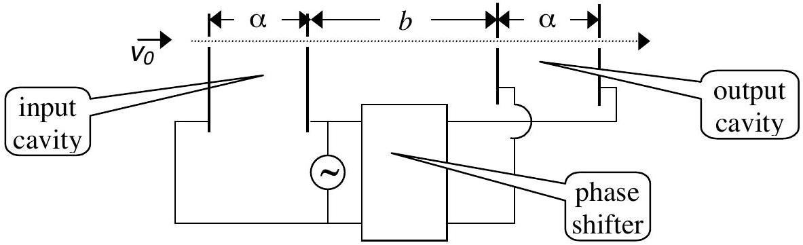
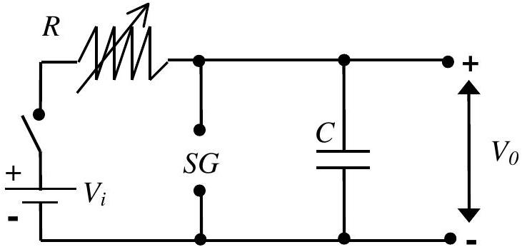
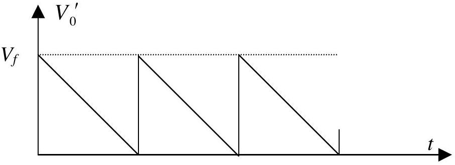
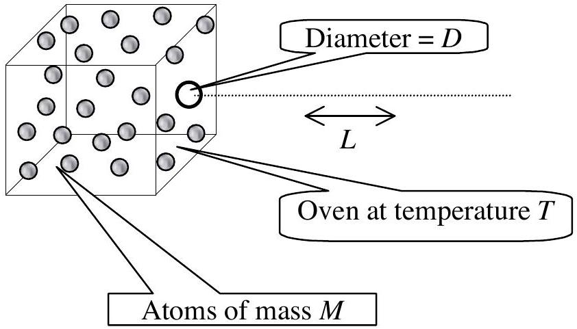

## Question 1

## 1a) KLYSTRON

Klystrons are devices used for amplifying very high-frequency signals. A klystron basically consists of two identical pairs of parallel plates (cavities) separated by a distance $b$, as shown in the figure.

An electron beam with an initial speed $v_{0}$ traverses the entire system, passing through small holes in the plates. The high-frequency voltage to be amplified is applied to both pairs of plates with a certain phase difference (where period T corresponds to $2 \pi$ phase) between them, producing horizontal, alternating electric fields in the cavities. The electrons entering the input cavity when the electric field is to the right are retarded and vice versa, so that the emerging electrons form bunches at a certain distance. If the output cavity is placed at the bunching point, the electric field in this cavity will absorb power from the beam provided that its phase is appropriately chosen. Let the voltage signal be a square wave with period $T=1.0 \times 10^{-9} \mathrm{~s}$, changing between $V= \pm 0.5$ volts. The initial velocity of the electrons is $v_{0}=2.0 \times 10^{6} \mathrm{~m} / \mathrm{s}$ and the charge to mass ratio is $e / m=1.76 \times 10^{11}$ C/kg. The distance $\alpha$ is so small that the transit time in the cavities can be neglected. Keeping 4 significant figures, calculate;

a) the distance $b$, where the electrons bunch. Copy your result onto the answer form. [1.5 pts]
b) the necessary phase difference to be provided by the phase shifter. Copy your result onto the answer form. [1.0 pts]

## 1b) INTERMOLECULAR DISTANCE

Let $d_{L}$ and $d_{V}$ represent the average distances between molecules of water in the liquid phase and in the vapor phase, respectively. Assume that both phases are at 100 °C and atmospheric pressure, and the vapor behaves like an ideal gas. Using the following data, calculate the ratio $d_{V} / d_{L}$ and copy your result onto the answer form. [2.5 pts]

Density of water in liquid phase: $\rho_{L}=1.0 \times 10^{3} \mathrm{~kg} / \mathrm{m}^{3}$,
Molar mass of water: $M=1.8 \times 10^{-2} \mathrm{~kg} / \mathrm{mol}$
Atmospheric pressure: $P_{a}=1.0 \times 10^{5} \mathrm{~N} / \mathrm{m}^{2}$
Gas constant: $R=8.3 \mathrm{~J} / \mathrm{mol}{ }^{\cdot} \mathrm{K}$
Avagadro's number: $N_{A}=6.0 \times 10^{23} / \mathrm{mol}$

## 1c) SIMPLE SAWTOOTH SIGNAL GENERATOR

A sawtooth voltage waveform $V_{0}$ can be obtained across the capacitor $C$ in Fig. 1. $R$ is a variable resistor, $V_{i}$ is an ideal battery, and $S G$ is a spark gap consisting of two electrodes with an adjustable distance between them. When the voltage across the electrodes exceeds the firing voltage $V_{f}$, the air between the electrodes breaks down, hence the gap becomes a short circuit and remains so until

Figure 1

the voltage across the gap becomes very small.

a) Draw the voltage waveform $V_{0}$ versus time $t$, after the switch is closed. [0.5 pts]
b) What condition must be satisfied in order to have an almost linearly varying sawtooth voltage waveform $V_{0}$ ? Copy your result onto the answer form. [0.2 pts]
c) Provided that this condition is satisfied, derive a simplified expression for the period $T$ of the waveform. Copy your result onto the answer form. [0.4 pts]
d) What should you vary( $R$ and/or $S G$ ) to change the period only? Copy your result onto the answer form. [0.2 pts]
e) What should you vary ( $R$ and/or $S G$ ) to change the amplitude only? Copy your result onto the answer form. [0.2 pts]
f) You are given an additional, adjustable DC voltage supply. Design and draw a new circuit indicating the terminals where you would obtain the voltage waveform $V_{0}^{\prime}$ described in Fig. 2. [1.0 pts]

Figure 2

## 1d) ATOMIC BEAM

An atomic beam is prepared by heating a collection of atoms to a temperature $T$ and allowing them to emerge horizontally through a small hole (of atomic dimensions) of diameter $D$ in one side of the oven. Estimate the diameter of the beam after it has traveled a horizontal length $L$ along its path. The mass of an atom is $M$. Copy your result onto the answer form. [2.5 pts]

