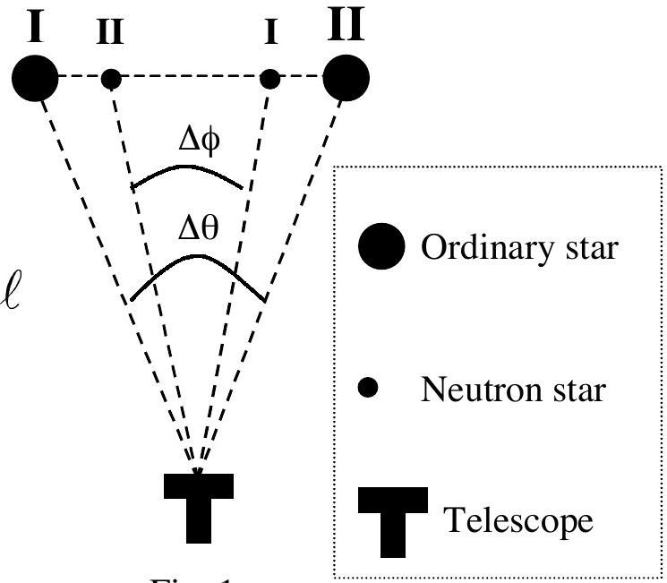
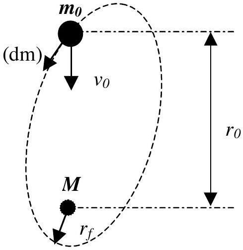

## Question 2

## BINARY STAR SYSTEM

a) It is well known that most stars form binary systems. One type of binary system consists of an ordinary star with mass $m_{0}$ and radius $R$, and a more massive, compact neutron star with mass $M$, rotating around each other. In all the following ignore the motion of the earth. Observations of such a binary system reveal the following information:
    - The maximum angular displacement of the ordinary star is $\Delta \theta$, whereas that of the neutron star is $\Delta \phi$ (see Fig. 1).
    - The time it takes for these maximum displacements is $\tau$.
    - The radiation characteristics of the ordinary star indicate that its surface temperature is $T$ and the radiated energy incident on a unit area on earth's surface per unit time is $P$.
    - The calcium line in this radiation differs from its normal wavelength $\lambda_{0}$ by an amount $\Delta \lambda$, due only to the gravitational field of the ordinary star. (For this calculation the photon can be considered to have an effective mass of $h / c \lambda$.)

Fig. 1

Find an expression for the distance $\ell$ from earth to this system, only in terms of the observed quantities and universal constants. Copy your result onto the answer form. [7 pts]

b) Assume that $M \gg m_{0}$, so that the ordinary star is basically rotating around the neutron star in a circular orbit of radius $r_{0}$. Assume that the ordinary star starts emitting gas toward the neutron star with a speed $v_{0}$, relative to the ordinary star (see Fig. 2). Assuming that the neutron star is the dominant gravitational force in this problem and neglecting the orbital changes of the ordinary star find the distance of closest approach $r_{f}$ shown in Fig. 2. Copy your result onto the answer form. [3pts]

Fig. 2
