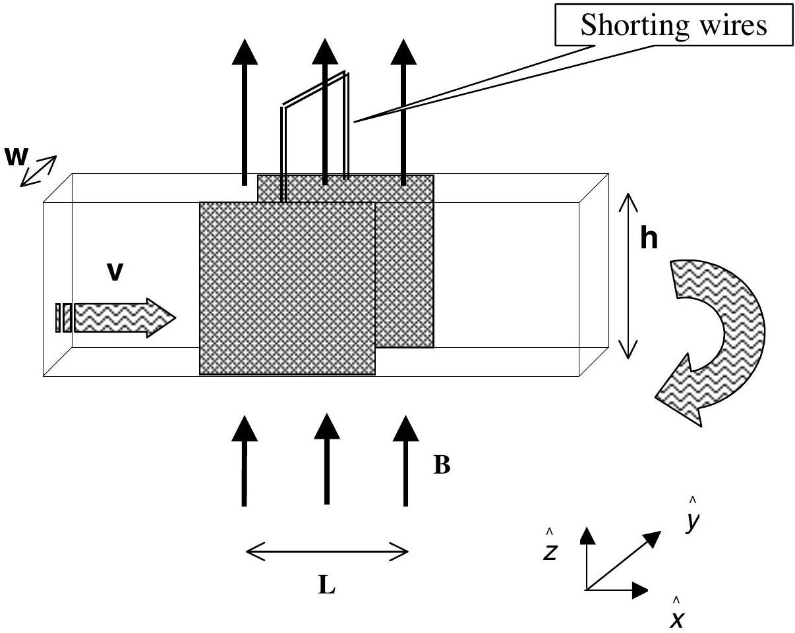

## Question 3

## MAGNETOHYDRODYNAMIC (MHD) GENERATOR

A horizontal rectangular plastic pipe of width $w$ and height $h$, which closes upon itself, is filled with mercury of resistivity $\rho$. An overpressure $P$ is produced by a turbine which drives this fluid with a constant speed $v_{0}$. The two opposite vertical walls of a section of the pipe with length $L$ are made of copper.

The motion of a real fluid is very complex. To simplify the situation we assume the following:

- Although the fluid is viscous, its speed is uniform over the entire cross section.
- The speed of the fluid is always proportional to the net external force acting upon it.
- The fluid is incompressible.

These walls are electrically shorted externally and a uniform, magnetic field B is applied vertically upward only in this section. The set up is illustrated in the figure above, with the unit vectors $\hat{\boldsymbol{x}}, \hat{\boldsymbol{y}}$, $\hat{\boldsymbol{Z}}$ to be used in the solution.

a) Find the force acting on the fluid due to the magnetic field (in terms of $L, B, h, w, \rho$ and the new velocity $v$ ) [2.0 pts]
b) Derive an expression for the new speed $v$ of the fluid (in terms of $v_{0}, P, L, B$ and $\rho$ ) after the magnetic field is applied. [3.0 pts]
c) Derive an expression for the additional power that must be supplied by the turbine to increase the speed to its original value $v_{0}$. Copy your result onto the answer form. $[2.0 p t s]$
d) Now the magnetic field is turned off and mercury is replaced by water flowing with speed $v_{0}$. An electromagnetic wave with a single frequency is sent along the section with length $L$ in the direction of the flow. The refractive index of water is $n$, and $v_{0} \ll c$. Derive an expression for the contribution of the fluid's motion to the phase difference between the waves entering and leaving section $L$. Copy your result onto the answer form. [3.0 pts]

| Country no | Country code | Student No. | Question No. | Page No. | Total No. of pages |
| :--- | :--- | :--- | :--- | :--- | :--- |
|  |  |  |  |  |  |

## ANSWER FORM

1A
a)
$b=$
b)

Phase difference=

1B
$\frac{d_{V}}{d_{L}}=$

IPhO2001 - theoretical competition

| Country no | Country code | Student No. | Question No. | Page No. | Total No. of pages |
| :--- | :--- | :--- | :--- | :--- | :--- |
|  |  |  |  |  |  |

## 1C

b) □
c) □
$T=$
d) □
□
e) □

## 1D

□
New diameter of the beam =

| Country no | Country code | Student No. | Question No. | Page No. | Total No. of pages |
| :--- | :--- | :--- | :--- | :--- | :--- |
|  |  |  |  |  |  |

## ANSWER FORM

2a)
$\ell=$

2b)
$r_{f}=$

| Country no | Country code | Student No. | Question No. | Page No. | Total No. of pages |
| :--- | :--- | :--- | :--- | :--- | :--- |
|  |  |  |  |  |  |

## ANSWER FORM

3a)
□
3b)
□
v =

3c)
□
□
Power =

3d) □
□
Phase difference =
