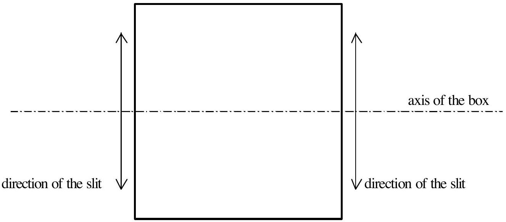

## II. OPTICAL BLACK BOX

## Description

In this problem, the students have to identify the unknown optical components inside the cubic box. The box is sealed and has only two narrow openings protected by red plastic covering. The components should be identified by means of optical phenomena observed in the experiment. Ignore the small thickness effect of the plastic covering layer.

A line going through the centers of the slits is defined as the axis of the box. Apart from the red plastic coverings, there are three (might be identical or different) elements from the following list:

- Mirror, either plane or spherical
- Lens, either positive or negative
- Transparent plate having parallel flat surfaces (so called plane-parallel plate)
- Prism
- Diffraction grating.

The transparent components are made of material with a refractive index of 1.47 at the wavelength used.

## Apparatus available:

- A laser pointer with a wavelength of 670 nm. CAUTION: DO NOT LOOK DIRECTLY INTO THE LASER BEAM.
- An optical rail
- A platform for the cube, movable along the optical rail
- A screen which can be attached to the end of the rail, and detached from it for other measurements.
- A sheet of graph paper which can be pasted on the screen by cellotape.
- A vertical stand equipped with a universal clamp and a test tube with arbitrary scales, which are also used in the Problem I.

Note that all scales marked on the graph papers and the apparatus for the experiments are of the same scale unit, but not calibrated in millimeter.

## The Problem

Identify each of the three components and give its respective specification:

| Possible type of component | Specification required |
| :--- | :--- |
| mirror | radius of curvature, angle between the mirror axis and the axis of the box |
| lens* | positive or negative, its focal length, and its position inside the box |
| plane-parallel plate | thickness, the angle between the plate and the axis of the box |
| prism | apex angle, the angle between one of its deflecting sides and the axis of the box |
| diffraction grating* | line spacing, direction of the lines, and its position inside the box |

- implies that its plane is at right angle to the axis of the box

Express your final answers for the specification parameters of each component (e.g. focal length, radius of curvature) in terms of millimeter, micrometer or the scale of graph paper.

You don't have to determine the accuracy of the results.

| Country | Student No. | Experiment No. | Page No. | Total Pages |
| :--- | :--- | :--- | :--- | :--- |
|  |  |  |  |  |

## ANSWER FORM

1. Write down the types of the optical components inside the box :
no.1. $\_\_\_\_$ [0.5 pts]
no.2.. $\_\_\_\_$ [0.5 pts]
no.3. $\_\_\_\_$ [0.5 pts]
2. The cross section of the box is given in the figure below. Add a sketch in the figure to show how the three components are positioned inside the box. In your sketch, denote each component with its code number in answer 1 .
[0.5 pts for each correct position]

| Country | Student No. | Experiment No. | Page No. | Total Pages |
| :--- | :--- | :--- | :--- | :--- |
|  |  |  |  |  |

3. Add detailed information with additional sketches regarding arrangement of the optical components in answer 2, such as the angle, the distance of the component from the slit, and the orientation or direction of the components. [1.0 pts]

| Country | Student No. | Experiment No. | Page No. | Total Pages |
| :--- | :--- | :--- | :--- | :--- |
|  |  |  |  |  |

4. Summarize the observed data [0.5 pts], determine the specification of the optical component no. 1 by deriving the appropriate formula with the help of drawing [1.0 pts], calculate the specifications in question and enter your answer in the box below [0.5 pts].

| Name of component no. 1 | Specification |
| :--- | :--- |
|  |  |

| Country | Student No. | Experiment No. | Page No. | Total Pages |
| :--- | :--- | :--- | :--- | :--- |
|  |  |  |  |  |

5. Summarize the observed data [0.5 pts], determine the specification of the optical component no. 2 by deriving the appropriate formula with the help of drawing [1.0 pts], calculate the specifications in question and enter your answer in the box below [0.5 pts].

| Name of component no. 2 | Specification |
| :--- | :--- |
|  |  |

| Country | Student No. | Experiment No. | Page No. | Total Pages |
| :--- | :--- | :--- | :--- | :--- |
|  |  |  |  |  |

6. Summarize the observed data [0.5 pts], determine the specification of the optical component no. 3 by deriving the appropriate formula with the help of drawing [1.0 pts], calculate the specifications in question and enter your answer in the box below [0.5 pts].

| Name of component no. 3 | Specification |
| :--- | :--- |
|  |  |
