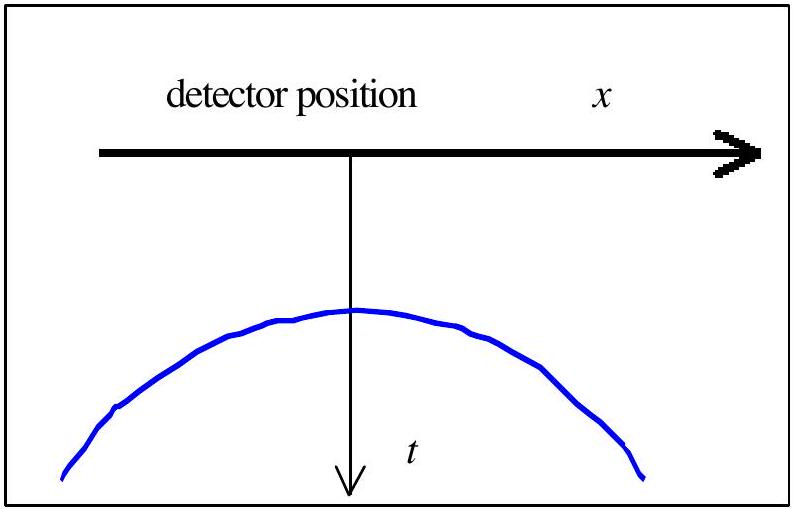

## I. Ground-Penetrating Radar

Ground-penetrating radar (GPR) is used to detect and locate underground objects near the surface by means of transmitting electromagnetic waves into the ground and receiving the waves reflected from those objects. The antenna and the detector are directly on the ground and they are located at the same point.

A linearly polarized electromagnetic plane wave of angular frequency $\omega$ propagating in the z direction is represented by the following expression for its field:

$$
E=E_{0} e^{-\alpha z} \cos (\omega t-\beta z),
$$

where $E_{\boldsymbol{o}}$ is constant, $\alpha$ is the attenuation coefficient and $\beta$ is the wave number expressed respectively as follows

$$
\alpha=\omega\left\{\frac{\mu \varepsilon}{2}\left[\left(1+\frac{\sigma^{2}}{\varepsilon^{2} \omega^{2}}\right)^{1 / 2}-1\right]\right\}^{1 / 2}, \beta=\omega\left\{\frac{\mu \varepsilon}{2}\left[\left(1+\frac{\sigma^{2}}{\varepsilon^{2} \omega^{2}}\right)^{1 / 2}+1\right]\right\}^{1 / 2}
$$

with $\mu, \varepsilon$, and $\sigma$ denoting the magnetic permeability, the electrical permittivity, and the electrical conductivity respectively.

The signal becomes undetected when the amplitude of the radar signal arriving at the object drops below 1/e ( $\approx 37 \%$ ) of its initial value. An electromagnetic wave of variable frequency ( $10 \mathrm{MHz}-1000 \mathrm{MHz}$ ) is usually used to allow adjustment of range and resolution of detection.

The performance of GPR depends on its resolution. The resolution is given by the minimum separation between the two adjacent reflectors to be detected. The minimum separation should give rise to a minimum phase difference of $180^{\circ}$ between the two reflected waves at the detector.

Questions:
(Given : $\mu_{\mathrm{b}}=4 \pi \times 10^{-7} \mathrm{H} / \mathrm{m}$ and $\varepsilon_{0}=8.85 \times 10^{-12} \mathrm{~F} / \mathrm{m}$ )

1. Assume that the ground is non-magnetic ( $\mu=\mu_{0}$ ) satisfying the condition $\left(\frac{\sigma}{\omega \varepsilon}\right)^{2}\langle\langle 1$. Derive the expression of propagation speed $v$ in terms of $\mu$ and $\varepsilon$, using equations (1) and (2) [1.0 pts].

2. Determine the maximum depth of detection of an object in the ground with conductivity of $1.0 \mathrm{mS} / \mathrm{m}$ and permittivity of $9 \varepsilon_{0}$, satisfying the condition $\left(\frac{\sigma}{\omega \varepsilon}\right)^{2}\left\langle\left\langle 1,\left(\mathrm{~S}=\mathrm{ohm}^{-1} ;\right.\right.\right.$ use $\left.\mu=\mu_{0}\right)$. [2.0 pts]
3. Consider two parallel conducting rods buried horizontally in the ground. The rods are 4 meter deep. The ground is known to have conductivity of 1.0 mS/m and permittivity of $9 \varepsilon_{0}$. Suppose the GPR measurement is carried out at a position aproximately above one of the rod. Assume point detector is used. Determine the minimum frequency required to get a lateral resolution of 50 cm [3.5 pts].
4. To determine the depth of a buried rod $d$ in the same ground, consider the measurements carried out along a line perpendicular to the rod. The result is described by the following figure:

Graph of traveltime $t$ vs detector position $x, t_{\text {min }}=100 \mathrm{~ns}$.
Derive $t$ as a function of $x$ and determine $d$ [3.5 pts].
