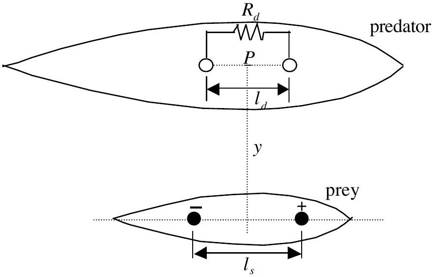
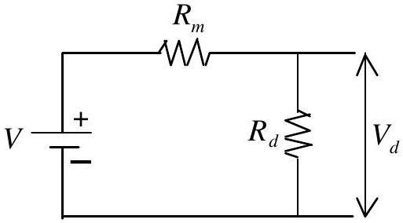

## II. Sensing Electrical Signals

Some seawater animals have the ability to detect other creatures at some distance away due to electric currents produced by the creatures during the breathing processes or other processes involving muscular contraction. Some predators use this electrical signal to locate their preys, even when buried under the sands.

The physical mechanism underlying the current generation at the prey and its detection by the predator can be modeled as described by Figure II-1. The current generated by the prey flows between two spheres with positive and negative potential in the prey's body. The distance between the centers of the two spheres is $l_{s}$, each having a radius of $r_{s}$, which is much smaller than $l_{s}$. The seawater resistivity is $\rho$. Assume that the resistivity of the prey's body is the same as that of the surrounding seawater, implying that the boundary surrounding the prey in the figure can be ignored.

Figure II-1. A model describing the detection of electric power coming from a prey by its predator.

In order to describe the detection of electric power by the predator coming from the prey, the detector is modeled similarly by two spheres on the predator's body and in contact with the surrounding seawater, lying parallel to the pair in the prey's body. They are separated by a distance of $l_{d}$, each having a radius of $r_{d}$ which is much smaller than $l_{d}$. In this case, the center of the detector is located at a distance $y$ right above the source and the line connecting the two spheres is parallel to the electric field as shown in Figure II-1. Both $l_{s}$ and $l_{d}$ are also much smaller than $y$. The electric field strength along the line connecting the two spheres is assumed to be constant. Therefore the detector forms a closed circuit system connecting the prey, the surrounding seawater and the predator as described in Figure II-2.

Figure II-2. The equivalent closed circuit system involving the sensing predator, the prey and the surrounding seawater.

In the figure, $V$ is the voltage difference between the detector's spheres due to the electric field induced by the prey, $R_{m}$ is the inner resistance due to the surrounding sea water. Further, $V_{d}$ and $R_{d}$ are respectively the voltage difference between the detecting spheres and the resistance of the detecting element within the predator.

## Questions:

1. Determine the current density vector $\vec{j}$ (current per unit area) caused by a point current source $I_{s}$ at a distance $r$ in an infinite medium. [1.5 pts]

2. Based on the law $\vec{E}=\rho \vec{j}$, determine the electric field strength $\vec{E}_{p}$ at the middle of the detecting spheres (at point P ) for a given current $I_{s}$ that flows between two spheres in the prey's body [2.0 pts].
3. Determine for the same current $I_{s}$, the voltage difference between the source spheres $\left(V_{s}\right)$ in the prey [1.5 pts]. Determine the resistance between the two source spheres $\left(R_{s}\right)$ [0.5 pts] and the power produced by the source $\left(P_{s}\right)$ [0.5 pts].
4. Determine $R_{m}[0.5$ pts $], V_{d}[1.0$ pts $]$ in Figure II-2 and calculate also the power transferred from the source to the detector $\left(P_{d}\right)$ [0.5 pts].
5. Determine the optimum value of $R_{d}$ leading to maximum detected power [1.5 pts] and determine also the maximum power [0.5 pts].
