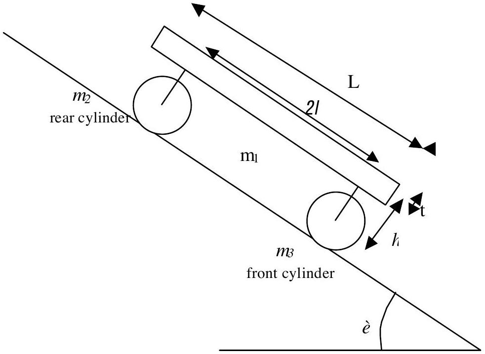
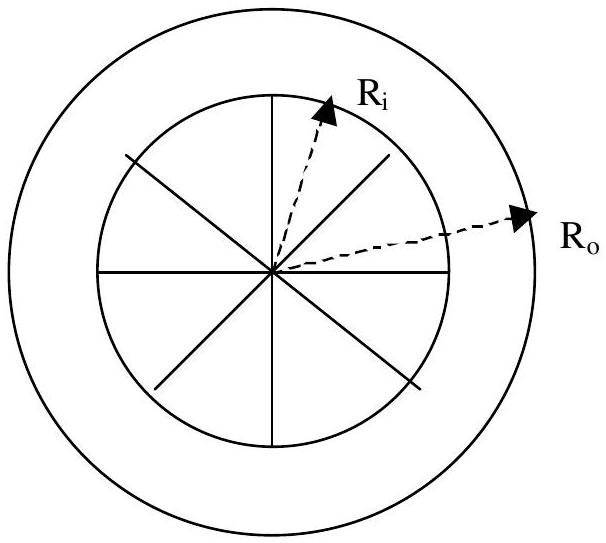

## III. A Heavy Vehicle Moving on An Inclined Road

Figure III-1: A simplified model of a heavy vehicle moving on an inclined road.

The above figure is a simplified model of a heavy vehicle (road roller) with one rear and one front cylinder as its wheels on an inclined road with inclination angle of $\grave{e}$ as shown in Figure III-1. Each of the two cylinders has a total mass $\mathrm{M}\left(\mathrm{m}_{2}=\mathrm{m}_{3}=\mathrm{M}\right)$ and consists of a cylindrical shell of outer radius $R_{o}$, inner radius $R_{\mathrm{i}}=$ $0.8 R_{\mathrm{o}}$ and eight number of spokes with total mass 0.2 M. The mass of the undercarriage supporting the vehicle's body is negligible. The cylinder can be modeled as shown in Figure III-2. The vehicle is moving down the road under the influence of gravitational and frictional forces. The front and rear cylinder are positioned symmetrically with respect to the vehicle.

Figure III-2: A simplified model of the cylinders.

The static and kinetic friction coefficients between the cylinder and the road are $\mu_{s}$ and $\mu_{k}$ respectively. The body of the vehicle has a mass of 5M , length of $L$ and thickness of $t$. The distance between the front and the rear cylinder is $2 l$ while the distance from the center of cylinder to the base of the vehicle's body is $h$. Assume that the rolling friction between the cylinder and its axis is negligible.

Questions:

1. Calculate the moment of inertia of either cylinder [1.5 pts].
2. Draw all forces that act on the body, the front cylinder, and the rear one. Write down equations of motion for each part of them [2.5 pts].
3. The vehicle is assummed to move from rest, then freely move under gravitational influence. State all the possible types of motion of the system and derive their accelerations in terms of the given physical quantities [4.0 pts].
4. Assume that after the vehicle travels a distance $d$ by pure rolling from rest the vehicle enters a section of the road with all the friction coefficients drop to smaller constant values $\mu_{\mathrm{s}}{ }^{\prime}$ and $\mu_{\mathrm{k}}$ ' such that the two cylinders start to slide. Calculate the linear and angular velocities of each cylinder after the vehicle has traveled a total distance of $s$ meters. Here we assume that d and s is much larger than the dimension of vehicle [2.0 pts]

IPhO2002
