# The 34th International Physics Olympiad

## Taipei, Taiwan

Experimental Competition
Wednesday, August 6, 2003
Time Available : 5 hours

Please Read This First:

1. Use only the pen provided.
2. Use only the front side of the answer sheets and paper.
3. In your answers please use as little text as possible; express yourself primarily in equations, numbers and figures. If the required result is a numerical number, underline your final result with a wavy line.
4. Write on the blank sheets of paper the results of your measurements and whatever else you consider is required for the solution of the question and that you wish to be marked.
5. It is absolutely essential that you enter in the boxes at the top of each sheet of paper used your Country and your student number [Student No.]. In addition, on the blank sheets of paper used for each question, you should enter the question number [Question No. : e.g. A-(1)], the progressive number of each sheet [Page No.] and the total number of blank sheets that you have used and wish to be marked for each question [Total No. of pages]. If you use some blank sheets of paper for notes that you do not wish to be marked, put a large cross through the whole sheet and do not include them in your numbering.
6. At the end of the exam please put your answer sheets and graphs in order.
7. Error bars on graphs are only needed in part A of the experiment.
8. Caution: Do not look directly into the laser beam. You can damage your eyes!!

## Apparatuses and materials

1. Available apparatuses and materials are listed in the following table:

| Item | Apparatus \& material | Quantity |
| :--- | :--- | :--- |
| A | Photodetector (PD) | 1 |
| B | Polarizers with Rotary mount | 2 |
| C | $90^{\circ}$ TN-LC cell (yellow wires) with rotary LC mount | 1 |
| D | Function generator | 1 |
| E | Laser diode (LD) | 1 |
| F | Multimeters | 2 |
| G | Parallel LC cell (orange wires) | 1 |
| H | Variable resistor | 1 |

| Item | Apparatus \& material | Quantity |
| :--- | :--- | :--- |
| I | Batteries | 2 |
| J | Battery box | 1 |
| K | Optical bench | 1 |
| L | Partially transparent papers | 2 |
| M | Ruler | 1 |
| N | White tape * (for marking on apparatus) | 1 |
| O | Scissors | 1 |
| P | Graph papers | 10 |
- Do not mark directly on apparatus. When needed, stick a piece of the white tape on the parts and mark on the white tape.

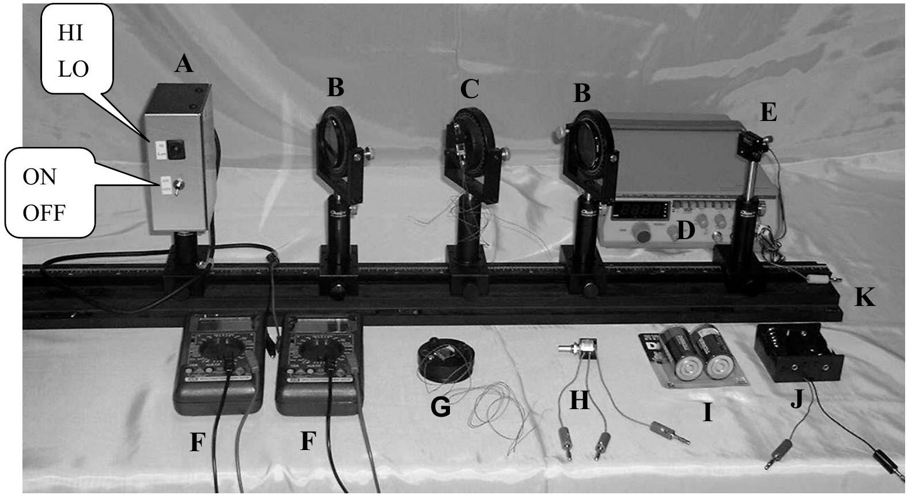
Fig. 1

2. Instructions for the multimeter:
- "DC/AC" switch for selecting DC or AC measurement.
- Use the "V $\Omega$ " and the "COM" inlets for voltage and resistance measurements.
- Use the "mA" and the "COM" inlets for small current measurements. The display then shows the current in milliamperes.
- Use the function dial to select the proper function and measuring range. "V" is for voltage measurement, "A" is for current measurement and " $\Omega$ "is for resistance measurement.

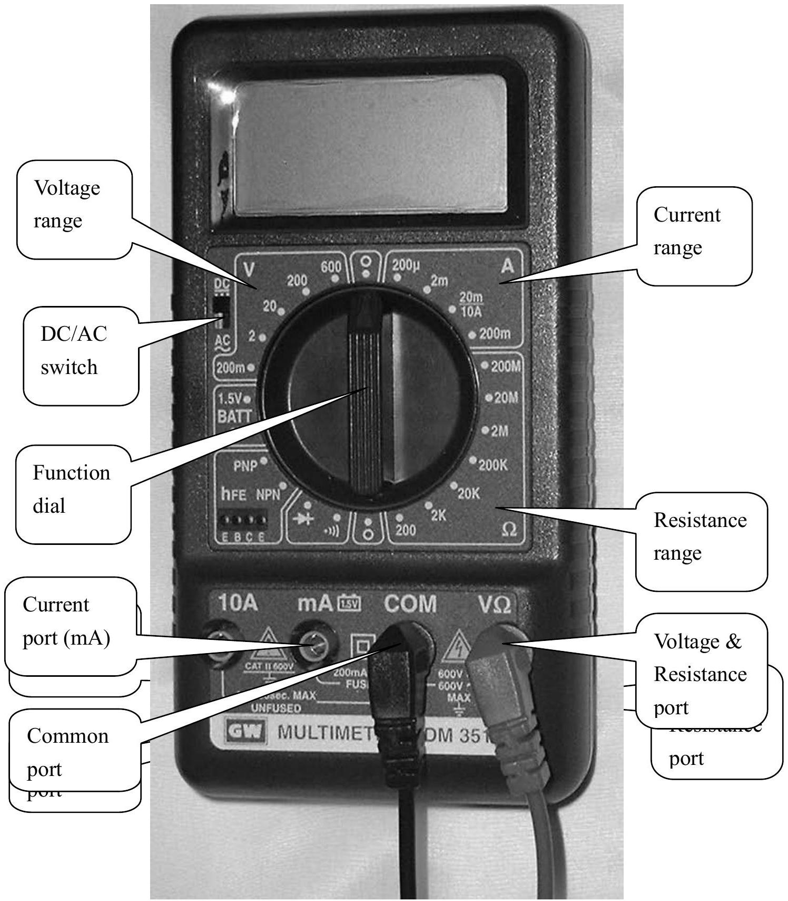
Fig. 2

3. Instructions for the Function Generator:
- The power button may be pressed for "ON" and pressed again for "OFF"
- Select the frequencies range, and press the proper button.
- The frequency is shown on the digital display.
- Use the coarse and the fine frequency adjusting knobs to tune the proper frequency.
- Select the square-wave form by pressing the left most waveform button.
- Use the amplitude-adjusting knob to vary the output voltage.

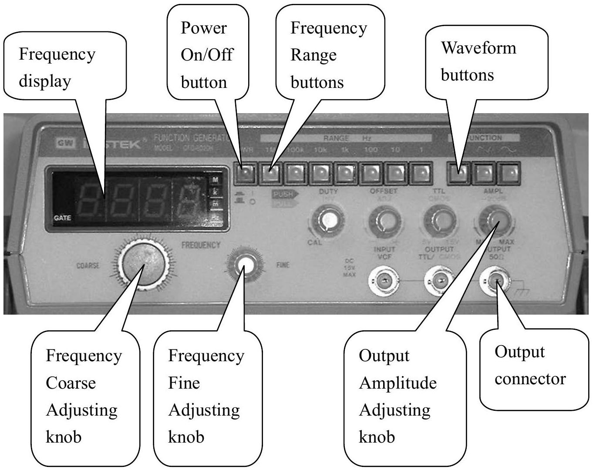
Fig. 3

## Part A: Optical Properties of Laser Diode

## I. Introduction

1. Laser Diode

The light source in this experiment is a laser diode which emits laser light with wavelength 650 nm . When the current of the laser diode (LD) is greater than the threshold current, the laser diode can emit monochromatic, partially polarized and coherent light. When the current in the laser diode is less than the threshold, the emitted light intensity is very small. At above the threshold current, the light intensity increases dramatically with the current and keeps a linear relationship with the current. If the current increases further, then the increasing rate of the intensity with respect to the current becomes smaller because of the higher temperature of the laser diode. Therefore, the optimal operating current range for the laser diode is the region where the intensity is linear with the current. In general, the threshold current $I_{t h}$ is defined as the intersection point of the current axis with the extrapolation line of the linear region.
Caution: Do not look directly into the laser beam. You can damage your eyes!!
2. Photodetector

The photodetector used in this experiment consists of a photodiode and a current amplifier. When an external bias voltage is applied on the photodiode, the photocurrent is generated by the light incident upon the diode. Under the condition of a constant temperature and monochromatic incident light, the photocurrent is proportional to the light intensity. On the other hand, the current amplifier is utilized to transfer the photocurrent into an output voltage. There are two transfer ratios in our photodetector - high and low gains. In our experiment, only the low gain is used. However, because of the limitation of the photodiode itself, the output voltage would go into saturation at about 8 Volts if the light intensity is too high and the photodiode cannot operate properly any more. Hence the appropriate operating range of the photodetector is when the output voltage is indeed proportional to the light intensity. If the light intensity is too high so that the photodiode reaches the saturation, the reading of the photodetector can not correctly represent the incident light intensity.

## II. Experiments and procedures

## Characteristics of the laser diode \& the photodetector

In order to make sure the experiments are done successfully, the optical alignment of
light rays between different parts of an experimental setup is crucial. Also the light source and the detector should be operated at proper condition. Part A is related to these questions and the question of the degree of polarization.

1. Mount the laser diode and photodetector in a horizontal line on the optical bench, as shown in Fig. 4. Connect the variable resistor, battery set, ampere meter, voltage meter, laser diode and photodetector according to Fig. 5. Adjust the variable resistor so that the current passing through LD is around 25 mA and the laser diode emits laser light properly. Choose the low gain for the photodetector. Align the laser diode and the photodetector to make the laser light level at the small hole on the detector box and the reading of the photodetector reaches a maximum value.
Caution: Do not let the black and the red leads of the battery contact with each other to avoid short circuit.

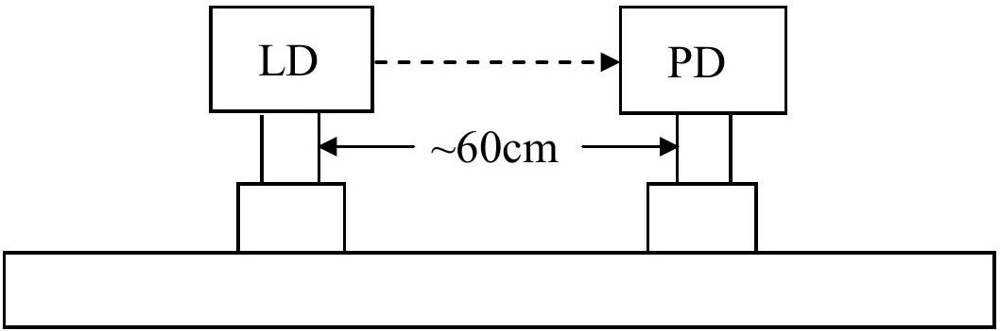
Fig. 4 Optical setup (LD : laser diode; PD : photodetector).

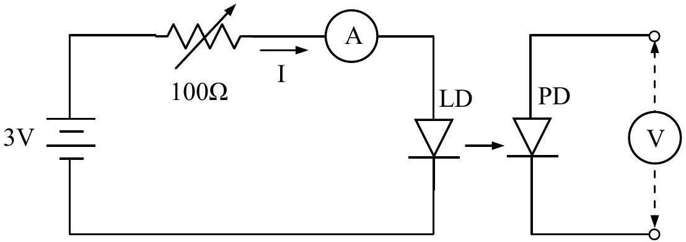
Fig. 5 Equivalent circuit for the connection of the laser diode.
2. Use the output voltage of the photodetector to represent the laser light intensity $\mathcal{J}$. Adjust the variable resistor to make the current $I$ of the laser diode varying from zero to a maximum value and measure the $\mathcal{J}$ as $I$ increases. Be sure to choose appropriate current increment in the measurement.

Question A-(1) (1.5 point)
Measure, tabulate, and plot the $\mathcal{J}$ vs. $I$ curve.

Question A-(2) (3.5 points)
Estimate the maximum current $I_{m}$ with uncertainty in the linear region of the
$\mathcal{J}$ vs. $I$ curve. Mark the linear region on the $\mathcal{J}-I$ curve figure by using arrows ( ↓ ) and determine the threshold current $I_{t h}$ with uncertainty.

3. Choose the current of the laser diode as $I_{t h}+2\left(I_{m}-I_{t h}\right) / 3$ to make sure the laser diode and photodetector are operated well.
4. To prepare for the part B experiment: Mount a polarizer on the optical bench close to the laser diode as shown in Fig. 6. Make sure the laser beam passing through the center portion of the polarizer. Adjust the polarizer so that the incident laser beam is perpendicular to the plane of the polarizer. (Hint: You can insert a piece of partially transparent paper as a test screen to check if the incident and reflected light spots coincide with each other.)

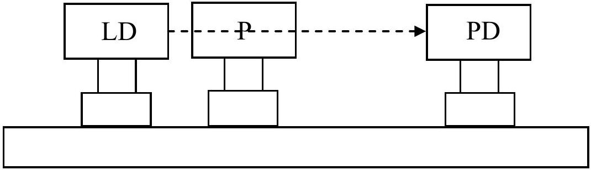
Fig. 6 Alignment of the polarizer (P : polarizer).
5. Keep the current of the laser diode unchanged, mount a second piece of polarizer on the optical bench and make sure proper alignment is accomplished, i.e., set up the source, detector and polarizers in a straight line and make sure each polarizer plane is perpendicular to the light beam.

## Part B Optical Properties of Nematic Liquid Crystal :

Electro-optical switching characteristic of $90^{\circ} \mathrm{TN} \mathrm{LC}$ cell

## I. Introduction

1. Liquid Crystal

Liquid crystal (LC) is a state of matter that is intermediate between the crystalline solid and the amorphous liquid. The nematic LCs are organic compounds consist of long-shaped needle-like molecules. The orientation of the molecules can be easily aligned and controlled by applying an electrical field. Uniform or well prescribed orientation of the LC molecules is required in most LC devices. The structure of the LC cell used in this experiment is shown in Fig 7. Rubbing the polyimide film can produce a well-aligned preferred orientation for LC molecules on substrate surfaces, thus due to the molecular interaction the whole slab of LC can achieve uniform molecular orientation. The local molecular orientation is called the director of LC at that point.

The LC cell exhibits the so-called double refraction phenomenon with two principal refractive indices. When light propagates along the direction of the director, all polarization components travel with the same speed $v_{o}=c / n_{0}$, where $n_{o}$ is called the ordinary index of refraction. This propagation direction (direction of the director) is called the optic axis of the LC cell. When a light beam propagates in the direction perpendicular to the optic axis, in general, there are two speeds of propagation. The electric field of the light polarized perpendicular (or parallel) to the optic axis travels with the speed of $v_{o}=c / n_{0}$ (or $v_{e}=c / n_{e}$, where $n_{e}$ is called the extraordinary index of refraction). The birefringence (optical anisotropy) is defined as the difference between the extraordinary and the ordinary indices of refraction $\Delta n \equiv n_{e}-n_{o}$.

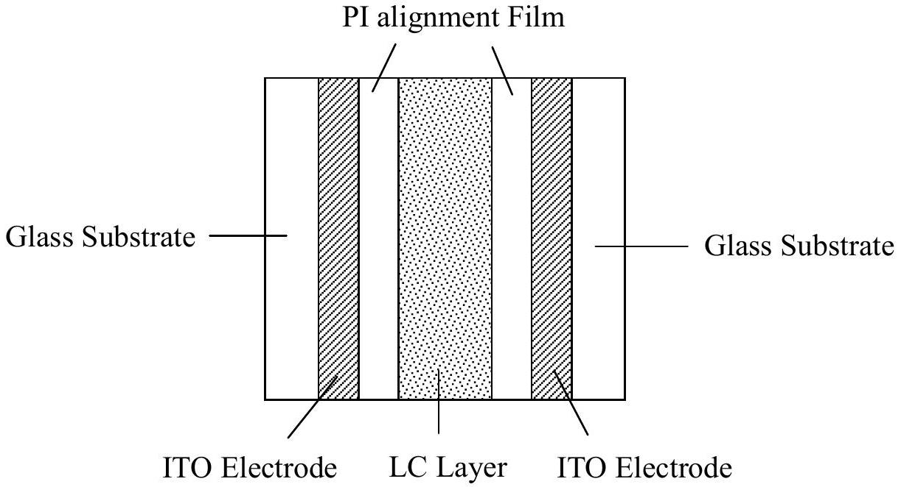
Fig. 7 LC cell structure

## 2. 90° Twisted Nematic LC Cell

In the 90° twisted nematic (TN) cell shown in Fig. 8, the LC director of the back surface is twisted $90^{\circ}$ with respect to the front surface. The front local director is set parallel to the transmission axis of the polarizer. An incident unpolarized light is converted into a linearly polarized light by the front polarizer.

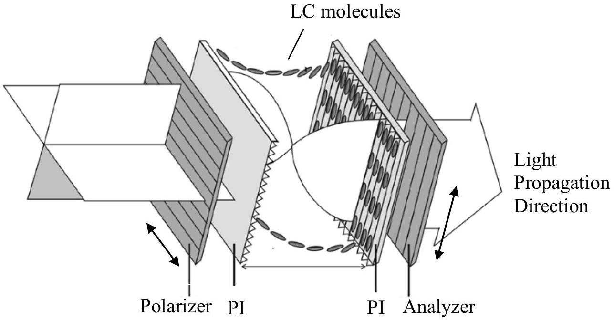
Fig. 8 90º TN LC cell

When a linearly polarized light traverses through a $90^{\circ} \mathrm{TN}$ cell, its polarization follows the twist of the LC directors (polarized light sees $\mathrm{n}_{\mathrm{e}}$ only) so that the output beam remains linearly polarized except for that its polarization axis is rotated by 90° (it's called the polarizing rotary effect by $\mathrm{n}_{\mathrm{e}}$; similarly we can also find polarizing rotary effect by $\mathrm{n}_{\mathrm{o}}$ ). Thus, for a normally black (NB) mode using a 90° TN cell, the analyzer's (a second polarizer) transmission axis is set to be parallel to the polarizer's transmission axis, as shown in Fig. 9. However, when the applied voltage V across the LC cell exceeds a critical value $\mathrm{V}_{\mathrm{c}}$, the director of LC molecules tends to align along the direction of applied external electrical field which is in the direction of the propagation of light. Hence, the polarization guiding effect of the LC cell is gradually diminishing and the light leaks through the analyzer. Its electro-optical switching slope $\gamma$ is defined as $\left(\mathrm{V}_{90}-\mathrm{V}_{10}\right) / \mathrm{V}_{10}$, where $\mathrm{V}_{10}$ and $\mathrm{V}_{90}$ are the applied voltages enabling output light signal reaches up to 10\% and 90\% of its maximum light intensity, respectively.

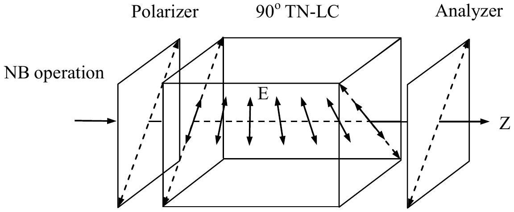
Fig. 9 NB mode operation of a 90° TN cell

## II. Experiments and procedures

1. Setup a NB 90° TN LC mode between two polarizers with parallel transmission axes and apply 100 Hz square wave voltage using a function generator onto the ITO portions of two glass substrates and vary the applied voltage $\left(\mathrm{V}_{\text {rms }}\right)$ from 0 to 7.2 Volts.
    - In the crucial turning points, take more data if necessary.

Question_B-(1) (5.0 points)
Measure, tabulate, and plot the electro-optical switching curve ( $\mathcal{J}$ vs. $\mathrm{V}_{\text {rms }}$ curve) of the NB 90° TN LC, and find its switching slope $\gamma$, where $\gamma$ is defined as $\left(\mathrm{V}_{90}-\mathrm{V}_{10}\right) / \mathrm{V}_{10}$.

Question B-(2) (2.5 points)
Determine the critical voltage $\mathrm{V}_{\mathrm{c}}$ of this NB 90° TN LC cell. Show explicitly with graph how you determine the value $\mathrm{V}_{\mathrm{c}}$.
Hint:* When the external applied voltage exceeds the critical voltage, the light transmission increases rapidly and abruptly.

## Part C Optical Properties of Nematic Liquid Crystal : Electro-optical switching characteristic of parallel aligned LC cell

## I. Introduction

Homogeneous Parallel-aligned LC Cell
For a parallel-aligned LC cell, the directors in the front and back substrates are parallel with each other, as shown in Fig. 10. When a linearly polarized light impinges on a parallel-aligned cell with its polarization parallel to the LC director (rubbing direction), a pure phase modulation is achieved because the light behaves only as an extraordinary ray.

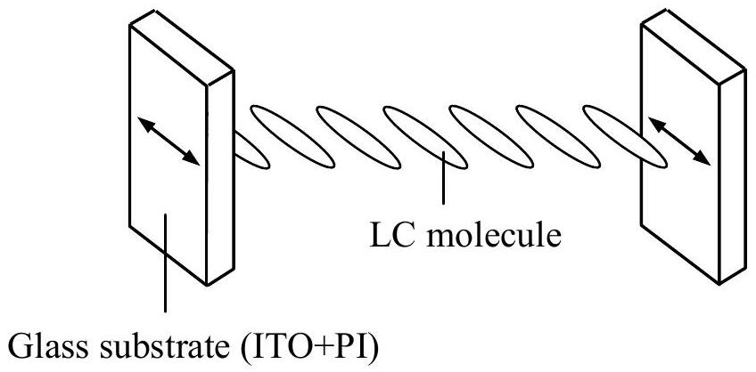
Fig. 10 Homogeneous parallel aligned LC

On the other hand, if a linearly polarized light is normally incident onto a parallel aligned cell but with its polarization making $\theta=45^{\circ}$ relative to the direction of the aligned LC directors (Fig. 11), then phase retardation occurs due to the different propagating speed of the extraordinary and ordinary rays in the LC medium. In this $\theta=45^{\circ}$ configuration, when the two polarizers are parallel, the normalized transmission of a parallel aligned LC cell is given by

$$
T_{\|}=\cos ^{2} \frac{\delta}{2}
$$

The phase retardation $\delta$ is expressed as

$$
\delta=2 \pi d \Delta n(V, \lambda) / \lambda
$$

where $d$ is the LC layer thickness, $\lambda$ is the wavelength of light in air, $V$ is the root mean square of applied AC voltage, and $\Delta n$, a function of $\lambda$ and $V$, is the LC birefringence. It should be also noted that, at $V=0, \Delta n\left(=n_{\mathrm{e}}-n_{\mathrm{o}}\right)$ has its maximum value, so does $\delta$. Also $\Delta n$ decreases as $V$ increases.

In the general case, we have

$$
T_{/ /}=1-\sin ^{2} 2 \theta \sin ^{2} \frac{\delta}{2}
$$

$$
T_{\perp}=\sin ^{2} 2 \theta \sin ^{2} \frac{\delta}{2}
$$

where // and ⟂ represent that the transmission axis of analyzer is parallel and perpendicular to that of the polarizer, respectively.

## II. Experiments and procedures

1. Replace NB 90° TN LC cell with parallel-aligned LC cell.
2. Set up $\theta=45^{\circ}$ configuration at $V=0$ as shown in Fig. 11. Let the analyzer's transmission axis perpendicular to that of the polarizer, then rotate the parallel-aligned LC cell until the intensity of the transmitted light reaches the maximum value ( $T_{\perp}$ ). This procedure establishes the $\theta=45^{\circ}$ configuration. Take down $T_{\perp}$ value, then, measure the intensity of the transmitted light ( $T_{/ /}$) of the same LC cell at the analyzer's transmission axis parallel to that of the polarizer (also at $V=0$ ).

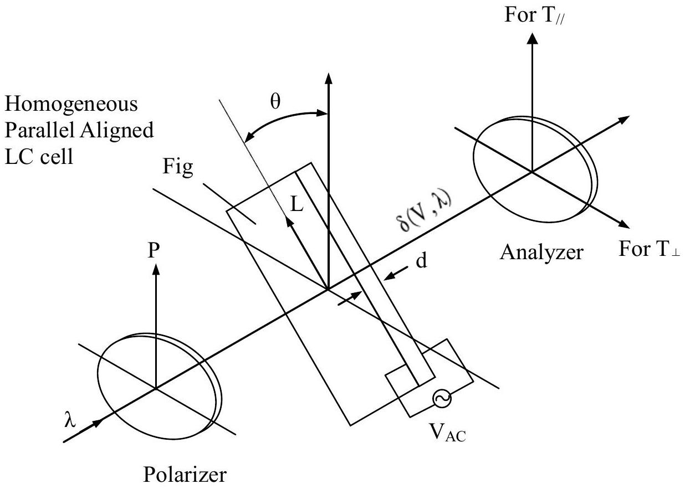
Fig. 11 Schematic diagram of experimental setup (The arrow L is the alignment direction.)

Question C-(1) (2.5 points)
Assume that the wavelength of laser light 650 nm, LC layer thickness $7.7 \mu \mathrm{~m}$, and approximate value of $\Delta \mathrm{n} \approx 0.25$ are known. From the experimental data $\mathrm{T}_{\perp}$ and $\mathrm{T}_{\|}$obtained above, calculate the accurate value of the phase retardation $\delta$ and accurate value of birefringence $\Delta \mathrm{n}$ of this LC cell at $\mathrm{V}=0$.

3. Similar to the above experiment (1), in the $\theta=45^{\circ}$ configuration, apply 100 Hz square wave voltage using a function generator onto the ITO portions of two glass substrates, vary the applied voltage $\left(\mathrm{V}_{\text {rms }}\right)$ from 0 to 7 Volts and measure the electro-optical switching curve $\left(\mathrm{T}_{\|}\right)$at the analyzer's transmission axis parallel to the polarizer's transmission axis. (Hint: Measuring the $\mathrm{T}_{\perp}$ switching curve is helpful to increase the data accuracy of the above $\mathrm{T}_{\|}$measurement; the data of $\mathrm{T}_{\perp}$ are not needed in the following questions. )
* In the crucial turning points, take more data if necessary (especially in the range of 0.5-4.0 Volts).

Question_C-(2) (3.0 points)
Measure, tabulate, and plot the electro-optical switching curve for $\mathrm{T}_{\mathrm{l}}$ of_this parallel aligned LC cell in the $\theta=45^{\circ}$ configuration.

Question C-(3) (2.0 points)
From the electro-optical switching data, find the value of the external applied voltage $\mathrm{V}_{\pi}$.
Hint: * $\mathrm{V}_{\pi}$ is the applied voltage which enables the phase retardation of this anisotropic LC cell become $\pi$ (or $180^{\circ}$ ).

- Remember that $\Delta \mathrm{n}$ is a function of applied voltage, and $\Delta \mathrm{n}$ decreases as V increases.
- Interpolation is probably needed when you determine the accurate value of this $\mathrm{V}_{\pi}$.
