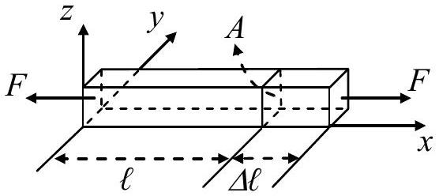
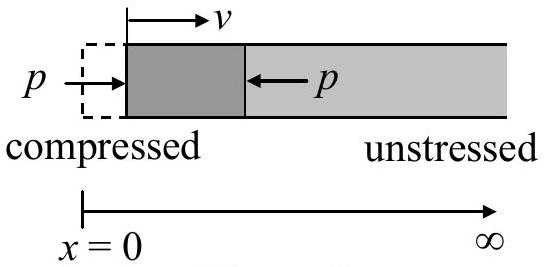
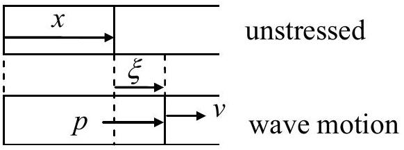
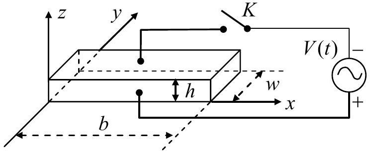
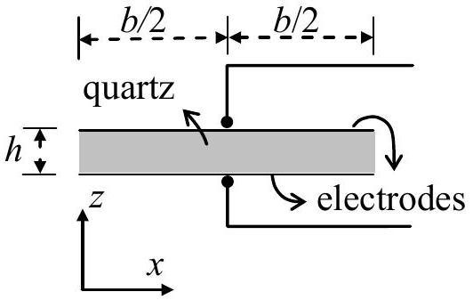

## Theoretical Question 2

## A Piezoelectric Crystal Resonator under an Alternating Voltage

Consider a uniform rod of unstressed length $\ell$ and cross-sectional area $A$ (Figure 2a). Its length changes by $\Delta \ell$ when equal and opposite forces of magnitude $F$ are applied to its ends faces normally. The stress $T$ on the end faces is defined to be $F / A$. The fractional change in its length, i.e., $\Delta \ell / \ell$, is called the strain $S$ of the rod. In terms of stress and strain, Hooke's law may be expressed as

$$
T=Y S \quad \text { or } \quad \frac{F}{A}=Y \frac{\Delta \ell}{\ell}
$$

where $Y$ is called the Young's modulus of the rod material. Note that a compressive stress $T$ corresponds to $F<0$ and a decrease in length (i.e., $\Delta \ell<0$ ). Such a stress is thus negative in value and is related to the pressure $p$ by $T=-p$.

For a uniform rod of density $\rho$, the speed of propagation of longitudinal waves (i.e., sound speed) along the rod is given by

$$
u=\sqrt{Y / \rho}
$$

Figure 2a

The effect of damping and dissipation can be ignored in answering the following questions.

## Part A: mechanical properties

A uniform rod of semi-infinite length, extending from $x=0$ to $\infty$ (see Figure 2b), has a density $\rho$. It is initially stationary and unstressed. A piston then steadily exerts a small pressure $p$ on its left face at $x=0$ for a very short time $\Delta t$, causing a pressure wave to propagate with speed $u$ to the right.

Figure 2b

Figure 2c

(a) If the piston causes the rod's left face to move at a constant velocity $v$ (Figure 2b), what are

the strain $S$ and pressure $p$ at the left face during the time $\Delta t$ ? Answers must be given in terms of $\rho, u$, and $v$ only. (1.6 points)
(b) Consider a longitudinal wave traveling along the $x$ direction in the rod. For a cross section at $x$ when the rod is unstressed (Figure 2c), let $\xi(x, t)$ be its displacement at time $t$ and assume
$$
\xi(x, t)=\xi_{0} \sin k(x-u t)
$$
where $\xi_{0}$ and $k$ are constants. Determine the corresponding velocity $v(x, t)$, strain $S(x, t)$, and pressure $p(x, t)$ as a function of $x$ and $t$. (2.4 points)

## Part B: electromechanical properties (including piezoelectric effect)

Consider a quartz crystal slab of length $b$, thickness $h$, and width $w$ (Figure 2d). Its length and thickness are along the $x$-axis and $z$-axis. Electrodes are formed by thin metallic coatings at its top and bottom surfaces. Electrical leads that also serve as mounting support (Figure 2e) are soldered to the electrode's centers, which may be assumed to be stationary for longitudinal oscillations along the $x$ direction.

Figure 2d

Figure 2e

The quartz crystal under consideration has a density $\rho$ of $2.65 \times 10^{3} \mathrm{~kg} / \mathrm{m}^{3}$ and Young's modulus $Y$ of $7.87 \times 10^{10} \mathrm{~N} / \mathrm{m}^{2}$. The length $b$ of the slab is 1.00 cm and the width $w$ and height $h$ of the slab are such that $h \ll w$ and $w \ll b$. With switch $K$ left open, we assume only longitudinal modes of standing wave oscillation in the $x$ direction are excited in the quartz slab.

For a standing wave of frequency $f=\omega / 2 \pi$, the displacement $\xi(x, t)$ at time $t$ of a cross section of the slab with equilibrium position $x$ may be written as

$$
\xi(x, t)=2 \xi_{0} g(x) \cos \omega t, \quad(0 \leq x \leq b)
$$

where $\xi_{0}$ is a positive constant and the spatial function $g(x)$ is of the form

$$
g(x)=B_{1} \sin k\left(x-\frac{b}{2}\right)+B_{2} \cos k\left(x-\frac{b}{2}\right)
$$

$\mathrm{g}(x)$ has the maximum value of one and $k=\omega / u$. Keep in mind that the centers of the electrodes are stationary and the left and right faces of the slab are free and must have zero stress (or pressure).

(c) Determine the values of $B_{1}$ and $B_{2}$ in Eq. (4b) for a longitudinal standing wave in the quartz slab. (1.2 point)
(d) What are the two lowest frequencies at which longitudinal standing waves may be excited in the quartz slab? (1.2 point)

The piezoelectric effect is a special property of a quartz crystal. Compression or dilatation of the crystal generates an electric voltage across the crystal, and conversely, an external voltage applied across the crystal causes the crystal to expand or contract depending on the polarity of the voltage. Therefore, mechanical and electrical oscillations can be coupled and made to resonate through a quartz crystal.

To account for the piezoelectric effect, let the surface charge densities on the upper and lower electrodes be $-\sigma$ and $+\sigma$, respectively, when the quartz slab is under an electric field $E$ in the $z$ direction. Denote the slab's strain and stress in the $x$ direction by $S$ and $T$, respectively. Then the piezoelectric effect of the quartz crystal can be described by the following set of equations:

$$
\begin{array}{r}
S=(1 / Y) T+d_{p} E \\
\sigma=d_{p} T+\varepsilon_{T} E
\end{array}
$$

where $1 / Y=1.27 \times 10^{-11} \mathrm{~m}^{2} / \mathrm{N}$ is the elastic compliance (i.e., inverse of Young's modulus) at constant electric field and $\varepsilon_{T}=4.06 \times 10^{-11} \mathrm{~F} / \mathrm{m}$ is the permittivity at constant stress, while $d_{p}$ $=2.25 \times 10^{-12} \mathrm{~m} / \mathrm{V}$ is the piezoelectric coefficient.

Let switch $K$ in Fig. 2d be closed. The alternating voltage $V(t)=V_{m} \cos \omega t$ now acts across the electrodes and a uniform electric field $E(t)=V(t) / h$ in the $z$ direction appears in the quartz slab. When a steady state is reached, a longitudinal standing wave oscillation of angular frequency $\omega$ appears in the slab in the $x$ direction.

With $E$ being uniform, the wavelength $\lambda$ and the frequency $f$ of a longitudinal standing wave in the slab are still related by $\lambda=u / f$ with $u$ given by Eq. (2). But, as Eq. (5a) shows, $T$ $=Y S$ is no longer valid, although the definitions of strain and stress remain unchanged and the end faces of the slab remain free with zero stress.

(e) Taking Eqs. (5a) and (5b) into account, the surface charge density $\sigma$ on the lower electrode as a function of $x$ and $t$ is of the form,
$$
\sigma(x, t)=\left[D_{1} \cos k\left(x-\frac{b}{2}\right)+D_{2}\right] \frac{V(t)}{h}
$$
where $k=\omega / u$. Find the expressions for $D_{1}$ and $D_{2}$. (2.2 points)
(f) The total surface charge $Q(t)$ on the lower electrode is related to $V(t)$ by
$$
Q(t)=\left[1+\alpha^{2}\left(\frac{2}{k b} \tan \frac{k b}{2}-1\right)\right] C_{0} V(t)
$$
Find the expression for $C_{0}$ and the expression and numerical value of $\alpha^{2}$. (1.4 points)

A Piezoelectric Crystal Resonator under an Alternating Voltage

Wherever requested, give each answer as analytical expressions followed by numerical values and units. For example: area of a circle $A=\pi r^{2}=1.23 \mathrm{~m}^{2}$.

(a) The strain $S$ and pressure $p$ at the left face are (in terms of $\rho, u$, and $v$ )
$$
S=
$$
$$
p=
$$
(b) The velocity $v(x, t)$, strain $S(x, t)$, and pressure $p(x, t)$ are
$$
v(x, t)=
$$
$$
S(x, t)=
$$
$$
p(x, t)=
$$
(c) The values of $B_{1}$ and $B_{2}$ are
$$
B_{1}=
$$
$$
B_{2}=
$$
(d) The lowest two frequencies of standing waves are (expression and value)
The Lowest
The Second Lowest
(e) The expressions of $D_{1}$ and $D_{2}$ are
$$
D_{1}=
$$
$$
D_{2}=
$$
(f) The constants $\alpha^{2}$ (expression and value) and $C_{0}$ are (expression only)
$$
\alpha^{2}=
$$
$$
C_{0}=
$$
