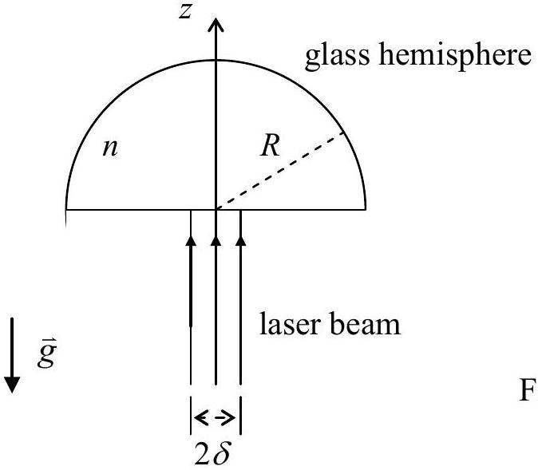

## Theoretical Question 3

## Part A

## Neutrino Mass and Neutron Decay

A free neutron of mass $m_{n}$ decays at rest in the laboratory frame of reference into three non-interacting particles: a proton, an electron, and an anti-neutrino. The rest mass of the proton is $m_{p}$, while the rest mass of the anti-neutrino $m_{\nu}$ is assumed to be nonzero and much smaller than the rest mass of the electron $m_{e}$. Denote the speed of light in vacuum by $c$. The measured values of mass are as follows:

$$
m_{n}=939.56563 \mathrm{MeV} / c^{2}, m_{p}=938.27231 \mathrm{MeV} / c^{2}, m_{e}=0.5109907 \mathrm{MeV} / c^{2}
$$

In the following, all energies and velocities are referred to the laboratory frame. Let $E$ be the total energy of the electron coming out of the decay.

(a) Find the maximum possible value $E_{\text {max }}$ of $E$ and the speed $v_{\mathrm{m}}$ of the anti-neutrino when $E$ $=E_{\text {max }}$. Both answers must be expressed in terms of the rest masses of the particles and the speed of light. Given that $m_{v}<7.3 \mathrm{eV} / c^{2}$, compute $E_{\text {max }}$ and the ratio $v_{\mathrm{m}} / c$ to 3 significant digits. (4.0 points)

## Part B

## Light Levitation

A transparent glass hemisphere with radius $R$ and mass $m$ has an index of refraction $n$. In the medium outside the hemisphere, the index of refraction is equal to one. A parallel beam of monochromatic laser light is incident uniformly and normally onto the central portion of its planar surface, as shown in Figure 3. The acceleration of gravity $\vec{g}$ is vertically downwards. The radius $\delta$ of the circular cross-section of the laser beam is much smaller than $R$. Both the glass hemisphere and the laser beam are axially symmetric with respect to the $z$-axis.

The glass hemisphere does not absorb any laser light. Its surface has been coated with a thin layer of transparent material so that reflections are negligible when light enters and leaves the glass hemisphere. The optical path traversed by laser light passing through the non-reflecting surface layer is also negligible.

(b) Neglecting terms of the order $(\delta / R)^{3}$ or higher, find the laser power $P$ needed to balance the weight of the glass hemisphere. (4.0 points)

Hint: $\cos \theta \approx 1-\theta^{2} / 2$ when $\theta$ is much smaller than one.

Figure 3

[Answer Sheet] Theoretical Question 3

Wherever requested, give each answer as analytical expressions followed by numerical values and units. For example: area of a circle $A=\pi r^{2}=1.23 \mathrm{~m}^{2}$.

Neutrino Mass and Neutron Decay

(a) (Give expressions in terms of rest masses of the particles and the speed of light) The maximum energy of the electron is (expression and value)
$$
E_{\max }=
$$
The ratio of anti-neutrino's speed at $E=E_{\text {max }}$ to $c$ is (expression and value)
$$
v_{\mathrm{m}} / c=
$$

Light Levitation

(b) The laser power needed to balance the weight of the glass hemisphere is
$$
P=
$$
