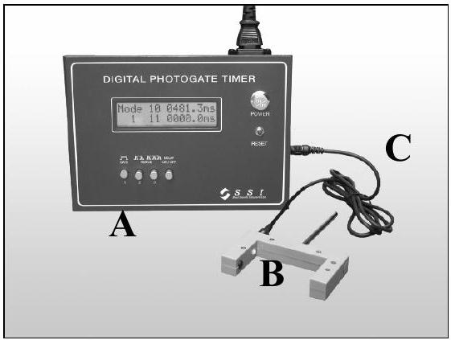
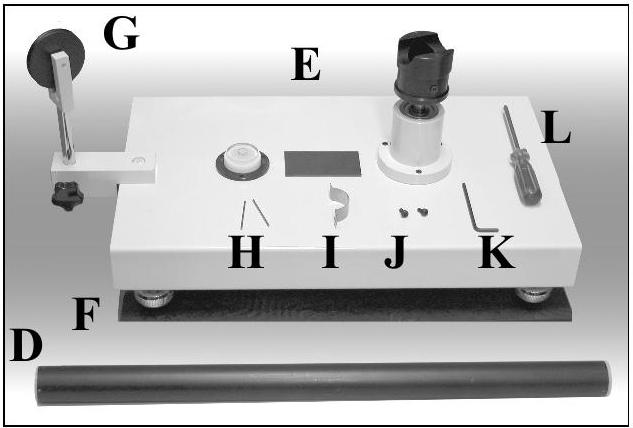
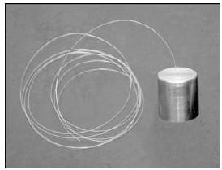
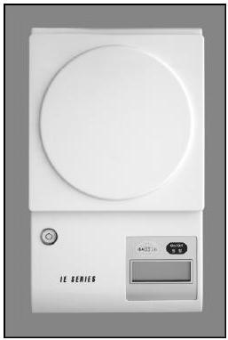
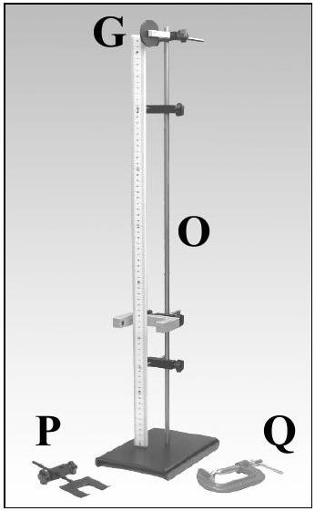
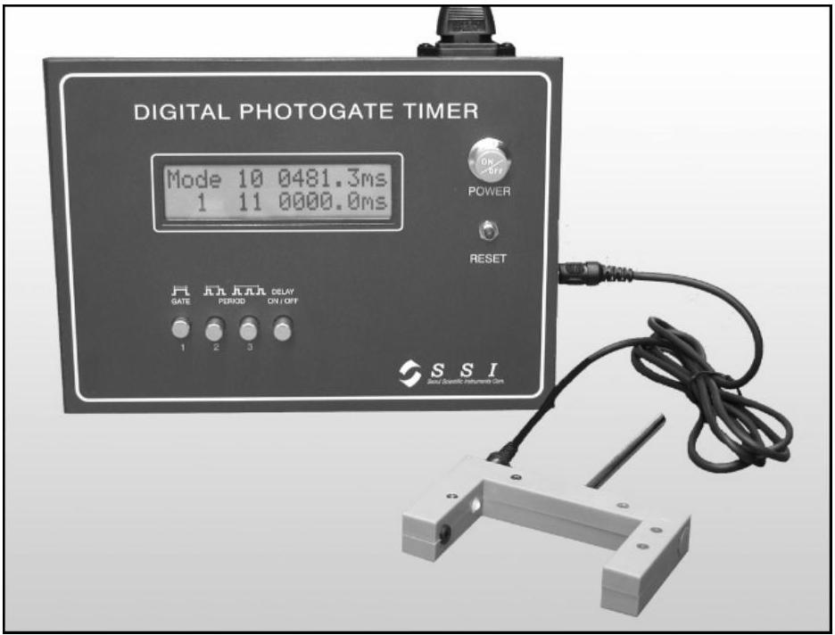
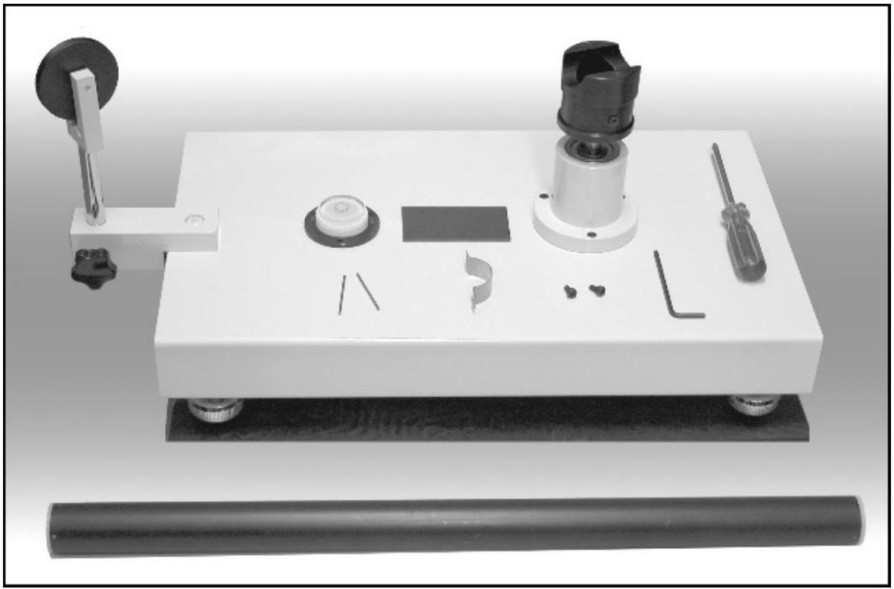
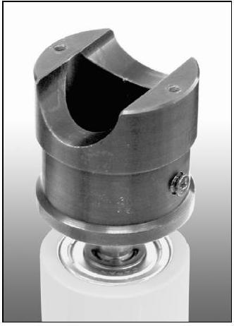
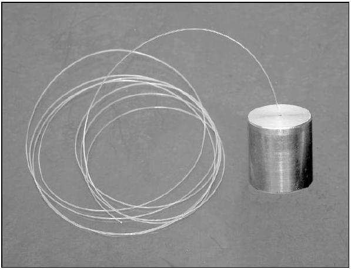

## $\mathbf{3 5}^{\text {th }}$ International Physics Olympiad

Pohang, Korea
15 ~ 23 July 2004

## Experimental Competition

Monday, 19 July 2004

## Please, first read the following instruction carefully:

1. The time available is 5 hours.
2. Use only the pen provided.
3. Use only the front side of the writing sheets. Write only inside the boxed area.
4. In addition to the blank writing sheets, there are Answer Forms where you must summarize the results you have obtained.
5. Write on the blank writing sheets the results of your measurements and whatever else you consider is required for the solution to the question. Please, use as little text as possible; express yourself primarily in equations, numbers, figures, and plots.
6. In the boxes at the top of each sheet of paper write down your country code (Country Code) and student number (Student Code). In addition, on each blank writing sheets, write down the progressive number of each sheet (Page Number) and the total number of writing sheets used (Total Number of Pages). If you use some blank writing sheets for notes that you do not wish to be marked, put a large X across the entire sheet and do not include it in your numbering.
7. At the end of the experiment, arrange all sheets in the following order:
    - Answer forms (top)
    - used writing sheets in order
    - the sheets you do not wish to be marked
    - unused writing sheets
    - the printed question (bottom)
8. It is not necessary to specify the error range of your values. However, their deviations from the actual values will determine your mark.
9. Place the papers inside the envelope and leave everything on your desk. You are not allowed to take any sheet of paper or any material used in the experiment out of the room.

## Apparatus and materials

1. List of available apparatus and materials

|  | Name | Quantity |
| :--- | :--- | :--- |
| A | Photogate timer | 1 |
| B | Photogate | 1 |
| C | Connecting cable | 1 |
| D | Mechanical "black box" (Black cylinder) | 1 |
| E | Rotation stage | 1 |
| F | Rubber pad | 1 |
| G | Pulley | 2 |
| H | Pin | 2 |
| I | U-shaped plate | 1 |
| J | Screw | 2 |
| K | Allen (hexagonal, Lshaped) wrench | 1 |

|  | Name | Quantity |
| :--- | :--- | :--- |
| L | Philips screw driver | 1 |
| M | Weight with a string | 1 |
| N | Electronic balance | 1 |
| O | Stand with a ruler | 1 |
| P | U-shaped support | 1 |
| Q | C-clamp | 1 |
|  | Ruler ( 0.50 m, 0.15 m) | 1 each |
|  | Vernier calipers | 1 |
|  | Scissors | 1 |
|  | Thread | 1 |
|  | Spares (string, thread, pin, screw, Allen wrench) |  |

M

N

2. Instruction for the Photogate Timer

The Photogate consists of an infrared LED and a photodetector. By connecting the Photogate to the Photogate Timer, you can measure the time duration related to the blocking of the infrared light reaching the sensor.

- Be sure that the Photogate is connected to the Photogate Timer. Turn on the power by pushing the button labelled "POWER".
- To measure the time duration of a single blocking event, push the button labelled "GATE". Use this "GATE" mode for speed measurements.
- To measure the time interval between two or three successive blocking events, push the corresponding "PERIOD". Use this "PERIOD" mode for oscillation measurements.
- If "DELAY" button is pushed in, the Photogate Timer displays the result of each measurement for 5 seconds and then resets itself.
- If "DELAY" button is pushed out, the Photogate Timer displays the result of the previous measurement until the next measurement is completed.
- After any change of button position, press the "RESET" button once to activate the mode change.

Caution: Do not look directly into the Photogate. The invisible infrared light may be harmful to your eyes.

Photogate, Photogate Timer, and connection cable

3. Instruction for the Electronic Balance
    - Adjust the bottom legs to set the balance stable. (Although there is a level indicator, setting the balance in a completely horizontal position is not necessary.)
    - Without putting anything on the balance, turn it on by pressing the "On/Off" button.
    - Place an object on the round weighing pan. Its mass will be displayed in grams.
    - If there is nothing on the weighing pan, the balance will be turned off automatically in about 25 seconds.

Balance

4. Instruction for the Rotation Stage
    - Adjust the bottom legs to set the rotation stage stable on a rubber pad in a near horizontal position.
    - With a U-shaped plate and two screws, mount the Mechanical "Black Box" (black cylinder) on the top of the rotating stub. Use Allen (hexagonal, L-shaped) wrench to tighten the screws.
    - The string attached to the weight is to be fixed to the screw on the side of the rotating stub. Use the Philips screw driver.

Mechanical "Black Box" and rotation stage

Rotating stub

Weight with a string

## Mechanical "Black Box"

[Question] Find the mass of the ball and the spring constants of two springs in the Mechanical "Black Box".

General Information on the Mechanical "Black Box"

The Mechanical "Black Box" (MBB) consists of a solid ball attached to two springs in a black cylindrical tube as shown in Fig. 1. The two springs are fashioned from the same tightly wound spring with different number of turns. The masses and the lengths of the springs when they are not extended can be ignored. The tube is homogeneous and sealed with two identical end caps. The part of the end caps plugged into the tube is 5 mm long. The radius of the ball is 11 mm and the inner diameter of the tube is 23 mm . The gravitational acceleration is given as $g=9.8 \mathrm{~m} / \mathrm{s}^{2}$. There is a finite friction between the ball and the inner walls of the tube.
$l_{\text {CM }}$

Fig. 1 Mechanical "Black Box" (not to scale)

The purpose of this experiment is to find out the mass $m$ of the ball and the spring constants $k_{1}$ and $k_{2}$ of the springs without opening the MBB. The difficult aspect of this problem is that any single experiment cannot provide the mass $m$ or the position $l$ of the ball because the two quantities are interconnected. Here, $l$ is the distance between the centers of the tube and the ball when the MBB lies horizontally in equilibrium when the friction is zero.

The symbols listed below should be used to represent the physical quantities of interest. If you need to use other physical quantities, use symbols different from those already assigned below to avoid confusion.

## Assigned Physical Symbols

Mass of the ball: $m$
Radius of the ball: $r(=11 \mathrm{~mm})$
Mass of the MBB excluding the ball: $M$
Length of the black tube: $L$
Length of each end cap extending into the tube: $\delta(=5.0 \mathrm{~mm})$
Distance from the center-of-mass of the MBB to the center of the tube: $l_{\mathrm{CM}}$
Distance between the center of the ball and the center of the tube: $x$ (or $l$ at equilibrium when the MBB is horizontal)
Gravitational acceleration: $g\left(=9.8 \mathrm{~m} / \mathrm{s}^{2}\right)$
Mass of the weight attached to a string: $m_{\mathrm{o}}$
Speed of the weight: $v$
Downward displacement of the weight: $h$
Radius of the rotating stub where the string is to be wound: $R$
Moments of inertia: $I, I_{0}, I_{1}, I_{2}$, and so on
Angular velocity and angular frequencies: $\omega, \omega_{1}, \omega_{2}$, and so on
Periods of oscillation: $T_{1}, T_{2}$
Effective total spring constant: $k$
Spring constants of the two springs: $k_{1}, k_{2}$
Number of turns of the springs: $N_{1}, N_{2}$

Caution: Do not try to open the MBB. If you open it, you will be disqualified and your mark in the Experimental Competition will be zero.

Caution: Do not shake violently nor drop the MBB. The ball may be detached from the springs. If your MBB seems faulty, report to the proctors immediately. It will be replaced only once without affecting your mark. Any further replacement will cut down your mark by 0.5 points each time.

## PART-A Product of the mass and the position of the ball ( $m \times l$ ) (4.0 points)

$l$ is the position of the center of the ball relative to that of the tube when the MBB lies horizontally in equilibrium as in Fig. 1. Find the value of the product of the mass $m$ and the position $l$ of the ball experimentally. You will need this to determine the value of $m$ in PART-B.

1. Suggest and justify, by using equations, a method allowing to obtain $m \times l$. (2.0 points)
2. Experimentally determine the value of $m \times l$. (2.0 points)

## PART-B The mass $\boldsymbol{m}$ of the ball (10.0 points)

Figure 2 shows the MBB fixed horizontally on the rotating stub and a weight attached to one end of a string whose other end is wound on the rotating stub. When the weight falls, the string unwinds, and the MBB rotates. By combining the equation pertinent to this experiment with the one obtained in PART-A, you can find an equation for $m$.

Between the ball and the inner walls of the cylindrical tube acts a frictional force. The physical mechanisms of the friction and the slipping of the ball under the rotational motion are complicated. To simplify the analysis, you may ignore the energy dissipation due to kinetic friction.

Fig. 2 Rotation of the Mechanical "Black Box" (not to scale) The angular velocity $\omega$ of the MBB can be obtained from the speed $v$ of the weight passing through the Photogate. $x$ is the position of the ball relative to the rotation axis, and $d$ is the length of the weight.

1. Measure the speed of the weight $v$ for various values of downward displacement $h$ of the weight. It is recommended to scan the whole range from $h=1.0 \times 10^{-2} \mathrm{~m}$ to $4.0 \times 10^{-1} \mathrm{~m}$ by measuring $v$ just once at each $h$ with an interval of $1.0 \times 10^{-2}$ $\sim 2.0 \times 10^{-2} \mathrm{~m}$. Plot the data on graph paper in a form that is suitable to find the value of $m$. After you get a general idea of the relation between $v$ and $h$, you may repeat the measurement or add some data points, if necessary. When the MBB rotates slowly, the ball does not slip from its static equilibrium position because of the friction between the ball and the tube. When the MBB rotates sufficiently fast, the ball hits and actually stays at the end cap of the tube because the springs are weak. Identify the slow rotation region and the fast rotation region on the graph. (4.0 points)
2. Show your measurements are consistent with the fact that $h$ is proportional to $v^{2}$ ( $h=C v^{2}$ ) in the slow rotation region. Show from your measurements that $h=$ $A v^{2}+B$ in the fast rotation region. (1.0 points)
3. The moment of inertia of a ball of radius $r$ and mass $m$ about the axis passing through its center is $2 m r^{2} / 5$. If the ball is displaced a distance $a$ perpendicular to the axis, the moment of inertia increases by $m a^{2}$. Use the symbol $I$ to represent the total moment of inertia of all the rotating bodies excluding the ball. Relate the coefficient $C$ to the parameters of the MBB such as $m, l$, etc. ( 1.0 points)
4. Relate the coefficients $A$ and $B$ to the parameters of the MBB such as $m, l$, etc. (1.0 points)
5. Determine the value of $m$ from your measurements and the results obtained in PART-A. (3.0 points)

## PART-C The spring constants $\boldsymbol{k}_{\mathbf{1}}$ and $\boldsymbol{k}_{\mathbf{2}}$ (6.0 points)

In this part, you need to perform small oscillation experiments using the MBB as a rigid pendulum. There are two small holes at each end of the MBB. Two thin pins inserted into the holes can be used as the pivot of small oscillation. The U-shaped support is to be clamped to the stand and used to support the pivot. Note that the angular frequency $\omega$ of small oscillation is given as $\omega=$ [torque/(moment of inertia × angle) $]^{1 / 2}$. Here, the torque and the moment of inertia are with respect to the pivot. Similarly to PART-B, consider two experimental conditions, shown in Fig. 3, to avoid the unknown moment of inertia $I_{\mathrm{o}}$ of the MBB excluding the ball.

Fig. 3 Oscillation of the Mechanical "Black Box" (not to scale) The periods of small oscillation, $T_{1}$ and $T_{2}$, for two configurations shown above can be measured using the Photogate. Two pins and a U-shaped support are supplied for this experiment.

1. Measure the periods $T_{1}$ and $T_{2}$ of small oscillation shown in Figs 3(1) and (2) and write down their values, respectively. (1.0 points)
2. Explain (by using equations) why the angular frequencies $\omega_{1}$ and $\omega_{2}$ of small oscillation of the configurations are different. Use the symbol $I_{\mathrm{o}}$ to represent the moment of inertia of the MBB excluding the ball for the axis perpendicular to the MBB at the end. Use the symbol $\Delta l$ as the displacement of the ball from the horizontal equilibrium position. (1.0 points)
3. Evaluate $\Delta l$ by eliminating $I_{\mathrm{o}}$ from the previous results. (1.0 points)
4. By combining the results of PART-C 1~3 and PART-B, find and write down the value of the effective total spring constant $k$ of the two-spring system. (2.0 points)
5. Obtain the respective values of $k_{1}$ and $k_{2}$. Write down their values. (1.0 points)
