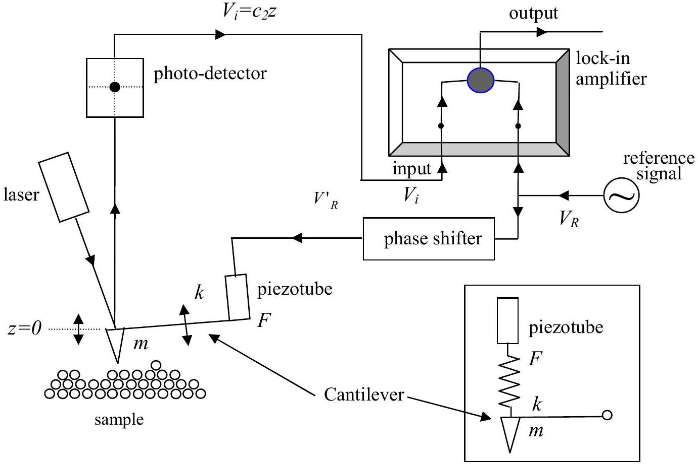

## Theoretical Question 3

## Atomic Probe Microscope

Atomic probe microscopes (APMs) are powerful tools in the field of nano-science. The motion of a cantilever in APM can be detected by a photo-detector monitoring the reflected laser beam, as shown in Fig. 3.1. The cantilever can move only in the vertical direction and its displacement $z$ as a function of time $t$ can be described by the equation

$$
m \frac{d^{2} z}{d t^{2}}+b \frac{d z}{d t}+k z=F,
$$

where $m$ is the cantilever mass, $k=m \omega_{0}^{2}$ is the spring constant of the cantilever, $b$ is a small damping coefficient satisfying $\omega_{0} \gg(b / m)>0$, and finally $F$ is an external driving force of the piezoelectric tube.

Figure 3.1 A schematic diagram for a scanning probe microscope (SPM). The inset in the lower right corner represents a simplified mechanical model to describe the coupling of the piezotube with the cantilever.

[Part A]
(a) [1.5 points] When $F=F_{0} \sin \omega t, z(t)$ satisfying Eq. (3.1) can be written as $z(t)=A \sin (\omega t-\phi)$, where $A>0$ and $0 \leq \phi \leq \pi$. Find the expression of the
amplitude $A$ and $\tan \phi$ in terms of $F_{0}, m, \omega, \omega_{0}$, and $b$. Obtain $A$ and the phase $\phi$ at the resonance frequency $\omega=\omega_{0}$.
(b) [1 point] A lock-in amplifier shown in Fig.3.1 multiplies an input signal by the lockin reference signal, $V_{R}=V_{R 0} \sin \omega t$, and then passes only the dc (direct current) component of the multiplied signal. Assume that the input signal is given by $V_{i}=V_{i 0} \sin \left(\omega_{i} t-\phi_{i}\right)$. Here $V_{R 0}, V_{i 0}, \omega_{i}$, and $\phi_{i}$ are all positive given constants. Find the condition on $\omega(>0)$ for a non-vanishing output signal. What is the expression for the magnitude of the non-vanishing $d c$ output signal at this frequency?
(c) [1.5 points] Passing through the phase shifter, the lock-in reference voltage $V_{R}=V_{R 0} \sin \omega t$ changes to $V_{R}^{\prime}=V_{R 0} \sin (\omega t+\pi / 2) . V_{R}^{\prime}$, applied to the piezoelectric tube, drives the cantilever with a force $F=c_{1} V^{\prime}{ }_{R}$. Then, the photo-detector converts the displacement of the cantilever, $z$, into a voltage $V_{i}=c_{2} z$. Here $c_{1}$ and $c_{2}$ are constants. Find the expression for the magnitude of the dc output signal at $\omega=\omega_{0}$.
(d) [2 points] The small change $\Delta m$ of the cantilever mass shifts the resonance frequency by $\Delta \omega_{0}$. As a result, the phase $\phi$ at the original resonance frequency $\omega_{0}$ shifts by $\Delta \phi$. Find the mass change $\Delta m$ corresponding to the phase shift $\Delta \phi=\pi / 1800$, which is a typical resolution in phase measurements. The physical parameters of the cantilever are given by $m=1.0 \times 10^{-12} \mathrm{~kg}, k=1.0 \mathrm{~N} / \mathrm{m}$, and $(b / m)=1.0 \times 10^{3} \quad \mathrm{~s}^{-1}$. Use the approximations $(1+x)^{a} \approx 1+a x$ and $\tan (\pi / 2+x) \approx-1 / x$ when $|x| \ll 1$.
[Part B]
From now on let us consider the situation that some forces, besides the driving force discussed in Part A, act on the cantilever due to the sample as shown in Fig.3.1.
(e) [1.5 points] Assuming that the additional force $f(h)$ depends only on the distance $h$ between the cantilever and the sample surface, one can find a new equilibrium position $h_{0}$. Near $h=h_{0}$, we can write $f(h) \approx f\left(h_{0}\right)+c_{3}\left(h-h_{0}\right)$, where $c_{3}$ is a constant in $h$. Find the new resonance frequency $\omega_{0}^{\prime}$ in terms of $\omega_{0}, m$, and $c_{3}$.
(f) [2.5 points] While scanning the surface by moving the sample horizontally, the tip of the cantilever charged with $Q=6 e$ encounters an electron of charge $q=e$ trapped
(localized in space) at some distance below the surface. During the scanning around the electron, the maximum shift of the resonance frequency $\Delta \omega_{0}\left(=\omega_{0}^{\prime}-\omega_{0}\right)$ is observed to be much smaller than $\omega_{0}$. Express the distance $d_{0}$ from the cantilever to the trapped electron at the maximum shift in terms of $m, q, Q, \omega_{0}, \Delta \omega_{0}$, and the Coulomb constant $k_{e}$. Evaluate $d_{0}$ in nm $\left(1 \mathrm{~nm}=1 \times 10^{-9} \mathrm{~m}\right)$ for $\Delta \omega_{0}=20 \mathrm{~s}^{-1}$.
The physical parameters of the cantilever are $m=1.0 \times 10^{-12} \mathrm{~kg}$ and $k=1.0 \mathrm{~N} / \mathrm{m}$. Disregard any polarization effect in both the cantilever tip and the surface. Note that $k_{e}=1 / 4 \pi \varepsilon_{0}=9.0 \times 10^{9} \mathrm{~N} \cdot \mathrm{~m}^{2} / \mathrm{C}^{2}$ and $e=-1.6 \times 10^{-19} \mathrm{C}$.
