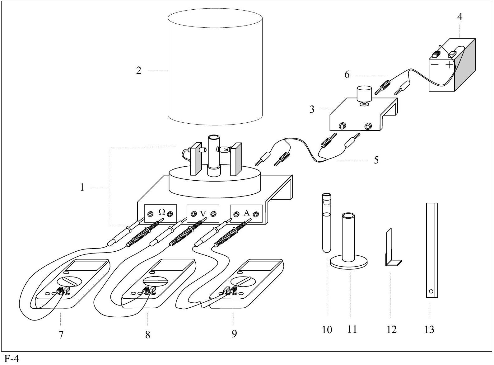
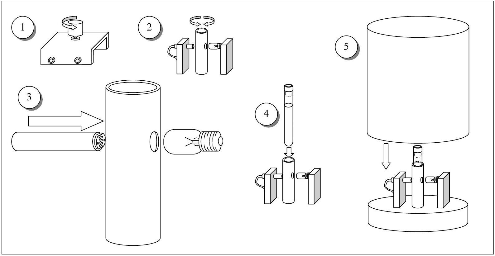
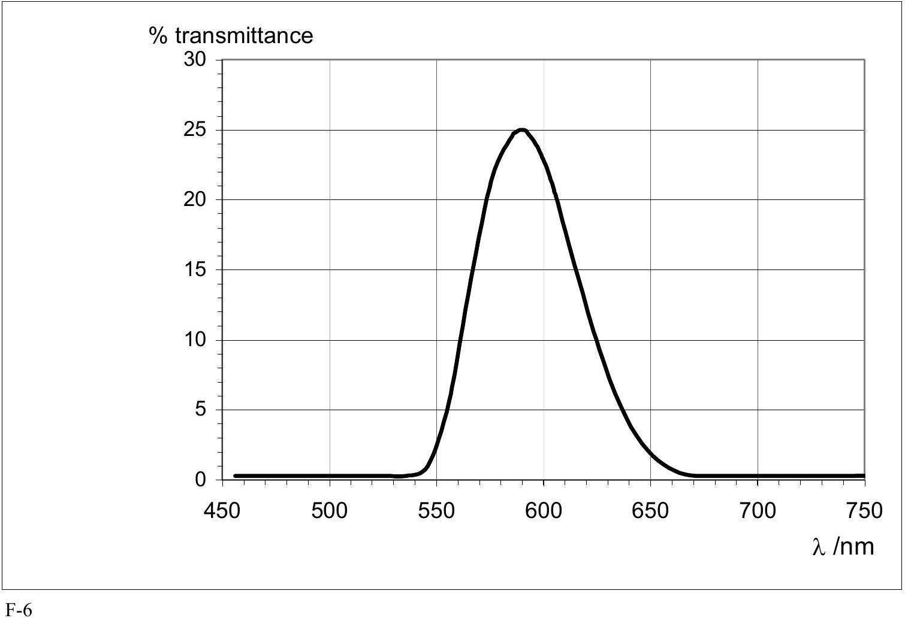
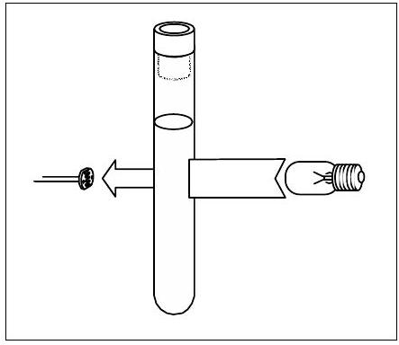
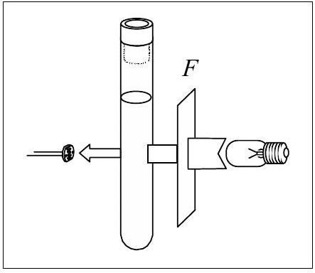
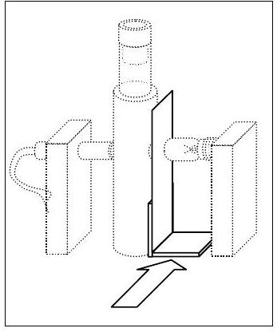

## PLANCK'S CONSTANT IN THE LIGHT OF AN INCANDESCENT LAMP

In 1900 Planck introduced the hypothesis that light is emitted by matter in the form of quanta of energy $h v$. In 1905 Einstein extended this idea proposing that once emitted, the energy quantum remains intact as a quantum of light (that later received the name photon). Ordinary light is composed of an enormous number of photons on each wave front. They remain masked in the wave, just as individual atoms are in bulk matter, but $h$ - the Planck's constant - reveals their presence. The purpose of this experiment is to measure Planck's constant.

A body not only emits, it can also absorb radiation arriving from outside. Black body is the name given to a body that can absorb all radiation incident upon it, for any wavelength. It is a full radiator. Referring to electromagnetic radiation, black bodies absorb everything, reflect nothing, and emit everything. Real bodies are not completely black; the ratio between the energy emitted by a body and the one that would be emitted by a black body at the same temperature, is called emissivity, $\varepsilon$, usually depending on the wavelength.

Planck found that the power density radiated by a body at absolute temperature $T$ in the form of electromagnetic radiation of wavelength $\lambda$ can be written as

$$
u_{\lambda}=\varepsilon \frac{c_{1}}{\lambda^{5}\left(e^{c_{2} / \lambda T}-1\right)}
$$

where $c_{1}$ and $c_{2}$ are constants. In this question we ask you to determine $c_{2}$ experimentally, which is proportional to $h$.
For emission at small $\lambda$, far at left of the maxima in Figure F-1, it is permissible to drop the -1 from the denominator of Eq. (1), that reduces to

$$
u_{\lambda}=\varepsilon \frac{c_{1}}{\lambda^{5} e^{c_{2} / \lambda T}}
$$

The basic elements of this experimental question are sketched in Fig.
F-2.

- The emitter body is the tungsten filament of an incandescent lamp $A$ that emits a wide range of $\lambda$ 's, and whose luminosity can be varied.
- The test tube $B$ contains a liquid filter that only transmits a thin band of the visible spectrum around a value $\lambda_{0}$ (see Fig. F-3). More information on the filter properties will be found in page 5.
- Finally, the transmitted radiation falls upon a photo resistor C (also known as LDR, the acronym of Light Dependent Resistor). Some properties of the LDR will be described in page 6.

The LDR resistance $R$ depends on its illumination, $E$, which is proportional to the filament power energy density

$$
\left.\begin{array}{l}
E \propto u_{\lambda_{0}} \\
R \propto E^{-\gamma}
\end{array}\right\} \Rightarrow R \propto u_{\lambda_{0}}^{-\gamma}
$$

where the dimensionless parameter $\gamma$ is a property of the LDR that will be determined in the experiment. For this setup we finally obtain a relation between the LDR resistance $R$ and the filament temperature $T$

$$
R=c_{3} e^{c_{2} \gamma / \lambda_{0} T}
$$

that we will use in page 6. In this relation $c_{3}$ is an unknown proportionality constant. By measuring $R$ as a function on $T$ one can obtain $c_{2}$, the objective of this experimental question.

## DESCRIPTION OF THE APPARATUS

The components of the apparatus are shown in Fig. F-4, which also includes some indications for its setup. Check now that all the components are available, but refrain for making any manipulation on them until reading the instructions in the next page.

## EQUIPMENT:

1. Platform. It has a disk on the top that holds a support for the LDR, a support for the tube and a support for an electric lamp of 12 V, 0.1 A.
2. Protecting cover.
3. 10 turns and $1 \mathrm{k} \Omega$ potentiometer.
4. 12 V battery.
5. Red and black wires with plugs at both ends to connect platform to potentiometer.
6. Red and black wires with plugs at one end and sockets for the battery at the other end.
7. Multimeter to work as ohmmeter.
8. Multimeter to work as voltmeter.
9. Multimeter to work as ammeter.
10. Test tube with liquid filter.
11. Stand for the test tube.
12. Grey filter.
13. Ruler.

An abridged set of instructions for the use of multimeters, along with information on the least squares method, is provided in a separate page.

## SETTING UP THE EQUIPMENT

Follow these instructions:

- Carefully make the electric connections as indicated in Fig. F-4, but do not plug the wires 6 to the potentiometer.
- By looking at Fig. F-5, follow the steps indicated below:

F-5

1. Turn the potentiometer knob anticlockwise until reaching the end.
2. Turn slowly the support for the test tube so that one of the lateral holes is in front of the lamp and the other in front of the LDR.
3. Bring the LDR nearer to the test tube support until making a light touch with its lateral hole. It is advisable to orient the LDR surface as indicated in Fig. F-5.
4. Insert the test tube into its support.
5. Put the cover onto the platform to protect from the outside light. Be sure to keep the LDR in total darkness for at least 10 minutes before starting the measurements of its resistance. This is a cautionary step, as the resistance value at darkness is not reached instantaneously.

## Task 1

Draw in Answer Sheet 1 the complete electric circuits in the boxes and between the boxes, when the circuit is fully connected. Please, take into account the indications contained in Fig. F-4 to make the drawings.

## Measurement of the filament temperature

The electric resistance $R_{B}$ of a conducting filament can be given as

$$
R_{B}=\rho \frac{l}{S}
$$

where $\rho$ is the resistivity of the conductor, $l$ is the length and $S$ the cross section of the filament.
This resistance depends on the temperature due to different causes such as:

- Metal resistivity increases with temperature. For tungsten and for temperatures in the range 300 K to 3655 K, it can be given by the empirical expression, valid in SI units,
$$
T=3.05 \cdot 10^{8} \rho^{0.83}
$$
- Thermal dilatation modifies the filament's length and section. However, its effects on the filament resistance will be negligible small in this experiment.
From (4) and (5) and neglecting dilatations one gets
$$
T=a R_{B}^{0.83}
$$
- Therefore, to get $T$ it is necessary to determine $a$. This can be achieved by measuring the filament resistance $R_{B, 0}$ at ambient temperature $T_{0}$.

## Task 2

a) Measure with the multimeter the ambient temperature $T_{0}$.
b) It is not a good idea to use the ohmmeter to measure the filament resistance $R_{B, 0}$ at $T_{0}$ because it introduces a small unknown current that increases the filament temperature. Instead, to find $R_{B, 0}$ connect the battery to the potentiometer and make a sufficient number of current readings for voltages from the lowest values attainable up to 1 V. (It will prove useful to make at least 15 readings below 100 mV .) At the end, leave the potentiometer in the initial position and disconnect one of the cables from battery to potentiometer.
Find $R_{B}$ for each pair of values of $V$ and $I$, translate these values into the Table for Task 2,b) in the Answer Sheets. Indicate there the lowest voltage that you can experimentally attain. Draw a graph and represent $R_{B}$ in the vertical axis against $I$.
c) After inspecting the graphics obtained at b), select an appropriate range of values to make a linear fit to the data suitable for extrapolating to the ordinate at the origin, $R_{B, 0}$. Write the selected values in the Table for Task 2, c) in the Answer Sheets. Finally, obtain $R_{B, 0}$ and $\Delta R_{B, 0}$.
d) Compute the numerical values of $a$ and $\Delta a$ for $R_{B, 0}$ in $\Omega$ and $T_{0}$ in K using (6).

## OPTICAL PROPERTIES OF THE FILTER

The liquid filter in the test tube is an aqueous solution of copper sulphate (II) and Orange (II) aniline dye. The purpose of the salt is to absorb the infrared radiation emitted by the filament.

The filter transmittance (transmitted intensity/incident intensity) is shown in Figure F-6 versus the wavelength.

Task 3

Determine $\lambda_{0}$ and $\Delta \lambda$ from Fig. F-6.
Note: $\quad 2 \Delta \lambda$ is the total width at half height and $\lambda_{0}$ the wavelength at the maximum.

## PROPERTIES OF THE LDR

The material which composes the LDR is non conducting in darkness conditions. By illuminating it some charge carriers are activated allowing some flow of electric current through it. In terms of the resistance of the LDR one can write the following relation

$$
R=b E^{-\gamma}
$$

where $b$ is a constant that depends on the composition and geometry of the LDR and $\gamma$ is a dimensionless parameter that measures the variation of the resistance with the illumination $E$ produced by the incident radiation. Theoretically, an ideal LDR would have $\gamma=1$, however many factors intervene, so that in the real case $\gamma<1$.

It is necessary to determine $\gamma$. This is achieved by measuring a pair $R$ and $E$ (Fig. F-7) and then introducing between the lamp and the tube the grey filter F (Fig. F-8) whose transmittance is known to be 51.2 \%, and we consider free of error. This produces an illumination $E^{\prime}=0.51 E$. After measuring the resistance $R^{\prime}$ corresponding to this illumination, we have

$$
R=b E^{-\gamma} \quad ; \quad R^{\prime}=b(0.512 E)^{-\gamma}
$$

From this

$$
\ln \frac{R}{R^{\prime}}=\gamma \ln 0.512
$$

Do not carry out this procedure until arriving at part b) of task 4 below.

F-7

F-8

## Task 4

a) Check that the LDR remained in complete darkness for at least 10 minutes before starting this part. Connect the battery to the potentiometer and, rotating the knob very slowly, increase the lamp voltage. Read the pairs of values of $V$ and $I$ for $V$ in the range between 9.50 V and 11.50 V, and obtain the corresponding LDR resistances $R$. (It will be useful to make at least 12 readings). Translate all these values to a table in the Answer Sheet. To deal with the delay in the LDR response, we recommend the following procedure: Once arrived at $V>9.5 \mathrm{~V}$, wait 10 min approximately before making the first reading. Then wait 5 min for the second one, and so on. Before doing any further calculation go to next step.
b) Once obtained the lowest value of the resistance $R$, open the protecting cover, put the grey filter as indicated in F-9, cover again - as soon as possible - the platform and record the new LDR resistance $R^{\prime}$. Using these data in (8) compute $\gamma$ and $\Delta \gamma$.
c) Modify Eq. (3) to display a linear dependence of $\ln R$ on $R_{B}^{-0.83}$. Write down that equation there and label it as (9).
d) Using now the data from a), work out a table that will serve to plot Eq. (9).
e) Make the graphics plot and, knowing that $c_{2}=h c / k$, compute $h$ and $\Delta h$ by any method (you are allowed to use statistical functions of the calculators provided by the organization).

F-9

| 36th International Physics Olympiad. Salamanca. Spain. Experimental Competition, 7 July 2005 |
| :--- |

| COUNTRY NUMBER | COUNTRY CODE | STUDENT NUMBER | PAGE NUMBER | TOTAL No OF PAGES |
| :--- | :--- | :--- | :--- | :--- |
|  |  |  |  |  |
