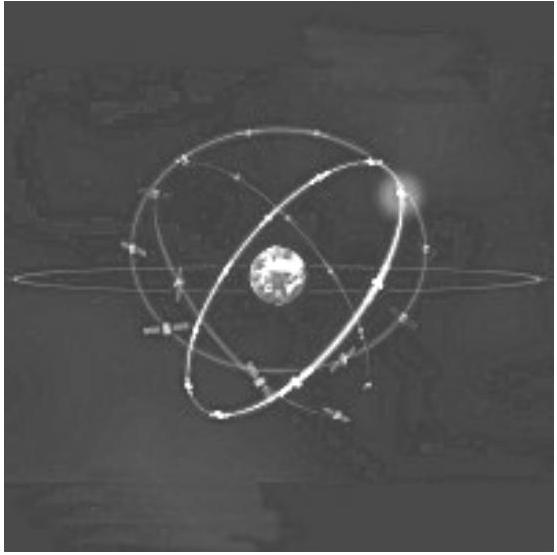
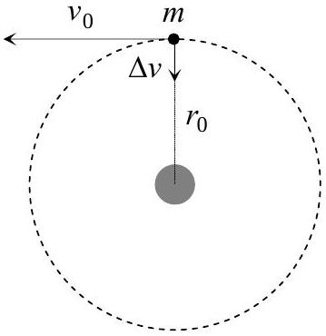
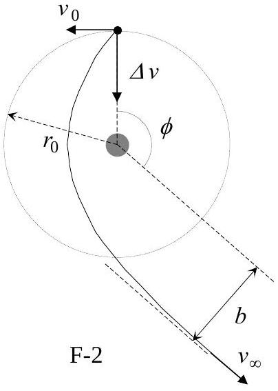

## Th 1 AN ILL FATED SATELLITE

The most frequent orbital manoeuvres performed by spacecraft consist of velocity variations along the direction of flight, namely accelerations to reach higher orbits or brakings done to initiate re-entering in the atmosphere. In this problem we will study the orbital variations when the engine thrust is applied in a radial direction.

To obtain numerical values use: Earth radius $R_{T}=6.37 \cdot 10^{6} \mathrm{~m}$, Earth surface gravity $g=9.81 \mathrm{~m} / \mathrm{s}^{2}$, and take the length of the sidereal day to be $T_{0}=24.0 \mathrm{~h}$.

We consider a geosynchronous ${ }^{1}$ communications satellite of mass $m$ placed in an equatorial circular orbit of radius $r_{0}$. These satellites have an "apogee engine" which provides the tangential thrusts needed to reach the final orbit.

Marks are indicated at the beginning of each subquestion, in parenthesis.

Image: ESA

## Question 1

1.1 (0.3) Compute the numerical value of $r_{0}$.
1.2 (0.3+0.1) Give the analytical expression of the velocity $v_{0}$ of the satellite as a function of $g, R_{T}$, and $r_{0}$, and calculate its numerical value.
1.3 (0.4+0.4) Obtain the expressions of its angular momentum $L_{0}$ and mechanical energy $E_{0}$, as functions of $v_{0}, m, g$ and $R_{T}$.

Once this geosynchronous circular orbit has been reached (see Figure F-1), the satellite has been stabilised in the desired location, and is being readied to do its work, an error by the ground controllers causes the apogee engine to be fired again. The thrust happens to be directed towards the Earth and, despite the quick reaction of the ground crew to shut the engine off, an unwanted velocity variation $\Delta v$ is imparted on the satellite. We characterize this boost by the parameter $\beta=\Delta v / v_{0}$. The duration of the engine burn is always negligible with respect to any other orbital times, so that it can be considered as instantaneous.

F-1

## Question 2

Suppose $\beta<1$.
$2.1(0.4+0.5)$ Determine the parameters of the new orbit ${ }^{2}$, semi-latus-rectum $l$ and eccentricity $\varepsilon$, in terms of $r_{0}$ and $\beta$.
2.2 (1.0) Calculate the angle $\alpha$ between the major axis of the new orbit and the position vector at the accidental misfire.
2.3 (1.0+0.2) Give the analytical expressions of the perigee $r_{\text {min }}$ and apogee $r_{\text {max }}$ distances to the Earth centre, as functions of $r_{0}$ and $\beta$, and calculate their numerical values for $\beta=1 / 4$.
$2.4(0.5+0.2)$ Determine the period of the new orbit, $T$, as a function of $T_{0}$ and $\beta$, and calculate its numerical value for $\beta=1 / 4$.

[^0]Question 3
3.1 (0.5) Calculate the minimum boost parameter, $\beta_{\text {esc }}$, needed for the satellite to escape Earth gravity.
3.2 (1.0) Determine in this case the closest approach of the satellite to the Earth centre in the new trajectory, $r_{\min }^{\prime}$, as a function of $r_{0}$.

Question 4
Suppose $\beta>\beta_{\text {esc }}$.
4.1 (1.0) Determine the residual velocity at the infinity, $v_{\infty}$, as a function of $v_{0}$ and $\beta$.
4.2 (1.0) Obtain the "impact parameter" $b$ of the asymptotic escape direction in terms of $r_{0}$ and $\beta$. (See Figure F-2).
$4.3(1.0+0.2)$ Determine the angle $\phi$ of the asymptotic escape direction in terms of $\beta$. Calculate its numerical value for $\beta=\frac{3}{2} \beta_{\text {esc }}$.

## HINT

Under the action of central forces obeying the inverse-square law, bodies follow trajectories described by ellipses, parabolas or hyperbolas. In the approximation $m \ll M$ the gravitating mass $M$ is at one of the focuses. Taking the origin at this focus, the general polar equation of these curves can be written as (see Figure F-3)

$$
r(\theta)=\frac{l}{1-\varepsilon \cos \theta}
$$

where $l$ is a positive constant named the semi-latus-rectum and $\varepsilon$ is the eccentricity of the curve. In terms of constants of motion:

$$
l=\frac{L^{2}}{G M m^{2}} \quad \text { and } \quad \varepsilon=\left(1+\frac{2 E L^{2}}{G^{2} M^{2} m^{3}}\right)^{1 / 2}
$$

where $G$ is the Newton constant, $L$ is the modulus of the angular momentum of the orbiting mass, with respect to the origin, and $E$ is its mechanical energy, with zero potential energy at infinity.

We may have the following cases:

i) If $0 \leq \varepsilon<1$, the curve is an ellipse (circumference for $\varepsilon=0$ ).
ii) If $\varepsilon=1$, the curve is a parabola.
iii) If $\varepsilon>1$, the curve is a hyperbola.

| COUNTRY CODE | STUDENT CODE | PAGE NUMBER | TOTAL No OF PAGES |
| :--- | :--- | :--- | :--- |
|  |  |  |  |

Th 1 ANSWER SHEET
| Question | Basic formulas and ideas used | Analytical results | Numerical results | Marking guideline |
| :--- | :--- | :--- | :--- | :--- |
| 1.1 |  |  | $r_{0}=$ | 0.3 |
| 1.2 |  | $v_{0}=$ | $v_{0}=$ | 0.4 |
| 1.3 |  | $L_{0}=$   $E_{0}=$ |  | 0.4   0.4 |
| 2.1 |  | $l=$   $\varepsilon=$ |  | 0.4   0.5 |
| 2.2 |  |  | $\alpha=$ | 1.0 |
| 2.3 |  | $r_{\max }=$   $r_{\text {min }}=$ | $r_{\max }=$   $r_{\text {min }}=$ | 1.2 |
| 2.4 |  | $T=$ | $T=$ | 0.7 |
| 3.1 |  |  | $\beta_{\text {esc }}=$ | 0.5 |
| 3.2 |  | $r_{\text {min }}^{\prime}=$ |  | 1.0 |
| 4.1 |  | $v_{\infty}=$ |  | 1.0 |
| 4.2 |  | $b=$ |  | 1.0 |
| 4.3 |  | $\phi=$ | $\phi=$ | 1.2 |

[^0]:    ${ }^{1}$ Its revolution period is $T_{0}$.
    ${ }^{2}$ See the "hint".
