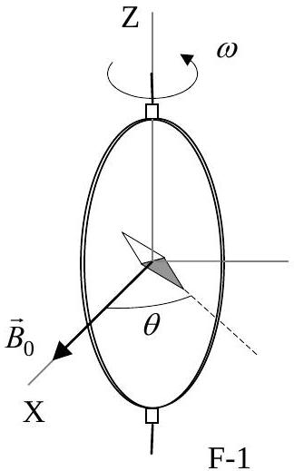
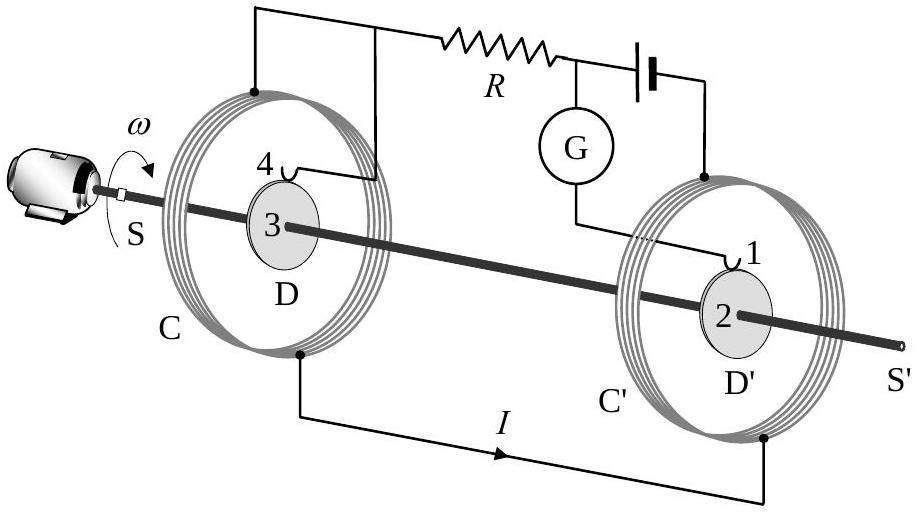
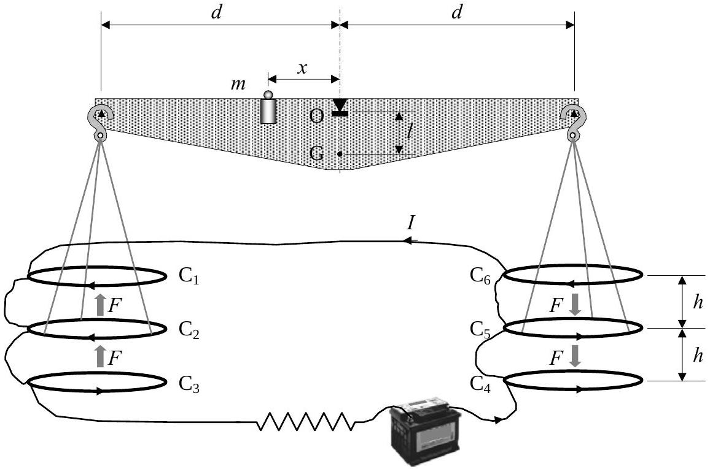

## Th 2 ABSOLUTE MEASUREMENTS OF ELECTRICAL QUANTITIES

The technological and scientific transformations underwent during the XIX century produced a compelling need of universally accepted standards for the electrical quantities. It was thought the new absolute units should only rely on the standards of length, mass and time established after the French Revolution. An intensive experimental work to settle the values of these units was developed from 1861 until 1912. We propose here three case studies.

Marks are indicated at the beginning of each subquestion, in parenthesis.

Determination of the ohm (Kelvin)
A closed circular coil of $N$ turns, radius $a$ and total resistance $R$ is rotated with uniform angular velocity $\omega$ about a vertical diameter in a horizontal magnetic field $\vec{B}_{0}=B_{0} \vec{i}$.

1. (0.5+1.0) Compute the electromotive force $\varepsilon$ induced in the coil, and also the mean power ${ }^{1}\langle P\rangle$ required for maintaining the coil in motion. Neglect the coil self inductance.

A small magnetic needle is placed at the center of the coil, as shown in Figure F-1. It

is free to turn slowly around the Z axis in a horizontal plane, but it cannot follow the rapid rotation of the coil.

2. (2.0) Once the stationary regime is reached, the needle will set at a direction making a small angle $\theta$ with $\vec{B}_{0}$. Compute the resistance $R$ of the coil in terms of this angle and the other parameters of the system.

Lord Kelvin used this method in the 1860s to set the absolute standard for the ohm. To avoid the rotating coil, Lorenz devised an alternative method used by Lord Rayleigh and Ms. Sidgwick, that we analyze in the next paragraphs.

Determination of the ohm (Rayleigh, Sidgwick).
The experimental setup is shown in Figure F-2. It consists of two identical metal disks D and D' of radius $b$ mounted on the conducting shaft SS'. A motor rotates the set at an angular velocity $\omega$, which can be adjusted for measuring $R$. Two identical coils C and C' (of radius $a$ and with $\boldsymbol{N}$ turns each) surround the disks. They are connected in such a form that the current $I$ flows through them in opposite directions. The whole apparatus serves to measure the resistance $R$.

F-2

[^0]

3. (2.0) Assume that the current $I$ flowing through the coils C and C' creates a uniform magnetic field $B$ around D and $\mathrm{D}^{\prime}$, equal to the one at the centre of the coil. Compute ${ }^{1}$ the electromotive force $\mathcal{E}$ induced between the rims 1 and 4, assuming that the distance between the coils is much larger than the radius of the coils and that $a \gg b$.

The disks are connected to the circuit by brush contacts at their rims 1 and 4. The galvanometer G detects the flow of current through the circuit 1-2-3-4.
4. (0.5) The resistance $R$ is measured when G reads zero. Give $R$ in terms of the physical parameters of the system.

## Determination of the ampere

Passing a current through two conductors and measuring the force between them provides an absolute determination of the current itself. The "Current Balance" designed by Lord Kelvin in 1882 exploits this method. It consists of six identical single turn coils $\mathrm{C}_{1} \ldots \mathrm{C}_{6}$ of radius $a$, connected in series. As shown in Figure F-3, the fixed coils $\mathrm{C}_{1}, \mathrm{C}_{3}, \mathrm{C}_{4}$, and $\mathrm{C}_{6}$ are on two horizontal planes separated by a small distance $2 h$. The coils $\mathrm{C}_{2}$ and $\mathrm{C}_{5}$ are carried on balance arms of length $d$, and they are, in equilibrium, equidistant from both planes.

The current $I$ flows through the various coils in such a direction that the magnetic force on $\mathrm{C}_{2}$ is upwards while that on $\mathrm{C}_{5}$ is downwards. A mass $m$ at a distance $x$ from the fulcrum O is required to restore the balance to the equilibrium position described above when the current flows through the circuit.

5. (1.0) Compute the force $F$ on $\mathrm{C}_{2}$ due to the magnetic interaction with $\mathrm{C}_{1}$. For simplicity assume that the force per unit length is the one corresponding to two long, straight wires carrying parallel currents.
6. (1.0) The current $I$ is measured when the balance is in equilibrium. Give the value of $I$ in terms of the physical parameters of the system. The dimensions of the apparatus are such that we can neglect the mutual effects of the coils on the left and on the right.

Let $M$ be the mass of the balance (except for $m$ and the hanging parts), G its centre of mass and $l$ the distance OG.

7. (2.0) The balance equilibrium is stable against deviations producing small changes $\delta z$ in the height of $\mathrm{C}_{2}$ and $-\delta z$ in $\mathrm{C}_{5}$. Compute ${ }^{2}$ the maximum value $\delta z_{\text {max }}$ so that the balance still returns towards the equilibrium position when it is released.
[^1]| COUNTRY CODE | STUDENT CODE | PAGE NUMBER | TOTAL No OF PAGES |
| :--- | :--- | :--- | :--- |
|  |  |  |  |

Th 2 ANSWER SHEET
| Question | Basic formulas used | Analytical results | Marking guideline |
| :--- | :--- | :--- | :--- |
| 1 |  | $\begin{aligned} & \varepsilon= \\ & \langle P\rangle= \end{aligned}$ | 1.5 |
| 2 |  | $R=$ | 2.0 |
| 3 |  | $\varepsilon=$ | 2.0 |
| 4 |  | $R=$ | 0,5 |
| 5 |  | $F=$ | 1.0 |
| 6 |  | $I=$ | 1.0 |
| 7 |  | $\delta z_{\text {max }}=$ | 2.0 |

[^0]:    ${ }^{1}$ The mean value $\langle X\rangle$ of a quantity $X(t)$ in a periodic system of period $T$ is $\langle X\rangle=\frac{1}{T} \int_{0}^{T} X(t) d t$
    You may need one or more of these integrals:

    $$
    \int_{0}^{2 \pi} \sin x d x=\int_{0}^{2 \pi} \cos x d x=\int_{0}^{2 \pi} \sin x \cos x d x=0, \quad \int_{0}^{2 \pi} \sin ^{2} x d x=\int_{0}^{2 \pi} \cos ^{2} x d x=\pi, \text { and later } \int x^{n} d x=\frac{1}{n+1} x^{n+1}
    $$

[^1]:    ${ }^{2}$ Consider that the coils centres remain approximately aligned.
    Use the approximations $\frac{1}{1 \pm \beta} \approx 1 \mp \beta+\beta^{2}$ or $\frac{1}{1 \pm \beta^{2}} \approx 1 \mp \beta^{2}$ for $\beta \ll 1$, and $\sin \theta \approx \tan \theta$ for small $\theta$.
