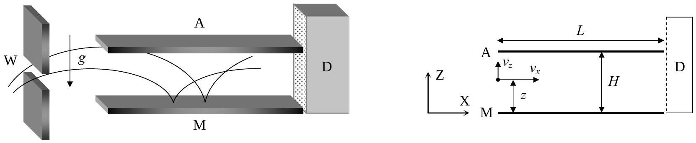

## Th 3 NEUTRONS IN A GRAVITATIONAL FIELD

In the familiar classical world, an elastic bouncing ball on the Earth's surface is an ideal example for perpetual motion. The ball is trapped: it can not go below the surface or above its turning point. It will remain bounded in this state, turning down and bouncing up once and again, forever. Only air drag or inelastic bounces could stop the process and will be ignored in the following.

A group of physicists from the Institute Laue - Langevin in Grenoble reported ${ }^{1}$ in 2002 experimental evidence on the behaviour of neutrons in the gravitational field of the Earth. In the experiment, neutrons moving to the right were allowed to fall towards a horizontal crystal surface acting as a neutron mirror, where they bounced back elastically up to the initial height once and again.

The setup of the experiment is sketched in Figure F-1. It consists of the opening W, the neutron mirror M (at height $z=0$ ), the neutron absorber A (at height $z=H$ and with length $L$ ) and the neutron detector D. The beam of neutrons flies with constant horizontal velocity component $v_{x}$ from W to D through the cavity between A and M. All the neutrons that reach the surface of A are absorbed and disappear from the experiment. Those that reach the surface of M are reflected elastically. The detector D counts the transmission rate $N(H)$, that is, the total number of neutrons that reach D per unit time.

F-1

Marks are indicated at the beginning of each subquestion, in parenthesis.

The neutrons enter the cavity with a wide range of positive and negative vertical velocities, $v_{z}$. Once in the cavity, they fly between the mirror below and the absorber above.

1. (1.5) Compute classically the range of vertical velocities $v_{z}(z)$ of the neutrons that, entering at a height $z$, can arrive at the detector D. Assume that $L$ is much larger than any other length in the problem.
2. (1.5) Calculate classically the minimum length $L_{c}$ of the cavity to ensure that all neutrons outside the previous velocity range, regardless of the values of $z$, are absorbed by A. Use $v_{x}=10 \mathrm{~m} \mathrm{~s}^{-1}$ and $H=50 \mu \mathrm{~m}$.

The neutron transmission rate $N(H)$ is measured at D . We expect that it increases monotonically with $H$.

3. (2.5) Compute the classical rate $N_{c}(H)$ assuming that neutrons arrive at the cavity with vertical velocity $v_{z}$ and at height $z$, being all the values of $v_{z}$ and $z$ equally probable. Give the answer in terms of $\rho$, the constant number of neutrons per unit time, per unit vertical velocity, per unit height, that enter the cavity with vertical velocity $v_{z}$ and at height $z$.
[^0]The experimental results obtained by the Grenoble group disagree with the above classical predictions, showing instead that the value of $N(H)$ experiences sharp increases when $H$ crosses some critical heights $H_{1}, H_{2} \ldots$ (Figure F-2 shows a sketch). In other words, the experiment showed that the vertical motion of neutrons bouncing on the mirror is quantized. In the language that Bohr and Sommerfeld used to obtain the energy levels of the hydrogen atom, this can be written as: "The action $S$ of these neutrons along the vertical direction is an integer multiple of the Planck action constant $h$ ". Here $S$ is given by

$$
S=\int p_{z}(z) d z=n h, \quad n=1,2,3 \ldots \quad \text { (Bohr-Sommerfeld quantization rule) }
$$

where $p_{z}$ is the vertical component of the classical momentum, and the integral covers a whole bouncing cycle. Only neutrons with these values of $S$ are allowed in the cavity.

4. (2.5) Compute the turning heights $H_{n}$ and energy levels $E_{n}$ (associated to the vertical motion) using the Bohr-Sommerfeld quantization condition. Give the numerical result for $H_{1}$ in $\mu \mathrm{m}$ and for $E_{1}$ in eV.

The uniform initial distribution $\rho$ of neutrons at the entrance changes, during the flight through a long cavity, into the step-like distribution detected at D (see Figure F-2). From now on, we consider for simplicity the case of a long cavity with $H<H_{2}$. Classically, all neutrons with energies in the range considered in question 1 were allowed through it, while quantum mechanically only neutrons in the energy level $E_{1}$ are permitted. According to the time-energy Heisenberg uncertainty principle, this reshuffling requires a minimum time of flight. The uncertainty of the vertical motion energy will be significant if the cavity length is small. This phenomenon will give rise to the widening of the energy levels.

5. (2.0) Estimate the minimum time of flight $t_{q}$ and the minimum length $L_{q}$ of the cavity needed to observe the first sharp increase in the number of neutrons at D . Use $v_{x}=10 \mathrm{~m} \mathrm{~s}^{-1}$.

Data:

| Planck action constant | $h=6.63 \cdot 10^{-34} \mathrm{~J} \mathrm{~s}$ |
| :--- | :--- |
| Speed of light in vacuum | $c=3.00 \cdot 10^{8} \mathrm{~m} \mathrm{~s}^{-1}$ |
| Elementary charge | $e=1.60 \cdot 10^{-19} \mathrm{C}$ |
| Neutron mass | $M=1.67 \cdot 10^{-27} \mathrm{~kg}$ |
| Acceleration of gravity on Earth | $g=9.81 \mathrm{~m} \mathrm{~s}^{-2}$ |
| If necessary, use the expression: | $\int(1-x)^{1 / 2} d x=-\frac{2(1-x)^{3 / 2}}{3}$ |

| COUNTRY CODE | STUDENT CODE | PAGE NUMBER | TOTAL No OF PAGES |
| :--- | :--- | :--- | :--- |
|  |  |  |  |

Th 3 ANSWER SHEET
| Question | Basic formulas used | Analytical results | Numerical results | Marking guideline |
| :--- | :--- | :--- | :--- | :--- |
| 1 |  | $\leq v_{z}(z) \leq$ |  | 1.5 |
| 2 |  | $L_{c}=$ | $L_{c}=$ | 1.5 |
| 3 |  | $N_{c}(H)=$ |  | 2.5 |
| 4 |  | $H_{n}=$   $E_{n}=$ | $H_{1}=\quad \mu \mathrm{m}$   $E_{1}=\quad \mathrm{eV}$ | 2.5 |
| 5 |  | $t_{q}=$   $L_{q}=$ | $t_{q}=$   $L_{q}=$ | 2.0 |

[^0]:    ${ }^{1}$ V. V. Nesvizhevsky et al. "Quantum states of neutrons in the Earth's gravitational field." Nature, 415 (2002) 297. Phys Rev D 67, 102002 (2003).
