## $\mathbf{3 7}^{\text {th }}$ International Physics Olympiad

## Singapore

8-17 July 2006

## Experimental Competition

Wed 12 July 2006

List of apparatus and materials
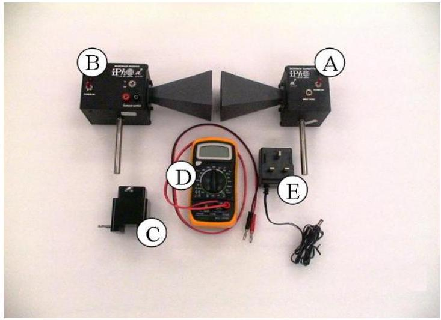

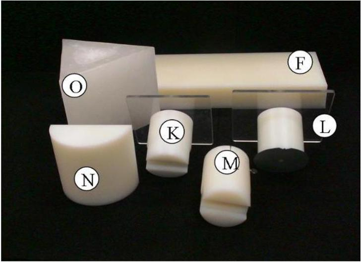
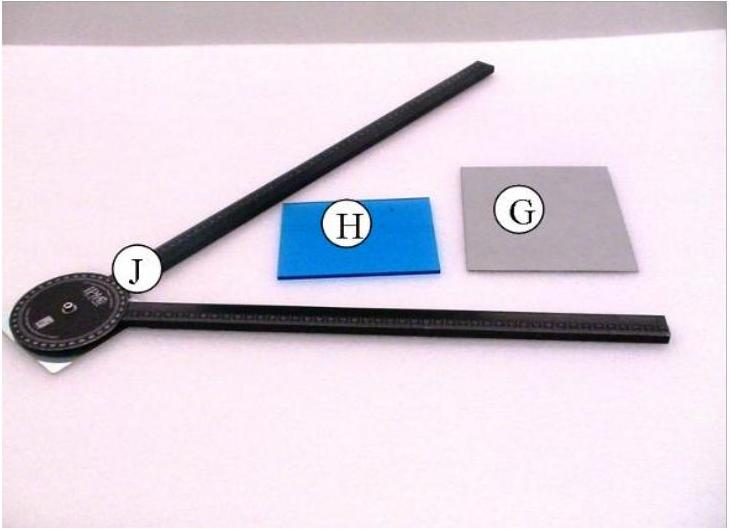
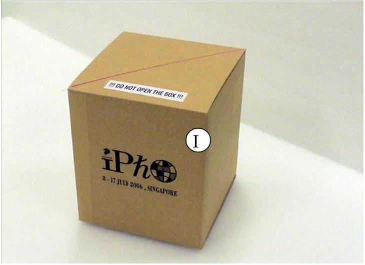

| Label | Component | Quantity |
| :--- | :--- | :--- |
| (A) | Microwave transmitter | 1 |
| (B) | Microwave receiver | 1 |
| (C) | Transmitter/receiver holder | 2 |
| (D) | Digital multimeter | 1 |
| (E) | DC power supply for transmitter | 1 |
| (F) | Slab as a "Thin film" sample | 1 |
| (G) | Reflector (silver metal sheet) | 1 |
| (H) | Beam splitter (blue Perspex) | 1 |
|  | Vernier caliper (provided separately) |  |

| Label | Component | Quantity |
| :--- | :--- | :--- |
| (I) | Lattice structure in a black box | 1 |
| (J) | Goniometer | 1 |
| (K) | Prism holder | 1 |
| (L) | Rotating table | 1 |
| (M) | Lens/reflector holder | 1 |
| (N) | Plano-cylindrical lens | 1 |
| (O) | Wax prism | 2 |
|  | Blu-Tack | 1 pack |
|  | 30 cm ruler (provided separately) |  |

Caution:

- The output power of the microwave transmitter is well within standard safety levels. Nevertheless, one should never look directly into the microwave horn at close range when the transmitter is on.
- Do not open the box containing the lattice (I).
- The wax prisms (O) are fragile (used in Part 3).

Note:

- It is important to note that the microwave receiver output (CURRENT) is proportional to the AMPLITUDE of the microwave.
- Always use LO gain setting of the microwave receiver.
- Do not change the range of the multimeter during the data collection.
- Place the unused components away from the experiment to minimize interference.
- Always use the component labels ((A), (B), (C),...) to indicate the components in all your drawings.

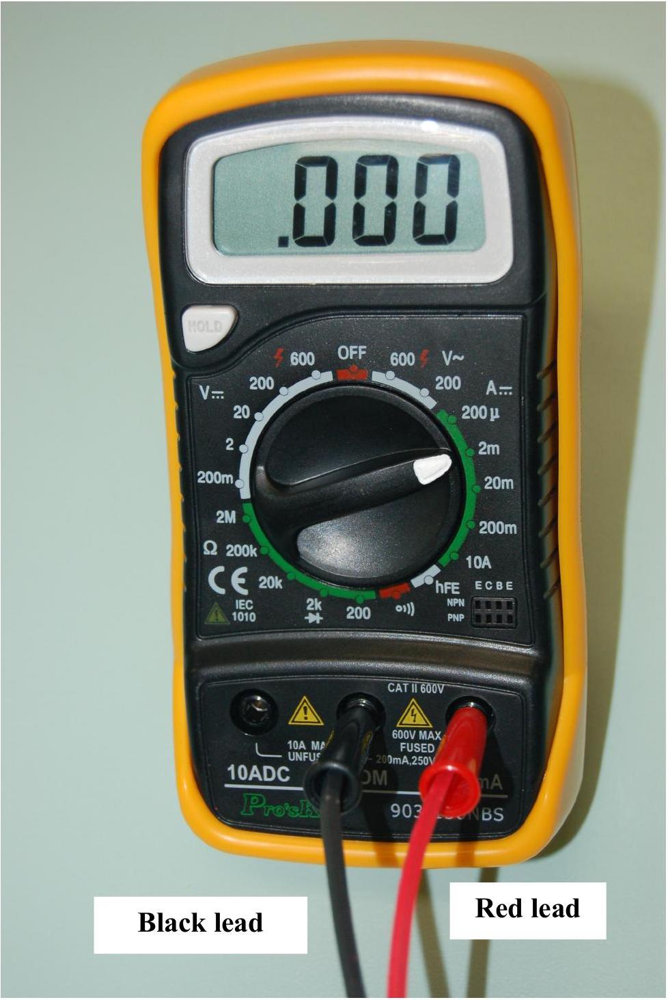

The digital multimeter should be used with the two leads connected as shown in the diagram. You should use the "2m" current setting in this experiment.

## Part 1: Michelson interferometer

### 1.1. Introduction

In a Michelson interferometer, a beam splitter sends an incoming electromagnetic (EM) wave along two separate paths, and then brings the constituent waves back together after reflection so that they superpose, forming an interference pattern. Figure 1.1 illustrates the setup for a Michelson interferometer. An incident wave travels from the transmitter to the receiver along two different paths. These two waves superpose and interfere at the receiver. The strength of signal at the receiver depends on the phase difference between the two waves, which can be varied by changing the optical path difference.

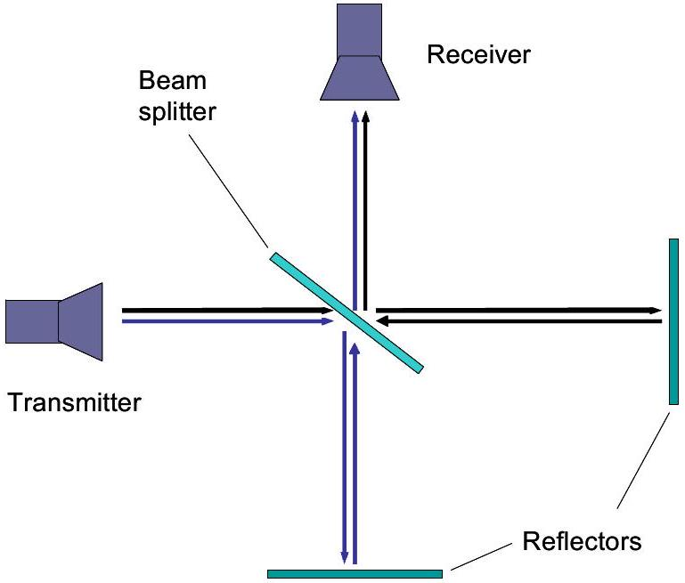
Figure 1.1: Schematic diagram of a Michelson interferometer.

### 1.2 List of components

1) Microwave transmitter (A) with holder (C)
2) Microwave receiver (B) with holder (C)
3) Goniometer (J)
4) 2 reflectors: reflector (G) with holder (M) and thin film (F) acting as a reflector.
5) Beam splitter (H) with rotating table (D) acting as a holder
6) Digital multimeter (D)

### 1.3. Task: Determination of wavelength of the microwave

[2 marks]
Using only the experimental components listed in Section 1.2, set up a Michelson interferometer experiment to determine the wavelength $\lambda$ of the microwave in air. Record your data and determine $\lambda$ in such a way that the uncertainty is $\leq 0.02 \mathrm{~cm}$.

Note that the "thin film" is partially transmissive, so make sure you do not stand or move behind it as this might affect your results.

## Part 2: "Thin film" interference

### 2.1. Introduction

A beam of EM wave incident on a dielectric thin film splits into two beams, as shown in Figure 2.1. Beam A is reflected from the top surface of the film whereas beam B is reflected from the bottom surface of the film. The superposition of beams A and B results in the so called thin film interference.

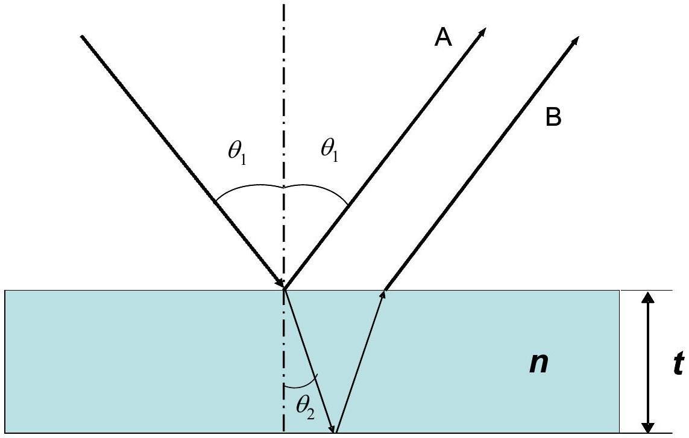
Figure 2.1: Schematic of thin film interference.

The difference in the optical path lengths of beam A and B leads to constructive or destructive interference. The resultant EM wave intensity $I$ depends on the path difference of the two interfering beams which in turn depends on the angle of incidence, $\theta_{1}$, of the
incident beam, wavelength $\lambda$ of the radiation, and the thickness $t$ and refractive index $n$ of the thin film. Thus, the refractive index $n$ of the thin film can be determined from $I-\theta_{1}$ plot, using values of $t$ and $\lambda$.

### 2.2. List of components

1) Microwave transmitter (A) with holder (C)
2) Microwave receiver (B) with holder (C)
3) Plano-cylindrical lens (N) with holder (M)
4) Goniometer (J)
5) Rotating table (D)
6) Digital multimeter (D)
7) Polymer slab acting as a "thin film" sample (F)
8) Vernier caliper

### 2.3. Tasks: Determination of refractive index of polymer slab

[6 marks]

1) Derive expressions for the conditions of constructive and destructive interferences in terms of $\theta_{1}, t, \lambda$ and $n$.
[1 mark]
2) Using only the experimental components listed in Section 2.2, set up an experiment to measure the receiver output $S$ as a function of the angle of incidence $\theta_{1}$ in the range from $40^{\circ}$ to $75^{\circ}$. Sketch your experimental setup, clearly showing the angles of incidence and reflection and the position of the film on the rotating table. Mark all components using the labels given on page 2. Tabulate your data. Plot the receiver output $S$ versus the angle of incidence $\theta_{1}$. Determine accurately the angles corresponding to constructive and destructive interferences.
[3 marks]
3) Assuming that the refractive index of air is 1.00 , determine the order of interference $m$ and the refractive index of the polymer slab $n$. Write the values of $m$ and $n$ on the answer sheet.

[1.5 marks]

4) Carry out error analysis for your results and estimate the uncertainty of $n$. Write the value of the uncertainty $\Delta n$ on the answer sheet.
[0.5 marks]

Note:

- The lens should be placed in front of the microwave transmitter with the planar surface facing the transmitter to obtain a quasi-parallel microwave beam. The distance between the planar surface of the lens and the aperture of transmitter horn should be 3 cm
- For best results, maximize the distance between the transmitter and receiver.
- Deviations of the microwave emitted by transmitter from a plane wave may cause extra peaks in the observed pattern. In the prescribed range from 40° to 75°, only one maximum and one minimum exist due to interference.

## Part 3: Frustrated Total Internal Reflection

### 3.1. Introduction

The phenomenon of total internal reflection (TIR) may occur when the plane wave travels from an optically dense medium to less dense medium. However, instead of TIR at the interface as predicted by geometrical optics, the incoming wave in reality penetrates into the less dense medium and travels for some distance parallel to the interface before being scattered back to the denser medium (see Figure 3.1). This effect can be described by a shift $D$ of the reflected beam, known as the Goos-Hänchen shift.

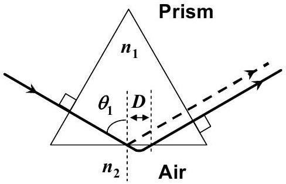
Figure 3.1: A sketch illustrating an EM wave undergoing total internal reflection in a prism. The shift $D$ parallel to the surface in air represents the Goos-Hänchen shift

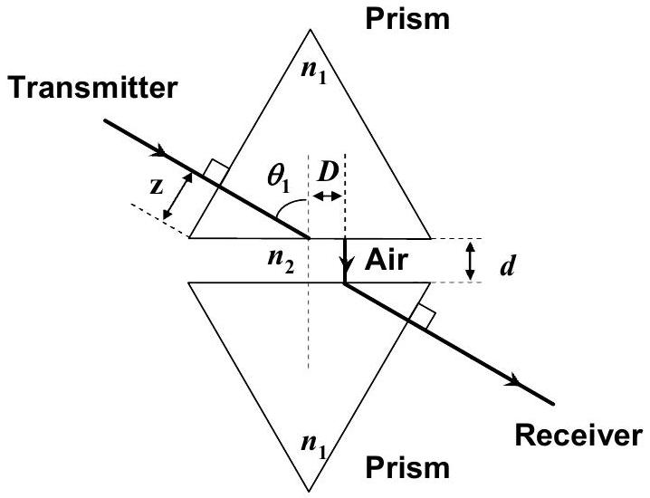
Figure 1.2: A sketch of the experimental setup showing the prisms and the air gap of distance $d$. The shift $D$ parallel to the surface in air represents the Goos-Hänchen shift. $z$ is the distance from the tip of the prism to the central axis of the transmitter.

If another medium of refractive index $n_{1}$ (i.e. made of the same material as the first medium) is placed at a small distance $d$ to the first medium as shown in Figure 3.2, tunneling of the EM wave through the second medium occurs. This intriguing phenomenon is known as the frustrated total internal reflection (FTIR). The intensity of the transmitted wave, $I_{\mathrm{t}}$, decreases exponentially with the distance $d$ :

$$
I_{t}=I_{0} \exp (-2 \gamma d)
$$

where $I_{0}$ is the intensity of the incident wave and $\gamma$ is:

$$
\gamma=\frac{2 \pi}{\lambda} \sqrt{\frac{n_{1}^{2}}{n_{2}^{2}} \sin ^{2} \theta_{1}-1}
$$

where $\lambda$ is the wavelength of EM wave in medium 2 and $n_{2}$ is the refractive index of medium 2 (assume that the refractive index of medium 2, air, is 1.00).

### 3.2 List of components

1) Microwave transmitter (A) with holder ©

2) Microwave receiver (B) with holder ©
3) Plano-cylindrical lens (N) with holder (M)
4) 2 equilateral wax prisms (O) with holder (K) and rotating table (L) acting as a holder
5) Digital multimeter (D)
6) Goniometer (J)
7) Ruler

### 3.3. Description of the Experiment

Using only the list of components described in Section 3.2, set up an experiment to investigate the variation of the intensity $I_{\mathrm{t}}$ as a function of the air gap separation $d$ in FTIR. For consistent results, please take note of the following:

- Use one arm of the goniometer for this experiment.
- Choose the prism surfaces carefully so that they are parallel to each other.
- The distance from the centre of the curved surface of the lens should be 2 cm from the surface of the prism.
- Place the detector such that its horn is in contact with the face of the prism.
- For each value of $d$, adjust the position of the microwave receiver along the prism surface to obtain the maximum signal.
- Make sure that the digital multi-meter is on the 2mA range. Collect data starting from $d=0.6 \mathrm{~cm}$. Discontinue the measurements when the reading of the multimeter falls below 0.20 mA.

### 3.4. Tasks: Determination of refractive index of prism material

[6 marks]
Task 1
Sketch your final experimental setup and mark all components using the labels given at page 2. In your sketch, record the value of the distance $z$ (see Figure 3.2), the distance from the tip of the prism to the central axis of the transmitter.
[1 Mark]
Task 2
Perform your experiment and tabulate your data. Perform this task twice.
[2.1 Marks]

Task 3

(a) By plotting appropriate graphs, determine the refractive index, $n_{1}$, of the prism with error analysis.
(b) Write the refractive index $n_{1}$, and its uncertainty $\Delta n_{1}$, of the prism in the answer sheet provided.

[2.9 Marks]

## Part 4: Microwave diffraction of a metal-rod lattice: Bragg reflection

### 4.1. Introduction

Bragg's Law

The lattice structure of a real crystal can be examined using Bragg's Law,

$$
2 d \sin \theta=m \lambda
$$

where $d$ refers to the distance between a set of parallel crystal planes that "reflect" the X-ray; $m$ is the order of diffraction and $\theta$ is the angle between the incident X-ray beam and the crystal planes. Bragg's law is also commonly known as Bragg's reflection or X-ray diffraction.

## Metal-rod lattice

Because the wavelength of the X-ray is comparable to the lattice constant of the crystal, traditional Bragg's diffraction experiment is performed using X-ray. For microwave, however, diffraction occurs in lattice structures with much larger lattice constant, which can be measured easily with a ruler.

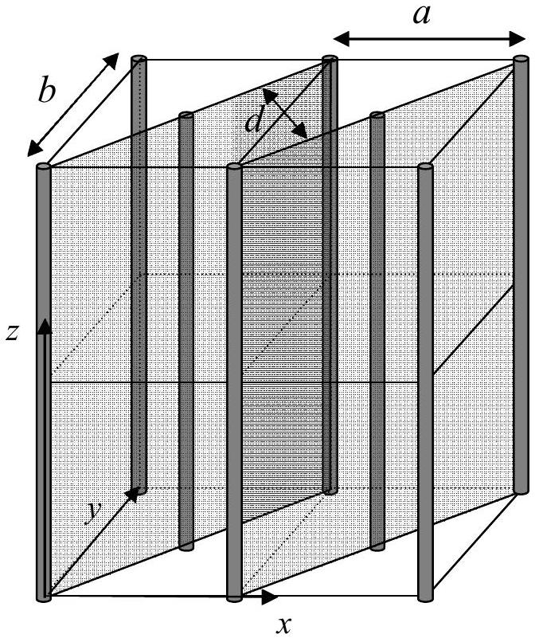
Figure 4.1: A metal-rod lattice of lattice constants $a$ and $b$, and interplanar spacing $d$.

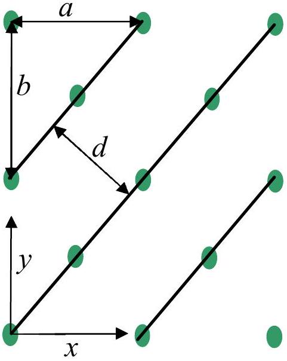
Figure 4.2: Top-view of the metal-rod lattice shown in Fig. 4.1 (not to scale). The lines denote diagonal planes of the lattice.

In this experiment, the Bragg law is used to measure the lattice constant of a lattice made of metal rods. An example of such metal-rod lattice is shown in Fig. 4.1, where the metal rods are shown as thick vertical lines. The lattice planes along the diagonal direction of the $x y$-plane are shown as shaded planes. Fig. 4.2 shows the top-view (looking down along the $z$-axis) of the metal-rod lattice, where the points represent the rods and the lines denote the diagonal lattice planes.

### 4.2 List of components

1) Microwave transmitter (A) with holder ©
2) Microwave receiver (B) with holder (C)
3) Plano-cylindrical lens (N) with holder (M)
4) Sealed box containing a metal-rod lattice (I)
5) Rotating table (L)
6) Digital multimeter (D)
7) Goniometer (J)

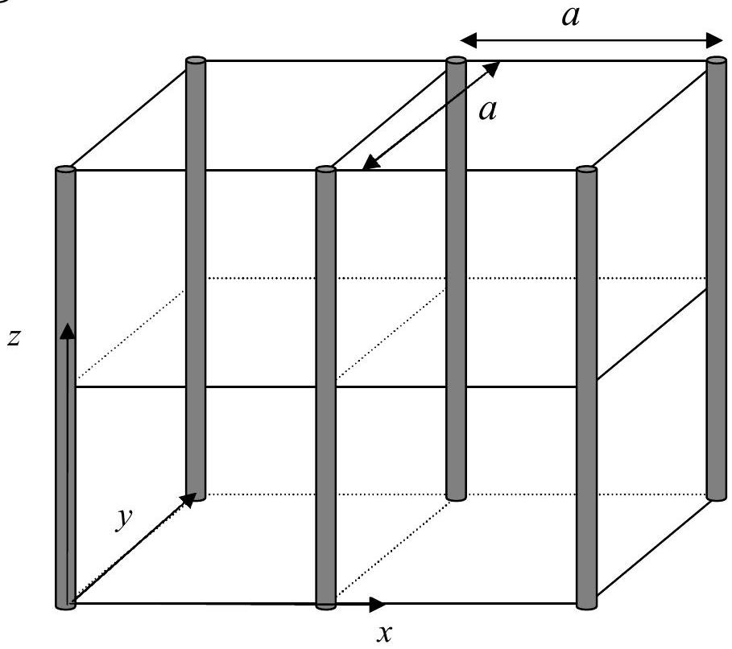
Figure 4.3: A simple square lattice.

In this experiment, you are given a simple square lattice made of metal rods, as illustrated in Fig. 4.3. The lattice is sealed in a box. You are asked to derive the lattice constant $a$ of
the lattice from the experiment. DO NOT open the box. No marks will be given to the experimental results if the seal is found broken after the experiment.

### 4.3. Tasks: Determination of lattice constant of given simple square lattice [6 Marks]

## Task 1

Draw a top-view diagram of the simple square lattice shown in Fig. 4.3. In the diagram, indicate the lattice constant $a$ of the given lattice and the interplanar spacing $d$ of the diagonal planes. With the help of this diagram, derive Bragg's Law.
[1 Mark]

## Task 2

Using Bragg's law and the apparatus provided, design an experiment to perform Bragg diffraction experiment to determine the lattice constant $a$ of the lattice.

(a) Sketch the experimental set up. Mark all components using the labels in page 2 and indicate clearly the angle between the axis of the transmitter and lattice planes, $\theta$, and the angle between the axis of the transmitter and the axis of the receiver, $\zeta$. In your experiment, measure the diffraction on the diagonal planes the direction of which is indicated by the red line on the box.

[1.5 Marks]

(b) Carry out the diffraction experiment for $20^{\circ} \leq \theta \leq 50^{\circ}$. In this range, you will only observe the first order diffraction. In the answer sheet, tabulate your results and record both the $\theta$ and $\zeta$.

[1.4 Marks]

(c) Plot the quantity proportional to the intensity of diffracted wave as a function of $\theta$. [1.3 Marks]
(d) Determine the lattice constant $a$ using the graph and estimate the experimental error.

[0.8 Marks]

Note:

1. For best results, the transmitter should remain fixed during the experiment. The separation between the transmitter and the lattice, as well as that between lattice and receiver should be about 50 cm.
2. Use only the diagonal planes in this experiment. Your result will not be correct if you try to use any other planes.
3. The face of the lattice box with the red diagonal line must be at the top.
4. To determine the position of the diffraction peak with better accuracy, use a number of data points around the peak position.
