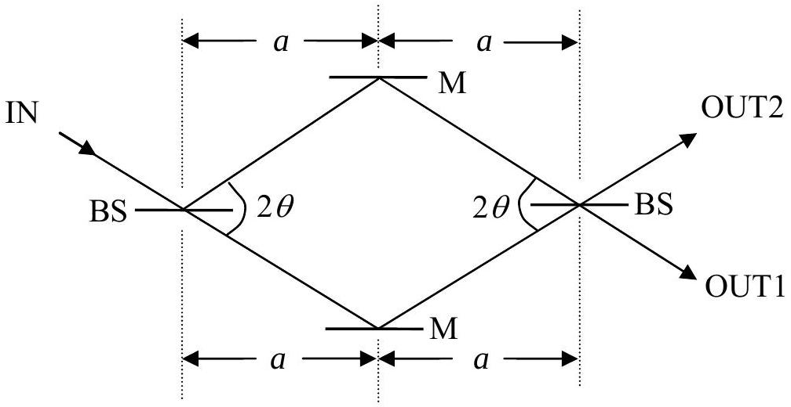
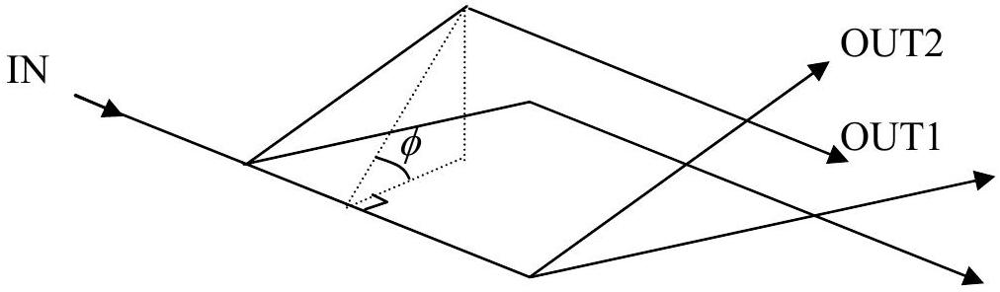

## Theory Question 1: Gravity in a Neutron Interferometer

Enter all your answers into the Answer Script.

BS - Beam Splitters

M - Mirror

Figure 1a

Figure 1b

Physical situation We consider the situation of the famous neutron-interferometer experiment by Collela, Overhauser and Werner, but idealize the set-up inasmuch as we shall assume perfect beam splitters and mirrors within the interferometer. The experiment studies the effect of the gravitational pull on the de Broglie waves of neutrons.

The symbolic representation of this interferometer in analogy to an optical interferometer is shown in Figure 1a. The neutrons enter the interferometer through the IN port and follow the two paths shown. The neutrons are detected at either one of the two output ports, OUT1 or OUT2. The two paths enclose a diamond-shaped area, which is typically a few $\mathrm{cm}^{2}$ in size.

The neutron de Broglie waves (of typical wavelength of $10^{-10} \mathrm{~m}$ ) interfere such that all neutrons emerge from the output port OUT1 if the interferometer plane is horizontal. But when the interferometer is tilted around the axis of the incoming neutron beam by angle $\phi$ (Figure 1b), one observes a $\phi$ dependent redistribution of the neutrons between the two output ports OUT1 and OUT2.

Geometry For $\phi=0^{\circ}$ the interferometer plane is horizontal; for $\phi=90^{\circ}$ the plane is vertical with the output ports above the tilt axis.

1.1 (1.0) How large is the diamond-shaped area $A$ enclosed by the two paths of the interferometer?
1.2 (1.0) What is the height $H$ of output port OUT1 above the horizontal plane of the tilt axis?

Express $A$ and $H$ in terms of $a, \theta$, and $\phi$.

Optical path length The optical path length $N_{\text {opt }}$ (a number) is the ratio of the geometrical path length (a distance) and the wavelength $\lambda$. If $\lambda$ changes along the path, $N_{\text {opt }}$ is obtained by integrating $\lambda^{-1}$ along the path.

1.3 (3.0) What is the difference $\Delta N_{\text {opt }}$ in the optical path lengths of the two paths when the interferometer has been tilted by angle $\phi$ ? Express your answer in terms of $a, \theta$, and $\phi$ as well as the neutron mass $M$, the de Broglie wavelength $\lambda_{0}$ of the incoming neutrons, the gravitational acceleration $g$, and Planck's constant $h$.
1.4 (1.0) Introduce the volume parameter
$$
V=\frac{h^{2}}{g M^{2}}
$$
and express $\Delta N_{\text {opt }}$ solely in terms of $A, V, \lambda_{0}$, and $\phi$. State the value of $V$ for $M=1.675 \times 10^{-27} \mathrm{~kg}, g=9.800 \mathrm{~m} \mathrm{~s}^{-2}$, and $h=6.626 \times 10^{-34} \mathrm{~J} \mathrm{~s}$.
1.5 (2.0) How many cycles - from high intensity to low intensity and back to high intensity - are completed by output port OUT1 when $\phi$ is increased from $\phi=-90^{\circ}$ to $\phi=90^{\circ}$ ?

Experimental data The interferometer of an actual experiment was characterized by $a=3.600 \mathrm{~cm}$ and $\theta=22.10^{\circ}$, and 19.00 full cycles were observed.

1.6 (1.0) How large was $\lambda_{0}$ in this experiment?
1.7 (1.0) If one observed 30.00 full cycles in another experiment of the same kind that uses neutrons with $\lambda_{0}=0.2000 \mathrm{~nm}$, how large would be the area $A$ ?

Hint: If $|\alpha x| \ll 1$, it is permissible to replace $(1+x)^{\alpha}$ by $1+\alpha x$.

| Country Code | Student Code | Question Number |
| :--- | :--- | :--- |
|  |  | 1 |

## Answer Script

Geometry
1.1 The area is

$$
A=
$$

1.2 The height is

For
Examiners
Use
Only
1.0
1.0

$$
H=
$$

| Country Code | Student Code | Question Number |
| :--- | :--- | :--- |
|  |  | 1 |

Optical path length
| 1.3 In terms of $a, \theta, \phi, M, \lambda_{0}, g$, and $h$ : | Examiners Use Only |
| :--- | :--- |
| $\Delta N_{\text {opt }}=$ | 3.0 |
| 1.4 In terms of $A, V, \lambda_{0}$, and $\phi$ : | 0.8 |
| The numerical value of $V$ is $V=$ | 0.2 |
| 1.5 The number of cycles is \# of cycles = | 2.0 |

| Country Code | Student Code | Question Number |
| :--- | :--- | :--- |
|  |  | 1 |

Experimental data
| 1.6 The de Broglie wavelength was $\lambda_{0}=$ |
| :--- |
| 1.7 The area is $A=$ |

For
Examiners
Use
Only
1.0
1.0
