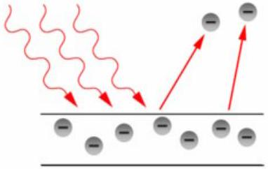
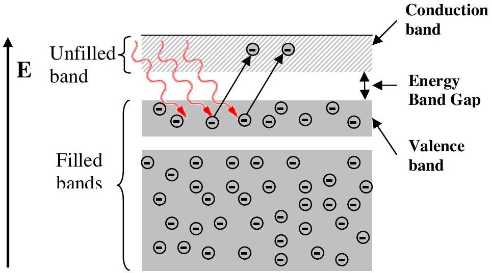
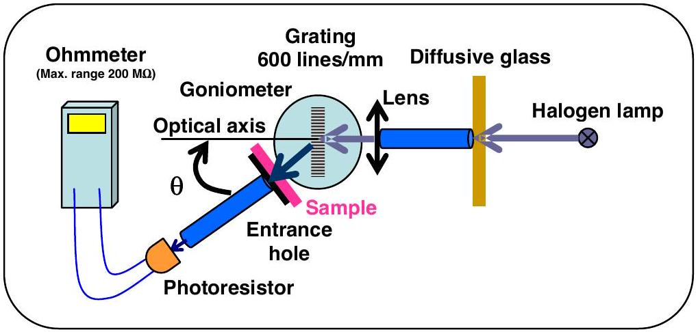
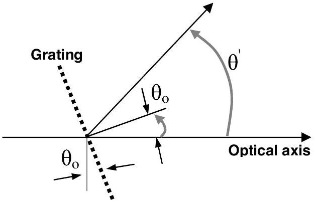

## Experimental Problem

## Determination of energy band gap of semiconductor thin films

## I. Introduction

Semiconductors can be roughly characterized as materials whose electronic properties fall somewhere between those of conductors and insulators. To understand semiconductor electronic properties, one can start with the photoelectric effect as a well-known phenomenon. The photoelectric effect is a quantum electronic phenomenon, in which photoelectrons are emitted from the matter through the absorption of sufficient energy from electromagnetic radiation (i.e. photons). The minimum energy which is required for the emission of an electron from a metal by light irradiation (photoelectron) is defined as "work function". Thus, only photons with a frequency $v$ higher than a characteristic threshold, i.e. with an energy $h v$ ( $h$ is the Planck's constant) more than the material's work function, are able to knock out the photoelectrons.

Figure 1. An illustration of photoelectron emission from a metal plate: The incoming photon should have an energy which is more than the work function of the material.

In fact, the concept of work function in the photoelectric process is similar to the concept of the energy band gap of a semiconducting material. In solid state physics, the band gap $E_{g}$ is the energy difference between the top of the valence band and the bottom of the conduction band of insulators and semiconductors. The valence band is completely filled with electrons, while the conduction band is empty however electrons can go from the valence band to the conduction band if they acquire sufficient energy (at least equal to the band gap energy).The semiconductor's conductivity strongly depends on its energy band gap.

Figure 2. Energy band scheme for a semiconductor.

Band gap engineering is the process of controlling or altering the band gap of a material by controlling the composition of certain semiconductor alloys. Recently, it has been shown that by changing the nanostructure of a semiconductor it is possible to manipulate its band gap.

In this experiment, we are going to obtain the energy band gap of a thin-film semiconductor containing nano-particle chains of iron oxide $\left(\mathrm{Fe}_{2} \mathrm{O}_{3}\right)$ by using an optical method. To measure the band gap, we study the optical absorption properties of the transparent film using its optical transmission spectrum. As a rough statement, the absorption spectra shows a sharp increase when the energy of the incident photons equals to the energy band gap.

## II. Experimental Setup

You will find the following items on your desk:

1. A large white box containing a spectrometer with a halogen lamp.
2. A small box containing a sample, a glass substrate, a sample-holder, a grating, and a photoresistor.
3. A multimeter.
4. A calculator.
5. A ruler.
6. A card with a hole punched in its center.
7. A set of blank labels.

The spectrometer contains a goniometer with a precision of $5^{\prime}$. The Halogen lamp acts as the source of radiation and is installed onto the fixed arm of the spectrometer (for detailed information see the enclosed "Description of Apparatus").

The small box contains the following items:

1. A sample-holder with two windows: a glass substrate coated with $\mathrm{Fe}_{2} \mathrm{O}_{3}$ film mounted on one window and an uncoated glass substrate mounted on the other.
2. A photoresistor mounted on its holder, which acts as a light detector.
3. A transparent diffraction grating (600 line/mm).

Note: Avoid touching the surface of any component in the small box!

A schematic diagram of the setup is shown in Figure 3:

Figure 3. Schematic diagram of the experimental setup.

## III. Methods

To obtain the transmission of a film at each wavelength, $T_{\text {film }}(\lambda)$, one can use the following formula:

$$
T_{\text {film }}(\lambda)=I_{\text {film }}(\lambda) / I_{\text {glass }}(\lambda)
$$

where $I_{\text {film }}$ and $I_{\text {glass }}$ are respectively the intensity of the light transmitted from the coated glass substrate, and the intensity of the light transmitted from the uncoated glass slide. The value of $I$ can be measured using a light detector such as a photoresistor. In a photoresistor, the electrical resistance decreases when the intensity of the incident light increases. Here, the value of $I$ can be determined from the following relation:

$$
I(\lambda)=C(\lambda) R^{-1}
$$

where $R$ is the electrical resistance of the photoresistor, $C$ is a $\lambda$-dependent coefficient.

The transparent grating on the spectrometer diffracts different wavelengths of light into different angles. Therefore, to study the variations of $T$ as a function of $\lambda$, it is enough to change the angle of the photoresistor ( $\theta^{\prime}$ ) with respect to the optical axis (defined as the direction of the incident light beam on the grating), as shown in Figure 4.
From the principal equation of a diffraction grating:

$$
n \lambda=d\left[\sin \left(\theta^{\prime}-\theta_{0}\right)+\sin \theta_{0}\right]
$$

one can obtain the angle $\theta^{\prime}$ corresponding to a particular $\lambda: n$ is an integer number representing the order of diffraction, $d$ is the period of the grating, and $\theta_{o}$ is the angle the normal vector to the surface of grating makes with the optical axis (see Fig. 4). (In this experiment we shall try to place the grating perpendicular to the optical axis making $\theta_{o}=0$, but since this cannot be achieved with perfect precision the error associated with this adjustment will be measured in task 1-e.)

Figure 4. Definition of the angles involved in Equation 3.

Experimentally it has been shown that for photon energies slightly larger than the band gap energy, the following relation holds:

$$
\alpha h v=A\left(h v-E_{g}\right)^{\eta}
$$

where $\alpha$ is the absorption coefficient of the film, $A$ is a constant that depends on the film's material, and $\eta$ is the constant determined by the absorption mechanism of the film's material and structure. Transmission is related to the value of $\alpha$ through the well-known absorption relation:

$$
T_{\text {film }}=\exp (-\alpha \mathrm{t})
$$

where $t$ is thickness of the film.
IV. Tasks:
0. Your apparatus and sample box (small box containing the sample holder) are marked with numbers. Write down the Apparatus number and Sample number in their appropriate boxes, in the answer sheet.

1. Adjustments and Measurements:

| 1-a | Check the vernier scale and report the maximum precision ( $\Delta \theta$ ). | 0.1 pt |
| :--- | :--- | :--- |

Note: Magnifying glasses are available on request.
Step1:
To start the experiment, turn on the Halogen lamp to warm up. It would be better not to turn off the lamp during the experiment. Since the halogen lamp heats up during the experiment, please be careful not to touch it.

Place the lamp as far from the lens as possible, this will give you a parallel light beam.

We are going to make a rough zero-adjustment of the goniometer without utilizing the photoresistor. Unlock the rotatable arm with screw 18 (underneath the arm), and visually align the rotatable arm with the optical axis. Now, firmly lock the rotatable arm with screw 18 . Unlock the vernier with screw 9 and rotate the stage to 0 on the vernier scale. Now firmly lock the vernier with screw 9 and use the vernier fineadjustment screw (screw 10) to set the zero of the vernier scale. Place the grating inside its holder. Rotate the grating's stage until the diffraction grating is roughly perpendicular to the optical axis. Place the card with a hole in front of the light source and position the hole such that a beam of light is incident on the grating. Carefully rotate the grating so that the spot of reflected light falls onto the hole. Then the reflected light beam coincides with the incident beam. Now lock the grating's stage by tightening screw 12.

| 1-b | By measuring the distance between the hole and the grating, estimate the precision of this adjustment ( $\Delta \theta_{o}$ ). | 0.3 pt |
| :--- | :--- | :--- |
|  | Now, by rotating the rotatable arm, determine and report the range of angles for which the first-order diffraction of visible light (from blue to red) is observed. | 0.2 pt |

Step 2:
Now, install the photoresistor at the end of the rotatable arm. To align the system optically, by using the photoresistor, loosen the screw 18, and slightly turn the rotatable arm so that the photoresistor shows a minimum resistance. For fine positioning, firmly lock screw 18, and use the fine adjustment screw of the rotatable arm.

Use the vernier fine-adjustment screw to set the zero of the vernier scale.

| 1-c | Report the measured minimum resistance value ( $R_{\text {min }}^{(0)}$ ). | 0.1 pt |
| :--- | :--- | :--- |
|  | Your zero-adjustment is more accurate now, report the precision of this new adjustment ( $\Delta \varphi_{o}$ ).   Note: $\Delta \varphi_{o}$ is the error in this alignment i.e. it is a measure of misalignment of the rotatable arm and the optical axis. | 0.1 pt |

- Hint: After this task you should tighten the fixing screws of the vernier. Moreover, tighten the screw of the photoresistor holder to fix it and do not remove it during the experiment.

Step 3:
Move the rotatable arm to the region of the first-order diffraction. Find the angle at which the resistance of the photoresistor is minimum (maximum light intensity). Using the balancing screws, you can slightly change the tilt of the grating's stage, to achieve an even lower resistance value.

| 1-c | Report the minimum value of the observed resistance ( $R_{\text {min }}^{(1)}$ ) in its appropriate box. | 0.1 pt |
| :--- | :--- | :--- |

It is now necessary to check the perpendicularity of the grating for zero adjustment, again. For this you must use the reflection-coincidence method of Step 1.

Important: From here onwards carry out the experiment in dark (close the cover).
Measurements: Screw the sample-holder onto the rotatable arm. Before you start the measurements, examine the appearance of your semiconductor film (sample). Place the sample in front of the entrance hole $S_{1}$ on the rotatable arm such that a uniformly coated part of the sample covers the hole. To make sure that every time you will be working with the same part of the sample make proper markings on the sample holder and the rotatable arm with blank labels.

Attention: At higher resistance measurements it is necessary to allow the photoresistor to relax, therefore for each measurement in this range wait 3 to 4 minutes before recording your measurement.

| 1-d | Measure the resistance of the photoresistor for the uncoated glass substrate and the glass substrate coated with semiconductor layer as a function of the angle $\theta$ (the value read by the goniometer for the angle between the photoresistor and your specified optical axis). Then fill in Table 1d. Note that you need at least 20 data points in the range you found in Step 1b. Carry out your measurement using the appropriate range of your ohmmeter. | 2.0 pt |
| :--- | :--- | :--- |
|  | Consider the error associated with each data point. Base your | 1.0 pt |

|  | answer only on your direct readings of the ohmmeter. |  |
| :--- | :--- | :--- |

Step 4:
The precision obtained so far is still limited since it is impossible to align the rotatable arm with the optical axis and/or position the grating perpendicular to the optical axis with 100\% precision. So we still need to find the asymmetry of the measured transmission at both sides of the optical axis (resulting from the deviation of the normal to the grating surface from the optical axis $\left.\left(\theta_{o}\right)\right)$.
To measure this asymmetry, follow these steps:

| 1-e | First, measure $T_{\text {film }}$ at $\theta=-20^{\circ}$. Then, obtain values for $T_{\text {film }}$ at some other angles around $+20^{\circ}$. Complete Table 1e (you can use the values obtained in Table 1d). | 0.6 pt |
| :--- | :--- | :--- |
|  | Draw $T_{\text {film }}$ versus $\theta$ and visually draw a curve. | 0.6 pt |

On your curve find the angle $\gamma$ for which the value of $T_{\text {film }}$ is equal to the $T_{\text {film }}$ that you measured at $\theta=-20^{\circ}\left(\left.\gamma \equiv \theta\right|_{T_{\text {film }}=T_{\text {film }}\left(-20^{\circ}\right)}\right)$. Denote the difference of this angle with $+20^{\circ}$ as $\delta$, in other words:

$$
\delta=\gamma-20^{\circ}
$$

| 1-e | Report the value of $\delta$ in the specified box. | 0.2 pt |
| :--- | :--- | :--- |

Then for the first-order diffraction, Eq. (3) can be simplified as follows:

$$
\lambda=d \sin (\theta-\delta / 2),
$$

where $\theta$ is the angle read on the goniometer.
2. Calculations:

| 2-a | Use Eq. (7) to express $\Delta \lambda$ in terms of the errors of the other parameters (assume $d$ is exact and there is no error is associated with it). Also using Eqs. (1), (2), and (5), express $\Delta T_{\text {film }}$ in terms of $R$ and $\Delta R$. | 0.6 pt |
| :--- | :--- | :--- |

| 2-b | Report the range of values of $\Delta \lambda$ over the region of first-order diffraction. | 0.3 pt |
| :--- | :--- | :--- |

| 2-c | Based on the measured parameters in Task 1, complete Table 2c for each $\theta$. Note that the wavelength should be calculated using Eq. (7). | 2.4 pt |
| :--- | :--- | :--- |

| 2-d | Plot $R_{\text {glass }}^{-1}$ and $R_{\text {film }}^{-1}$ as a function of wavelength together on the same diagram. Note that on the basis of Eq. (2) behaviors of $R_{\text {glass }}^{-1}$ and $R_{\text {film }}^{-1}$ can reasonably give us an indication of the way $I_{\text {glass }}$ and $I_{\text {film }}$ behave, respectively. | 1.5 pt |
| :--- | :--- | :--- |
|  | In Table 2d, report the wavelengths at which $R_{\text {glass }}$ and $R_{\text {film }}$ attain their minimum values. | 0.4 pt |

| 2-e | For the semiconductor layer (sample) plot $T_{\text {film }}$ as a function of wavelength. This quantity also represents the variation of the film transmission in terms of wavelength. | 1.0 pt |
| :--- | :--- | :--- |

3. Data analysis:

By substituting $\eta=1 / 2$ and $A=0.071\left((\mathrm{eV})^{1 / 2} / \mathrm{nm}\right)$ in Eq. (4) one can find values for $E_{g}$ and $t$ in units of eV and nm, respectively. This will be accomplished by plotting a suitable diagram in an $x-y$ coordinate system and doing an extrapolation in the region satisfying this equation.

| 3-a | By assuming $x=h v$ and $y=(\alpha t h v)^{2}$ and by using your measurements in Task 1, fill in Table 3a for wavelengths around 530 nm and higher. Express your results ( $x$ and $y$ ) with the correct number of significant figures (digits), based on the estimation of the error on one single data point. Note that $h v$ should be calculated in units of eV and wavelength in units of nm. Write the unit of each variable between the parentheses in the top row of the table. | 2.4 pt |
| :--- | :--- | :--- |

| 3-b | Plot $y$ versus $x$. | 2.6 pt |
| :--- | :--- | :--- |
|  | Note that the $y$ parameter corresponds to the absorption of the film. Fit a line to the points in the linear region around 530 nm. |  |
|  | Specify the region where Eq. (4) is satisfied, by reporting the values of the smallest and the largest x-coordinates for the data points to which you fit the line. |  |

| 3-c | Call the slope of this line $m$, and find an expression for the film thickness ( $t$ ) and its error ( $\Delta t$ ) in terms of $m$ and $A$ (consider $A$ to have no error). | 0.5 pt |
| :--- | :--- | :--- |

| 3-d | Obtain the values of $E_{g}$ and $t$ and their associated errors in units of eV and nm, respectively. Fill in Table 3d. | 3.0 pt |
| :--- | :--- | :--- |

- Some useful physical constants required for your analysis:

- Speed of the light: $c=3.00 \times 10^{8} \mathrm{~m} / \mathrm{s}$
- Plank's constant: $h=6.63 \times 10^{-34} \mathrm{~J}$.s
- Electron charge: $e=1.60 \times 10^{-19} \mathrm{C}$

This document was created with Win2PDF available at http://www.daneprairie.com. The unregistered version of Win2PDF is for evaluation or non-commercial use only.
