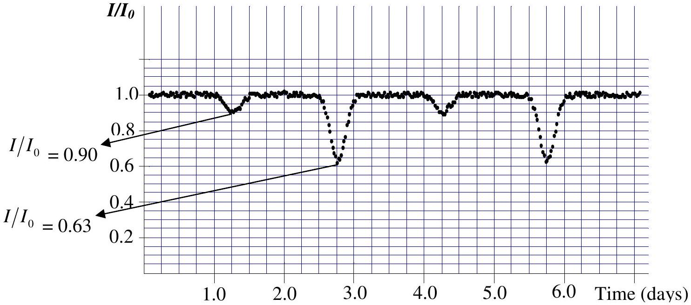
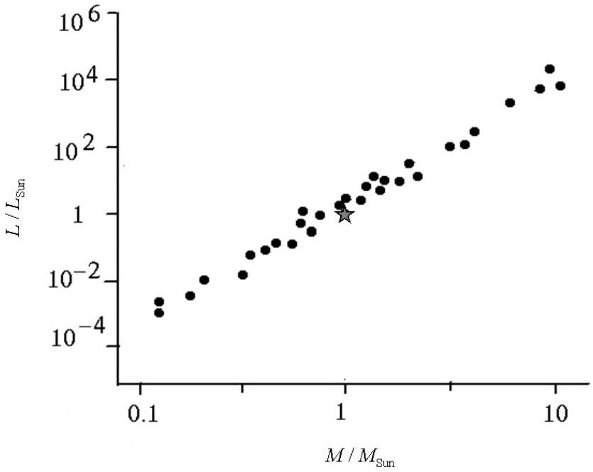

Two stars rotating around their center of mass form a binary star system. Almost half of the stars in our galaxy are binary star systems. It is not easy to realize the binary nature of most of these star systems from Earth, since the distance between the two stars is much less than their distance from us and thus the stars cannot be resolved with telescopes. Therefore, we have to use either photometry or spectrometry to observe the variations in the intensity or the spectrum of a particular star to find out whether it is a binary system or not.

## Photometry of Binary Stars

If we are exactly on the plane of motion of the two stars, then one star will occult (pass in front of) the other star at certain times and the intensity of the whole system will vary with time from our observation point. These binary systems are called ecliptic binaries.

1 Assume that two stars are moving on circular orbits around their common center of mass with a constant angular speed $\omega$ and we are exactly on the plane of motion of the binary system. Also assume that the surface temperatures of the stars are $T_{1}$ and $T_{2}\left(T_{1}>T_{2}\right)$, and the corresponding radii are $R_{1}$ and $R_{2}\left(R_{1}>R_{2}\right)$, respectively. The total intensity of light, measured on Earth, is plotted in Figure 1 as a function of time. Careful measurements indicate that the intensities of the incident light from the stars corresponding to the minima are respectively 90 and 63 percent of the maximum intensity, $I_{0}$, received from both stars $\left(I_{0}=4.8 \times 10^{-9} \mathrm{~W} / \mathrm{m}^{2}\right)$. The vertical axis in Figure 1 shows the ratio $I / I_{0}$ and the horizontal axis is marked in days.

Figure 1. The relative intensity received from the binary star system as a function of time. The vertical axis has been scaled by $I_{0}=4.8 \times 10^{-9} \mathrm{~W} / \mathrm{m}^{2}$. Time is given in days.

Figure 1. The relative intensity received from the binary star system as a function of time. The vertical axis has been scaled by $I_{0}=4.8 \times 10^{-9} \mathrm{~W} / \mathrm{m}^{2}$. Time is given in days.
| 1.1 | Find the period of the orbital motion. Give your answer in seconds up to two significant digits. What is the angular frequency of the system in rad/sec? | 0.8 |
| :--- | :--- | :--- |

To a good approximation, the receiving radiation from a star is a uniform black body radiation from a flat disc with a radius equal to the radius of the star. Therefore, the power received from the star is proportional to $A T^{4}$ where $A$ is area of the disc and $T$ is the surface temperature of the star.

| 1.2 | Use the diagram in Figure 1 to find the ratios $T_{1} / T_{2}$ and $R_{1} / R_{2}$. | 1.6 |
| :--- | :--- | :--- |

## Spectrometry of Binary Systems

In this section, we are going to calculate the astronomical properties of a binary star by using experimental spectrometric data of the binary system.

Atoms absorb or emit radiation at their certain characteristic wavelengths. Consequently, the observed spectrum of a star contains absorption lines due to the atoms in the star's atmosphere. Sodium has a characteristic yellow line spectrum ( $\mathrm{D}_{1}$ line) with a wavelength $5895.9 \AA$ ( $10 \AA=1$ nm). We examine the absorption spectrum of atomic Sodium at this wavelength for the binary system of the previous section. The spectrum of the light that we receive from the binary star is Doppler-shifted, because the stars are moving with respect to us. Each star has a different speed. Accordingly the absorption wavelength for each star will be shifted by a different amount. Highly accurate wavelength measurements are required to observe the Doppler shift since the speed of the stars is much less than the speed of light. The speed of the center of mass of the binary system we consider in this problem is much smaller than the orbital velocities of the stars. Hence all the Doppler shifts can be attributed to the orbital velocity of the stars. Table 1 shows the measured spectrum of the stars in the binary system we have observed.

Table 1: Absorption spectrum of the binary star system for the Sodium $\mathbf{D}_{\mathbf{1}}$ line
| t/days | 0.3 | 0.6 | 0.9 | 1.2 | 1.5 | 1.8 | 2.1 | 2.4 |
| :--- | :--- | :--- | :--- | :--- | :--- | :--- | :--- | :--- |
| $\lambda_{1}(\AA)$ | 5897.5 | 5897.7 | 5897.2 | 5896.2 | 5895.1 | 5894.3 | 5894.1 | 5894.6 |
| $\lambda_{2}(\AA)$ | 5893.1 | 5892.8 | 5893.7 | 5896.2 | 5897.3 | 5898.7 | 5899.0 | 5898.1 |

| t/days | 2.7 | 3.0 | 3.3 | 3.6 | 3.9 | 4.2 | 4.5 | 4.8 |
| :--- | :--- | :--- | :--- | :--- | :--- | :--- | :--- | :--- |
| $\lambda_{1}(\AA)$ | 5895.6 | 5896.7 | 5897.3 | 5897.7 | 5897.2 | 5896.2 | 5895.0 | 5894.3 |
| $\lambda_{2}(\AA)$ | 5896.4 | 5894.5 | 5893.1 | 5892.8 | 5893.7 | 5896.2 | 5897.4 | 5898.7 |

(Note: There is no need to make a graph of the data in this table)
2 Using Table 1,

| 2.1 | Let $v_{1}$ and $v_{2}$ be the orbital velocity of each star. Find $v_{1}$ and $v_{2}$. The speed of light $c=3.0 \times 10^{8} \mathrm{~m} / \mathrm{s}$. Ignore all relativistic effects. | 1.8 |
| :--- | :--- | :--- |
| 2.2 | Find the mass ratio of the stars $\left(m_{1} / m_{2}\right)$. | 0.7 |

| 2.3 | Let $r_{1}$ and $r_{2}$ be the distances of each star from their center of mass. Find $r_{1}$ and $r_{2}$. | 0.8 |
| :--- | :--- | :--- |

| 2.4 | Let $r$ be the distance between the stars. Find $r$. | 0.2 |
| :--- | :--- | :--- |

3 The gravitational force is the only force acting between the stars.

| 3.1 | Find the mass of each star up to one significant digit.   The universal gravitational constant $G=6.7 \times 10^{-11} \mathrm{~m}^{3} \mathrm{~kg}^{-1} \mathrm{~s}^{-2}$. | 1.2 |
| :--- | :--- | :--- |

## General Characteristics of Stars

4 Most of the stars generate energy through the same mechanism. Because of this, there is an empirical relation between their mass, $M$, and their luminosity, $L$, which is the total radiant power of the star. This relation could be written in the form $L / L_{\text {Sun }}=\left(M / M_{\text {Sun }}\right)^{\alpha}$. Here, $M_{\text {Sun }}=2.0 \times 10^{30} \mathrm{~kg}$ is the solar mass and, $L_{\text {Sun }}=3.9 \times 10^{26} \mathrm{~W}$ is the solar luminosity. This relation is shown in a log-log diagram in Figure 2.

Figure 2. The luminosity of a star versus its mass varies as a power law. The diagram is loglog. The star-symbol represents Sun with a mass of $2.0 \times 10^{30} \mathrm{~kg}$ and luminosity of $3.9 \times 10^{26} \mathrm{~W}$.

| 4.1 | Find $\alpha$ up to one significant digit. | 0.6 |
| :--- | :--- | :--- |
| 4.2 | Let $L_{1}$ and $L_{2}$ be the luminosity of the stars in the binary system studied in the previous sections. Find $L_{1}$ and $L_{2}$. | 0.6 |

| 4.3 | What is the distance, $d$, of the star system from us in light years?   To find the distance you can use the diagram of Figure 1. One light year is the distance light travels in one year. | 0.9 |
| :--- | :--- | :--- |

| 4.4 | What is the maximum angular distance, $\theta$, between the stars from our observation point? | 0.4 |
| :--- | :--- | :--- |

| 4.5 | What is the smallest aperture size for an optical telescope, $D$, that can resolve these two stars? | 0.4 |
| :--- | :--- | :--- |
