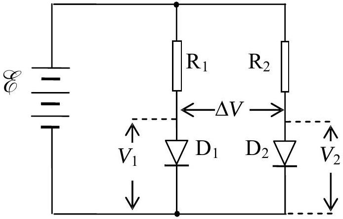
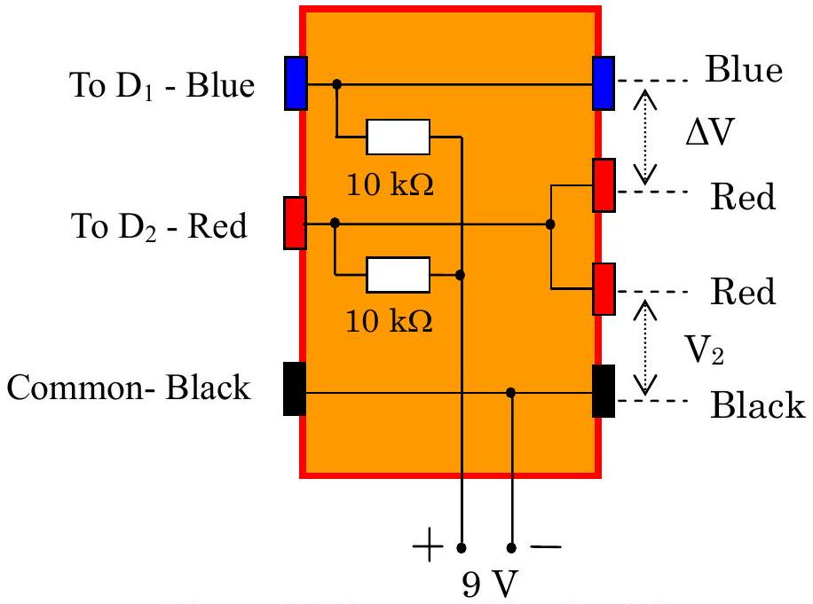
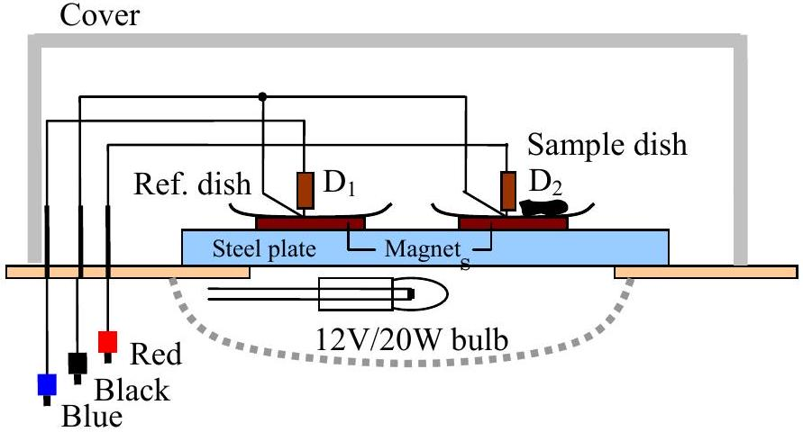
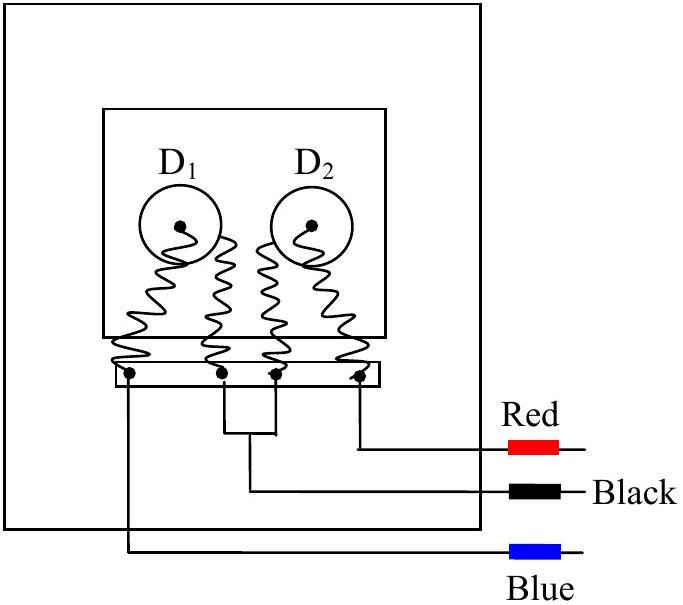
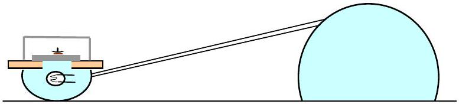
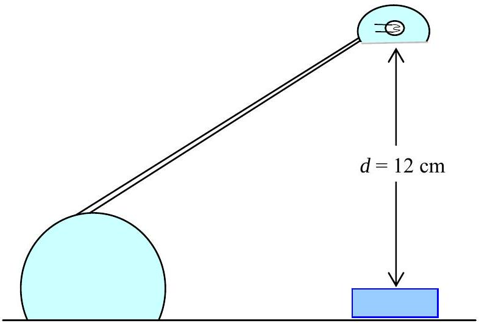
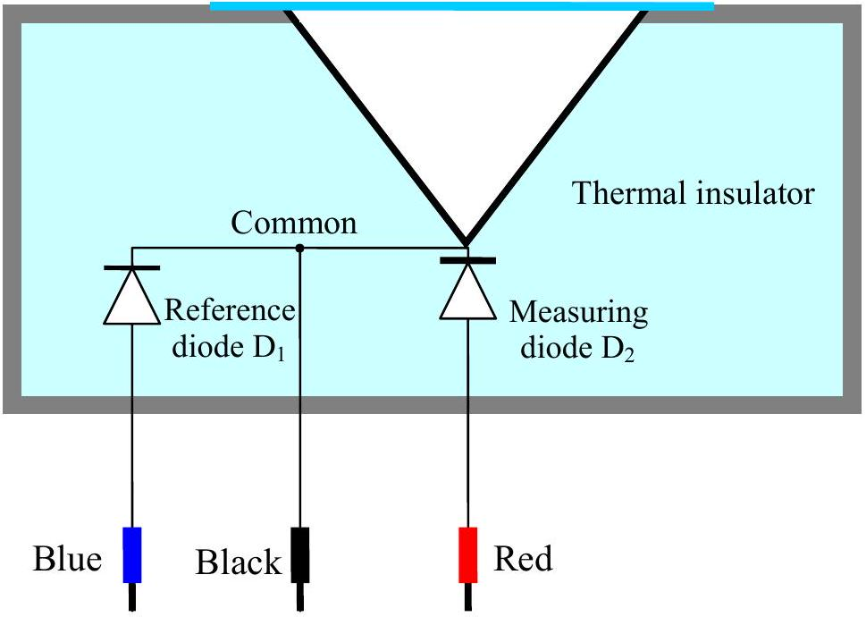
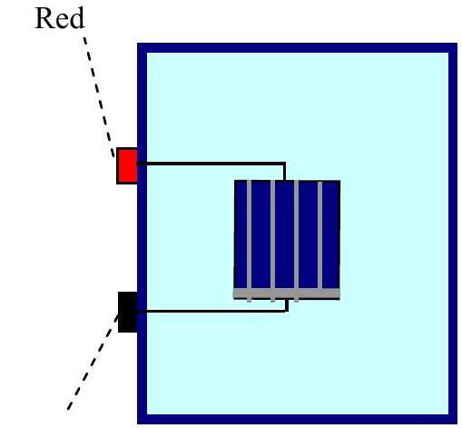
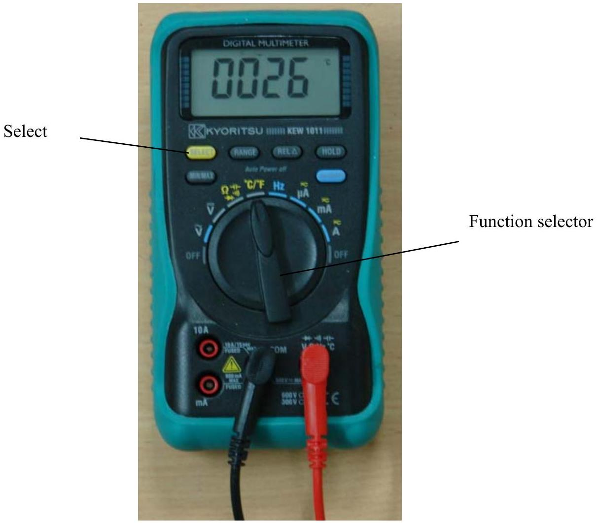
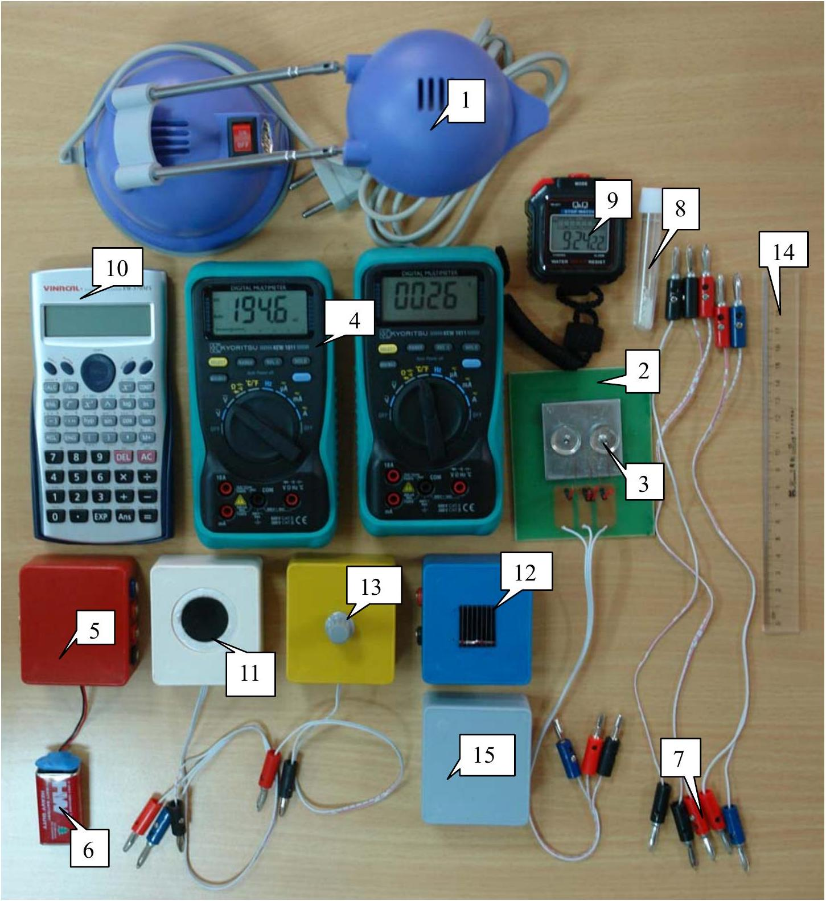

## DIFFERENTIAL THERMOMETRIC METHOD

In this problem, we use the differential thermometric method to fulfill the two following tasks:

1. Finding the temperature of solidification of a crystalline solid substance.
2. Determining the efficiency of a solar cell.

## A. Differential thermometric method

In this experiment forward biased silicon diodes are used as temperature sensors to measure temperature. If the electric current through the diode is constant, then the voltage drop across the diode depends on the temperature according to the relation

$$
V(T)=V\left(T_{0}\right)-\alpha\left(T-T_{0}\right)
$$

where $V(T)$ and $V\left(T_{0}\right)$ are respectively the voltage drops across the diode at temperature $T$ and at room temperature $T_{0}$ (measured in ${ }^{\circ} \mathrm{C}$ ), and the factor

$$
\alpha=(2.00 \pm 0.03) \mathrm{mV} /{ }^{\circ} \mathrm{C}
$$

The value of $V\left(T_{0}\right)$ may vary slightly from diode to diode.
If two such diodes are placed at different temperatures, the difference between the temperatures can be measured from the difference of the voltage drops across the two diodes. The difference of the voltage drops, called the differential voltage, can be measured with high precision; hence the temperature difference can also be measured with high precision. This method is called the differential thermometric method. The electric circuit used with the diodes in this experiment is shown in Figure 1. Diodes $\mathrm{D}_{1}$ and $\mathrm{D}_{2}$ are forward biased by a 9V battery, through $10 \mathrm{k} \Omega$ resistors, $R_{1}$ and $R_{2}$. This circuit keeps the current in the

Figure 1. Electric circuit of the diode

two diodes approximately constant.

If the temperature of diode $\mathrm{D}_{1}$ is $T_{1}$ and that of $\mathrm{D}_{2}$ is $T_{2}$, then according to (1), we have:

$$
V_{1}\left(T_{1}\right)=V_{1}\left(T_{0}\right)-\alpha\left(T_{1}-T_{0}\right)
$$

and

$$
V_{2}\left(T_{2}\right)=V_{2}\left(T_{0}\right)-\alpha\left(T_{2}-T_{0}\right)
$$

The differential voltage is:

$$
\begin{aligned}
& \Delta V=V_{2}\left(T_{2}\right)-V_{1}\left(T_{1}\right)=V_{2}\left(T_{0}\right)-V_{1}\left(T_{0}\right)-\alpha\left(T_{2}-T_{1}\right)=\Delta V\left(T_{0}\right)-\alpha\left(T_{2}-T_{1}\right) \\
& \Delta V=\Delta V\left(T_{0}\right)-\alpha \Delta T
\end{aligned}
$$

in which $\Delta T=T_{2}-T_{1}$. By measuring the differential voltage $\Delta V$, we can determine the temperature difference.

To bias the diodes, we use a circuit box, the diagram of which is shown in Figure 2.

Figure 2. Diagram of the circuit box (top view)

The circuit box contains two biasing resistors of $10 \mathrm{k} \Omega$ for the diodes, electrical leads to the 9 V battery, sockets for connecting to the diodes $\mathrm{D}_{1}$ and $\mathrm{D}_{2}$, and sockets for connecting to digital multimeters to measure the voltage drop $V_{2}$ on diode $\mathrm{D}_{2}$ and the differential voltage $\Delta V$ of the diodes $\mathrm{D}_{1}$ and $\mathrm{D}_{2}$.
B. Task 1: Finding the temperature of solidification of a crystalline substance 1. Aim of the experiment

If a crystalline solid substance is heated to the melting state and then cooled down, it solidifies at a fixed temperature $T_{\mathrm{s}}$, called temperature of solidification, also called the melting point of the substance. The traditional method to determine $T_{\mathrm{s}}$ is to follow the change in temperature with time during the cooling process. Due to the fact that the solidification process is accompanied by the release of the latent heat of the phase transition, the temperature of the substance does not change while the substance is solidifying. If the amount of the substance is large enough, the time interval in which the temperature remains constant is rather long, and one can easily determine this temperature. On the contrary, if the amount of substance is small, this time interval is too short to be observed and hence it is difficult to determine $T_{\mathrm{s}}$.

In order to determine $T_{\mathrm{s}}$ in case of small amount of substance, we use the differential thermometric method, whose principle can be summarized as follows. We use two identical small dishes, one containing a small amount of the substance to be studied, called the sample dish, and the other not containing the substance, called the reference dish. The two dishes are put on a heat source, whose temperature varies slowly with time. The thermal flows to and from the two dishes are nearly the same. Each dish contains a temperature sensor (a forward biased silicon diode). While there is no phase change in the substance, the temperature $T_{\text {samp }}$ of the sample dish and the temperature $T_{\text {ref }}$ of the reference dish vary at nearly the same rate, and thus $\Delta T=T_{\text {ref }}-T_{\text {samp }}$ varies slowly with $T_{\text {samp }}$. If there is a phase change in the substance, and during the phase change $T_{\text {samp }}$ does not vary and equals $T_{\mathrm{s}}$, while $T_{\text {ref }}$ steadily varies, then $\Delta T$ varies quickly. The plot of $\Delta T$ versus $T_{\text {samp }}$ shows an abrupt change. The value of $T_{\text {samp }}$ corresponding to the abrupt change of $\Delta T$ is indeed $T_{\mathrm{s}}$.

The aim of this experiment is to determine the temperature of solidification $T_{\mathrm{s}}$ of a
pure crystalline substance, having $T_{\mathrm{s}}$ in the range from $50^{\circ} \mathrm{C}$ to $70^{\circ} \mathrm{C}$, by using the traditional and differential thermal analysis methods. The amount of substance used in the experiment is about 20 mg.

## 2. Apparatus and materials

1. The heat source is a 20 W halogen lamp.
2. The dish holder is a bakelite plate with a square hole in it. A steel plate is fixed on the hole. Two small magnets are put on the steel plate.
3. Two small steel dishes, each contains a silicon diode soldered on it. One dish is used as the reference dish, the other - as the sample dish.

Figure 3. Apparatus for measuring the solidification temperature

Each dish is placed on a magnet. The magnetic force maintains the contact between the dish, the magnet and the steel plate. The magnets also keep a moderate thermal contact between the steel plate and the dishes.

A grey plastic box used as a cover to protect the dishes from the outside influence.

Figure 3 shows the arrangement of the dishes and the magnets on the dish holder and the light bulb.
4. Two digital multimeters are used as voltmeters. They can also measure room temperature by turning the Function selector to the " ${ }^{\circ} \mathrm{C} /{ }^{\circ} \mathrm{F}$ " function. The voltage function of the multimeter has an error of ±2 on the last digit. Note: to prevent the multimeter (see Figure 9) from going into the "Auto power

Figure 4. The dishes on the dish holder (top view)

off" function, turn the Function selector from OFF position to the desired function while pressing and holding the SELECT button.

5. A circuit box as shown in Figure 2.
6. A 9 V battery.
7. Electrical leads.
8. A small ampoule containing about 20 mg of the substance to be measured.
9. A stop watch
10. A calculator
11. Graph papers.

## 3. Experiment

1. The magnets are placed on two equivalent locations on the steel plate. The reference dish and the empty sample dish are put on the magnets as shown in the Figure 4. We use the dish on the left side as the reference dish, with diode $\mathrm{D}_{1}$ on it ( $\mathrm{D}_{1}$ is called the reference diode), and the dish on the right side as the sample dish, with diode $\mathrm{D}_{2}$ on it ( $\mathrm{D}_{2}$ is called the measuring diode).

Put the lamp-shade up side down as shown in Figure 5. Do not switch the lamp on. Put the dish holder on the lamp. Connect the apparatuses so that you can measure the voltage drop on the diode $\mathrm{D}_{2}$, that is $V_{\text {samp }}=V_{2}$, and the differential voltage $\Delta V$.

In order to eliminate errors due to the warming up period of the instruments and devices, it is strongly recommended that the complete measurement circuit be switched on for about 5 minutes before starting real experiments.

Figure 5.
Using the halogen lamp as a heat source

1.1. Measure the room temperature $T_{0}$ and the voltage drop $V_{\text {samp }}\left(T_{0}\right)$ across diode $\mathrm{D}_{2}$ fixed to the sample dish, at room temperature $T_{0}$.
1.2. Calculate the voltage drops $V_{\text {samp }}\left(50^{\circ} \mathrm{C}\right), V_{\text {samp }}\left(70^{\circ} \mathrm{C}\right)$ and $V_{\text {samp }}\left(80^{\circ} \mathrm{C}\right)$ on the measuring diode at temperatures 50°C, 70°C and 80°C, respectively.
2. With both dishes still empty, switch the lamp on. Follow $V_{\text {sam }}$. When the temperature of the sample dish reaches $T_{\text {samp }} \sim 80^{\circ} \mathrm{C}$, switch the lamp off.
2.1. Wait until $T_{\text {samp }} \sim 70^{\circ} \mathrm{C}$, and then follow the change in $V_{\text {samp }}$ and $\Delta V$ with time, while the steel plate is cooling down. Note down the values of $V_{\text {samp }}$ and $\Delta V$ every 10 s to 20 s in the table provided in the answer sheet. If $\Delta V$ varies quickly, the time interval between consecutive measurements may be shorter. When the temperature of the sample dish decreases to $T_{\text {samp }} \sim 50^{\circ} \mathrm{C}$, the measurement is stopped.
2.2. Plot the graph of $V_{\text {samp }}$ versus $t$, called Graph 1 , on a graph paper provided.
2.3. Plot the graph of $\Delta V$ versus $V_{\text {samp }}$, called Graph 2, on a graph paper provided.

Note: for 2.2 and 2.3 do not forget to write down the correct name of each graph.
3. Pour the substance from the ampoule into the sample dish. Repeat the experiment identically as mentioned in section 2.
3.1. Write down the data of $V_{\text {samp }}$ and $\Delta V$ with time $t$ in the table provided in the answer sheet.
3.2. Plot the graph of $V_{\text {samp }}$ versus $t$, called Graph 3, on a graph paper provided.
3.3. Plot the graph of $\Delta V$ versus $V_{\text {samp }}$, called Graph 4, on a graph paper provided.

Note: for 3.2 and 3.3 do not forget to write down the correct name of each graph.
4. By comparing the graphs in section 2 and section 3, determine the temperature of solidification of the substance.
4.1. Using the traditional method to determine $T_{\mathrm{s}}$ : by comparing the graphs of $V_{\text {samp }}$ versus $t$ in sections 3 and 2, i.e. Graph 3 and Graph 1, mark the point on Graph 3 where the substance solidifies and determine the value $V_{\mathrm{s}}$ (corresponding to this point) of $V_{\text {samp }}$.

Find out the temperature of solidification $T_{\mathrm{s}}$ of the substance and estimate its error.
4.2. Using the differential thermometric method to determine $T_{\mathrm{s}}$ : by comparing the graphs of $\Delta V$ versus $V_{\text {samp }}$ in sections 3 and 2, i.e. Graph 4 and Graph 2, mark the point on Graph 4 where the substance solidifies and determine the value $V_{\mathrm{s}}$ of $V_{\text {samp }}$.

Find out the temperature of solidification $T_{\mathrm{s}}$ of the substance.
4.3. From errors of measurement data and instruments, calculate the error of $T_{\mathrm{s}}$ obtained with the differential thermometric method. Write down the error calculations and finally write down the values of $T_{\mathrm{s}}$ together with its error in the answer sheet.

## C. Task 2: Determining the efficiency of a solar cell under illumination of an incandescent lamp

## 1. Aim of the experiment

The aim of the experiment is to determine the efficiency of a solar cell under illumination of an incandescent lamp. Efficiency is defined as the ratio of the electrical power that the solar cell can supply to an external circuit, to the total radiant power received by the cell. The efficiency depends on the incident radiation spectrum. In this experiment the radiation incident to the cell is that of an incandescent halogen lamp. In order to determine the efficiency of the solar cell, we have to measure the irradiance $E$ at a point situated under the lamp, at a distance $d$ from the lamp along the vertical direction, and the maximum power $P_{\text {max }}$ of the solar cell when it is placed at this point. In this experiment, $d=12 \mathrm{~cm}$ (Figure 6). Irradiance $E$ can be defined by:

$$
E=\Phi / S
$$

in which $\Phi$ is the radiant flux (radiant power), and $S$ is the area of the

Figure 6.
Using the halogen lamp as a light source

illuminated surface.

## 2. Apparatus and materials

1. The light source is a 20W halogen lamp.
2. The radiation detector is a hollow cone made of copper, the inner surface of it is

Figure 7. Diagram of the radiation detector

3. A circuit box as shown in Figure 2.
4. A piece of solar cell fixed on a plastic box (Figure 8). The area of the cell includes some metal connection strips. For the efficiency calculation these strips are considered parts of the cell.
5. Two digital multimeters. When used to measure the voltage, they have a very large internal resistance, which can be considered infinitely large. When we use them to measure the current, we cannot neglect their internal resistance. The voltage function of the multimeter has an error of ±2 on the last digit.

Figure 8.
The solar cell

The multimeters can also measure the room temperature.
Note: to prevent the multimeter (see Figure 9) from going into the "Auto power off" function, turn the Function selector from OFF position to the desired function while pressing and holding the SELECT button.

6. A 9 V battery
7. A variable resistor.
8. A stop watch
9. A ruler with 1mm divisions
10. Electrical leads.
11. Graph papers.

## 3. Experiment

When the detector receives energy from radiation, it heats up. At the same time, the detector loses its heat by several mechanisms, such as thermal conduction, convection, radiation etc...Thus, the radiant energy received by detector in a time interval $d t$ is equal to the sum of the energy needed to increase the detector temperature and the energy transferred from the detector to the surrounding:

$$
\Phi d t=C d T+d Q
$$

where $C$ is the heat capacity of the detector and the diode, $d T$ - the temperature increase and $d Q$ - the heat loss.

When the temperature difference between the detector and the surrounding $\Delta T=T-T_{0}$ is small, we can consider that the heat $d Q$ transferred from the detector to the surrounding in the time interval $d t$ is approximately proportional to $\Delta T$ and $d t$, that is $d Q=k \Delta T d t$, with $k$ being a factor having the dimension of W/K. Hence, assuming that $k$ is constant and $\Delta T$ is small, we have:

$$
\Phi d t=C d T+k \Delta T d t=C d(\Delta T)+k \Delta T d t
$$

or

$$
\frac{d(\Delta T)}{d t}+\frac{k}{C} \Delta T=\frac{\Phi}{C}
$$

The solution of this differential equation determines the variation of the temperature difference $\Delta T$ with time $t$, from the moment the detector begins to receive the light with a constant irradiation, assuming that at $t=0, \Delta T=0$

$$
\Delta T(t)=\frac{\Phi}{k}\left(1-e^{-\frac{k}{C} t}\right)
$$

When the radiation is switched off, the mentioned above differential equation becomes

$$
\frac{d(\Delta T)}{d t}+\frac{k}{C} \Delta T=0
$$

and the temperature difference $\Delta T$ varies with the time according to the following formula:

$$
\Delta T(t)=\Delta T(0) e^{-\frac{k}{C} t}
$$

where $\Delta T(0)$ is the temperature difference at $t=0$ (the moment when the measurement starts).

1. Determine the room temperature $T_{0}$.
2. Compose an electric circuit comprising the diode sensors, the circuit box and the multimeters to measure the temperature of the detector.

In order to eliminate errors due to the warming up period of the instruments and devices, it is strongly recommended that the complete measurement circuit be switched on for about 5 minutes before starting real experiments.
2.1. Place the detector under the light source, at a distance of $d=12 \mathrm{~cm}$ to the lamp. The lamp is off. Follow the variation of $\Delta V$ for about 2 minutes with sampling intervals of 10 s and determine the value of $\Delta V\left(T_{0}\right)$ in equation (3).
2.2. Switch the lamp on to illuminate the detector. Follow the variation of $\Delta V$. Every 10-15 s, write down a value of $\Delta V$ in the table provided in the answer sheet. (Note: columns $x$ and $y$ of the table will be used later in section 4.). After 2 minutes, switch the lamp off.
2.3. Move the detector away from the lamp. Follow the variation of $\Delta V$ for about 2 minutes after that. Every 10-15 s, write down a value of $\Delta V$ in the table provided in the answer sheet. (Note: columns x and y of the table will be used later in section 3.).

Hints: As the detector has a thermal inertia, it is recommended not to use some data obtained immediately after the moment the detector begins to be illuminated or ceases to be illuminated.
3. Plot a graph in an $x-y$ system of coordinates, with variables $x$ and $y$ chosen appropriately, in order to prove that after the lamp is switched off, equation (7) is satisfied.

3.1. Write down the expression for variables $x$ and $y$.
3.2. Plot a graph of $y$ versus $x$, called Graph 5.
3.3. From the graph, determine the value of $k$.
4. Plot a graph in an $x-y$ system of coordinates, with variables $x$ and $y$ chosen
appropriately, in order to prove that when the detector is illuminated, equation (5) is satisfied.
4.1. Write down the expressions for variables $x$ and $y$.
4.2. Plot a graph of $y$ versus $x$, called Graph 6.
4.3. Determine the irradiance $E$ at the orifice of the detector.
5. Put the solar cell to the same place where the radiation detector was. Connect the solar cell to an appropriate electric circuit comprising the multimeters and a variable resistor which is used to change the load of the cell. Measure the current in the circuit and the voltage on the cell at different values of the resistor.
5.1. Draw a diagram of the circuit used in this experiment.
5.2. By rotating the knob of the variable resistor, you change the value of the load. Note the values of current $I$ and voltage $V$ at each position of the knob.
5.3. Plot a graph of the power of the cell, which supplies to the load, as a function of the current through the cell. This is Graph 7.
5.4. From the graph deduce the maximum power $P_{\max }$ of the cell and estimate its error.
5.5. Write down the expression for the efficiency of the cell that corresponds to the obtained maximum power. Calculate its value and error.

Contents of the experiment kit（see also Figure 10）
| 1 | Halogen lamp 220 V／ 20 W | 9 | Stop watch |
| :--- | :--- | :--- | :--- |
| 2 | Dish holder | 10 | Calculator |
| 3 | Dish | 11 | Radiation detector |
| 4 | Multimeter | 12 | Solar cell |
| 5 | Circuit box | 13 | Variable resistor |
| 6 | 9 V battery | 14 | Ruler |
| 7 | Electrical leads | 15 | Box used as a cover |
| 8 | Ampoule with substance to be measured |  |  |

Note：to prevent the multimeter（see Figure 9）from going into the＂Auto power off＂ function，turn the Function selector from OFF position to the desired function while pressing and holding the SELECT button．

Figure 9．Digital multimeter

Figure 10．Contents of the experiment kit
