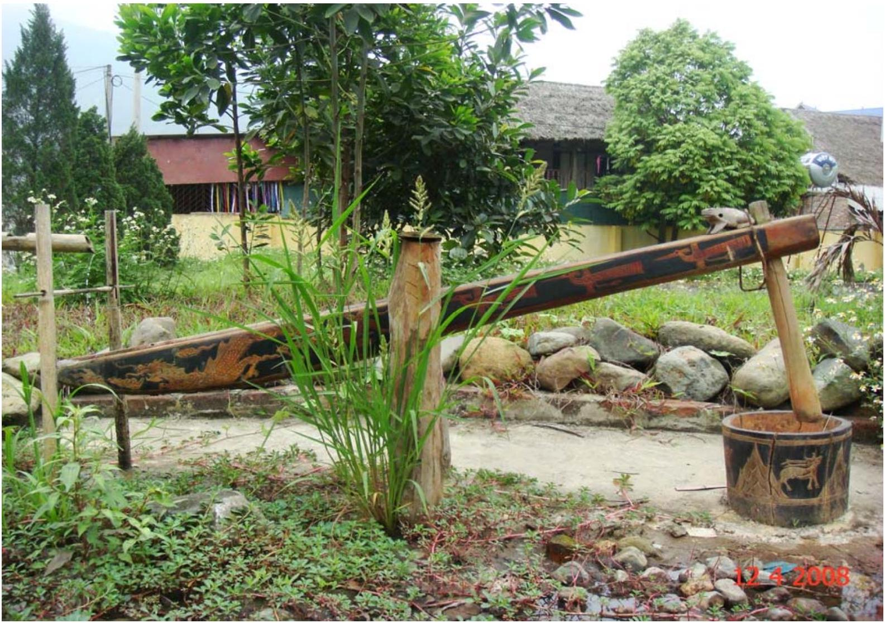
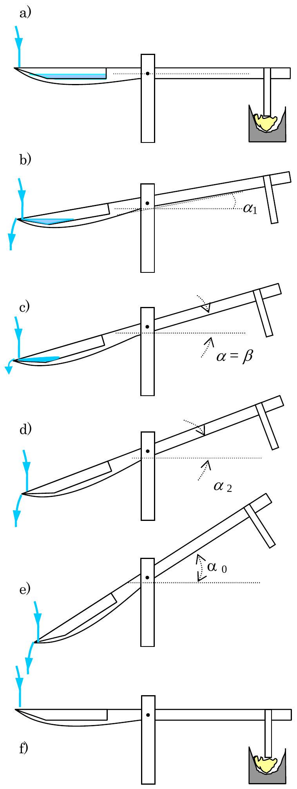
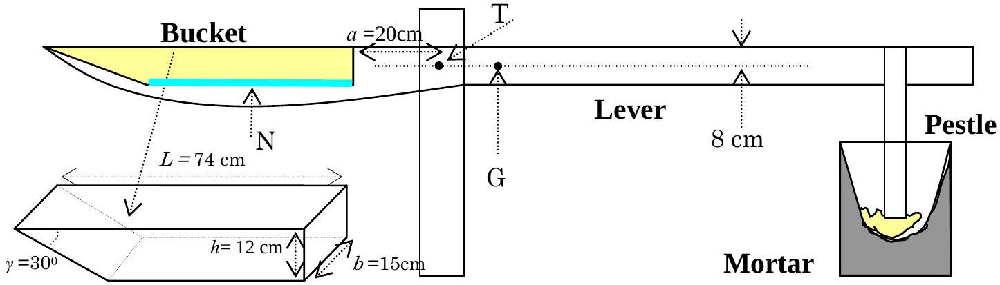

## WATER-POWERED RICE-POUNDING MORTAR

## A. Introduction

Rice is the main staple food of most people in Vietnam. To make white rice from paddy rice, one needs separate of the husk (a process called "hulling") and separate the bran layer ("milling"). The hilly parts of northern Vietnam are abundant with water streams, and people living there use water-powered rice-pounding mortar for bran layer separation. Figure 1 shows one of such mortars., Figure 2 shows how it works.

## B. Design and operation

1. Design.

The rice-pounding mortar shown in Figure 1 has the following parts:
The mortar, basically a wooden container for rice.
The lever, which is a tree trunk with one larger end and one smaller end. It can rotate around a horizontal axis. A pestle is attached perpendicularly to the lever at the smaller end. The length of the pestle is such that it touches the rice in the mortar when the lever lies horizontally. The larger end of the lever is carved hollow to form a bucket. The shape of the bucket is crucial for the mortar's operation.
2. Modes of operation

The mortar has two modes.
Working mode. In this mode, the mortar goes through an operation cycle illustrated in Figure 2.

The rice-pounding function comes from the work that is transferred from the pestle to the rice during stage f) of Figure 2. If, for some reason, the pestle never touches the rice, we say that the mortar is not working.

Rest mode with the lever lifted up. During stage c) of the operation cycle (Figure 2), as the tilt angle $\alpha$ increases, the amount of water in the bucket decreases. At one particular moment in time, the amount of water is just enough to counterbalance the weight of the lever. Denote the tilting angle at this instant by $\beta$. If the lever is kept at angle $\beta$ and the initial angular velocity is zero, then the lever will remain at this position forever. This is the rest mode with the lever lifted up. The stability of this position depends on the flow rate of water into the bucket, $\Phi$. If $\Phi$ exceeds some value $\Phi_{2}$, then this rest mode is stable, and the mortar cannot be in the working mode.

In other words, $\Phi_{2}$ is the minimal flow rate for the mortar not to work.

Figure 1
A water－powered rice－pounding mortar

## OPERATION CYCLE OF A WATER-POWERED RICE-POUNDING MORTAR

Figure 2

a) At the beginning there is no water in the bucket, the pestle rests on the mortar. Water flows into the bucket with a small rate, but for some time the lever remains in the horizontal position.
b) At some moment the amount of water is enough to lift the lever up. Due to the tilt, water rushes to the farther side of the bucket, tilting the lever more quickly. Water starts to flow out at $\alpha=\alpha_{1}$.
c) As the angle $\alpha$ increases, water starts to flow out. At some particular tilt angle, $\alpha=\beta$, the total torque is zero.
d) $\alpha$ continues increasing, water continues to flow out until no water remains in the bucket.
e) $\alpha$ keeps increasing because of inertia. Due to the shape of the bucket, water falls into the bucket but immediately flows out. The inertial motion of the lever continues until $\alpha$ reaches the maximal value $\alpha_{0}$.
f) With no water in the bucket, the weight of the lever pulls it back to the initial horizontal position. The pestle gives the mortar (with rice inside) a pound and a new cycle begins.

## C. The problem

Consider a water-powered rice-pounding mortar with the following parameters (Figure 3)

The mass of the lever (including the pestle but without water) is $M=30 \mathrm{~kg}$,
The center of mass of the lever is G. The lever rotates around the axis T (projected onto the point T on the figure).

The moment of inertia of the lever around T is $I=12 \mathrm{~kg} \cdot \mathrm{~m}^{2}$.
When there is water in the bucket, the mass of water is denoted as $m$, the center of mass of the water body is denoted as N.

The tilt angle of the lever with respect to the horizontal axis is $\alpha$.
The main length measurements of the mortar and the bucket are as in Figure 3.
Neglect friction at the rotation axis and the force due to water falling onto the bucket. In this problem, we make an approximation that the water surface is always horizontal.

Figure 3 Design and dimensions of the rice-pounding mortar

## 1. The structure of the mortar

At the beginning, the bucket is empty, and the lever lies horizontally. Then water flows into the bucket until the lever starts rotating. The amount of water in the bucket at this moment is $m=1.0 \mathrm{~kg}$.
1.1. Determine the distance from the center of mass G of the lever to the rotation axis T. It is known that GT is horizontal when the bucket is empty.
1.2. Water starts flowing out of the bucket when the angle between the lever and the horizontal axis reaches $\alpha_{1}$. The bucket is completely empty when this angle is $\alpha_{2}$.

Determine $\alpha_{1}$ and $\alpha_{2}$.
1.3. Let $\mu(\alpha)$ be the total torque (relative to the axis T) which comes from the
weight of the lever and the water in the bucket. $\mu(\alpha)$ is zero when $\alpha=\beta$. Determine $\beta$ and the mass $m_{1}$ of water in the bucket at this instant.

## 2. Parameters of the working mode

Let water flow into the bucket with a flow rate $\Phi$ which is constant and small. The amount of water flowing into the bucket when the lever is in motion is negligible. In this part, neglect the change of the moment of inertia during the working cycle.
2.1. Sketch a graph of the torque $\mu$ as a function of the angle $\alpha, \mu(\alpha)$, during one operation cycle. Write down explicitly the values of $\mu(\alpha)$ at angle $\alpha_{1}, \alpha_{2}$, and $\alpha=0$.
2.2. From the graph found in section 2.1., discuss and give the geometric interpretation of the value of the total energy $W_{\text {total }}$ produced by $\mu(\alpha)$ and the work $W_{\text {pounding }}$ that is transferred from the pestle to the rice.
2.3. From the graph representing $\mu$ versus $\alpha$, estimate $\alpha_{0}$ and $W_{\text {pounding }}$ (assume the kinetic energy of water flowing into the bucket and out of the bucket is negligible.) You may replace curve lines by zigzag lines, if it simplifies the calculation.

## 3. The rest mode

Let water flow into the bucket with a constant rate $\Phi$, but one cannot neglect the amount of water flowing into the bucket during the motion of the lever.
3.1. Assuming the bucket is always overflown with water,
3.1.1. Sketch a graph of the torque $\mu$ as a function of the angle $\alpha$ in the vicinity of $\alpha=\beta$. To which kind of equilibrium does the position $\alpha=\beta$ of the lever belong?
3.1.2. Find the analytic form of the torque $\mu(\alpha)$ as a function of $\Delta \alpha$ when $\alpha=\beta+\Delta \alpha$, and $\Delta \alpha$ is small.
3.1.3. Write down the equation of motion of the lever, which moves with zero initial velocity from the position $\alpha=\beta+\Delta \alpha$ ( $\Delta \alpha$ is small). Show that the motion is, with good accuracy, harmonic oscillation. Compute the period $\tau$.
3.2. At a given $\Phi$, the bucket is overflown with water at all times only if the lever moves sufficiently slowly. There is an upper limit on the amplitude of harmonic oscillation, which depends on $\Phi$. Determine the minimal value $\Phi_{1}$ of $\Phi$ (in kg/s) so that the lever can make a harmonic oscillator motion with amplitude 1°.
3.3. Assume that $\Phi$ is sufficiently large so that during the free motion of the lever when the tilting angle decreases from $\alpha_{2}$ to $\alpha_{1}$ the bucket is always overflown with water. However, if $\Phi$ is too large the mortar cannot operate. Assuming that the motion of the lever is that of a harmonic oscillator, estimate the minimal flow rate $\Phi_{2}$ for the rice-pounding mortar to not work.
