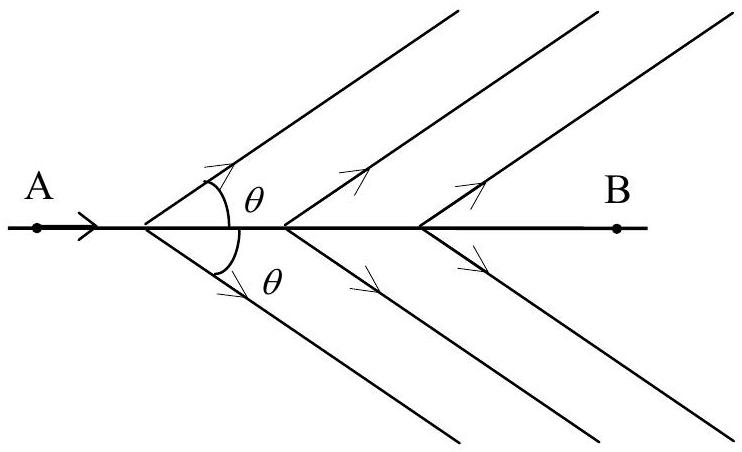

## CHERENKOV LIGHT AND RING IMAGING COUNTER

Light propagates in vacuum with the speed $c$. There is no particle which moves with a speed higher than $c$. However, it is possible that in a transparent medium a particle moves with a speed $v$ higher than the speed of the light in the same medium $\frac{c}{n}$, where $n$ is the refraction index of the medium. Experiment (Cherenkov, 1934) and theory (Tamm and Frank, 1937) showed that a charged particle, moving with a speed $v$ in a transparent medium with refractive index
$n$ such that $v>\frac{c}{n}$, radiates light, called Cherenkov light, in directions forming with the trajectory an angle

$$
\theta=\arccos \frac{1}{\beta n}
$$

where $\beta=\frac{v}{c}$.

1. To establish this fact, consider a particle moving at constant velocity $v>\frac{c}{n}$ on a straight line. It passes A at time 0 and B at time $t_{1}$. As the problem is symmetric with respect to rotations around AB, it is sufficient to consider light rays in a plane containing AB.

At any point C between A and B, the particle emits a spherical light wave, which propagates with velocity $\frac{c}{n}$. We define the wave front at a given time $t$ as the envelope of all these spheres at this time.
1.1. Determine the wave front at time $t_{1}$ and draw its intersection with a plane containing the trajectory of the particle.
1.2. Express the angle $\varphi$ between this intersection and the trajectory of the particle in terms of $n$ and $\beta$.
2. Let us consider a beam of particles moving with velocity $v>\frac{c}{n}$, such that the angle $\theta$ is small, along a straight line IS. The beam crosses a concave spherical mirror of focal length $f$ and center C, at point S. SC makes with SI a small angle $\alpha$ (see the figure in the Answer Sheet). The particle beam creates a ring image in the focal plane of the mirror.

Explain why with the help of a sketch illustrating this fact. Give the position of the center $O$ and the radius $r$ of the ring image.
This set up is used in ring imaging Cherenkov counters (RICH) and the medium which the particle traverses is called the radiator.

Note: in all questions of the present problem, terms of second order and higher in $\alpha$ and $\theta$ will be neglected.
3. A beam of particles of known momentum $p=10.0 \mathrm{GeV} / c$ consists of three types of particles: protons, kaons and pions, with rest mass $M_{\mathrm{p}}=0.94 \mathrm{GeV} / c^{2}$, $M_{\kappa}=0.50 \mathrm{GeV} / c^{2}$ and $M_{\pi}=0.14 \mathrm{GeV} / c^{2}$, respectively. Remember that $p c$ and $M c^{2}$ have the dimension of an energy, and 1 eV is the energy acquired by an electron after being accelerated by a voltage 1 V, and $1 \mathrm{GeV}=10^{9} \mathrm{eV}, 1 \mathrm{MeV}=10^{6} \mathrm{eV}$.

The particle beam traverses an air medium (the radiator) under the pressure $P$. The refraction index of air depends on the air pressure $P$ according to the relation $n=1+a P$ where $a=2.7 \times 10^{-4} \mathrm{~atm}^{-1}$
3.1. Calculate for each of the three particle types the minimal value $P_{\text {min }}$ of the air pressure such that they emit Cherenkov light.
3.2. Calculate the pressure $P_{\frac{1}{2}}$ such that the ring image of kaons has a radius equal to one half of that corresponding to pions. Calculate the values of $\theta_{\kappa}$ and $\theta_{\pi}$ in this case.

Is it possible to observe the ring image of protons under this pressure?
4. Assume now that the beam is not perfectly monochromatic: the particles momenta are distributed over an interval centered at $10 \mathrm{GeV} / c$ having a half width at half height $\Delta p$. This makes the ring image broaden, correspondingly $\theta$ distribution has a half width at half height $\Delta \theta$. The pressure of the radiator is $P_{\frac{1}{2}}$ determined in 3.2.
4.1. Calculate $\frac{\Delta \theta_{\kappa}}{\Delta p}$ and $\frac{\Delta \theta_{\pi}}{\Delta p}$, the values taken by $\frac{\Delta \theta}{\Delta p}$ in the pions and kaons cases.
4.2. When the separation between the two ring images, $\theta_{\pi}-\theta_{\mathrm{K}}$, is greater than 10
times the half-width sum $\Delta \theta=\Delta \theta_{\kappa}+\Delta \theta_{\pi}$, that is $\theta_{\pi}-\theta_{\kappa}>10 \Delta \theta$, it is possible to distinguish well the two ring images. Calculate the maximal value of $\Delta p$ such that the two ring images can still be well distinguished.
5. Cherenkov first discovered the effect bearing his name when he was observing a bottle of water located near a radioactive source. He saw that the water in the bottle emitted light.
5.1. Find out the minimal kinetic energy $T_{\text {min }}$ of a particle with a rest mass $M$ moving in water, such that it emits Cherenkov light. The index of refraction of water is $n=1.33$.
5.2. The radioactive source used by Cherenkov emits either $\alpha$ particles (i.e. helium nuclei) having a rest mass $M_{\alpha}=3.8 \mathrm{GeV} / c^{2}$ or $\beta$ particles (i.e. electrons) having a rest mass $M_{\mathrm{e}}=0.51 \mathrm{MeV} / c^{2}$. Calculate the numerical values of $T_{\text {min }}$ for $\alpha$ particles and $\beta$ particles.

Knowing that the kinetic energy of particles emitted by radioactive sources never exceeds a few MeV, find out which particles give rise to the radiation observed by Cherenkov.
6. In the previous sections of the problem, the dependence of the Cherenkov effect on wavelength $\lambda$ has been ignored. We now take into account the fact that the Cherenkov radiation of a particle has a broad continuous spectrum including the visible range (wavelengths from $0.4 \mu \mathrm{~m}$ to $0.8 \mu \mathrm{~m}$ ). We know also that the index of refraction $n$ of the radiator decreases linearly by 2\% of $n-1$ when $\lambda$ increases over this range.
6.1. Consider a beam of pions with definite momentum of $10.0 \mathrm{GeV} / c$ moving in air at pressure 6 atm. Find out the angular difference $\delta \theta$ associated with the two ends of the visible range.
6.2. On this basis, study qualitatively the effect of the dispersion on the ring image of pions with momentum distributed over an interval centered at $p=10 \mathrm{GeV} / c$ and having a half width at half height $\Delta p=0.3 \mathrm{GeV} / c$.
6.2.1. Calculate the broadening due to dispersion (varying refraction index) and that due to achromaticity of the beam (varying momentum).
6.2.2. Describe how the color of the ring changes when going from its inner to outer edges by checking the appropriate boxes in the Answer Sheet.
