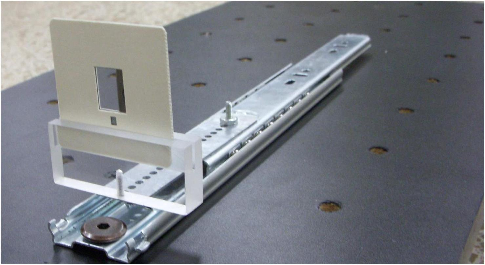
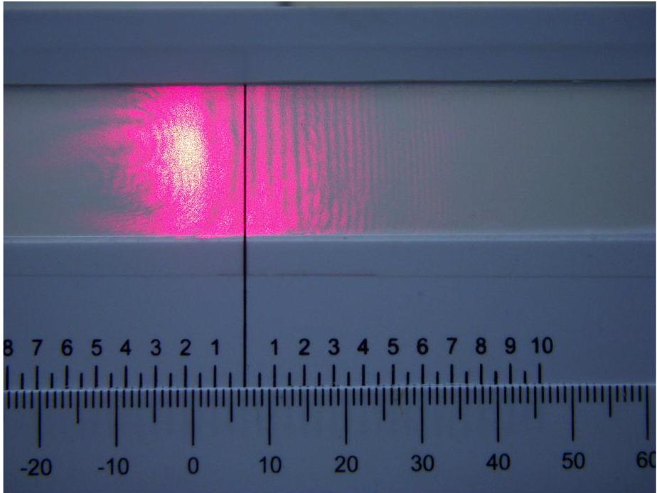
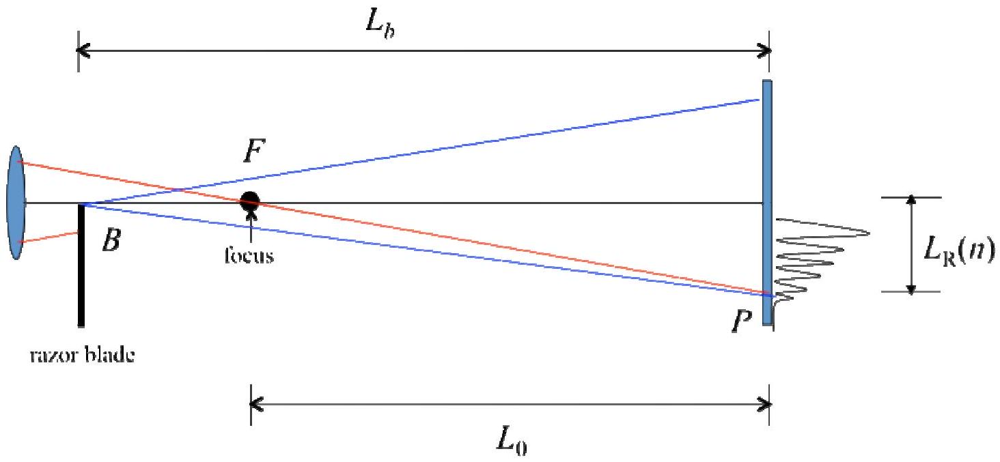
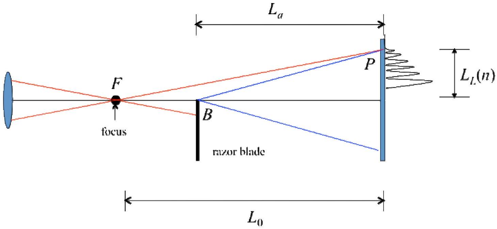

## EXPERIMENTAL PROBLEM 1

## DETERMINATION OF THE WAVELENGTH OF A DIODE LASER

## MATERIAL

In addition to items 1), 2) and 3), you should use:

4) A lens mounted on a square post (LABEL C).
5) A razor blade in a slide holder to be placed in acrylic support, (LABEL D1) and mounted on sliding rail (LABEL D2). Use the screwdriver to tighten the support if necessary. See photograph for mounting instructions.
6) An observation screen with a caliper scale (1/20 mm) (LABEL E).
7) A magnifying glass (LABEL F).
8) 30 cm ruler (LABEL G).
9) Caliper (LABEL H).
10) Measuring tape (LABEL I).
11) Calculator.
12) White index cards, masking tape, stickers, scissors, triangle squares set.
13) Pencils, paper, graph paper.

Razor blade in a slide holder to be placed in acrylic support (LABEL D1) and mounted on sliding rail (LABEL D2).

## EXPERIMENT DESCRIPTION

You are asked to determine a diode laser wavelength. The particular feature of this measurement is that no exact micrometer scales (such as prefabricated diffraction gratings) are used. The smallest lengths measured are in the millimetric range. The wavelength is determined using light diffraction on a sharp edge of a razor blade.

Figure 1.1 Typical interference fringe pattern.

Once the laser beam (A) is reflected on the mirror (B), it must be made to pass through a lens (C), which has a focal length of a few centimeters. It can now be assumed that the focus is a light point source from which a spherical wave is emitted. After the lens, and along its path, the laser beam hits a sharp razor blade edge as an obstacle. This can be considered to be a light source from which a cylindrical wave is emitted. These two waves interfere with each other, in the forward direction, creating a diffractive pattern that can be observed on a screen. See Figure 1.1 with a photograph of a typical pattern.

There are two important cases, see Figures 1.2 and 1.3.

Figure 1.2. Case (I). The razor blade is before the focus of the lens. Figure is not at scale. B in this diagram is the edge of the blade and F is the focal point.

Figure 1.3. Case (II). The razor blade is after the focus of the lens. Figure is not at scale. B in this diagram is the edge of the blade and F is the focal point.

## EXPERIMENTAL SETUP

Task 1.1 Experimental setup (1.0 points). Design an experimental setup to obtain the above described interference patterns. The distance $L_{0}$ from the focus to the screen should be much larger than the focal length.

- Make a sketch of your experimental setup in the drawing of the optical table provided. Do this by writing the LABELS of the different devices on the drawing of the optical table. You can make additional simple drawings to help clarify your design.
- You may align the laser beam by using one of the white index cards to follow the path.
- Make a sketch of the laser beam path on the drawing of the optical table and write down the height $h$ of the beam as measured from the optical table.

WARNING: Ignore the larger circular pattern that may appear. This is an effect due to the laser diode itself.

Spend some time familiarizing yourself with the setup. You should be able to see of the order of 10 or more vertical linear fringes on the screen. The readings are made using the positions of the dark fringes. You may use the magnifying glass to see more clearly the position of the fringes. The best way to observe the fringes is to look at the back side of the illuminated screen (E). Thus, the scale of the screen should face out of the optical table. If the alignment of the optical devices is correct, you should see both patterns (of Cases I and II) by simply sliding the blade (D1) through the rail (D2).

## THEORETICAL CONSIDERATIONS

Refer to Figure 1.2 and 1.3 above. There are five basic lengths:
$L_{0}$ : distance from the focus to the screen.
$L_{b}$ : distance from the razor blade to the screen, Case I.
$L_{a}$ : distance from the razor blade to the screen, Case II.
$L_{R}(n)$ : position of the $n$-th dark fringe for Case I.
$L_{L}(n)$ : position of the $n$-th dark fringe for Case II.
The first dark fringe, for both Cases I and II, is the widest one and corresponds to $n=0$.
Your experimental setup must be such that $L_{R}(n) \ll L_{0}, L_{b}$ for Case I and $L_{L}(n) \ll L_{0}, L_{a}$ for Case II.

The phenomenon of wave interference is due to the difference in optical paths of a wave starting at the same point. Depending on their phase difference, the waves may cancel each
other (destructive interference) giving rise to dark fringes; or the waves may add (constructive interference) yielding bright fringes.

A detailed analysis of the interference of these waves gives rise to the following condition to obtain a dark fringe, for Case I:

$$
\Delta_{\mathrm{I}}(n)=\left(n+\frac{5}{8}\right) \lambda \quad \text { with } \quad n=0,1,2, \ldots
$$

and for Case II:

$$
\Delta_{\mathrm{II}}(n)=\left(n+\frac{7}{8}\right) \lambda \quad \text { with } \quad n=0,1,2, \ldots
$$

where $\lambda$ is the wavelength of the laser beam, and $\Delta_{\mathrm{I}}$ and $\Delta_{\mathrm{II}}$ are the optical path differences for each case.

The difference in optical paths for Case I is,

$$
\Delta_{\mathrm{I}}(n)=(B F+F P)-B P \quad \text { for each } \quad n=0,1,2, \ldots
$$

while for Case II is,

$$
\Delta_{\mathrm{II}}(n)=(F B+B P)-F P \quad \text { for each } \quad n=0,1,2, \ldots
$$

Task 1.2 Expressions for optical paths differences (0.5 points). Assuming $L_{R}(n) \ll L_{0}, L_{b}$ for Case I and $L_{L}(n) \ll L_{0}, L_{a}$ for Case II in equations (1.3) and (1.4) (make sure your setup satisfies these conditions), find approximated expressions for $\Delta_{\mathrm{I}}(n)$ and $\Delta_{\mathrm{II}}(n)$ in terms of $L_{0}, L_{b}, L_{a}, L_{R}(n)$ and $L_{L}(n)$. You may find useful the approximation $(1+x)^{r} \approx 1+r x$ if $x \ll 1$.

The experimental difficulty with the above equations is that $L_{0}, L_{R}(n)$ and $L_{L}(n)$ cannot be accurately measured. The first one because it is not easy to find the position of the focus of the lens, and the two last ones because the origin from which they are defined may be very hard to find due to misalignments of your optical devices.

To solve the difficulties with $L_{R}(n)$ and $L_{L}(n)$, first choose the zero (0) of the scale of the screen (LABEL E) as the origin for all your measurements of the fringes. Let $l_{0 R}$ and $l_{0 L}$ be the (unknown) positions from which $L_{R}(n)$ and $L_{L}(n)$ are defined. Let $l_{R}(n)$ and $l_{L}(n)$ be the positions of the fringes as measured from the origin (0) you chose. Therefore

$$
L_{R}(n)=l_{R}(n)-l_{0 R} \quad \text { and } \quad L_{L}(n)=l_{L}(n)-l_{0 L}
$$

## PERFORMING THE EXPERIMENT. DATA ANALYSIS.

Task 1.3 Measuring the dark fringe positions and locations of the blade ( 3.25 points).

- For both Case I and Case II, measure the positions of the dark fringes $l_{R}(n)$ and $l_{L}(n)$ as a function of the number fringe $n$. Write down your measurements in Table I; you should report no less than 8 measurements for each case.
- Report also the positions of the blade $L_{b}$ and $L_{a}$, and indicate with its LABEL the intrument you used.
- IMPORTANT SUGGESTION: For purposes of both simplification of analysis and better accuracy, measure directly the distance $d=L_{b}-L_{a}$ with a better accuracy than that of $L_{b}$ and $L_{a}$; that is, do not calculate it from the measurements of $L_{b}$ and $L_{a}$. Indicate with its LABEL the instrument you used.

Make sure that you include the uncertainty of your measurements.
Task 1.4 Data analysis. (3.25 points). With all the previous information you should be able to find out the values of $l_{0 R}$ and $l_{0 L}$, and, of course, of the wavelength $\lambda$.

- Devise a procedure to obtain those values. Write down the expressions and/or equations needed.
- Include the analysis of the errors. You may use Table I or you can use another one to report your findings; make sure that you label clearly the contents of the columns of your tables.
- Plot the variables analyzed. Use the graph paper provided.
- Write down the values for $l_{0 R}$ and $l_{0 L}$, with uncertainties.

Task 1.5 Calculating $\lambda$. Write down the calculated value for $\lambda$. Include its uncertainty and the analysis to obtain it. SUGGESTION: In your formula for $\lambda$, wherever you find $\left(L_{b}-L_{a}\right)$ replace it by $d$ and use its measured value. (2 points).
