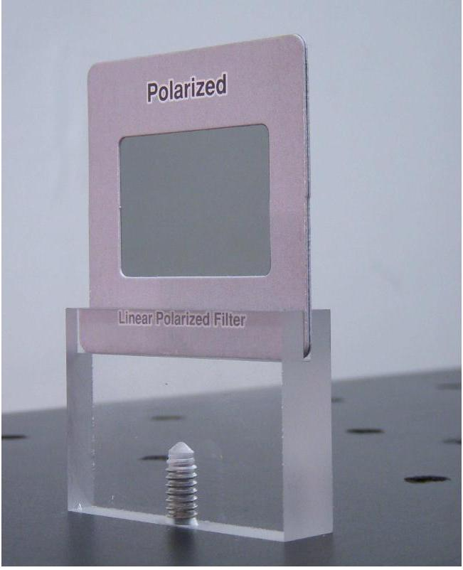
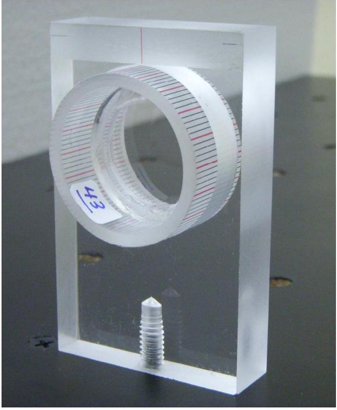
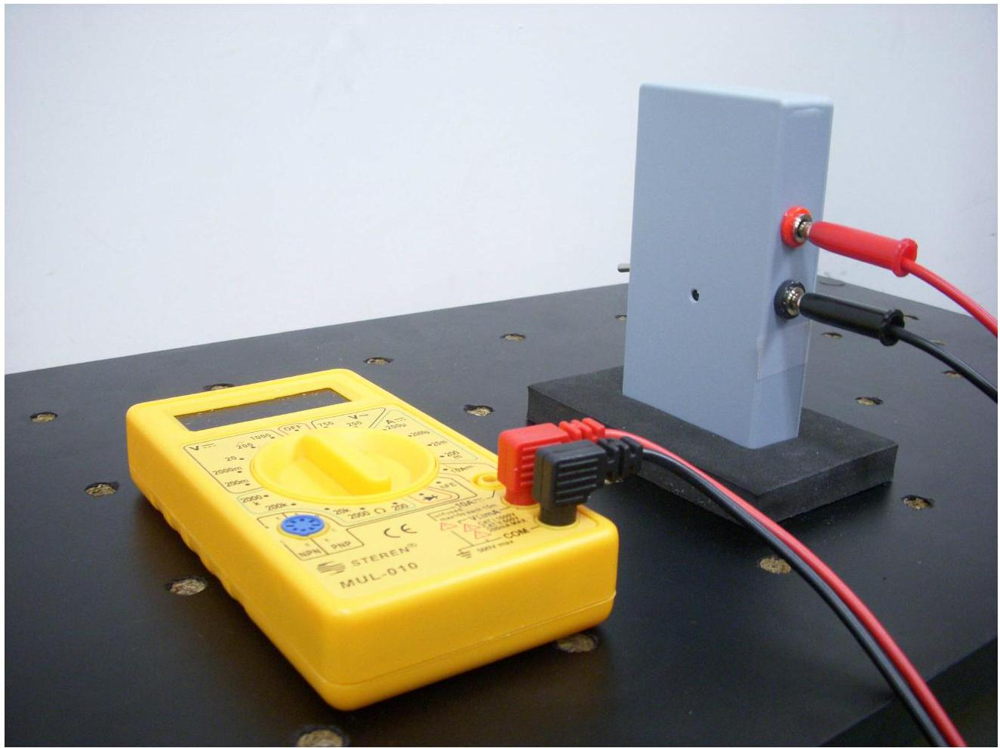
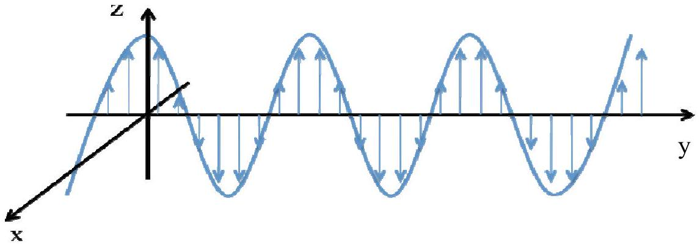
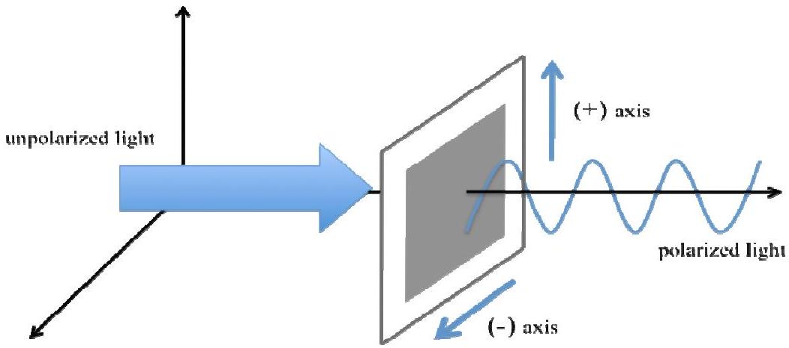
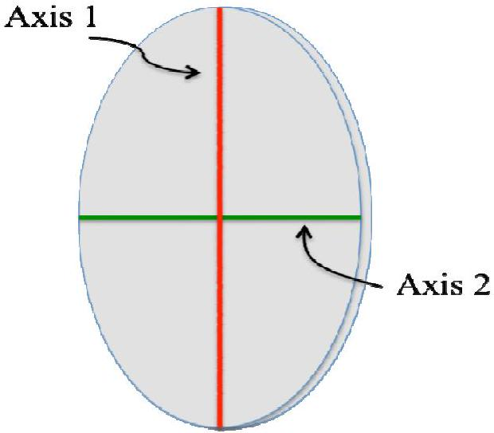
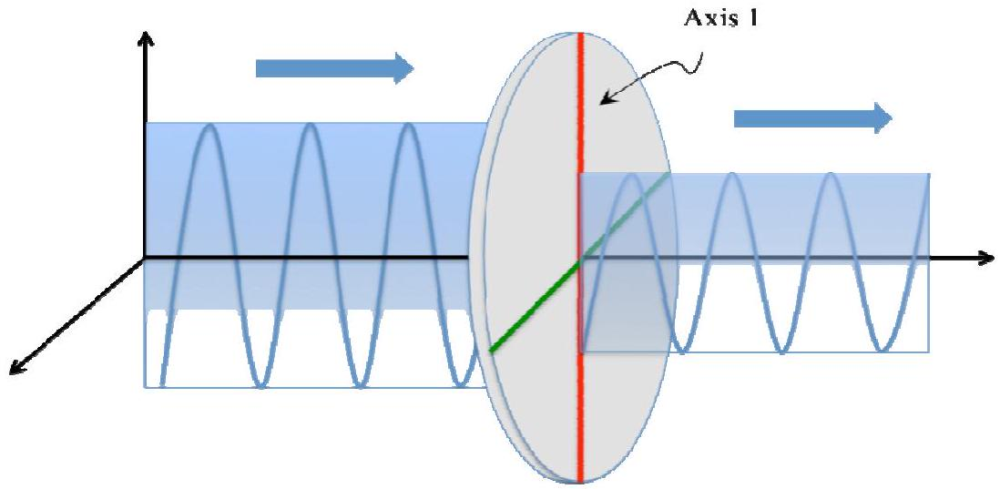
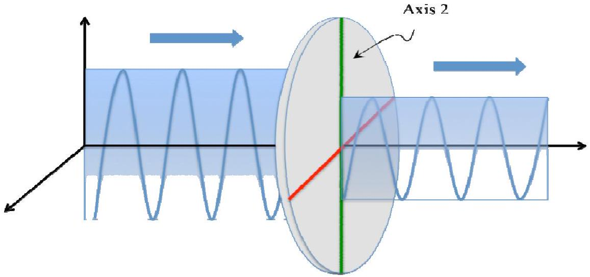
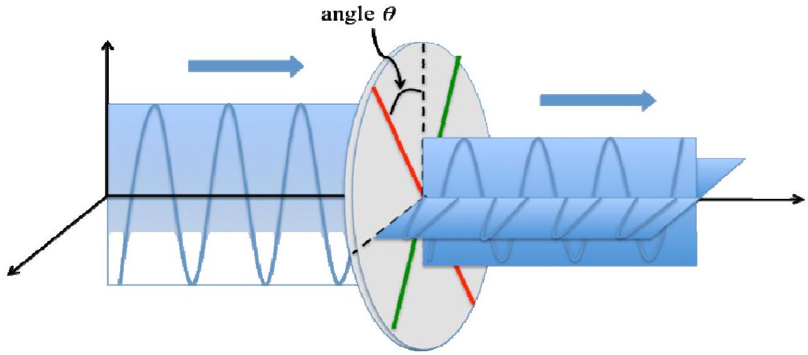

## EXPERIMENTAL PROBLEM 2 BIREFRINGENCE OF MICA

In this experiment you will measure the birefringence of mica (a crystal widely used in polarizing optical components).

## MATERIAL

In addition to items 1), 2) and 3), you should use,

14) Two polarizing films mounted in slide holders, each with an additional acrylic support (LABEL J). See photograph for mounting instructions.
15) A thin mica plate mounted in a plastic cylinder with a scale with no numbers; acrylic support for the cylinder (LABEL K). See photograph for mounting instructions.
16) Photodetector equipment. A photodetector in a plastic box, connectors and foam support. A multimeter to measure the voltage of the photodetector (LABEL L). See photograph for mounting and connecting instructions.
17) Calculator.
18) White index cards, masking tape, stickers, scissors, triangle squares set.
19) Pencils, paper, graph paper.

Polarizer mounted in slide holder with

Thin mica plate mounted in cylinder with a scale with no numbers, and acrylic support (LABEL K).

Figure 2.1 A wave travelling in the y-direction and polarized in the z-direction.

A photodetector in a plastic box, connectors and foam support. A multimeter to measure the voltage of the photodetector (LABEL L). Set the connections as indicated.

## DESCRIPTION OF THE PHENOMENON

Light is a transverse electromagnetic wave, with its electric field lying on a plane perpendicular to the propagation direction and oscillating in time as the light wave travels.

If the direction of the electric field remains in time oscillating along a single line, the wave is said to be linearly polarized, or simply, polarized. See Figure 2.1.

Figure 2.1 A wave travelling in the y-direction and polarized in the z-direction.

A polarizing film (or simply, a polarizer) is a material with a privileged axis parallel to its surface, such that, transmitted light emerges polarized along the axis of the polarizer. Call $(+)$ the privileged axis and (-) the perpendicular one.

Figure 2.2 Unpolarized light normally incident on a polarizer. Transmitted light is polarized in the (+) direction of the polarizer.

Common transparent materials (such as window glass), transmit light with the same polarization as the incident one, because its index of refraction does not depend on the direction and/or polarization of the incident wave. Many crystals, including mica, however, are sensitive to the direction of the electric field of the wave. For propagation perpendicular to its surface, the mica sheet has two characteristic orthogonal axes, which we will call Axis 1 and Axis 2. This leads to the phenomenon called birefringence.

Figure 2.3 Thin slab of mica with its two axes, Axis 1 (red) and Axis 2 (green).

Let us analyze two simple cases to exemplify the birefringence. Assume that a wave polarized in the vertical direction is normally incident on one of the surfaces of the thin slab of mica.

Case 1) Axis 1 or Axis 2 is parallel to the polarization of the incident wave. The trasmitted wave passes without changing its polarization state, but the propagation is characterized as if the material had either an index of refraction $n_{1}$ or $n_{2}$. See Figs. 2.4 and 2.5.

Figure 2.4 Axis 1 is parallel to polarization of incident wave. Index of refraction is $n_{1}$.

Figure 2.5 Axis 2 is parallel to polarization of incident wave. Index of refraction is $n_{2}$.

Case 2) Axis 1 makes an angle $\theta$ with the direction of polarization of the incident wave. The transmitted light has a more complicated polarization state. This wave, however, can be seen as the superposition of two waves with different phases, one that has polarization parallel to the polarization of the incident wave (i.e. "vertical") and another that has polarization perpendicular to the polarization of the incident wave (i.e. "horizontal").

Figure 2.6 Axis 1 makes and angle $\theta$ with polarization of incident wave
Call $I_{P}$ the intensity of the wave transmitted parallel to the polarization of the incident wave, and $I_{O}$ the intensity of the wave transmitted perpendicular to polarization of the incident wave. These intensities depend on the angle $\theta$, on the wavelength $\lambda$ of the light source, on the thickness $L$ of the thin plate, and on the absolute value of the difference of the refractive indices, $\left|n_{1}-n_{2}\right|$. This last quantity is called the birefringence of the material. The measurement of this quantity is the goal of this problem. Together with polarizers, birefringent materials are useful for the control of light polarization states.

We point out here that the photodetector measures the intensity of the light incident on it, independent of its polarization.

The dependence of $I_{P}(\theta)$ and $I_{O}(\theta)$ on the angle $\theta$ is complicated due to other effects not considered, such as the absorption of the incident radiation by the mica. One can obtain, however, approximated but very simple expressions for the normalized intensities $\bar{I}_{P}(\theta)$ and $\bar{I}_{O}(\theta)$, defined as,

$$
\bar{I}_{P}(\theta)=\frac{I_{P}(\theta)}{I_{P}(\theta)+I_{O}(\theta)}
$$

and

$$
\bar{I}_{O}(\theta)=\frac{I_{O}(\theta)}{I_{P}(\theta)+I_{O}(\theta)}
$$

It can be shown that the normalized intensities are (approximately) given by,

$$
\bar{I}_{P}(\theta)=1-\frac{1}{2}(1-\cos \Delta \varphi) \sin ^{2}(2 \theta)
$$

and

$$
\bar{I}_{O}(\theta)=\frac{1}{2}(1-\cos \Delta \varphi) \sin ^{2}(2 \theta)
$$

where $\Delta \psi$ is the difference of phases of the parallel and perpendicular transmitted waves. This quantity is given by,

$$
\Delta \varphi=\frac{2 \pi L}{\lambda}\left|n_{1}-n_{2}\right|
$$

where $L$ is the thickness of the thin plate of mica, $\lambda$ the wavelength of the incident radiation and $\left|n_{1}-n_{2}\right|$ the birefringence.

## EXPERIMENTAL SETUP

Task 2.1 Experimental setup for measuring intensities. Design an experimental setup for measuring the intensities $I_{P}$ and $I_{O}$ of the transmitted wave, as a function of the angle $\theta$ of any of the optical axes, as shown in Fig. 2.6. Do this by writing the LABELS of the different devices on the drawing of the optical table. Use the convention (+) and (-) for the direction of the polarizers. You can make additional simple drawings to help clarify your design.

Task 2.1 a) Setup for $I_{P}$ (0.5 points).
Task 2.1 b) Setup for $I_{O}$ ( $\mathbf{0 . 5}$ points).
Laser beam alignment. Align the laser beam in such a way that it is parallel to the table and is incident on the center of the cylinder holding the mica. You may align by using one the white index cards to follow the path. Small adjustments can be made with the movable mirror.

Photodetector and the multimeter. The photodetector produces a voltage as light impinges on it. Measure this voltage with the multimeter provided. The voltage produced is linearly proportional to the intensity of the light. Thus, report the intensities as the voltage produced by the photodetector. Without any laser beam incident on the photodetector, you can measure the background light intensity of the detector. This should be less than 1 mV. Do not correct for this background when you perform the intensity measurements.

WARNING: The laser beam is partially polarized but it is not known in which direction. Thus, to obtain polarized light with good intensity readings, place a polarizer with either its (+) or (-) axes vertically in such a way that you obtain the maximum transmitted intensity in the absence of any other optical device.

## MEASURING INTENSITIES

Task 2.2 The scale for angle settings. The cylinder holding the mica has a regular graduation for settings of the angles. Write down the value in degrees of the smallest interval (i.e. between two black consecutive lines). (0.25 points).

Finding (approximately) the zero of $\boldsymbol{\theta}$ and/or the location of the mica axes. To facilitate the analysis, it is very important that you find the appropriate zero of the angles. We suggest that, first, you identify the location of one of the mica axes, and call it Axis 1. It is almost sure that this position will not coincide with a graduation line on the cylinder. Thus, consider the nearest graduation line in the mica cylinder as the provisional origin for the angles. Call $\bar{\theta}$ the angles measured from such an origin. Below you will be asked to provide a more accurate location of the zero of $\theta$.

Task 2.3 Measuring $I_{P}$ and $I_{O}$. Measure the intensities $I_{P}$ and $I_{O}$ for as many angles $\bar{\theta}$ as you consider necessary. Report your measurements in Table I. Try to make the measurements for $I_{P}$ and $I_{O}$ for the same setting of the cylinder with the mica, that is, for a fixed angle $\bar{\theta}$. (3.0 points).

Task 2.4 Finding an appropriate zero for $\theta$. The location of Axis 1 defines the zero of the angle $\theta$. As mentioned above, it is mostly sure that the location of Axis 1 does not coincide with a graduation line on the mica cylinder. To find the zero of the angles, you may proceed either graphically or numerically. Recognize that the relationship near a maximum or a minimum may be approximated by a parabola where:

$$
I(\bar{\theta}) \approx a \bar{\theta}^{2}+b \bar{\theta}+c
$$

and the minimum or maximum of the parabola is given by,

$$
\bar{\theta}_{m}=-\frac{b}{2 a} .
$$

Either of the above choices gives rise to a shift $\delta \bar{\theta}$ of all your values of $\bar{\theta}$ given in Table I of Task 2.3, such that they can now be written as angles $\theta$ from the appropriate zero, $\theta=\bar{\theta}+\delta \bar{\theta}$. Write down the value of the shift $\delta \bar{\theta}$ in degrees. (1.0 points).

## DATA ANALYSIS.

Task 2.5 Choosing the appropriate variables. Choose $\bar{I}_{P}(\theta)$ or $\bar{I}_{O}(\theta)$ to make an analysis to find the difference of phases $\Delta \varphi$. Identify the variables that you will use. (0.5 point).

## Task 2.6 Data analysis and the phase difference.

- Use Table II to write down the values of the variables needed for their analysis. Make sure that you use the corrected values for the angles $\theta$. Include uncertainties. Use graph paper to plot your variables. (1.0 points).
- Perform an analysis of the data needed to obtain the phase difference $\Delta \varphi$. Report your results including uncertainties. Write down any equations or formulas used in the analysis. Plot your results. (1.75 points).
- Calculate the value of the phase difference $\Delta \psi$ in radians, including its uncertainty. Find the value of the phase difference in the interval $[0, \pi]$. ( $\mathbf{0 . 5}$ points).

Task 2.7 Calculating the birefringence $\left|n_{1}-n_{2}\right|$. You may note that if you add $2 N \pi$ to the phase difference $\Delta \varphi$, with $N$ any integer, or if you change the sign of the phase, the values of the intensities are unchanged. However, the value of the birefringence $\left|n_{1}-n_{2}\right|$ would change. Thus, to use the value $\Delta \varphi$ found in Task 2.6 to correctly calculate the birefringence, you must consider the following:

$$
\Delta \varphi=\frac{2 \pi L}{\lambda}\left|n_{1}-n_{2}\right| \quad \text { if } \quad L<82 \times 10^{-6} \mathrm{~m}
$$

or

$$
2 \pi-\Delta \varphi=\frac{2 \pi L}{\lambda}\left|n_{1}-n_{2}\right| \quad \text { if } \quad L>82 \times 10^{-6} \mathrm{~m}
$$

where the value $L$ of the thickness of the slab of mica you used is written on the cylinder holding it. This number is given in micrometers ( 1 micrometer $=10^{-6} \mathrm{~m}$ ). Assign $1 \times 10^{-6} \mathrm{~m}$ as the uncertainty for $L$. For the laser wavelength, you may use the value you found in Problem 1 or the average value between $620 \times 10^{-9} \mathrm{~m}$ and $750 \times 10^{-9} \mathrm{~m}$, the reported range for red in the visible spectrum. Write down the values of $L$ and $\lambda$ as well as the birefringence $\left|n_{1}-n_{2}\right|$ with its uncertainty. Include the formulas that you used to calculate the uncertainties. (1.0 points).
