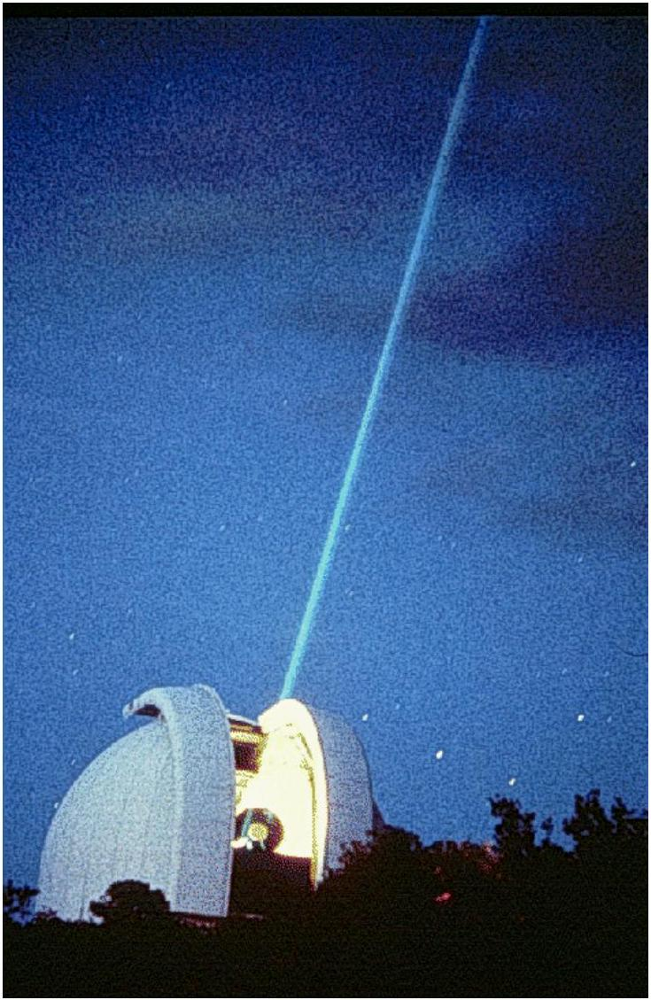
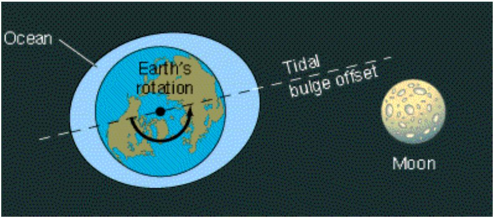
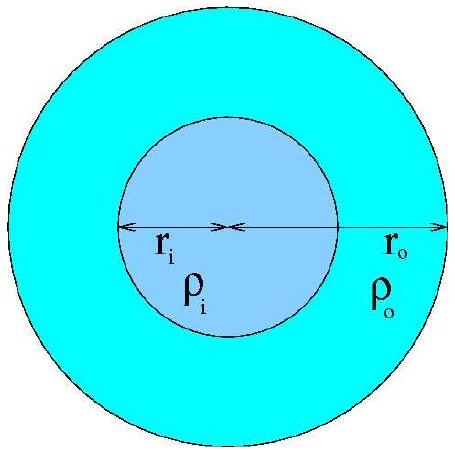
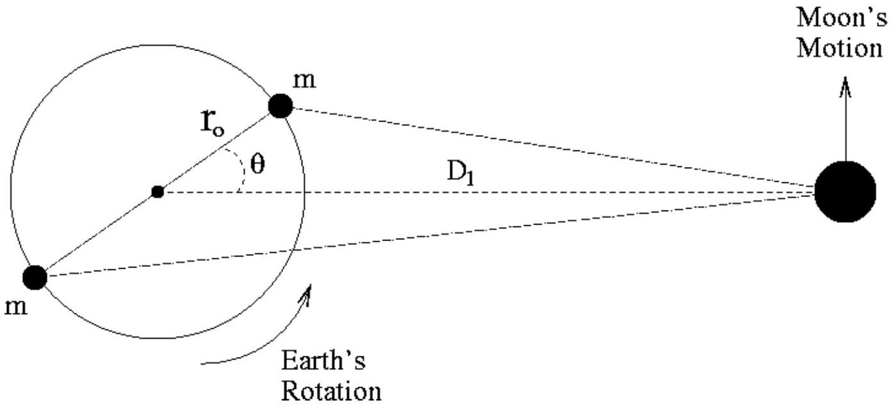

## THEORETICAL PROBLEM No. 1

## EVOLUTION OF THE EARTH-MOON SYSTEM

Scientists can determine the distance Earth-Moon with great precision. They achieve this by bouncing a laser beam on special mirrors deposited on the Moon's surface by astronauts in 1969, and measuring the round travel time of the light (see Figure 1).

Figure 1. A laser beam sent from an observatory is used to measure accurately the distance between the Earth and the Moon.

With these observations, they have directly measured that the Moon is slowly receding from the Earth. That is, the Earth-Moon distance is increasing with time. This is happening because due to tidal torques the Earth is transferring angular momentum to the Moon, see Figure 2. In this problem you will derive the basic parameters of the phenomenon.

Figure 2. The Moon's gravity produces tidal deformations or "bulges" in the Earth. Because of the Earth's rotation, the line that goes through the bulges is not aligned with the line between the Earth and the Moon. This misalignment produces a torque that transfers angular momentum from the Earth's rotation to the Moon's translation. The drawing is not to scale.

## 1. Conservation of Angular Momentum.

Let $L_{1}$ be the present total angular momentum of the Earth-Moon system. Now, make the following assumptions: i) $L_{1}$ is the sum of the rotation of the Earth around its axis and the translation of the Moon in its orbit around the Earth only. ii) The Moon's orbit is circular and the Moon can be taken as a point. iii) The Earth's axis of rotation and the Moon's axis of revolution are parallel. iv) To simplify the calculations, we take the motion to be around the center of the Earth and not the center of mass. Throughout the problem, all moments of inertia, torques and angular momenta are defined around the axis of the Earth. v) Ignore the influence of the Sun.

| 1a | Write down the equation for the present total angular momentum of the Earth-Moon system. Set this equation in terms of $I_{E}$, the moment of inertia of the Earth; $u_{E 1}$, the present angular frequency of the Earth's rotation; $I_{M 1}$, the present moment of inertia of the Moon with respect to the Earth's axis; and $డ_{M 1}$, the present angular frequency of the Moon's orbit. | 0.2 |
| :--- | :--- | :--- |

This process of transfer of angular momentum will end when the period of rotation of the Earth and the period of revolution of the Moon around the Earth have the same duration. At this point the tidal bulges produced by the Moon on the Earth will be aligned with the line between the Moon and the Earth and the torque will disappear.

| 1b | Write down the equation for the final total angular momentum $L_{2}$ of the Earth-Moon system. Make the same assumptions as in Question 1a. Set this equation in terms of $I_{E}$, the moment of inertia of the Earth; $u_{2}$, the final angular frequency of the Earth's rotation and Moon's translation; and $I_{M 2}$, the final moment of inertia of the Moon. | 0.2 |
| :--- | :--- | :--- |

| 1c | Neglecting the contribution of the Earth's rotation to the final total angular momentum, write down the equation that expresses the angular momentum conservation for this problem. | 0.3 |
| :--- | :--- | :--- |

## 2. Final Separation and Final Angular Frequency of the Earth-Moon System.

Assume that the gravitational equation for a circular orbit (of the Moon around the Earth) is always valid. Neglect the contribution of the Earth's rotation to the final total angular momentum.

| 2a | Write down the gravitational equation for the circular orbit of the Moon around the Earth, at the final state, in terms of $M_{E}, u_{2}, G$ and the final separation $D_{2}$ between the Earth and the Moon. $M_{E}$ is the mass of the Earth and $G$ is the gravitational constant. | 0.2 |
| :--- | :--- | :--- |

| 2b | Write down the equation for the final separation $D_{2}$ between the Earth and the Moon in terms of the known parameters, $L_{1}$, the total angular momentum of the system, $M_{E}$ and $M_{M}$, the masses of the Earth and Moon, respectively, and $G$. | 0.5 |
| :--- | :--- | :--- |

| 2c | Write down the equation for the final angular frequency $u_{2}$ of the EarthMoon system in terms of the known parameters $L_{1}, M_{E}, M_{M}$ and $G$. | 0.5 |
| :--- | :--- | :--- |

Below you will be asked to find the numerical values of $D_{2}$ and $c_{2}$. For this you need to know the moment of inertia of the Earth.

| 2d | Write down the equation for the moment of inertia of the Earth $I_{E}$ assuming it is a sphere with inner density $\rho_{i}$ from the center to a radius $r_{i}$, and with outer density $\rho_{o}$ from the radius $r_{i}$ to the surface at a radius $r_{o}$ (see Figure 3). | 0.5 |
| :--- | :--- | :--- |

Figure 3. The Earth as a sphere with two densities, $\rho_{i}$ and $\rho_{o}$.

Determine the numerical values requested in this problem always to two significant digits.

| 2e | Evaluate the moment of inertia of the Earth $I_{E}$, using $\rho_{i}=1.3 \times 0^{4} \mathrm{~kg} \mathrm{~m}^{-3}$, $r_{i}=3.5 \times 0^{6} \mathrm{~m}, \rho_{o}=4.0 \times 0^{3} \mathrm{~kg} \mathrm{~m}^{-3}$, and $r_{o}=6.4 \times 0^{6} \mathrm{~m}$. | 0.2 |
| :--- | :--- | :--- |

The masses of the Earth and Moon are $M_{E}=6.0 \times 10^{24} \mathrm{~kg}$ and $M_{M}=7.3 \times 0^{22} \mathrm{~kg}$, respectively. The present separation between the Earth and the Moon is $D_{1}=3.8 \times 10^{8} \mathrm{~m}$. The present angular frequency of the Earth's rotation is $\omega_{E 1}=7.3 \times 10^{-5} \mathrm{~s}^{-1}$. The present angular frequency of the Moon's translation around the Earth is $\omega_{M 1}=2.7 \times 0^{-6} \mathrm{~s}^{-1}$, and the gravitational constant is $G=6.7 \times 0^{-11} \mathrm{~m}^{3} \mathrm{~kg}^{-1} \mathrm{~s}^{-2}$.

| 2f | Evaluate the numerical value of the total angular momentum of the system, $L_{1}$. | 0.2 |
| :--- | :--- | :--- |

| 2g | Find the final separation $D_{2}$ in meters and in units of the present separation $D_{1}$. | 0.3 |
| :--- | :--- | :--- |

| 2 h | Find the final angular frequency $u_{2}$ in $\mathrm{s}^{-1}$, as well as the final duration of the day in units of present days. | 0.3 |
| :--- | :--- | :--- |

Verify that the assumption of neglecting the contribution of the Earth's rotation to the final total angular momentum is justified by finding the ratio of the final angular momentum of the Earth to that of the Moon. This should be a small quantity.

| 2i | Find the ratio of the final angular momentum of the Earth to that of the Moon. | 0.2 |
| :--- | :--- | :--- |

## 3. How much is the Moon receding per year?

Now, you will find how much the Moon is receding from the Earth each year. For this, you will need to know the equation for the torque acting at present on the Moon. Assume that the tidal bulges can be approximated by two point masses, each of mass $m$, located on the surface of the Earth, see Fig. 4. Let $\theta$ be the angle between the line that goes through the bulges and the line that joins the centers of the Earth and the Moon.

Figure 4. Schematic diagram to estimate the torque produced on the Moon by the bulges on the Earth. The drawing is not to scale.

| 3a | Find $F_{c}$, the magnitude of the force produced on the Moon by the closest point mass. | 0.4 |
| :--- | :--- | :--- |

| 3b | Find $F_{f}$, the magnitude of the force produced on the Moon by the farthest point mass. | 0.4 |
| :--- | :--- | :--- |

You may now evaluate the torques produced by the point masses.

| 3c | Find the magnitude of $\boldsymbol{\tau}_{c}$, the torque produced by the closest point mass. | 0.4 |
| :--- | :--- | :--- |

| 3d | Find the magnitude of $\boldsymbol{\tau}_{f}$, the torque produced by the farthest point mass. | 0.4 |
| :--- | :--- | :--- |

| 3e | Find the magnitude of the total torque $\tau$ produced by the two masses. Since $r_{o} \ll D_{1}$ you should approximate your expression to lowest significant order in $r_{o} / D_{1}$. You may use that $(1+x)^{a} \approx 1+a x$, if $x \ll 1$. | 1.0 |
| :--- | :--- | :--- |

| 3f | Calculate the numerical value of the total torque $\tau$, taking into account that $\theta=3^{\circ}$ and that $m=3.6 \times 10^{16} \mathrm{~kg}$ (note that this mass is of the order of $10^{-8}$ times the mass of the Earth). | 0.5 |
| :--- | :--- | :--- |

Since the torque is the rate of change of angular momentum with time, find the increase in the distance Earth-Moon at present, per year. For this step, express the angular momentum of the Moon in terms of $M_{M}, M_{E}, D_{1}$ and $G$ only.

| 3g | Find the increase in the distance Earth-Moon at present, per year. | 1.0 |
| :--- | :--- | :--- |

Finally, estimate how much the length of the day is increasing each year.

| 3 h | Find the decrease of $u_{E 1}$ per year and how much is the length of the day at present increasing each year. | 1.0 |
| :--- | :--- | :--- |

## 4. Where is the energy going?

In contrast to the angular momentum, that is conserved, the total (rotational plus gravitational) energy of the system is not. We will look into this in this last section.

| 4a | Write down an equation for the total (rotational plus gravitational) energy of the Earth-Moon system at present, $E$. Put this equation in terms of $I_{E}$, $u_{E 1}, M_{M}, M_{E}, D_{1}$ and $G$ only. | 0.4 |
| :--- | :--- | :--- |

| 4b | Write down an equation for the change in $E, \Delta E$, as a function of the changes in $D_{1}$ and in $c_{E 1}$. Evaluate the numerical value of $\Delta E$ for a year, using the values of changes in $D_{1}$ and in $u_{E 1}$ found in questions 3g and 3h. | 0.4 |
| :--- | :--- | :--- |

Verify that this loss of energy is consistent with an estimate for the energy dissipated as heat in the tides produced by the Moon on the Earth. Assume that the tides rise, on the average by 0.5 m , a layer of water $h=0.5 \mathrm{~m}$ deep that covers the surface of the Earth (for simplicity assume that all the surface of the Earth is covered with water). This happens twice a day. Further assume that 10\% of this gravitational energy is dissipated as heat due to viscosity when the water descends. Take the density of water to be $\rho_{\text {water }}=10^{3} \mathrm{~kg} \mathrm{~m}^{-3}$, and the gravitational acceleration on the surface of the Earth to be $g=9.8 \mathrm{~m} \mathrm{~s}^{-2}$.

| 4c | What is the mass of this surface layer of water? | 0.2 |
| :--- | :--- | :--- |
| 4d | Calculate how much energy is dissipated in a year? How does this compare with the energy lost per year by the Earth-Moon system at present? | 0.3 |
