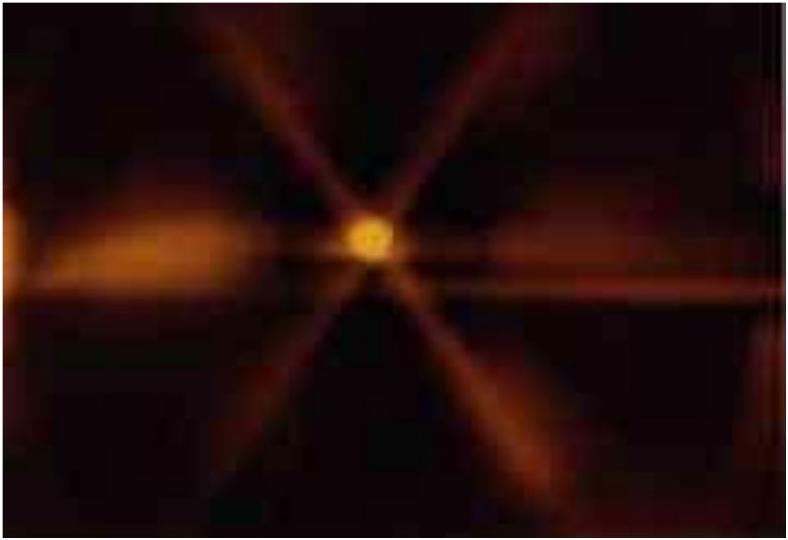
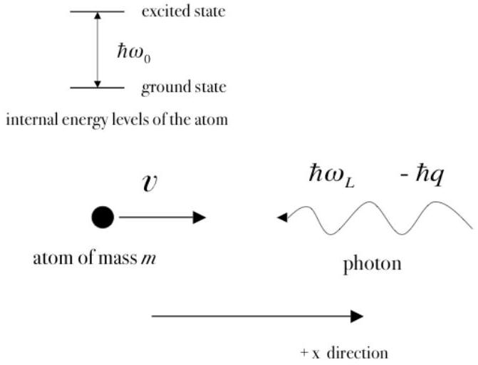
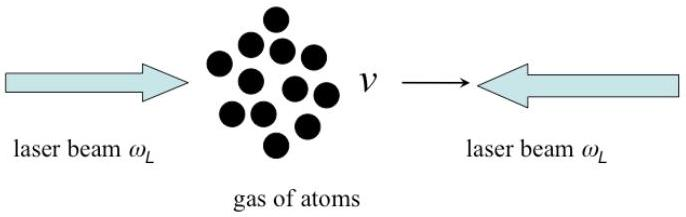

## THEORETICAL PROBLEM 2

## DOPPLER LASER COOLING AND OPTICAL MOLASSES

The purpose of this problem is to develop a simple theory to understand the so-called "laser cooling" and "optical molasses" phenomena. This refers to the cooling of a beam of neutral atoms, typically alkaline, by counterpropagating laser beams with the same frequency. This is part of the Physics Nobel Prize awarded to S. Chu, P. Phillips and C. Cohen-Tannoudji in 1997.

The image above shows sodium atoms (the bright spot in the center) trapped at the intersection of three orthogonal pairs of opposing laser beams. The trapping region is called "optical molasses" because the dissipative optical force resembles the viscous drag on a body moving through molasses.

In this problem you will analyze the basic phenomenon of the interaction between a photon incident on an atom and the basis of the dissipative mechanism in one dimension.

## PART I: BASICS OF LASER COOLING

Consider an atom of mass $m$ moving in the $+x$ direction with velocity $v$. For simplicity, we shall consider the problem to be one-dimensional, namely, we shall ignore the $y$ and $z$ directions (see figure 1). The atom has two internal energy levels. The energy of the lowest state is considered to be zero and the energy of the excited state to be $\hbar u_{0}$, where $\hbar=h / 2 \pi$. The atom is initially in the lowest state. A laser beam with frequency $u_{L}$ in the laboratory is directed in the $-x$ direction and it is incident on the atom. Quantum mechanically the laser is composed of a large number of photons, each with energy $\hbar u_{L}$ and momentum $-\hbar q$. A photon can be absorbed by the atom and later spontaneously emitted; this emission can occur with equal probabilities along the $+x$ and $-x$ directions. Since the atom moves at non-relativistic speeds, $v / c \ll 1$ (with $c$ the speed of light) keep terms up to first order in this quantity only. Consider also $\hbar q / m v \ll 1$, namely, that the momentum of the atom is much larger than the
momentum of a single photon. In writing your answers, keep only corrections linear in either of the above quantities.

Fig. 1 Sketch of an atom of mass $m$ with velocity $v$ in the $+x$ direction, colliding with a photon with energy $\hbar c_{L}$ and momentum $-\hbar q$. The atom has two internal states with energy difference $\hbar \omega_{0}$.

Assume that the laser frequency $\mathrm{u}_{L}$ is tuned such that, as seen by the moving atom, it is in resonance with the internal transition of the atom. Answer the following questions:

## 1. Absorption.

| 1a | Write down the resonance condition for the absorption of the photon. | 0.2 |
| :--- | :--- | :--- |

| 1b | Write down the momentum $p_{a t}$ of the atom after absorption, as seen in the laboratory. | 0.2 |
| :--- | :--- | :--- |

| 1c | Write down the total energy $\varepsilon_{a t}$ of the atom after absorption, as seen in the laboratory. | 0.2 |
| :--- | :--- | :--- |

## 2. Spontaneous emission of a photon in the $-x$ direction.

At some time after the absorption of the incident photon, the atom may emit a photon in the $-x$ direction.

| 2a | Write down the energy of the emitted photon, $\varepsilon_{p h}$, after the emission process in the $-x$ direction, as seen in the laboratory. | 0.2 |
| :--- | :--- | :--- |

| 2b | Write down the momentum of the emitted photon $p_{p h}$, after the emission process in the $-x$ direction, as seen in the laboratory. | 0.2 |
| :--- | :--- | :--- |

| 2c | Write down the momentum of the atom $p_{a t}$, after the emission process in the $-x$ direction, as seen in the laboratory. | 0.2 |
| :--- | :--- | :--- |

| 2d | Write down the total energy of the atom $\varepsilon_{a t}$, after the emission process in the $-x$ direction, as seen in the laboratory. | 0.2 |
| :--- | :--- | :--- |

## 3. Spontaneous emission of a photon in the $\boldsymbol{+} \boldsymbol{x}$ direction.

At some time after the absorption of the incident photon, the atom may instead emit a photon in the $+x$ direction.

| 3a | Write down the energy of the emitted photon, $\varepsilon_{p h}$, after the emission process in the $+x$ direction, as seen in the laboratory. | 0.2 |
| :--- | :--- | :--- |

| 3b | Write down the momentum of the emitted photon $p_{p h}$, after the emission process in the $+x$ direction, as seen in the laboratory. | 0.2 |
| :--- | :--- | :--- |

| 3c | Write down the momentum of the atom $p_{a t}$, after the emission process in the $+x$ direction, as seen in the laboratory. | 0.2 |
| :--- | :--- | :--- |

| 3d | Write down the total energy of the atom $\varepsilon_{a t}$, after the emission process in the $+x$ direction, as seen in the laboratory. | 0.2 |
| :--- | :--- | :--- |

## 4. Average emission after the absorption.

The spontaneous emission of a photon in the $-x$ or in the $+x$ directions occurs with the same probability. Taking this into account, answer the following questions.

| 4a | Write down the average energy of an emitted photon, $\varepsilon_{p h}$, after the emission process. | 0.2 |
| :--- | :--- | :--- |

| 4b | Write down the average momentum of an emitted photon $p_{p h}$, after the emission process. | 0.2 |
| :--- | :--- | :--- |

| 4c | Write down the average total energy of the atom $\varepsilon_{a t}$, after the emission process. | 0.2 |
| :--- | :--- | :--- |

| 4d | Write down the average momentum of the atom $p_{a t}$, after the emission process. | 0.2 |
| :--- | :--- | :--- |

## 5. Energy and momentum transfer.

Assuming a complete one-photon absorption-emission process only, as described above, there is a net average momentum and energy transfer between the laser radiation and the atom.

| 5a | Write down the average energy change $\Delta \varepsilon$ of the atom after a complete one-photon absorption-emission process. | 0.2 |
| :--- | :--- | :--- |

| 5b | Write down the average momentum change $\Delta p$ of the atom after a complete one-photon absorption-emission process. | 0.2 |
| :--- | :--- | :--- |

## 6. Energy and momentum transfer by a laser beam along the $+x$ direction.

Consider now that a laser beam of frequency $\omega_{L}$ is incident on the atom along the $+x$ direction, while the atom moves also in the $+x$ direction with velocity $v$. Assuming a resonance condition between the internal transition of the atom and the laser beam, as seen by the atom, answer the following questions:

| 6a | Write down the average energy change $\Delta \varepsilon$ of the atom after a complete one-photon absorption-emission process. | 0.3 |
| :--- | :--- | :--- |

| 6b | Write down the average momentum change $\Delta p$ of the atom after a complete one-photon absorption-emission process. | 0.3 |
| :--- | :--- | :--- |

## PART II: DISSIPATION AND THE FUNDAMENTALS OF OPTICAL MOLASSES

Nature, however, imposes an inherent uncertainty in quantum processes. Thus, the fact that the atom can spontaneously emit a photon in a finite time after absorption, gives as a result that the resonance condition does not have to be obeyed exactly as in the discussion above. That is, the frequency of the laser beams $u_{L}$ and $\omega_{L}^{\prime}$ may have any value and the absorption-emission process can still occur. These will happen with different (quantum) probabilities and, as one should expect, the maximum probability is found at the exact resonance condition. On the average, the time elapsed between a single process of absorption and emission is called the lifetime of the excited energy level of the atom and it is denoted by $\Gamma^{-1}$.

Consider a collection of $N$ atoms at rest in the laboratory frame of reference, and a
laser beam of frequency $u_{L}$ incident on them. The atoms absorb and emit continuously such that there is, on average, $N_{\text {exc }}$ atoms in the excited state (and therefore, $N-N_{\text {exc }}$ atoms in the ground state). A quantum mechanical calculation yields the following result:

$$
N_{e x c}=N \frac{\Omega_{R}^{2}}{\left(\omega_{0}-\omega_{L}\right)^{2}+\frac{\Gamma^{2}}{4}+2 \Omega_{R}^{2}}
$$

where $u_{0}$ is the resonance frequency of the atomic transition and $\Omega_{R}$ is the so-called Rabi frequency; $\Omega_{R}^{2}$ is proportional to the intensity of the laser beam. As mentioned above, you can see that this number is different from zero even if the resonance frequency $u_{0}$ is different from the frequency of the laser beam $u_{L}$. An alternative way of expressing the previous result is that the number of absorption-emission processes per unit of time is $N_{\text {exc }} \Gamma$.

Consider the physical situation depicted in Figure 2, in which two counter propagating laser beams with the same but arbitrary frequency $\mathrm{u}_{L}$ are incident on a gas of $N$ atoms that move in the $+x$ direction with velocity $v$.

Figure 2. Two counter propagating laser beams with the same but arbitrary frequency $u_{L}$ are incident on a gas of $N$ atoms that move in the $+x$ direction with velocity $v$.

## 7. Force on the atomic beam by the lasers.

| 7a | With the information found so far, find the force that the lasers exert on the atomic beam. You should assume that $m v \gg \hbar q$. | 1.5 |
| :--- | :--- | :--- |

## 8. Low velocity limit.

Assume now that the velocity of the atoms is small enough, such that you can expand the force up to first order in $v$.

| 8a | Find an expression for the force found in Question (7a), in this limit. | 1.5 |
| :--- | :--- | :--- |

Using this result, you can find the conditions for speeding up, slowing down, or no effect at all on the atoms by the laser radiation.

| 8b | Write down the condition to obtain a positive force (speeding up the atoms). | 0.25 |
| :--- | :--- | :--- |

| 8c | Write down the condition to obtain a zero force. | 0.25 |
| :--- | :--- | :--- |

| 8d | Write down the condition to obtain a negative force (slowing down the atoms). | 0.25 |
| :--- | :--- | :--- |

| 8e | Consider now that the atoms are moving with a velocity $-v$ (in the $-x$ direction). Write down the condition to obtain a slowing down force on the atoms. | 0.25 |
| :--- | :--- | :--- |

## 9. Optical molasses.

In the case of a negative force, one obtains a frictional dissipative force. Assume that initially, at $t=0$, the gas of atoms has velocity $v_{0}$.

| 9a | In the limit of low velocities, find the velocity of the atoms after the laser beams have been on for a time $\tau$. | 1.5 |
| :--- | :--- | :--- |

| 9b | Assume now that the gas of atoms is in thermal equilibrium at a temperature $T_{0}$. Find the temperature $T$ after the laser beams have been on for a time $\tau$. | 0.5 |
| :--- | :--- | :--- |

This model does not allow you to go to arbitrarily low temperatures.
