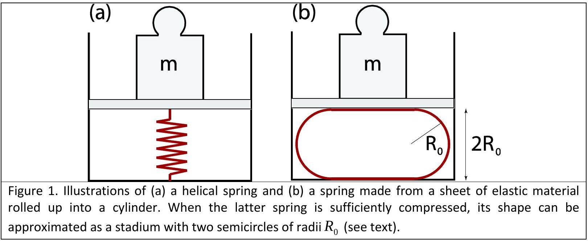
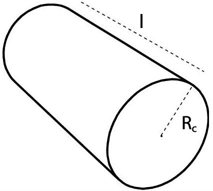
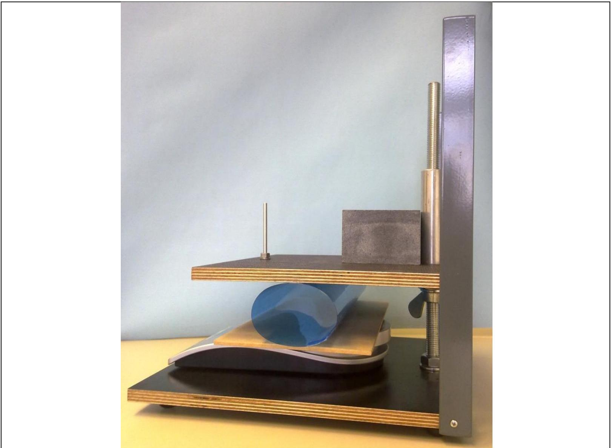

## Experimental problem 1

There are two experimental problems. The setup on your table is used for both problems. You have 5 hours to complete the entire task (1\&2).

## Experimental problem 1: Elasticity of sheets

## Introduction

Springs are objects made from elastic materials which can be used to store mechanical energy. The most famous helical springs are well described in terms of Hooke's law, which states that the force with which the spring pushes back is linearly proportional to the distance from its equilibrium length: $F=-k \Delta x$, where $k$ is the spring constant, $\Delta x$ is the displacement from equilibrium, and $F$ is the force [see Fig. 1(a)]. However, elastic springs can have quite different shapes from the usual helical springs, and for larger deformations Hooke's law does not generally apply. In this problem we measure the properties of a spring made from a sheet of elastic material, which is schematically illustrated in Fig. 1(b).

## Transparent foil rolled into a cylindrical spring

Suppose that we take a sheet of elastic material (e.g. a transparent foil) and bend it. The more we bend it, the more elastic energy is stored in the sheet. The elastic energy depends on the curvature of the sheet. Parts of the sheet with larger curvature store more energy (flat parts of the sheet do not store energy because their curvature is zero). The springs used in this experiment are made from rectangular transparent foils rolled into cylinders (see Fig. 2). The elastic energy stored in a cylinder is

| $E_{e l}=\frac{\kappa}{2} \frac{1}{R_{c}^{2}} A$, | (1) |
| :--- | :--- |

where $A$ denotes the area of the cylinder's side (excluding its bases), $R_{c}$ denotes its radius, and the parameter $\kappa$, referred to as the bending rigidity, is determined by the elastic properties of the material and the thickness of the sheet. Here we neglect the stretching of the sheets.

Figure 2. A schematic picture of an elastic sheet rolled into a cylinder of radius $R_{c}$ and length $l$.

Suppose that such a cylinder is compressed as in Fig. 1(b). For a given force applied by the press $(F)$, the displacement from equilibrium depends on the elasticity of the transparent foil. For some interval of compression forces, the shape of the compressed transparency foil can be approximated with the shape of a stadium, which has a cross section with two straight lines and two semicircles, both of radius $R_{0}$. It can be shown that the energy of the compressed system is minimal when

$$
R_{0}^{2}=\frac{l \kappa \pi}{2 F} .
$$

The force is measured by the scale calibrated to measure mass $m$, so $F=m g, g=9.81 \mathrm{~m} / \mathrm{s}^{2}$.

## Experimental setup (1 ${ }^{\text {st }}$ problem)

The following items (to be used for the $1^{\text {st }}$ problem) are on your desk:

1. Press (together with a stone block); see separate instructions if needed
2. Scale (measures mass up to 5000 g, it has TARA function, see separate instructions if needed)
3. Transparency foils (all foils are 21 cm × 29.7 cm, the blue foil is $200 \mu \mathrm{~m}$ thick, and the colorless foil is $150 \mu \mathrm{~m}$ thick); please, do ask for the extra foils if you need them.
4. Adhesive (scotch) tape
5. Scissors
6. Ruler with a scale
7. A rectangular wooden plate (the plate is to be placed on a scale, and the foil sits on the plate)

The setup is to be used as in Fig. 3. The upper plate of the press can be moved downward and upward using a wing nut, and the force (mass) applied by the press is measured with the scale. Important: The wing nut moves 2 mm when rotated 360 degrees. (Small aluminum rod is not used in Experiment 1.)

Figure 3. The photo of a setup for measuring the bending rigidity.

Tasks

1. Roll the blue foils into cylinders, one along the longer side, and the other along its shorter side; use the adhesive tape to fix them. The overlap of the sheet should be about 0.5 cm.
    (a) Measure the dependence of the mass read by the scale on the separation between the plates of the press for each of the two cylinders. (1.9 points)
    (b) Plot your measurements on appropriate graphs. Using the ruler and eye as the guide, draw lines through the points and determine the bending rigidities $\kappa$ for the cylinders. Mark the region where the approximate relation (the stadium approximation) holds. Estimate the value of $\frac{R_{0}}{R_{c}}$ below which the stadium approximation holds; here $R_{c}$ is the radius of the non-laden cylinder(s). (4.3 points)

The error analysis of the results is not required.

2. Measure the bending rigidity of a single colorless transparent foil. (2.8 points)
3. The bending rigidity $\kappa$ depends on the Young's modulus $Y$ of elasticity of the isotropic material, and the thickness $d$ of the transparent foil according to

$$
\kappa=\frac{Y d^{3}}{12\left(1-v^{2}\right)},
$$

where $v$ is the Poisson ratio for the material; for most materials $v \approx 1 / 3$. From the previous measurements, determine the Young's modulus of the blue and the colorless transparent foil. (1.0 points)
