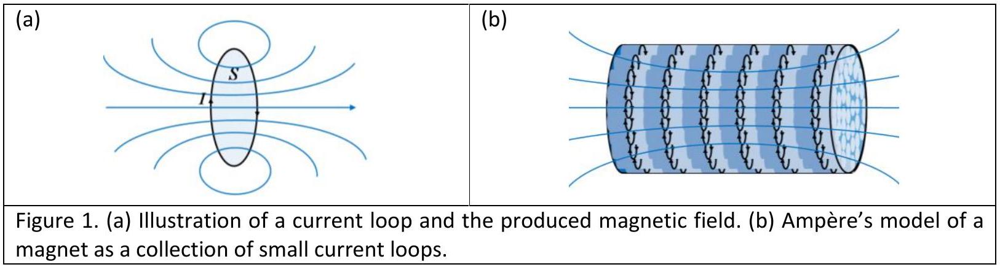
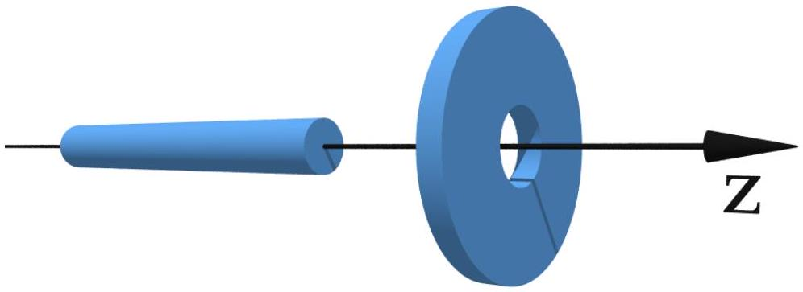
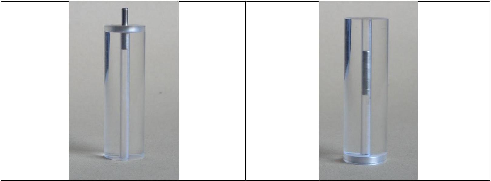
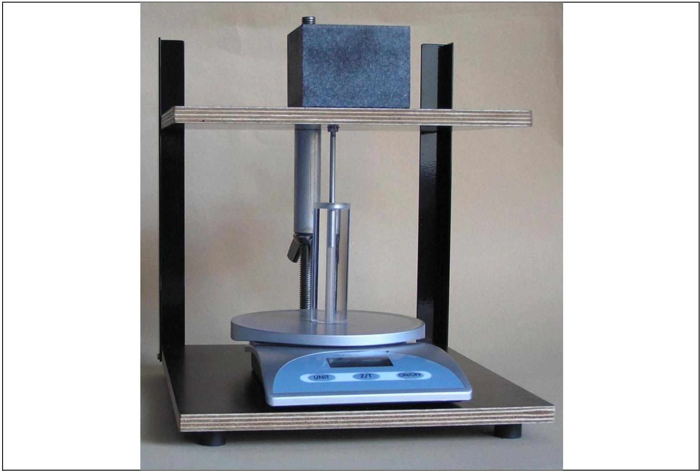

## Experimental problem 2

There are two experimental problems. The setup on your table is used for both problems. You have 5 hours to complete the entire task (1\&2).

## Experimental problem 2: Forces between magnets, concepts of stability and symmetry

## Introduction

Electric current $I$ circulating in a loop of area $S$ creates a magnetic moment of magnitude $m=I S$ [see Fig. 1(a)]. A permanent magnet can be thought of as a collection of small magnetic moments of iron (Fe), each of which is analogous to the magnetic moment of a current loop. This (Ampère's) model of a magnet is illustrated in Fig. 1(b). The total magnetic moment is a sum of all small magnetic moments, and it points from the south to the northern pole.

## Forces between magnets

To calculate the force between two magnets is a nontrivial theoretical task. It is known that like poles of two magnets repel, and unlike poles attract. The force between two current loops depends on the strengths of the currents in them, their shape, and their mutual distance. If we reverse the current in one of the loops, the force between them will be of the same magnitude, but of the opposite direction.

In this problem you experimentally investigate the forces between two magnets, the ring-magnet and the rod-magnet. We are interested in the geometry where the axes of symmetry of the two magnets coincide (see Fig. 2). The rod-magnet can move along the $Z$ - axis from the left, through the ring-magnet, and then towards the right (see Fig. 2). Among other tasks, you will be asked to measure the force between the magnets as a function of $Z$. The origin $z=0$ corresponds to the case when the centers of the magnets coincide.

Figure 2. The rod- and the ring-magnet are aligned. The force between them changes as the rodmagnet moves along the $Z$ - axis.

To ensure motion of the rod-magnet along the axis of symmetry ( $Z$ - axis), the ring-magnet is firmly embedded in a transparent cylinder, which has a narrow hole drilled along the $Z$ - axis. The rodmagnet is thus constrained to move along the $Z$ - axis through the hole (see Fig. 3). The magnetization of the magnets is along the $Z$ - axis. The hole ensures radial stability of the magnets.

Figure 3. Photo of two magnets and a transparent hollow cylinder; the rod-magnet moves through the cylinder's hole.

## Experimental setup ( $\mathbf{2}^{\text {nd }}$ problem)

The following items (to be used for the $2^{\text {nd }}$ problem) are on your desk:

1. Press (together with a stone block); see separate instructions if needed
2. Scale (measures mass up to 5000 g, it has TARA function, see separate instructions if needed)
3. A transparent hollow cylinder with a ring-magnet embedded in its side.
4. One rod-magnet.
5. One narrow wooden stick (can be used to push the rod magnet out of the cylinder).

The setup is to be used as in Fig. 4 to measure the forces between the magnets. The upper plate of the press needs to be turned up-side-down in comparison to the first experimental problem. The narrow Aluminum rod is used to press the rod-magnet through the hollow cylinder. The scale measures the force (mass). The upper plate of the press can be moved downwards and upwards by using a wing nut. Important: The wing nut moves 2 mm when rotated 360 degrees.

Figure 4. Photograph of the setup, and the way it should be used for measuring the force between the magnets.

## Tasks

1. Determine qualitatively all equilibrium positions between the two magnets, assuming that the $Z$ - axis is positioned horizontally as in Fig. 2 , and draw them in the answer sheet. Label the equilibrium positions as stable (S)/unstable (U), and denote the like poles by shading, as indicated for one stable position in the answer sheet. You can do this Task by using your hands and a wooden stick. (2.5 points)
2. By using the experimental setup measure the force between the two magnets as a function of the $Z$ - coordinate. Let the positive direction of the $Z$ - axis point into the transparent cylinder (the force is positive if it points in the positive direction). For the configuration when the magnetic moments are parallel, denote the magnetic force by $F_{\uparrow \uparrow}(z)$, and when they are anti-parallel, denote the magnetic force by $F_{\uparrow \downarrow}(Z)$. Important: Neglect the mass of the rod-magnet (i.e., neglect gravity), and utilize the symmetries of the forces between magnets to measure different parts of the curves. If you find any symmetry in the forces, write them in the answer sheets. Write the measurements on the answer sheets; beside every table schematically draw the configuration of magnets corresponding to each table (an example is given). (3.0 points)
3. By using the measurements from Task 2, use the millimeter paper to plot in detail the functional dependence $F_{\uparrow \uparrow}(z)$ for $z>0$. Plot schematically the shapes of the curves $F_{\uparrow \uparrow}(Z)$ and $F_{\uparrow \downarrow}(Z)$ (along the positive and the negative $Z$ - axis). On each schematic graph

denote the positions of the stable equilibrium points, and sketch the corresponding configuration of magnets (as in Task 1). (4.0 points)
4. If we do not neglect the mass of the rod magnet, are there any qualitatively new stable equilibrium positions created when the $Z$ - axis is positioned vertically? If so, plot them on the answer sheet as in Task 1. (0.5 points)
