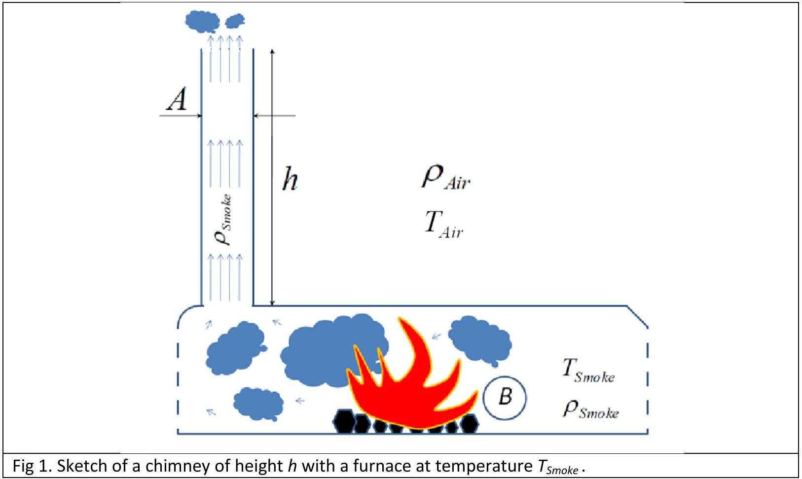
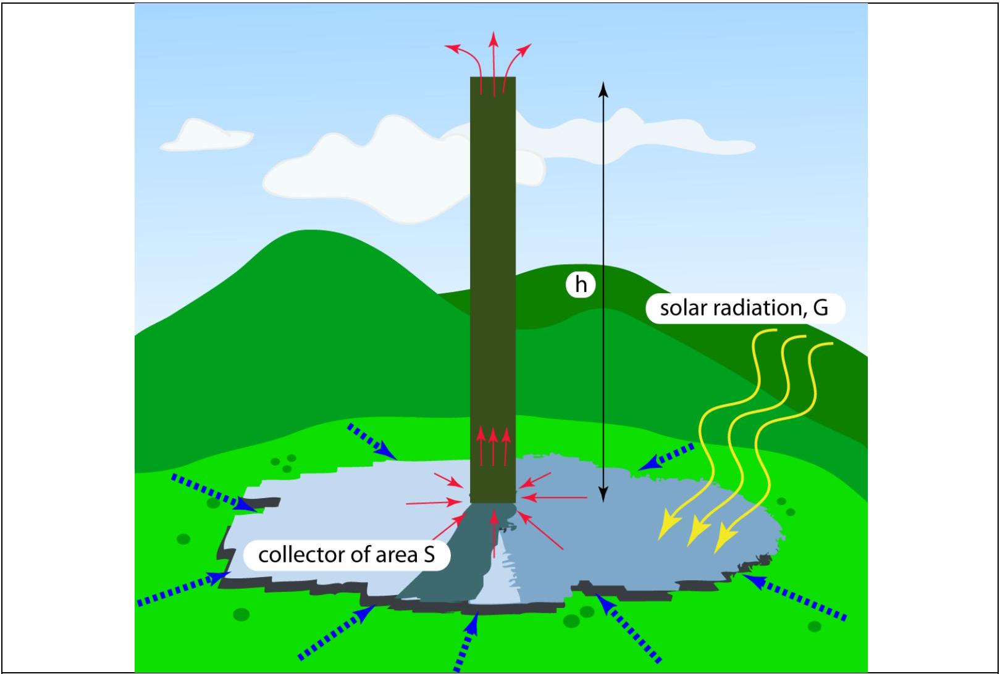

## 2. Chimney physics

Introduction
Gaseous products of burning are released into the atmosphere of temperature $T_{\text {Air }}$ through a high chimney of cross-section $A$ and height $h$ (see Fig. 1). The solid matter is burned in the furnace which is at temperature $T_{\text {smoke }}$. The volume of gases produced per unit time in the furnace is $B$.

Assume that:

- the velocity of the gases in the furnace is negligibly small
- the density of the gases (smoke) does not differ from that of the air at the same temperature and pressure; while in furnace, the gases can be treated as ideal
- the pressure of the air changes with height in accordance with the hydrostatic law; the change of the density of the air with height is negligible
- the flow of gases fulfills the Bernoulli equation which states that the following quantity is conserved in all points of the flow:
$\frac{1}{2} \rho v^{2}(z)+\rho g z+p(z)=$ const,
where $\rho$ is the density of the gas, $v(z)$ is its velocity, $p(z)$ is pressure, and $z$ is the height
- the change of the density of the gas is negligible throughout the chimney

Task 1

a) What is the minimal height of the chimney needed in order that the chimney functions efficiently, so that it can release all of the produced gas into the atmosphere? Express your

result in terms of $B, A, T_{\text {Air }}, g=9.81 \mathrm{~m} / \mathrm{s}^{2}, \Delta T=T_{\text {Smoke }}-T_{\text {Air }}$. Important: in all subsequent tasks assume that this minimal height is the height of the chimney. (3.5 points)
b) Assume that two chimneys are built to serve exactly the same purpose. Their cross sections are identical, but are designed to work in different parts of the world: one in cold regions, designed to work at an average atmospheric temperature of -30 °C and the other in warm regions, designed to work at an average atmospheric temperature of 30 °C. The temperature of the furnace is 400 °C. It was calculated that the height of the chimney designed to work in cold regions is 100 m. How high is the other chimney? (0.5 points)
c) How does the velocity of the gases vary along the height of the chimney? Make a sketch/diagram assuming that the chimney cross-section does not change along the height. Indicate the point where the gases enter the chimney. (0.6 points)
d) How does the pressure of the gases vary along the height of the chimney? (0.5 points)

## Solar power plant

The flow of gases in a chimney can be used to construct a particular kind of solar power plant (solar chimney). The idea is illustrated in Fig. 2. The Sun heats the air underneath the collector of area $S$ with an open periphery to allow the undisturbed inflow of air (see Fig. 2). As the heated air rises through the chimney (thin solid arrows), new cold air enters the collector from its surrounding (thick dotted arrows) enabling a continuous flow of air through the power plant. The flow of air through the chimney powers a turbine, resulting in the production of electrical energy. The energy of solar radiation per unit time per unit of horizontal area of the collector is $G$. Assume that all that energy can be used to heat the air in the collector (the mass heat capacity of the air is $c$, and one can neglect its dependence on the air temperature). We define the efficiency of the solar chimney as the ratio of the kinetic energy of the gas flow and the solar energy absorbed in heating of the air prior to its entry into the chimney.

Fig 2. Sketch of a solar power plant.

Task 2

a) What is the efficiency of the solar chimney power plant? (2.0 points)
b) Make a diagram showing how the efficiency of the chimney changes with its height. (0.4 points)

## Manzanares prototype

The prototype chimney built in Manzanares, Spain, had a height of 195 m, and a radius 5 m. The collector is circular with diameter of 244 m. The specific heat of the air under typical operational conditions of the prototype solar chimney is $1012 \mathrm{~J} / \mathrm{kg} \mathrm{K}$, the density of the hot air is about $0.9 \mathrm{~kg} / \mathrm{m}^{3}$, and the typical temperature of the atmosphere $T_{\text {Air }}=295 \mathrm{~K}$. In Manzanares, the solar power per unit of horizontal surface is typically $150 \mathrm{~W} / \mathrm{m}^{2}$ during a sunny day.

Task 3

a) What is the efficiency of the prototype power plant? Write down the numerical estimate. (0.3 points)
b) How much power could be produced in the prototype power plant? (0.4 points)
c) How much energy could the power plant produce during a typical sunny day? (0.3 points)

Task 4

a) How large is the rise in the air temperature as it enters the chimney (warm air) from the surrounding (cold air)? Write the general formula and evaluate it for the prototype chimney. (1.0 points)
b) What is the mass flow rate of air through the system? (0.5 points)
