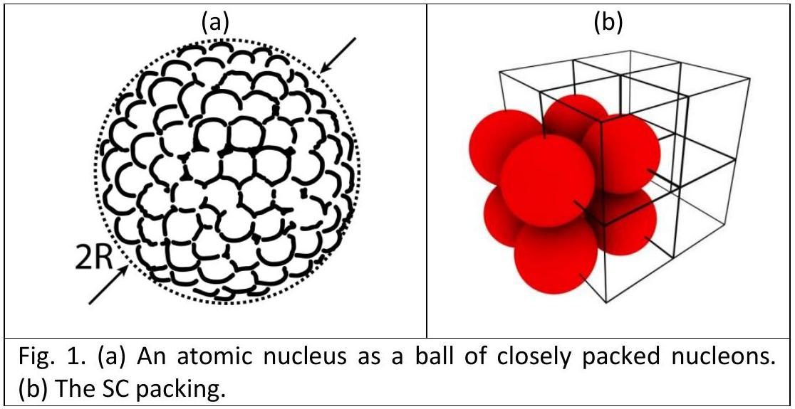
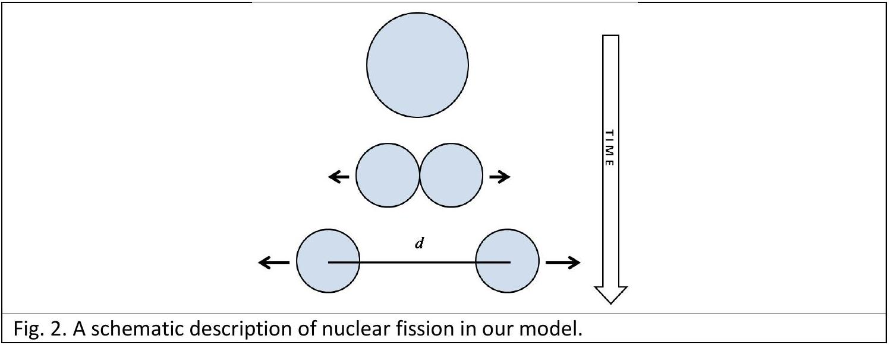
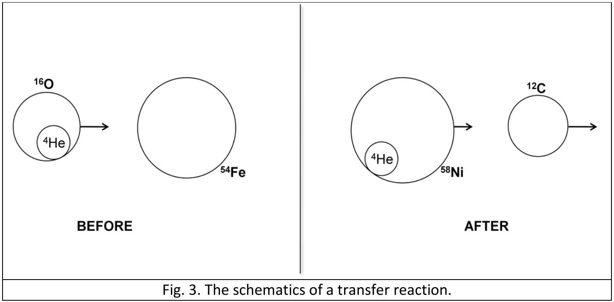

## 3. Simple model of an atomic nucleus

## Introduction

Although atomic nuclei are quantum objects, a number of phenomenological laws for their basic properties (like radius or binding energy) can be deduced from simple assumptions: (i) nuclei are built from nucleons (i.e. protons and neutrons); (ii) strong nuclear interaction holding these nucleons together has a very short range (it acts only between neighboring nucleons); (iii) the number of protons ( $Z$ ) in a given nucleus is approximately equal to the number of neutrons ( $N$ ), i.e. $Z \approx N \approx A / 2$, where $A$ is the total number of nucleons ( $A \gg 1$ ). Important: Use these assumptions in Tasks 1-4 below.

## Task 1 - Atomic nucleus as closely packed system of nucleons

In a simple model, an atomic nucleus can be thought of as a ball consisting of closely packed nucleons [see Fig. 1(a)], where the nucleons are hard balls of radius $r_{N}=0.85 \mathrm{fm}\left(1 \mathrm{fm}=10^{-15} \mathrm{~m}\right)$. The nuclear force is present only for two nucleons in contact. The volume of the nucleus $V$ is larger than the volume of all nucleons $A V_{N}$, where $V_{N}=\frac{4}{3} r_{N}^{3} \pi$. The ratio $f=A V_{N} / V$ is called the packing factor and gives the percentage of space filled by the nuclear matter.

a) Calculate what would be the packing factor $f$ if nucleons were arranged in a "simple cubic" (SC) crystal system, where each nucleon is centered on a lattice point of an infinite cubic lattice [see Fig. 1(b)]. (0.3 points)

Important: In all subsequent tasks, assume that the actual packing factor for nuclei is equal to the one from Task 1a. If you are not able to calculate it, in subsequent tasks use $f=1 / 2$.

b) Estimate the average mass density $\rho_{m}$, charge density $\rho_{c}$, and the radius $R$ for a nucleus having $A$ nucleons. The average mass of a nucleon is $1.67 \cdot 10^{-27} \mathrm{~kg}$. ( 1.0 points)

## Task 2 - Binding energy of atomic nuclei - volume and surface terms

Binding energy of a nucleus is the energy required to disassemble it into separate nucleons and it essentially comes from the attractive nuclear force of each nucleon with its neighbors. If a given nucleon is not on the surface of the nucleus, it contributes to the total binding energy with $a_{V}=15.8$ $\mathrm{MeV}\left(1 \mathrm{MeV}=1.602 \cdot 10^{-13} \mathrm{~J}\right)$. The contribution of one surface nucleon to the binding energy is approximately $a_{V} / 2$. Express the binding energy $E_{b}$ of a nucleus with $A$ nucleons in terms of $A, a_{V}$, and $f$, and by including the surface correction. (1.9 points)

## Task 3 - Electrostatic (Coulomb) effects on the binding energy

The electrostatic energy of a homogeneously charged ball (with radius $R$ and total charge $Q_{0}$ ) is $U_{c}=\frac{3 Q_{0}^{2}}{20 \pi \varepsilon_{0} R}$, where $\varepsilon_{0}=8.85 \cdot 10^{-12} \mathrm{C}^{2} N^{-1} m^{-2}$.

a) Apply this formula to get the electrostatic energy of a nucleus. In a nucleus, each proton is not acting upon itself (by Coulomb force), but only upon the rest of the protons. One can take this into account by replacing $Z^{2} \rightarrow Z(Z-1)$ in the obtained formula. Use this correction in subsequent tasks. (0.4 points)
b) Write down the complete formula for binding energy, including the main (volume) term, the surface correction term and the obtained electrostatic correction. (0.3 points)

## Task 4 - Fission of heavy nuclei

Fission is a nuclear process in which a nucleus splits into smaller parts (lighter nuclei). Suppose that a nucleus with $A$ nucleons splits into only two equal parts as depicted in Fig. 2.

a) Calculate the total kinetic energy of the fission products $E_{\text {kin }}$ when the centers of two lighter nuclei are separated by the distance $d \geq 2 R(A / 2)$, where $R(A / 2)$ is their radius. The large nucleus was initially at rest. (1.3 points)
b) Assume that $d=2 R(A / 2)$ and evaluate the expression for $E_{\text {kin }}$ obtained in part a) for $A=$ 100, 150, 200 and 250 (express the results in units of MeV). Estimate the values of $A$ for which fission is possible in the model described above? (1.0 points)

## Task 5 - Transfer reactions

a) In modern physics, the energetics of nuclei and their reactions is described in terms of masses. For example, if a nucleus (with zero velocity) is in an excited state with energy $E_{\text {exc }}$ above the ground state, its mass is $m=m_{0}+E_{\text {exc }} / c^{2}$, where $m_{0}$ is its mass in the ground state at rest. The nuclear reaction ${ }^{16} \mathrm{O}+{ }^{54} \mathrm{Fe} \rightarrow{ }^{12} \mathrm{C}+{ }^{58} \mathrm{Ni}$ is an example of the so-called "transfer reactions", in which a part of one nucleus ("cluster") is transferred to the other (see Fig. 3). In our example the transferred part is a ${ }^{4} \mathrm{He}$-cluster ( $\alpha$-particle). The transfer reactions occur with maximum probability if the velocity of the projectile-like reaction product (in our case: ${ }^{12} \mathrm{C}$ ) is equal both in magnitude and direction to the velocity of projectile (in our case: ${ }^{16} \mathrm{O}$ ). The target ${ }^{54} \mathrm{Fe}$ is initially at rest. In the reaction, ${ }^{58} \mathrm{Ni}$ is excited into one of its higher-lying states. Find the excitation energy of that state (and express it units of MeV) if the kinetic energy of the projectile ${ }^{16} \mathrm{O}$ is 50 MeV . The speed of light is $\mathrm{c}=3 \cdot 10^{8} \mathrm{~m} / \mathrm{s}$. (2.2 points)

| 1. | $\mathrm{M}\left({ }^{16} \mathrm{O}\right)$ | 15.99491 a.m.u. |
| :--- | :--- | :--- |
| 2. | $\mathrm{M}\left({ }^{54} \mathrm{Fe}\right)$ | 53.93962 a.m.u. |
| 3. | $\mathrm{M}\left({ }^{12} \mathrm{C}\right)$ | 12.00000 a.m.u. |
| 4. | $\mathrm{M}\left({ }^{58} \mathrm{Ni}\right)$ | 57.93535 a.m.u. |
| Table 1. The rest masses of the reactants in their ground states. 1 a.m.u. $=1.6605 \cdot 10^{-27} \mathrm{~kg}$. |  |  |

b) The ${ }^{58} \mathrm{Ni}$ nucleus produced in the excited state discussed in the part a), deexcites into its ground state by emitting a gamma-photon in the direction of its motion. Consider this decay in the frame of reference in which ${ }^{58} \mathrm{Ni}$ is at rest to find the recoil energy of ${ }^{58} \mathrm{Ni}$ (i.e. kinetic energy which ${ }^{58} \mathrm{Ni}$ acquires after the emission of the photon). What is the photon energy in that system? What is the photon energy in the lab system of reference (i.e. what would be the energy of the photon measured in the detector which is positioned in the direction in which the ${ }^{58} \mathrm{Ni}$ nucleus moves)? (1.6 points)

