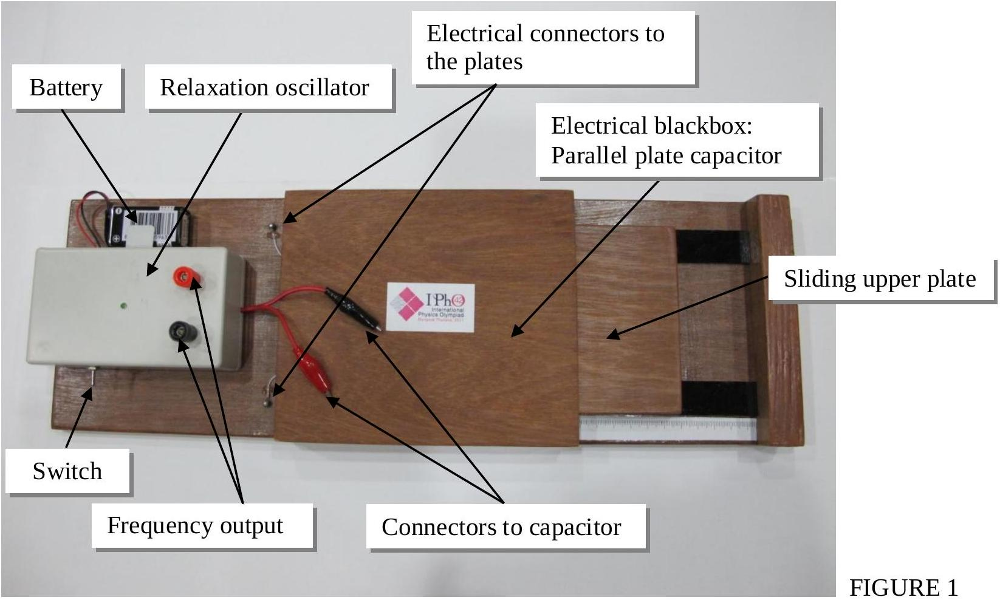
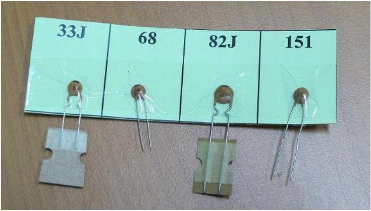
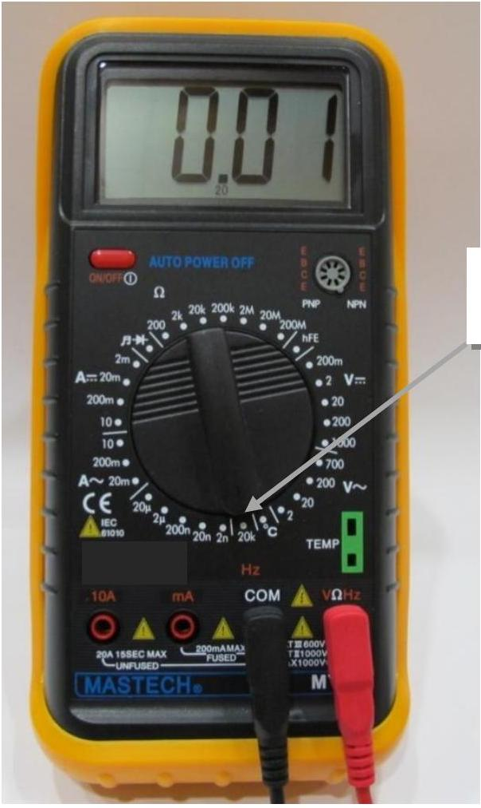
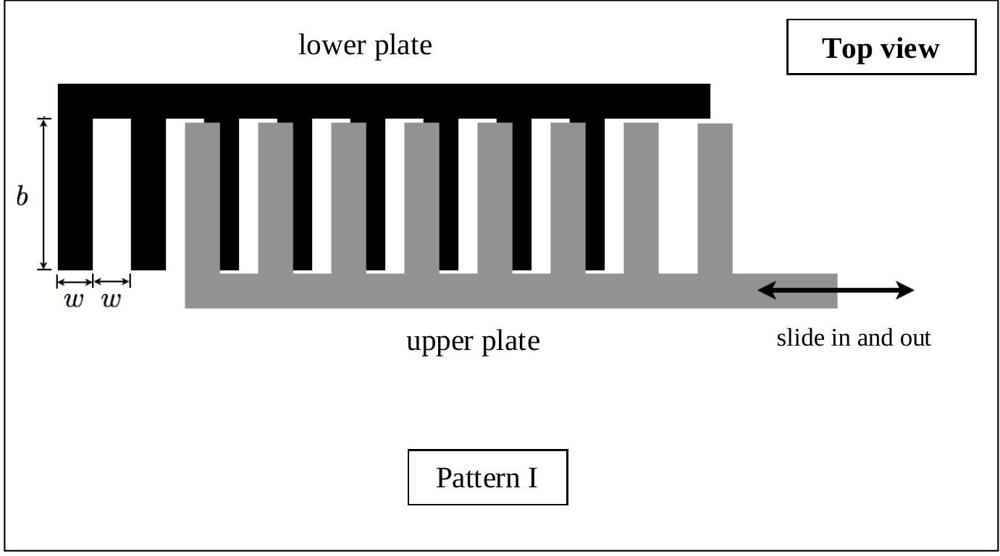
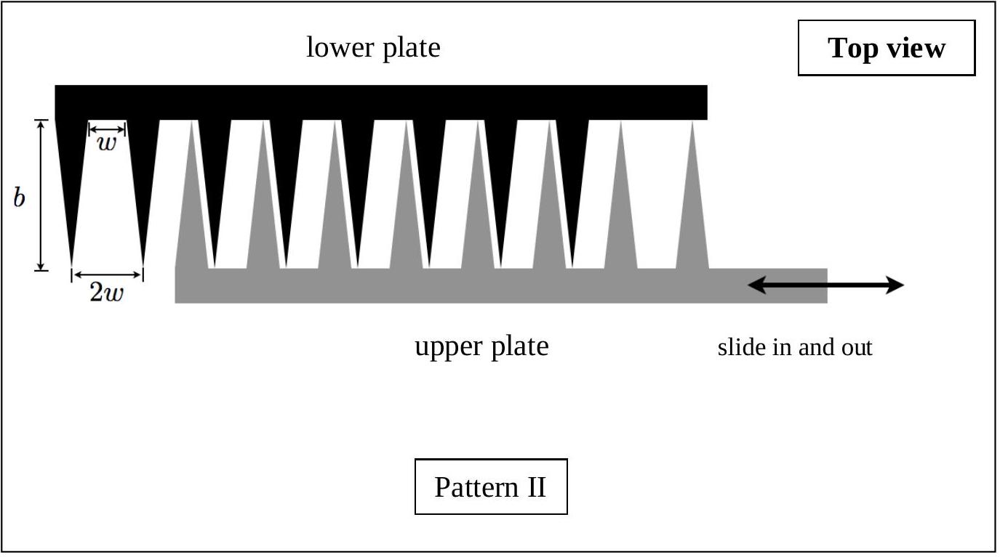
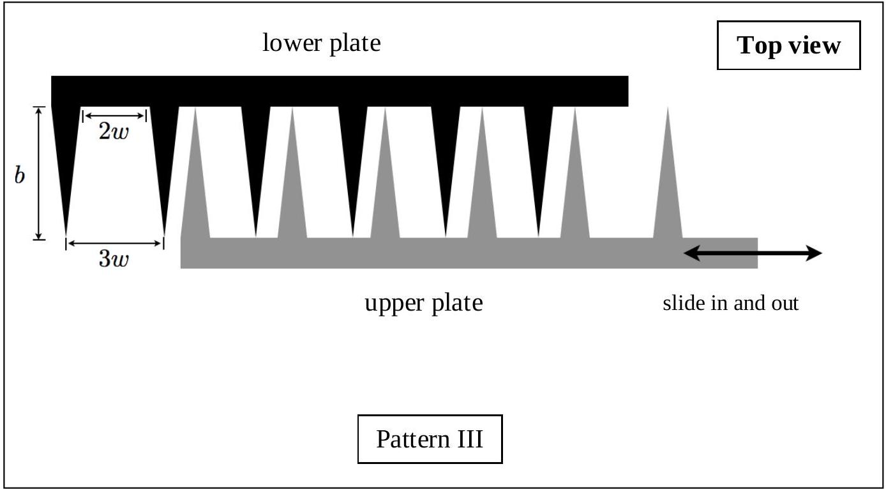

## 1. Electrical Blackbox: Capacitive Displacement Sensor

For a capacitor of capacitance $C$ which is a component of a relaxation oscillator whose frequency of oscillation is $f$, the relationship between $f$ and $C$ is as follows:

$$
f=\frac{\alpha}{C+C_{S}}
$$

where $\alpha$ is a constant and $C_{S}$ is the stray capacitance of our circuits. The frequency $f$ can be monitored using a digital frequency meter.

The electrical blackbox given in this experiment is a parallel plate capacitor. Each plate consists of a number of small teeth of the same geometrical shape. The value of $C$ can be varied by displacing the upper plate relative to the lower plate, horizontally. Between the two plates there is a sheet of dielectric material.

Equipment: a relaxation oscillator, a digital multimeter for measuring frequency of the relaxation oscillator, a set of capacitors of known capacitances, an electrical blackbox and a battery.

Caution: Check the voltage of the battery and ask for a new one if the voltage is less than 9 V. Do not forget to switch on.

FIGURE 2 Capacitors

FIGURE 3 Digital multimeter for measuring frequency

TABLE 1 Nominal Capacitance values
| Code | Capacitance value (pF) |
| :--- | :--- |
| 33J | $34 \pm 1$ |
| 68 | $68 \pm 1$ |
| 82J | 84 ± 1 |
| 151 | $150 \pm 1$ |

Part 1. Calibration
Perform the measurement of $f$ using the given capacitors of known capacitances. Draw appropriate graph to find the value of $\alpha$ and $C_{S}$. Error analysis is not required. [3.0 points]

Part 2. Determination of geometrical shape of a parallel plate capacitor [6.0 points] Given the three possible geometrical shapes as Pattern I, Pattern II and Pattern III as follows:

For each pattern, draw qualitatively an expected graph of $C$ versus the positions of the upper plate but label the x-axis. Then, perform the measurement of $f$ versus the positions of the upper plate. Plot graphs and, from these graphs, deduce the pattern of the parallel plate capacitor and its dimensions (values of $b$ and $w$ ). The separation $d$ between the upper and lower plates is 0.20 mm. The dielectric sheet between the plates has a dielectric constant $K=1.5$. The permittivity of free space $\varepsilon_{0}=8.85 \times 10^{-12} \mathrm{Fm}^{-1}$. Error analysis is not required.

Part 3. Resolution of digital calipers [1.0 point]

As the relative position of the parallel plates is varied, the capacitance changes with a pattern. This set-up may be used as digital calipers for measuring length. If the parallel plate capacitor in this experiment is to be used as digital calipers, estimate from the experimental data in Part 2 its resolution: the smallest distance that can be measured for the frequency value $f \approx 5 \mathrm{kHz}$. An error estimate for the final answer is not required.
