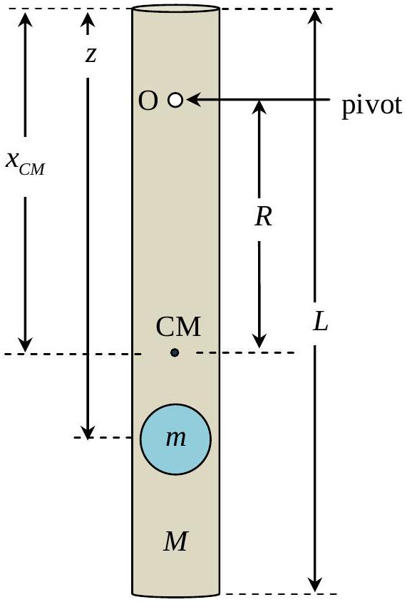
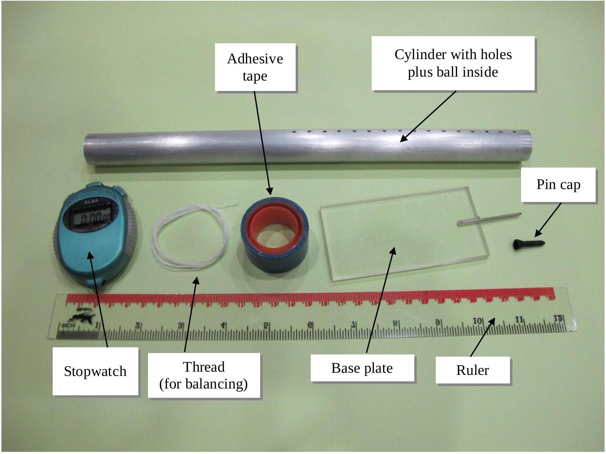

## 2. Mechanical Blackbox: a cylinder with a ball inside

A small massive particle (ball) of mass $m$ is fixed at distance $z$ below the top of a long hollow cylinder of mass $M$. A series of holes are drilled perpendicularly to the central axis of the cylinder. These holes are for pivoting so that the cylinder will hang in a vertical plane.

Students are required to perform necessary nondestructive measurements to determine the numerical values of the following with their error estimates:

i. position of centre of mass of cylinder with ball inside.
Also provide a schematic drawing of the experimental set-up for measuring the centre of mass.
[1.0 points]
ii. distance $z$
[3.5 points]
iii. ratio $\frac{M}{m}$.
[3.5 points]
iv. the acceleration due to gravity, $g$.

[2.0 points]

Equipment: a cylinder with holes plus a ball inside, a base plate with a thin pin, a pin cap, a ruler, a stopwatch, thread, a pencil and adhesive tape.

$x_{C M}$ is the distance from the top of the cylinder to the centre of mass.
$R$ is the distance from the pivoting point to the centre of mass.

Caution: The thin pin is sharp. When it is not in use, it should be protected with a pin cap for safety.

Useful information:

1. For such a physical pendulum, $\quad M+m R^{2}+I_{C M} \frac{d^{2} \theta}{d t^{2}} \approx-g M+m R \theta$, where $I_{C M}$ is the moment of inertia of the cylinder with a ball about the centre of mass and $\theta$ is the angular displacement.
2. For a long hollow cylinder of length $L$ and mass $M$, the moment of inertia about the centre of mass with the rotational axis perpendicular to the cylinder can be approximated by $\frac{1}{3} M\left(\frac{L}{2}\right)^{2}$.
3. The parallel axis theorem: $I=I_{\text {centre of mass }}+\mathfrak{M} x^{2}$, where $x$ is the distance from the rotation point to the centre of mass, and $\mathfrak{M}$ is the total mass of the object.
4. The ball can be treated as a point mass and it is located on the central axis of the cylinder.
5. Assume that the cylinder is uniform and the mass of the end-caps is negligible.
