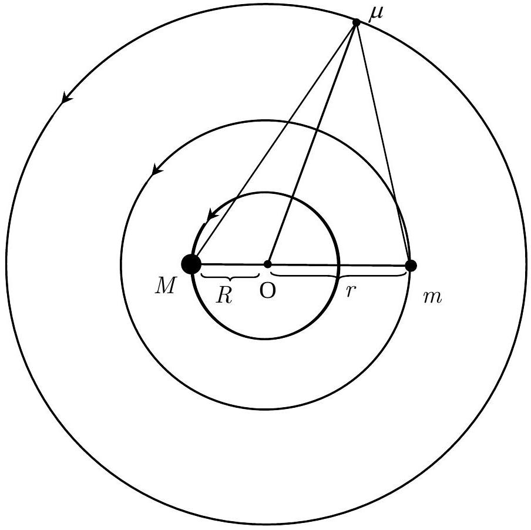
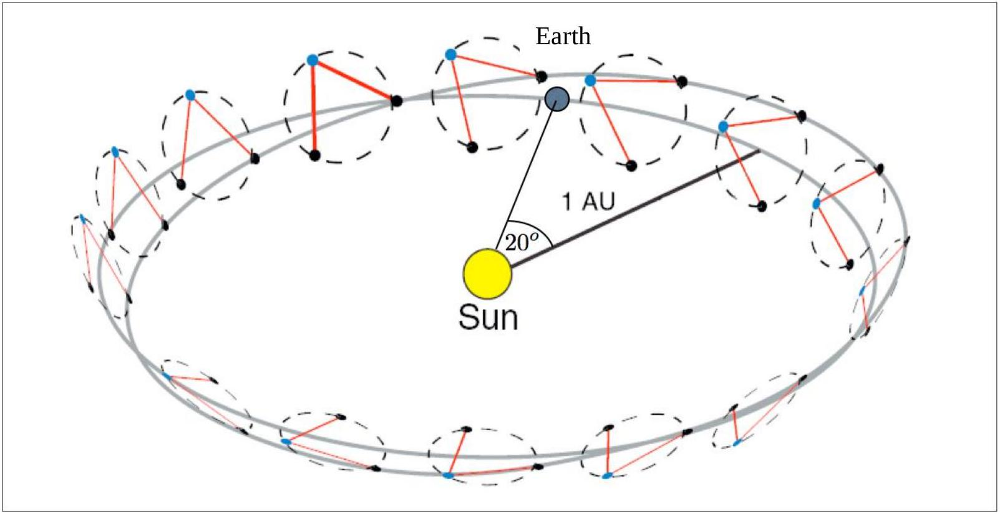
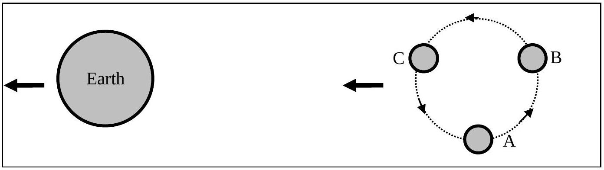

## 1. A Three-body Problem and LISA

FIGURE 1 Coplanar orbits of three bodies.

1.1 Two gravitating masses $M$ and $m$ are moving in circular orbits of radii $R$ and $r$, respectively, about their common centre of mass. Find the angular velocity $\omega_{0}$ of the line joining $M$ and $m$ in terms of $R, r, M, m$ and the universal gravitational constant $G$.
[1.5 points]
1.2 A third body of infinitesimal mass $\mu$ is placed in a coplanar circular orbit about the same centre of mass so that $\mu$ remains stationary relative to both $M$ and $m$ as shown in Figure 1. Assume that the infinitesimal mass is not collinear with $M$ and $m$. Find the values of the following parameters in terms of $R$ and $r$ :
[3.5 points]
    1.2.1 distance from $\mu$ to $M$.
    1.2.2 distance from $\mu$ to $m$.
    1.2.3 distance from $\mu$ to the centre of mass.

1.3Consider the case $M=m$. If $\mu$ is now given a small radial perturbation (along $\mathrm{O} \mu$ ), what is the angular frequency of oscillation of $\mu$ about the unperturbed position in terms of $\omega_{0}$ ? Assume that the angular momentum of $\mu$ is conserved. [3.2 points]
The Laser Interferometry Space Antenna (LISA) is a group of three identical spacecrafts for detecting low frequency gravitational waves. Each of the spacecrafts is placed at the corners of an equilateral triangle as shown in Figure 2 and Figure 3. The sides (or 'arms') are about 5.0 million kilometres long. The LISA constellation is in an earth-like orbit around the Sun trailing the Earth by 20°. Each of them moves on a slightly inclined individual orbit around the Sun. Effectively, the three spacecrafts appear to roll about their common centre one revolution per year.
They are continuously transmitting and receiving laser signals between each other. Overall, they detect the gravitational waves by measuring tiny changes in the arm lengths using interferometric means. A collision of massive objects, such as blackholes, in nearby galaxies is an example of the sources of gravitational waves.

FIGURE 2 Illustration of the LISA orbit. The three spacecraft roll about their centre of mass with a period of 1 year. Initially, they trail the Earth by 20°. (Picture from D.A. Shaddock, "An Overview of the Laser Interferometer Space Antenna", Publications of the Astronomical Society of Australia, 2009, 26, pp.128-132.).

FIGURE 3 Enlarged view of the three spacecrafts trailing the Earth. A, B and C are the three spacecrafts at the corners of the equilateral triangle.

1.4 In the plane containing the three spacecrafts, what is the relative speed of one spacecraft with respect to another? [1.8 point]
