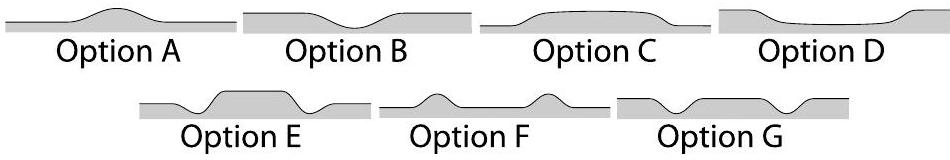

## Problem E1

Part A. Qualitative shape of the water surface (1 points) When a cylindrical magnet is placed below water surface, the latter becomes curved. By observation, determine the shape of the water surface above the magnet. Based on this observation, decide if the water is diamagnetic $(\mu<1)$ or paramagnetic $(\mu>1)$.

Write the letter corresponding to the correct option into the Answer Sheet, together with an inequality $\mu>1$ or $\mu<1$.

For this part, you do not need to justify your answer.
Part B. Exact shape of the water surface (7 points)
Curving of the water surface can be checked with high sensitivity by measuring the reflection of the laser beam from the surface. We use this effect to calculate the dependence of the depth of the water on the horizontal position above the magnet.
i. (1.6 pts) Measure the dependence of the vertical position $y$ of the laser spot on the screen on the caliper reading $x$ (see figure). You should cover the whole usable range of caliper displacements. Write the results into the Table in the Answer Sheet.
ii. (0.7 pts) Draw the graph of the measured dependence.
iii. (0.7 pts) Using the obtained graph, determine the angle $\alpha_{0}$ between the beam and the horizontal surface of the water. iv. (1.4 pts) please note that the slope $(\tan \beta)$ of the water surface can be expressed as follows:

$$
\tan \beta \approx \beta \approx \frac{\cos ^{2} \alpha_{0}}{2} \cdot \frac{y-y_{0}-\left(x-x_{0}\right) \tan \alpha_{0}}{L_{0}+x-x_{0}},
$$

where $y_{0}$ is the vertical position of the laser spot on the screen when the beam is reflected from the water surface at the axis of the magnet, and $x_{0}$ is the respective position of the caliper. Calculate the values of the slope of the water surface and enter them into the Table on the Answer Sheet. Please note that it may be possible to simplify your calculations if you substitute some combination of terms in the given expression for the slope with a reading from the last graph.
v. (1.6 pts) Calculate the height of the water surface relative to the surface far from the magnet, as a function of $x$, and write it into the Table on the Answer Sheet.
vi. (1.0 pts) Draw the graph of the latter dependence. Indicate on it the region where the beam hits the water surface directly above the magnet.

Part C. Magnetic permeability (2 points)
Using the results of Part B, calculate the value of $\mu-1$ (the so-called magnetic susceptibility), where $\mu$ is the relative magnetic permeability of the water. Write your final formula and the numerical result into the Answer Sheet.
