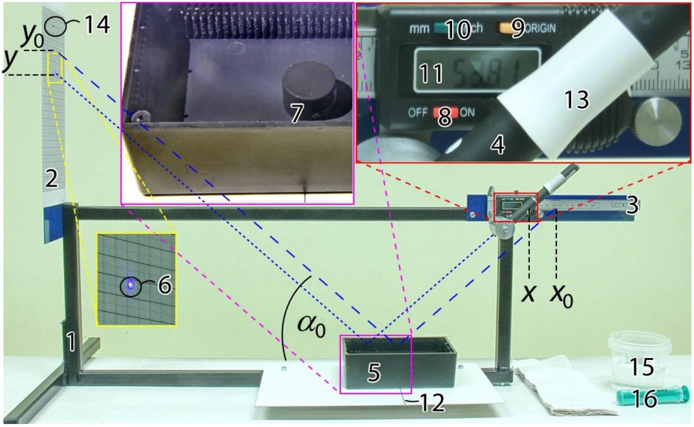

## Problem E1. The magnetic permeability of water (10 points)

The effect of a magnetic field on most of substances other than ferromagnetics is rather weak. This is because the energy density of the magnetic field in substances of relative magnetic permeability $\mu$ is given by the formula $w=\frac{B^{2}}{2 \mu \mu_{0}}$, and typically $\mu$ is very close to 1. Still, with suitable experimental techniques such effects are firmly observable. In this problem we study the effect of a magnetic field, created by a permanent neodymium magnet, on water and use the results to calculate the magnetic permeability of water. You are not asked to estimate any uncertainties throughout this problem and you do not need to take into account the effects of surface tension.

The setup comprises of 1 a stand (the highlighted numbers correspond to the numbers in the fig.), 3 a digital caliper, 4 a laser pointer, 5 a water tray and 7 a cylindrical permanent magnet in the water tray (the magnet is axially magnetised). The water tray is fixed to the base of the stand by the magnet's pull. The laser is fixed to the caliper, the base of which is fastened to the stand; the caliper allows horizontal displacement of the laser. The on-off button of the laser can be kept down with the help of 13 the white conical tube. Do not leave the Laser switched on unnecessarily. The depth of the water above the magnet should be reasonably close to 1 mm (if shallower, the water surface becomes so curved that it will be difficult to take readings from the screen). 15 A cup of water and 16 a syringe can be used for the water level adjustment (to raise the level by 1 mm , add 13 ml of water). 2 A sheet of graph paper (the "screen") is to be fixed to the vertical plate with 14 small magnetic tablets. If the laser spot on the screen becomes smeared, check for a dust on the water surface (and blow away).

The remaining legend for the figure is as follows: 6 the point where the laser beam hits the screen; 11 the LCD screen of the caliper, 10 the button which switches the caliper units between millimeters and inches; 8 on-off switch; 9 button for setting the origin of the caliper reading. Beneath the laser pointer, there is one more button on the caliper, which temporarily re-sets the origin (if you pushed it inadvertently, push it once again to return to the normal measuring mode).

Numerical values for your calculations:
Horizontal distance between the magnet's centre and the screen $L_{0}=490 \mathrm{~mm}$. Check (and adjust, if needed) the alignment of the centre of the magnet in two perpendicular directions. The vertical axis of the magnet must intersect with the laser beam, and it must also intersect with 12 the black line on the support plate.
Magnetic induction (magnetic field strength) on the magnet's axis, at a height of 1 mm from the flat surface, $B_{0}=0.50 \mathrm{~T}$
Density of water $\rho_{w}=1000 \mathrm{~kg} / \mathrm{m}^{3}$
Acceleration of free-fall $g=9.8 \mathrm{~m} / \mathrm{s}^{2}$
Permeability of a vacuum $\mu_{0}=4 \pi \times 10^{-7} \mathrm{H} / \mathrm{m}$

WARNINGS:

◇ The laser orientation is pre-adjusted, do not move it!
◇ Do not look into the laser beam or its reflections!
◇ Do not try to remove the strong neodymium magnet!
◇ Do not put magnetic materials close to the magnet!
◇ Turn off the laser when not used, batteries drain in 1 h!

