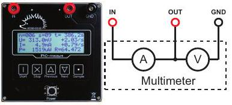
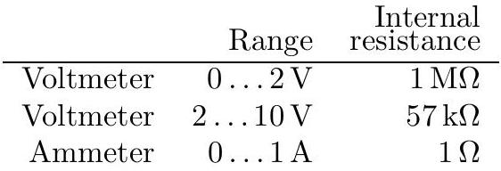
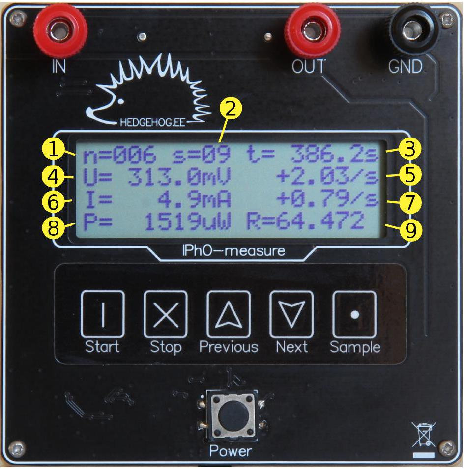

## Problem E2

## IPhO-measure: short manual

IPhO-measure is a multimeter capable of measuring voltage V and current $I$ simultaneously. It also records their time derivatives $\dot{V}$ and $\dot{I}$, their product $P=V I$, ratio $R=V / I$, and time $t$ of the sample. Stored measurements are organized into separate sets; every stored sample is numbered by the set number $s$ and a counter $n$ inside the set. All saved samples are written to an internal flash memory and can later be retrieved.

## Electrical behaviour

The device behaves as an ammeter and a voltmeter connected as follows.

## Basic usage

- Push "Power" to switch the IPhO-measure on. The device is not yet measuring; to start measuring, push "START". Alternatively, you can now start browsing your stored data. See below.
- To browse previously saved samples (through all sets), press "Previous" or "Next". Hold them down longer to jump directly between sets.
- While not measuring, push "Start" to start measuring a new set.
- While measuring, push "Sample" each time you want to store a new set of data (i.e. of the readings shown on the display).
- While measuring, you can also browse other samples of the current set, using "Previous" and "Next".
- Press "Stop" to end a set and stop measuring. The device is still on. You are ready to start a new measuring session or start browsing stored data.
- Pushing "Power" turns the device off. The device will show text "my mind is going ..."; do not worry, all the data measurements will be stored and you will be able to browse them after you switch the device on again. Saved samples will not be erased.

## Display

A displayed sample consists of nine variables:

1. index $n$ of the sample in the set;
2. index $s$ of the set;
3. time $t$ since starting the set;
4. voltmeter output $V$;
5. rate of change of $V$ (the time derivative $\dot{V}$ ); if derivative cannot be reliably taken due to fluctuations, "+nan/s" is shown;
6. ammeter output $I$;
7. rate of change of $I$ (the time derivative $\dot{I}$ ); if derivative cannot be reliably taken due to fluctuations, "+nan/s" is shown;
8. product $P=V I$;
9. ratio $R=V / I$.

If any of the variables is out of its allowed range, its display shows "+inf" or "-inf".
