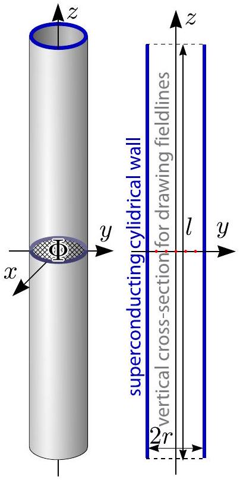
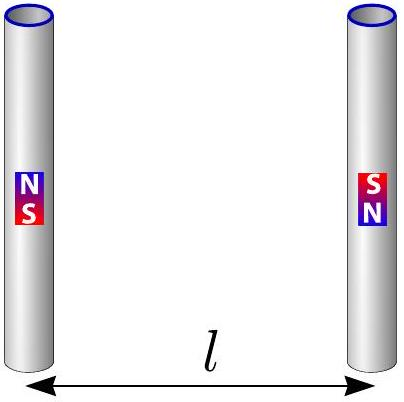

## Problem 1

Part C. Magnetic straws (4.5 points)
Consider a cylindrical tube made of a superconducting material. The length of the tube is $l$ and the inner radius is $r$ with $l \gg r$. The centre of the tube coincides with the origin, and its axis coincides with the $z$-axis.

There is a magnetic flux $\Phi$ through the central cross-section of the tube, $z=0, x^{2}+y^{2}<r^{2}$. A superconductor is a material which expels any magnetic field (the field is zero inside the material).
i. (0.8 pts) Sketch five such magnetic field lines, which pass through the five red dots marked on the axial cross-section of the tube, on the designated diagram on the answer sheet.
ii. (1.2 pts) Find the tension force $T$ along the $z$-axis in the middle of the tube (i.e. the force by which two halves of the tube, $z>0$ and $z<0$, interact with each other).
iii. (2.5 pts) Consider another tube, identical and parallel to the first one.

The second tube has the same magnetic field but in the opposite direction and its centre is placed at $y=l, x=z=0$ (so that the tubes form opposite sides of a square). Determine the magnetic interaction force $F$ between the two tubes.
