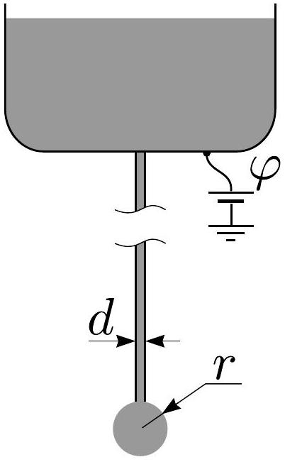
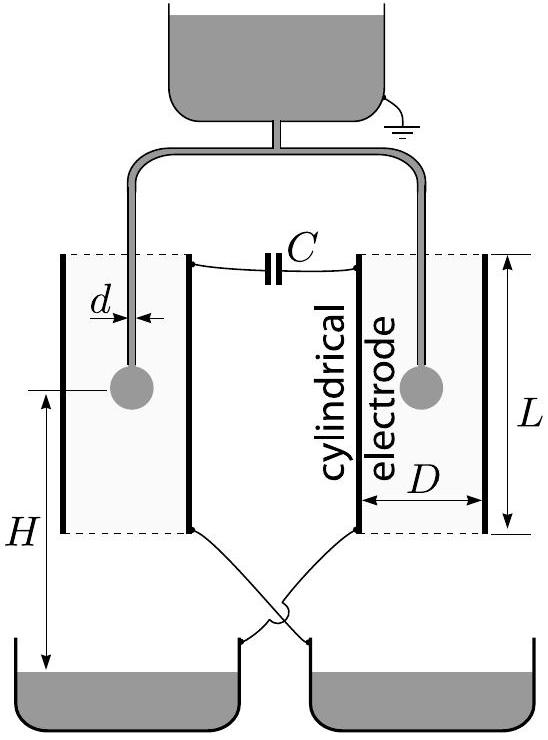

## Problem T2. Kelvin water dropper (8 points)

The following facts about the surface tension may turn out to be useful for this problem. For the molecules of a liquid, the positions at the liquid-air interface are less favourable as compared with the positions in the bulk of the liquid. This interface is described by the so-called surface energy, $U=\sigma S$, where $S$ is the surface area of the interface and $\sigma$ is the surface tension coefficient of the liquid. Moreover, two fragments of the liquid surface pull each other with a force $F=\sigma l$, where $l$ is the length of a straight line separating the fragments.

A long metallic pipe with internal diameter $d$ is pointing directly downwards. Water is slowly dripping from a nozzle at its lower end, see fig. Water can be considered to be electrically conducting; its surface tension is $\sigma$ and its density is $\rho$. A droplet of radius $r$ hangs below the nozzle. The radius grows slowly in time until the droplet separates from the nozzle due to the free fall acceleration $g$. Always assume that $d \ll r$.

## Part A. Single pipe (4 points)

i. (1.2 pts) Find the radius $r_{\text {max }}$ of a drop just before it separates from the nozzle.
ii. (1.2 pts) Relative to the far-away surroundings, the pipe's electrostatic potential is $\varphi$. Find the charge $Q$ of a drop when its radius is $r$.
iii. (1.6 pts) Consider the situation in which $r$ is kept constant and $\varphi$ is slowly increased. The droplet becomes unstable and breaks into pieces if the hydrostatic pressure inside the droplet becomes smaller than the atmospheric pressure. Find the critical potential $\varphi_{\text {max }}$ at which this will happen.

## Part B. Two pipes (4 points)

An apparatus called the "Kelvin water dropper" consists of two pipes, each identical to the one described in Part A, connected via a T-junction, see fig. The ends of both pipes are at the centres of two cylindrical electrodes (with height $L$ and diameter $D$ with $L \gg D \gg r$ ). For both tubes, the dripping rate is $n$ droplets per unit time. Droplets fall from height $H$ into conductive bowls underneath the nozzles, cross-connected to the electrodes as shown in the diagram. The electrodes are connected via a capacitance $C$. There is no net charge on the system of bowls and electrodes. Note that the top water container is earthed as shown. The first droplet to fall will have some microscopic charge which will cause an imbalance between the two sides and a small charge separation across the capacitor.

i. (1.2 pts) Express the absolute value of the charge $Q_{0}$ of the drops as they separate from the tubes, and at the instant when the capacitor's charge is $q$. Express $Q_{0}$ in terms of $r_{\text {max }}$ (from Part A-i) and neglect the effect described in Part A-iii.
ii. (1.5 pts) Find the dependence of $q$ on time $t$ by approximating it with a continuous function $q(t)$ and assuming that $q(0)=q_{0}$.
iii. (1.3 pts) The dropper's functioning can be hindered by the effect shown in Part A-iii. In addition, a limit $U_{\text {max }}$ to the achievable potential between the electrodes is set by the electrostatic push between a droplet and the bowl beneath it. Find $U_{\text {max }}$.
