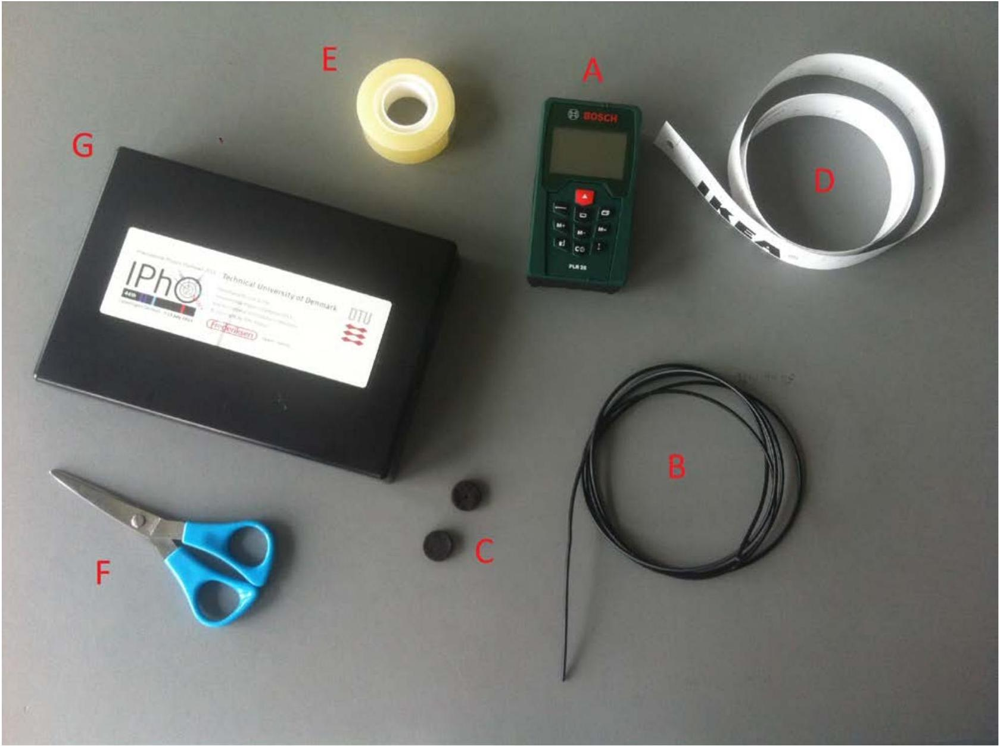
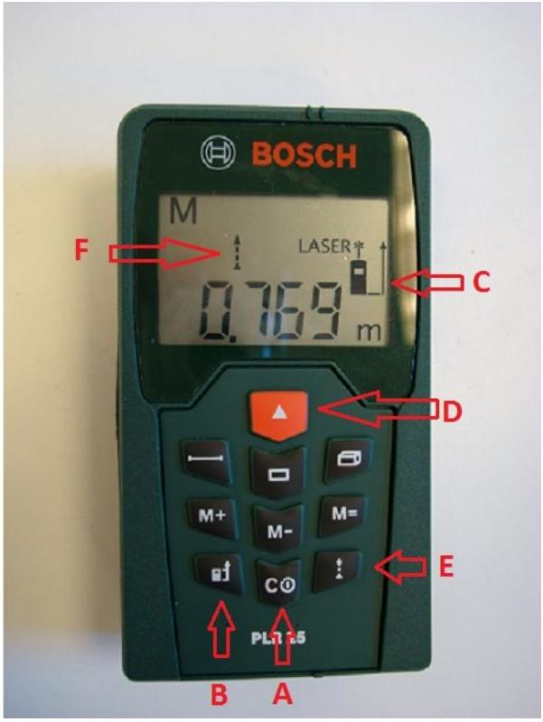
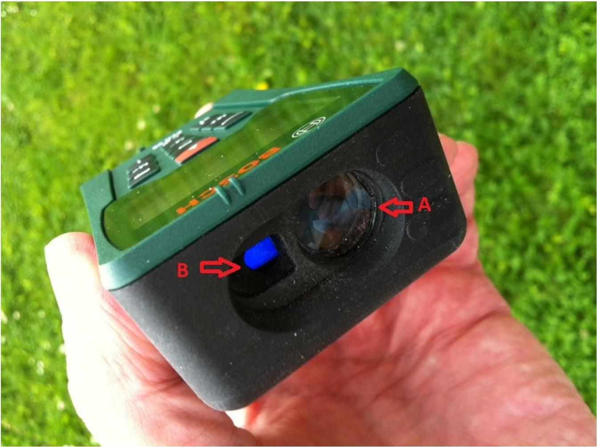
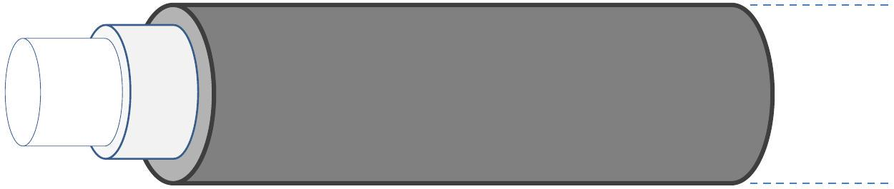
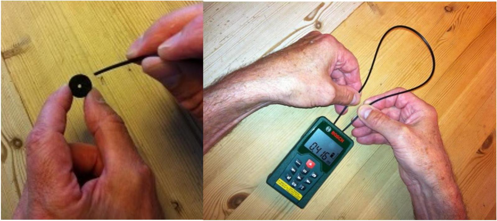
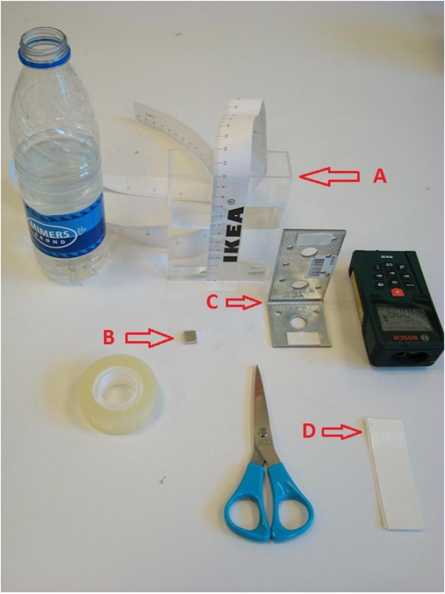
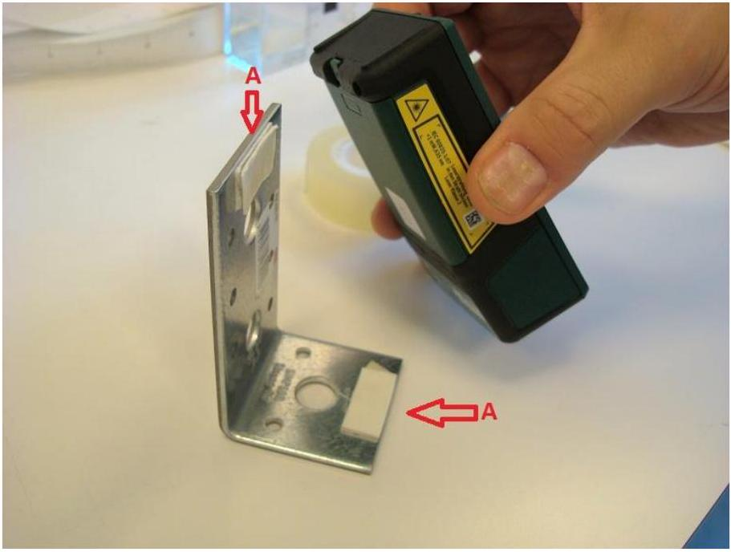
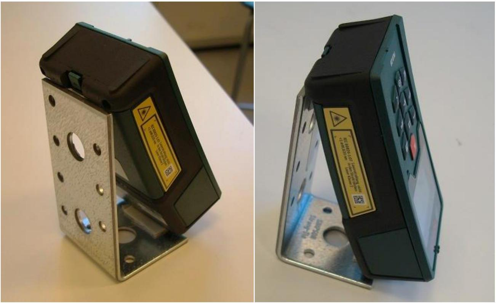
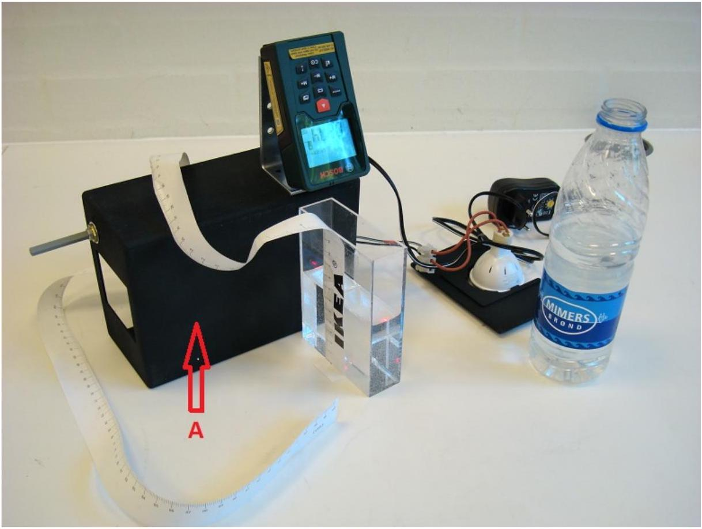
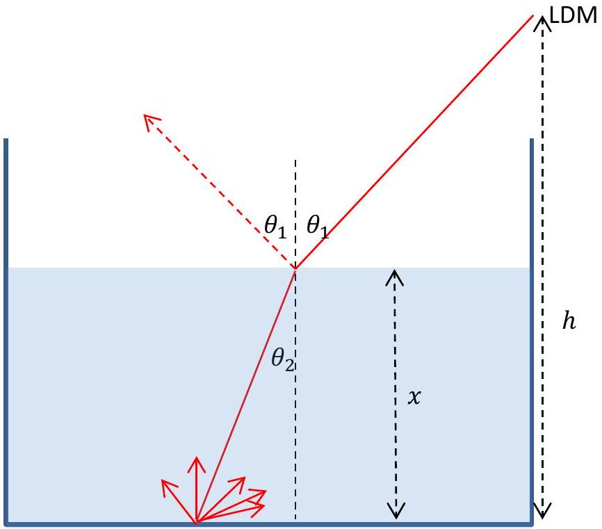

Notice: All measurements and calculated values must be presented with SI units with an appropriate number of significant digits. Uncertainties required only when explicitly asked for.

### 1.0 Introduction

Experiments with a laser distance meter (LDM)

Figure 1.1 Equipment for the first experiments 1.1 and 1.2.

A: Laser distance meter
B: Fiber optic cable (approximately 1 m)
C: Self-adhesive black felt pads with hole
D: Tape measure
E: Tape
F: Scissors
G: Lid from the black box

A laser distance meter (LDM, see Fig. 1.2 and Fig. 1.3) consists of an emitter and a receiver. The emitter is a diode laser that emits a modulated laser beam, i.e. a laser beam for which the amplitude varies at a very high frequency. When the laser beam hits an object, light is reflected in all directions from the laser dot. Some of this light returns to the instrument's receiver which is situated
immediately next to the emitter. The instrument's telescope optics is focused on the laser dot and receives the light returned from the laser dot. The electronics of the instrument measures the time difference in the modulation of the received light signal relative to the emitted light signal. The delay $t$ in the modulation is exactly the time it takes for the light to travel from emitter to receiver. The measured time is then converted to a value

$$
y=\frac{1}{2} c t+k
$$

This value $y$ is shown in the instrument's display. Here, $c=2.998 \cdot 10^{8} \mathrm{~ms}^{-1}$ is the speed of light. The constant $k$ depends on the instrument setting; on the instrument you can switch between measuring the distance either from the rear end or from the front end of the instrument. When the laser distance meter is turned on, the default setting is to measure from the rear. This setting shall be maintained during all measurements.

Due to parallax, the LDM cannot measure any distance shorter than 5 cm. The maximum distance that can be measured is around 25 m. The shape of the instrument is such that the rear side is perpendicular to the laser beam as well as the front side. When the instrument is lying on the table the polarization is vertical (perpendicular to the display)
The diode laser is of class 2 with power < 1 mW and wavelength 635 nm. Manifacturer uncertainty for measurements is +/- 2 mm.

Warning: The instrument's diode laser can damage your eyes. Do not look into the laser beam and do not shine it into other people's eyes!

Settings for LDM
The above calculation of the distance $y$ of course assumes that the light has been travelling at speed $c$. At the level of accuracy in this experiment, there is no need to distinguish between the speed of light in vacuum and in air, since the refractive index for dry, atmospheric air at normal pressure and temperature is $1.00029 \approx 1.000$.

Page 2 of 9

Figure 1.2 The unlabeled six buttons are irrelevant (they are used to calculate area and volume). The relevant buttons are:

A: On/off
B: Switch between measurement from the rear and the front of the instrument.
C: Indicator for measurement from the rear/front
D: Turn on laser/start measurement
E: Continuous measurement
F: Indicator for continuous measurement

Figure 1.3 The laser distance meter seen from the front end:

A: Receiver: Lens for the telescope focused on the laser dot
B: Emitter: Do not look into the laser beam!

### 1.1 Measurement with the laser distance meter

The instrument will perform a measurement when you press the button $\mathbf{D}$, see Fig. 1.2.

| 1.1 | Use the LDM to measure the distance $H$ from the top of the table to the floor. Write down the uncertainty $\Delta H$. Show with a sketch how you perform this measurement. | 0.4 |
| :--- | :--- | :--- |

### 1.2 Experiment with the fiber optic cable

Figure 1.4 Diagram of a fiber optic cable.

You have been given a fiber optic cable of length approximately 1 m and diameter approximately 2 mm . The cable consists of two optical materials. The core (diameter approximately 1 mm ) is made from a plastic with a high refractive index. The core is surrounded by a cladding made from a plastic with a slightly lower refractive index, and this is covered by a protective jacket of black plastic. Core and cladding serve as a wave guide for light shone into the cable, since the boundary between core and cladding will cause total reflection - and thereby prevent the light from leaving the core - as long as the angle of incidence is larger than the critical angle for total reflection. The light will therefore follow the core fiber, even if the cable bends, as long as it is not bent too much.

The LDM should now be set for continuous measurement (E, see Fig. 1.2), so that the display indication $y$ updates approximately once per second. The LDM will automatically go into sleep mode after a few minutes. It can be reactivated by pushing the red start button.

Carefully and gently cover the lens of the receiver with one small, black felt pad (the other is a backup) with a hole of diameter 2 mm (see figure 1.3A). The adhesive side of the pad should be pressed softly against the lens. Insert a fiber optic cable of length $x$ in the hole in the pad so that it touches the lens,
see Fig. 1.5.

Figure 1.5 (a) Felt pad and fiber optic cable. (b) Attaching the fiber optic cable.

The other end of the cable should be held against the emitter, so that it touches the glass in the middle of the laser beam. Now read off the $y$-value from the display. The supplied scissors should be used to cut the fiber optic cable into different lengths $x$.
Think very carefully before cutting the fiber optic cable, as you cannot get any more cable!!
Notice also that the LDM display might show a thermometer icon after a while in the continuous mode due to excessive heating of the electronics. If this happens, turn off the LDM for a while to cool off the instrument.

| 1.2a | Measure corresponding values of $x$ and $y$. Set up a table with your measurements. Draw a graph showing $y$ as a function of $x$. | 1.8 |
| :--- | :--- | :--- |
| 1.2b | Use the graph to find the refractive index $n_{\mathrm{co}}$ for the material from which the core of the fiber optic cable is made. Calculate the speed of light $v_{\mathrm{co}}$ in the core of the fiber optic cable. | 1.2 |

### 1.3 Laser distance meter at an angle from the vertical

In this part of the experiment you will need the equipment shown in Fig. 1.6.

Figure 1.6 Equipment for experiment 1.3 shown in the figure:

A: Optical vessel with water and measuring tape
B: Magnet to secure the angle iron on top of the black box. (You find magnet placed on the angle iron).
C: Angle iron with self-adhesive foam pads
D: Self-adhesive foam pads

Remove the black felt pad from the lens. The LDM should now be placed in the following set-up: Place two self-adhesive foam pads on the angle iron, see A on Fig. 1.7.

Figure 1.7 How to place the two self-adhesive foam pads on the angle iron.

The LDM should be carefully placed on the angle iron as shown in Fig. 1.8.

Figure 1.8 How to place the laser distance meter on the angle iron.

The angle iron with the LDM should be mounted on the black box as shown in Fig. 1.9. Secure the angle iron to the box with a magnet placed below inside the box. (The tiny magnet is found on the angle iron). It is important to mount the LDM exactly as in the photo, since the side of the box facing upwards slants by approximately 4 degrees. The laser beam should now be pointing unobstructedly downwards at an angle.

Figure 1.9 The experimental set-up. (The black box only serves as a support. The equipment behind the bottle is not used, though).
A: Important: The bottom of the black box must face forward as shown. The side that faces upwards is slanting approximately 4 degrees with respect to the horizontal plane. Make sure that the angle $\boldsymbol{\theta}_{\mathbf{1}}$ is the same all the time

When the LDM is turned on and mounted as explained above, the laser beam will form an angle $\theta_{1}$ with respect to the vertical direction. This angle, which must be the same throughout this experiment, must now be determined. The optical vessel is not needed here, so put it aside so far.

| 1.3a | Measure with the LDM the distance $y_{1}$ to the laser dot where the laser beam hits the table top. Then move the box with the LDM horizontally until the laser beam hits the floor. Measure the distance $y_{2}$ to the laser dot where the laser beam hits the floor. State the uncertainties. | 0.2 |
| :--- | :--- | :--- |
| 1.3b | Calculate the angle $\theta_{1}$ using only these measurements $y_{1}, y_{2}$ and $H$ (from problem 1.1). Determine the uncertainty $\Delta \theta_{1}$. | 0.4 |

### 1.4 Experiment with the optical vessel

Place the optical vessel so that the laser beam hits the bottom of the vessel approximately in the middle, see Fig. 1.10. Pour some water into the vessel. The depth of the water is $x$. Read off $y$ on the display of the LDM.

Figure 1.10 Diagram of laser beams in the optical vessel with water of depth $x$.

| 1.4a | Measure corresponding values of $x$ and $y$. Set up a table with your measurements. Draw a graph of $y$ as a function of $x$. | 1.6 |
| :--- | :--- | :--- |
| 1.4b | Use equations to explain theoretically what the graph is expected to look like. | 1.2 |
| 1.4c | Use the graph to determine the refractive index $n_{\mathrm{w}}$ for water. | 1.2 |
